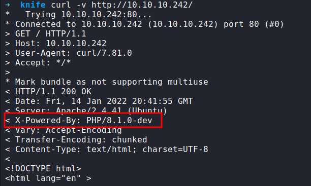
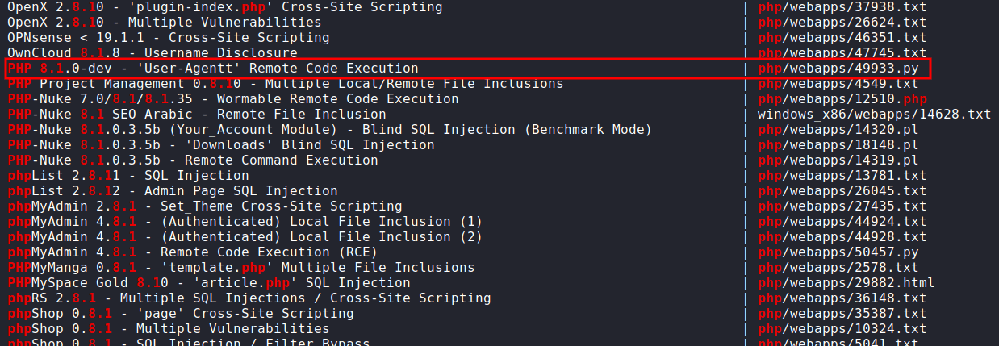
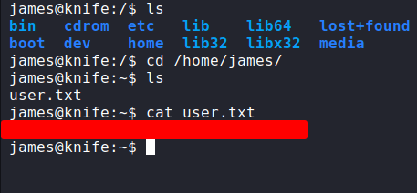
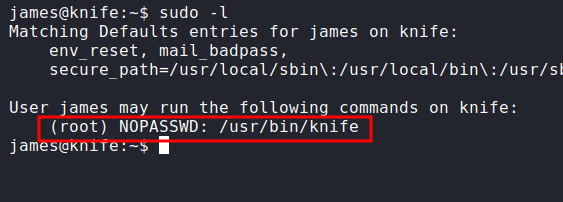

## Enumeration

### Nmap

First, let's start with the Nmap scan. Here is the result of the scan.

### the result


I ran another Nmap scan against all ports. However, the result still returns the same. So, that's not much we can do. 

### Webserver
Let's navigate to the `website` on `port 80`. It's just one big landing page and doesn't have anything interesting in it. I also checked the source of this page and nothing. 


### Gobuster
Now, I'm gonna run the `gobuster` to find any hidden directory on this webserver. Turns out, this is a `PHP` webserver. So, I'm gonna search any directory and file that have PHP extensions. Unfortunately, the result is `nothing` and I ran another scan, and still the same.

### X-Powered-By
Now, I do not understand how I'm gonna get into this machine. I've already checked the source code and nothing. Now, let's check the header of this page. 

 <br>

- [Hidden Helpers: Security-Focused HTTP Headers to Protect Against Vulnerabilities](https://www.rapid7.com/blog/post/2019/12/06/hidden-helpers-security-focused-http-headers-to-protect-against-vulnerabilities/)

### RCE
Great!. At least I got some information. Turns out, this webserver runs on the `PHP/8.1.1-dev` version. Like always I'm checking on `searchsploit` does this version have any exploit and YES!.

## Foothold/Gaining Access



This one caught my eyes. I'm gonna mirror/copy these exploits into my current directory with the `-m` flag. Here is the comment in this `python script`

```plaintext
An early release of PHP, the PHP 8.1.0-dev version was released with a backdoor on March 28th 2021, but the backdoor was quickly discovered and removed. If this version of PHP runs on a server, an attacker can execute arbitrary code by sending the User-Agentt header.
The following exploit uses the backdoor to provide a pseudo shell ont the host.
```

- [PHP 8.1.0-dev - 'User-Agentt' Remote Code Execution](https://www.exploit-db.com/exploits/49933)

### PHP backdoor
Based on the comment and exploit itself. I need to add the `User-Agentt` header, like this `User-Agentt: zerodiumsystem('cmd');`. Let's try to get the `reverse-shell` on this machine. I'm gonna use `burpsuite` to do this. Make sure you set up the listener first.


### Shell
YES! I've got the shell as James. Let's upgrade the shell real quick with `python3 -c 'import pty;pty.spawn("/bin/bash")'` and `CTRL + z (background)` , type `stty raw -echo; fg` press `Return 2 times`, lastly `export TERM=xterm` to have beautiful clear screen.



## Privilege Escalation

Now, I have the user flag. Let's hunt for the next flag. First, what I like to do is check the sudo permission with `sudo -l`. Turns out, this user can run some applications with no password needed. Let's check the app.



Well, it looks like a legitimate application. So, I'm gonna search on [GTFOBins](https://gtfobins.github.io/). 

- [About Knife](https://docs.chef.io/workstation/knife/)

 <br>

I'm more interested in the `sudo` section of this exploit with type this in the terminal `sudo /usr/bin/knife exec -E 'exec "/bin/bash"'`. I'm becoming the `root` user. Here's the final flag.

