## Nmap

Let's scan the IP Address first by using Nmap.

```sql
# Nmap 7.92 scan initiated Wed Feb  9 07:45:26 2022 as: nmap -sC -sV -oN nmap/paper 10.129.156.206
Nmap scan report for 10.129.156.206
Host is up (0.23s latency).
Not shown: 997 closed tcp ports (reset)
PORT    STATE SERVICE  VERSION
22/tcp  open  ssh      OpenSSH 8.0 (protocol 2.0)
| ssh-hostkey: 
|   2048 10:05:ea:50:56:a6:00:cb:1c:9c:93:df:5f:83:e0:64 (RSA)
|   256 58:8c:82:1c:c6:63:2a:83:87:5c:2f:2b:4f:4d:c3:79 (ECDSA)
|_  256 31:78:af:d1:3b:c4:2e:9d:60:4e:eb:5d:03:ec:a0:22 (ED25519)
80/tcp  open  http     Apache httpd 2.4.37 ((centos) OpenSSL/1.1.1k mod_fcgid/2.3.9)
|_http-generator: HTML Tidy for HTML5 for Linux version 5.7.28
| http-methods: 
|_  Potentially risky methods: TRACE
|_http-title: HTTP Server Test Page powered by CentOS
|_http-server-header: Apache/2.4.37 (centos) OpenSSL/1.1.1k mod_fcgid/2.3.9
443/tcp open  ssl/http Apache httpd 2.4.37 ((centos) OpenSSL/1.1.1k mod_fcgid/2.3.9)
|_ssl-date: TLS randomness does not represent time
| http-methods: 
|_  Potentially risky methods: TRACE
|_http-generator: HTML Tidy for HTML5 for Linux version 5.7.28
|_http-title: HTTP Server Test Page powered by CentOS
| ssl-cert: Subject: commonName=localhost.localdomain/organizationName=Unspecified/countryName=US
| Subject Alternative Name: DNS:localhost.localdomain
| Not valid before: 2021-07-03T08:52:34
|_Not valid after:  2022-07-08T10:32:34
|_http-server-header: Apache/2.4.37 (centos) OpenSSL/1.1.1k mod_fcgid/2.3.9
| tls-alpn: 
|_  http/1.1

Service detection performed. Please report any incorrect results at https://nmap.org/submit/ .
# Nmap done at Wed Feb  9 07:45:54 2022 -- 1 IP address (1 host up) scanned in 27.74 seconds
```

Only `3` open ports

## Http/HttpS
From the Nmap scan result above, the `port 80,443` is open. So, like a normal human being.  I'm navigating through it using a web browser :)

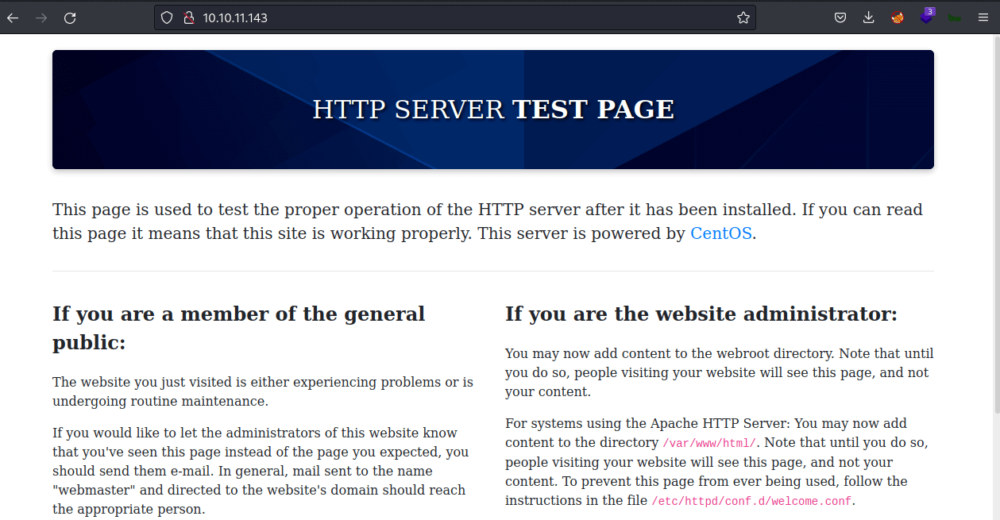

Well, that's not what I expected. It shows the default page after installation in `CentOS`.

### Gobuster
When I found a webpage, the first thing I'll do is run the [gobuster](https://github.com/OJ/gobuster) to find any hidden directory. Unfortunately, I can't find anything useful. 

### Header: X-Backend-Server
To be honest, I'm stuck and don't know what to do. Then, I remember that I didn't even check the `header`. I'm going to check it using the `curl` command. OH WOW! the [X-Backend-Server](https://docs.gitlab.com/ee/user/application_security/dast/checks/16.4.html) just exposes the hostname called `office.paper`. So, I'll add the hostname into the `/etc/hosts` file. 


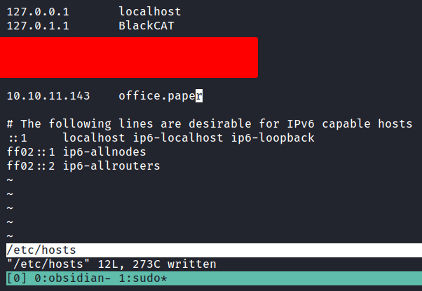

### Http: office.paper
Then, I navigate to `http://office.paper`. Turns out, it's a blog. Down to the footer, it says `Proudly Powered by WordPress` and this indicates it's using [WordPress](https://wordpress.org/) as [CMS](https://en.wikipedia.org/wiki/Content_management_system).

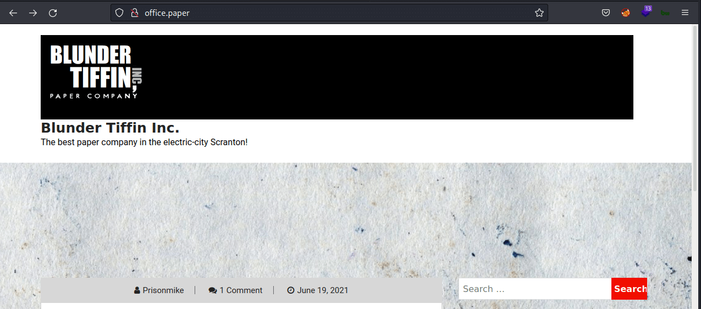

The first thing I'll do is start messing around with it. However, one comment sticks out. It says something about `drafts` is not secure and should be deleted ASAP.

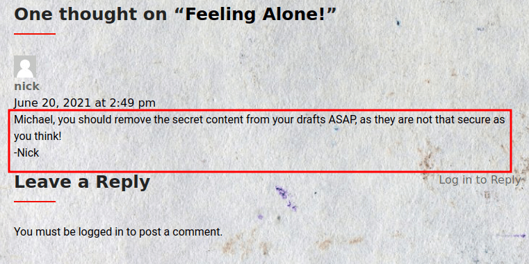

## CVE-2019-17671

As the comment above shown. The `drafts` section is not secure. So, with this information. I'm searching on the net about it and found this [article](https://wpscan.com/vulnerability/3413b879-785f-4c9f-aa8a-5a4a1d5e0ba2) with `PoC` and it got assigned as [CVE-2019-17671](https://nvd.nist.gov/vuln/detail/CVE-2019-17671).

> CVE description: In WordPress before 5.2.4, unauthenticated viewing of certain content is possible because the static query property is mishandled.

So, I'll try to read the `secret draft` with this URL `http://office.paper/?static=1` and it's successfully retrieved. After I read it, I found the `secret registration URL` that leads into the `chat` subdomain. Like always, I'll add it into the `/etc/hosts` file.

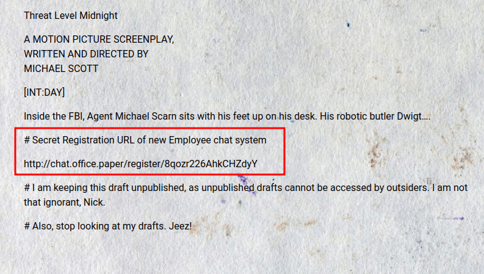

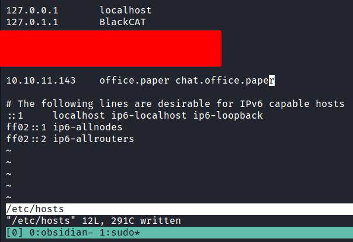

### Http: chat.office.paper
I'm copying and pasting the URL in my web browser and being greeted by [rocket.chat](https://rocket.chat/) registration page. Well, I'm registering a new account and taking a look inside it. Turns out, it's just a chat app and I can't find anything useful. However, it's has a `bot` called `recyclops` that can be interacted with.

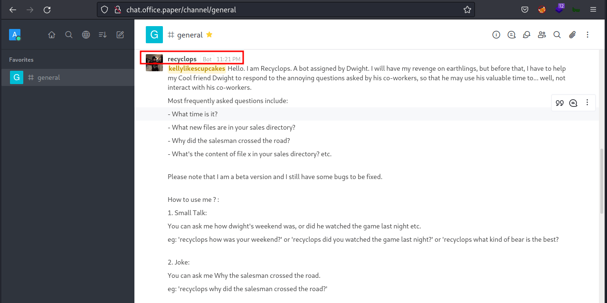

## Recyclops
To interact with the bot, first, click the `bot's profile` and click the `direct message` button. So, I'll try the `help` command first. There is some interesting stuff this bot can do. However, I'm interested in the `Files` and `List` commands.


### Recyclops: path traversal
To invoke the `list` command, type `recyclops list`. It's just giving me a listing of the `/sales/` directory. However, this makes me wonder, can I make it list another directory as [path traversal](https://owasp.org/www-community/attacks/Path_Traversal) the answer is YES!. Here's the command that I put in, `recyclops list ..`

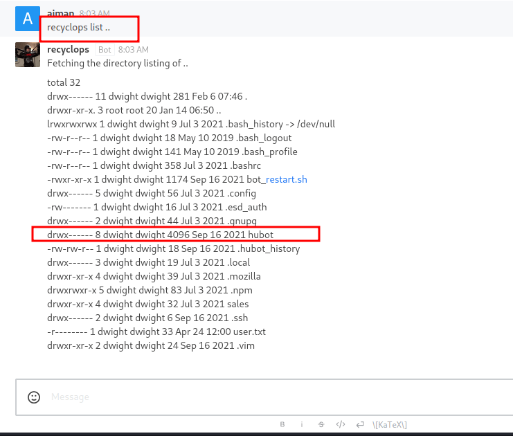

## Hubot
There is a `.ssh` directory present and the Nmap scan shows, that this machine has `port 22` open. Unfortunately, there's nothing in that directory. On top of that, I found the directory called `hubot`. It's a robot for a chat room. So, I assumed `recyclops` are based on [hubot](https://hubot.github.com/).

### Hubot: /.env
After listing the `hubot` directory. The file called `.env` really stands out above the rest. Here's the command that I put in `recyclops file ../hubot/.env` to read the file. Finally, I found something useful this time. It is a password belonging to the `recyclops` user.

_Note: these creds also share with the `dwight` user and can be also `SSH` into the box_

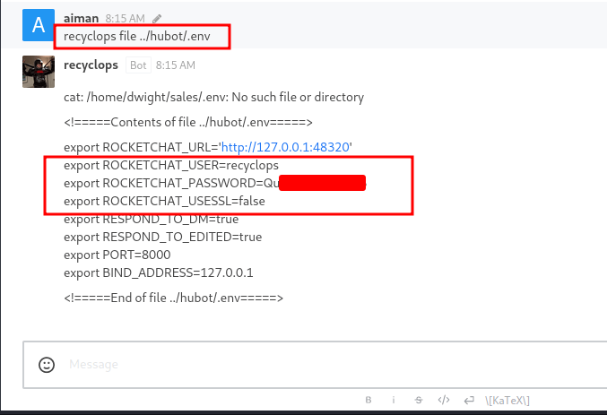

### Hubot: RUN command</font>
Futher enumeration, I found the [javascript](https://en.wikipedia.org/wiki/JavaScript) file called `run.js` in the `hubot/scripts` directory. When I inspect the file, it executes the command with the `RUN` function. Well, let me try put the simple bash reverse shell. YES! successfully get the foothold as a `dwight` user.


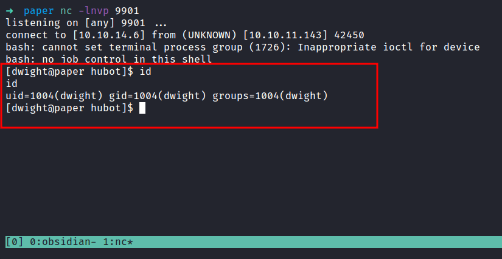

## PEASS-ng: linpeas.sh
I'm already in as `dwight`. First, I'll check the sudo permission with `sudo -l` using the credentials found earliear. Unfortunatelly, `dwight` can't run `sudo` in this machine. So, to make it quick, I'm going to run [linpeas](https://github.com/carlospolop/PEASS-ng).


## CVE-2021-3560
The linpeas script is already done running. OH WOW! it says this machine is vulnerable to [CVE-2021-3560](https://nvd.nist.gov/vuln/detail/CVE-2021-3560). The funny thing is when I searched on the internet about this [CVE](https://en.wikipedia.org/wiki/Common_Vulnerabilities_and_Exposures). I found [secnigma github repos](https://github.com/secnigma) and this machine was created by [secnigma](https://twitter.com/secnigma).

> CVE description: It was found that polkit could be tricked into bypassing the credential checks for D-Bus requests, elevating the privileges of the requestor to the root user. 

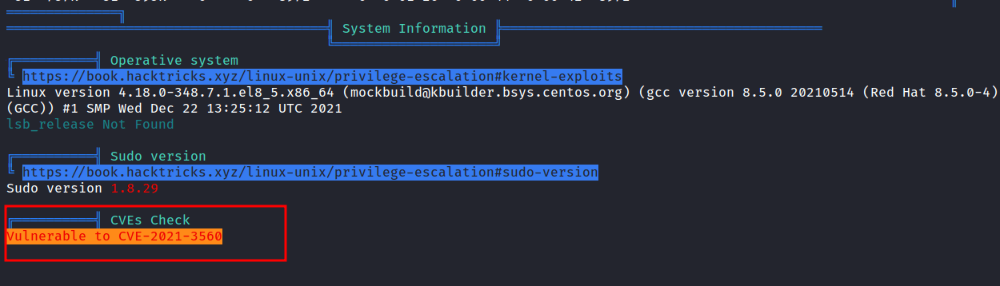

The [github repos](https://github.com/secnigma/CVE-2021-3560-Polkit-Privilege-Esclation) itself is about bash `PoC` script. Also, the original research is done by [Kevin Backhouse](https://twitter.com/kevin_backhouse), and here's [his blog post](https://github.blog/2021-06-10-privilege-escalation-polkit-root-on-linux-with-bug/) talking about it. Well, it's time to run the `PoC` script. <br>
_Disclaimer: **MULTIPLE TRIES ARE USUALLY REQUIRED** for this exploit to work._

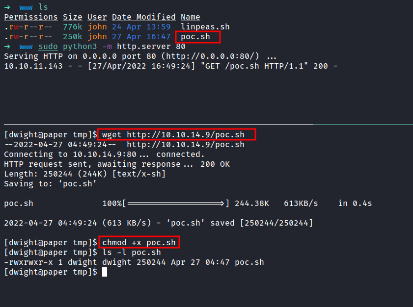

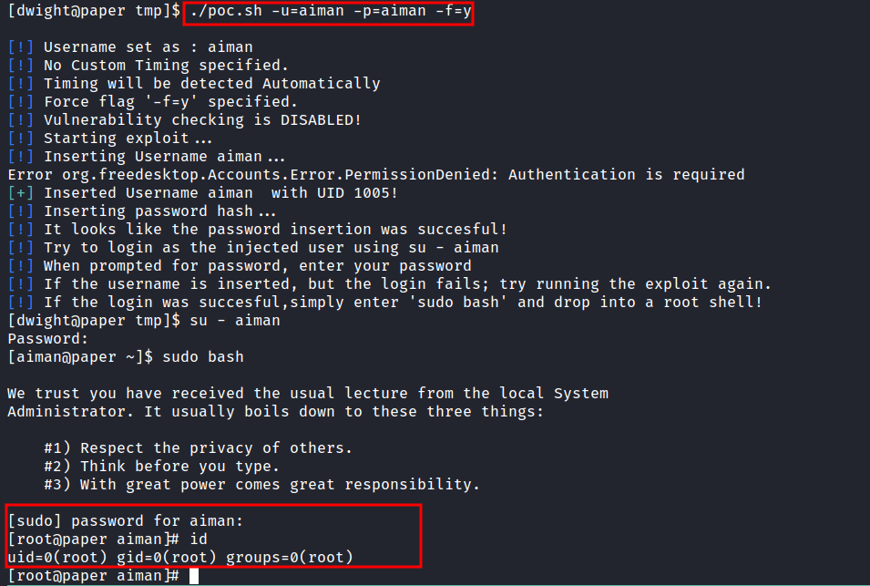

I'M ROOT BABYYY!