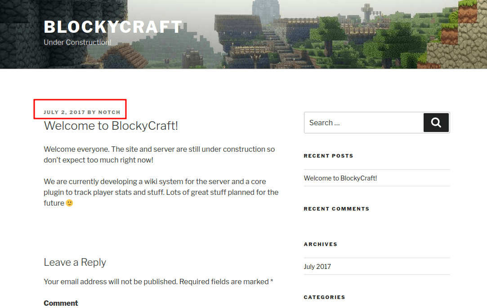
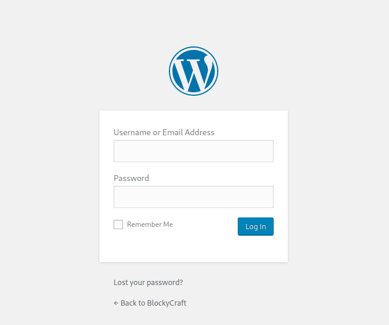
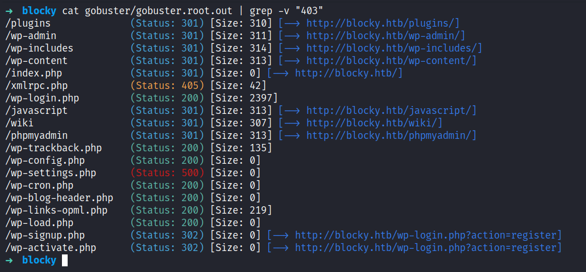
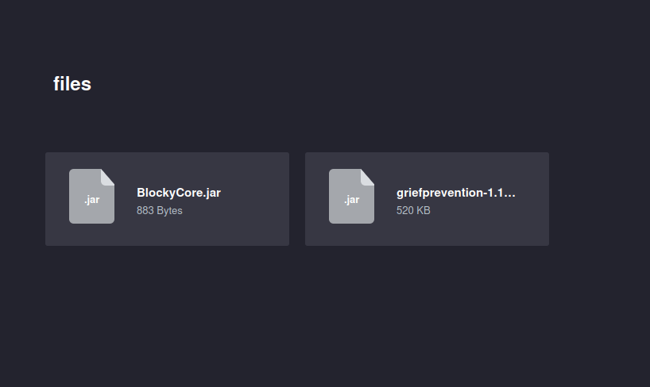
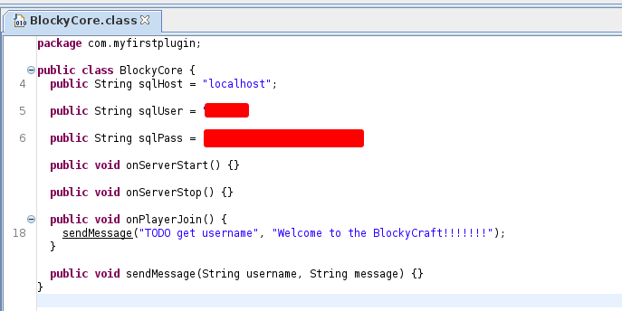
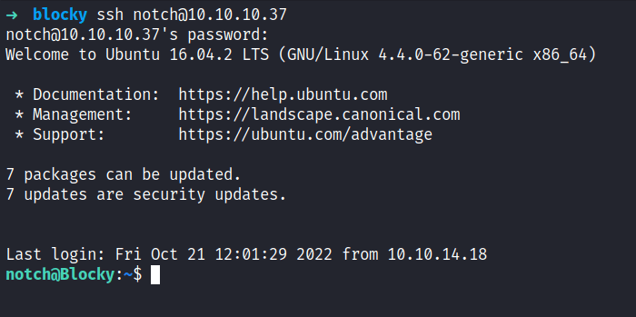
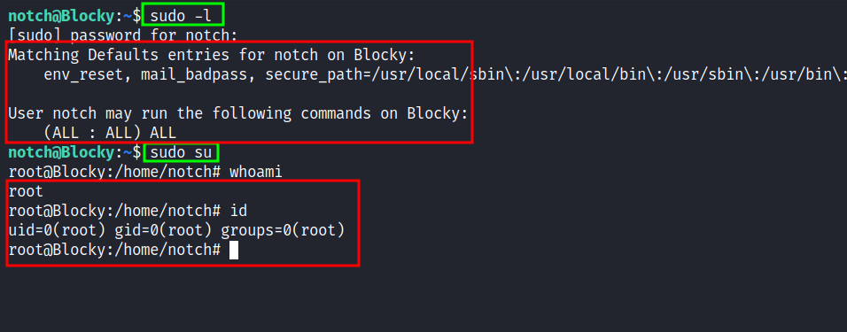

## Nmap
Like always, I’m going to scan the IP address by using [nmap](https://nmap.org/) but I’m going to scan the full port first. Then, I’m going to scan the only open ports.

```sql
nmap -p21,22,80,25565 -sCV -oN nmap/blocky 10.10.10.37

21/tcp    open   ftp       ProFTPD 1.3.5a

22/tcp    open   ssh       OpenSSH 7.2p2 Ubuntu 4ubuntu2.2 (Ubuntu Linux; protocol 2.0)
| ssh-hostkey: 
|   2048 d62b99b4d5e753ce2bfcb5d79d79fba2 (RSA)
|   256 5d7f389570c9beac67a01e86e7978403 (ECDSA)
|_  256 09d5c204951a90ef87562597df837067 (ED25519)

80/tcp    open   http      Apache httpd 2.4.18
|_http-server-header: Apache/2.4.18 (Ubuntu)
|_http-title: Did not follow redirect to http://blocky.htb

25565/tcp open   minecraft Minecraft 1.11.2 (Protocol: 127, Message: A Minecraft Server, Users: 0/20)
Service Info: Host: 127.0.1.1; OSs: Unix, Linux; CPE: cpe:/o:linux:linux_kernel
```

The nmap scan result is completed. Looks like, I'm dealing with an Ubuntu linux machine based on the [OpenSSH](https://launchpad.net/ubuntu/+source/openssh/1:7.2p2-4ubuntu2.2) service banner. On top of that, it's running FTP, Apache, and Minecraft also based on my nmap scan it's found a hostname called `blocky.htb`. So, I'm going to add that in my `/etc/hosts` file.


### Http: blocky.htb
I already add the IP address to the `/etc/hosts` file. So, I navigated to `http://blocky.htb` in my browser. It's just a simple blog page titled `BlockyCraft` which is using WordPress because when I scrolled down at the bottom of it, it says "Proudly powered by [WordPress](https://wordpress.org/)". Upon enumerating this website, I manage to find a single username called `Notch` aka Minecraft god. :)



### Http: /wp-admin
Since this is a WordPress site and I already have a username. I navigate through the `/wp-admin` which is a login form for this [cms](https://en.wikipedia.org/wiki/Content_management_system). I'll try a bunch of passwords and nothing useful came out of it.



### Gobuster
Based on the extension of the `index` file. Turns out, it is a php webserver. Now, I'm going to run [gobuster](https://github.com/OJ/gobuster) with the `-x` flag for looking up only the `.php` extension. To my surprise, it has a bunch of directories and files. However, the one that caught my eye is `/phpmyadmin/`. However, it required the credentials which I did not have on me.



### Http: /plugins
I ended up going through all the directories that gobuster found earlier. Fortunately, I managed to find the `.jar` file located in `/plugins` which is the first directory that I navigated to. So, I downloaded all the files into my current working directory. 



Based on the extension of the file, which is `.jar`, I'm firing up [jd-gui](https://github.com/java-decompiler/jd-gui) to decompile those java files into human-readable. Shockingly, the file called `BlockyCore.jar` have hardcode credentials on it and with these credentials, I manage to login on to `/phpmyadmin/` and [change](https://codebeautify.org/wordpress-password-hash-generator) the `notch` user password. 



## SSH: Notch
However, I can ssh into this machine with those credentials that I found earlier and I'm in as a notch.



## Root
Then, I’ll try to enumerate the sudo permissions by running this command `sudo -l`. Surprisingly, this user has all access to everything and I ended up just running the command `sudo su` to get the root shell.



NICE! 