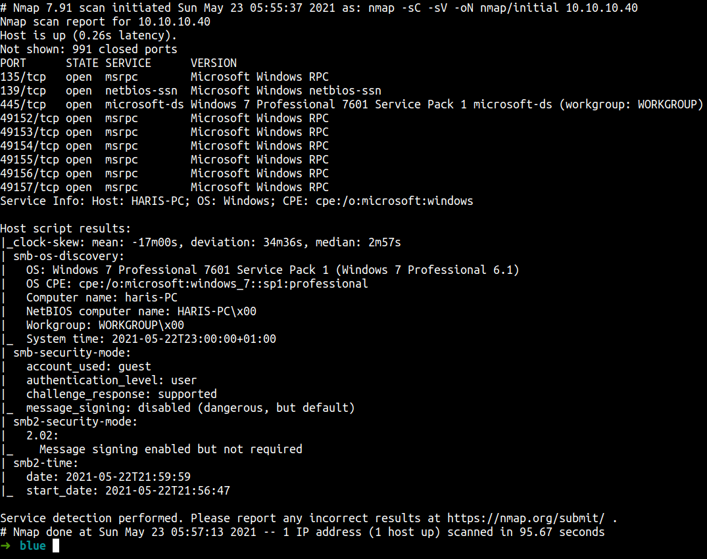
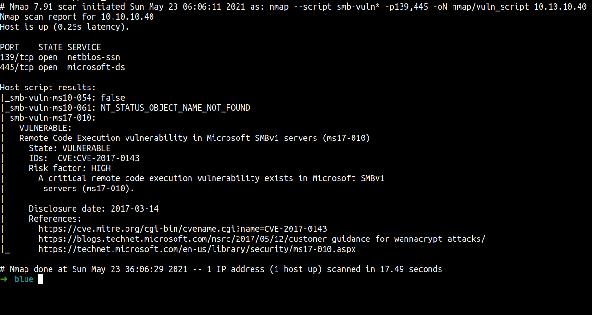
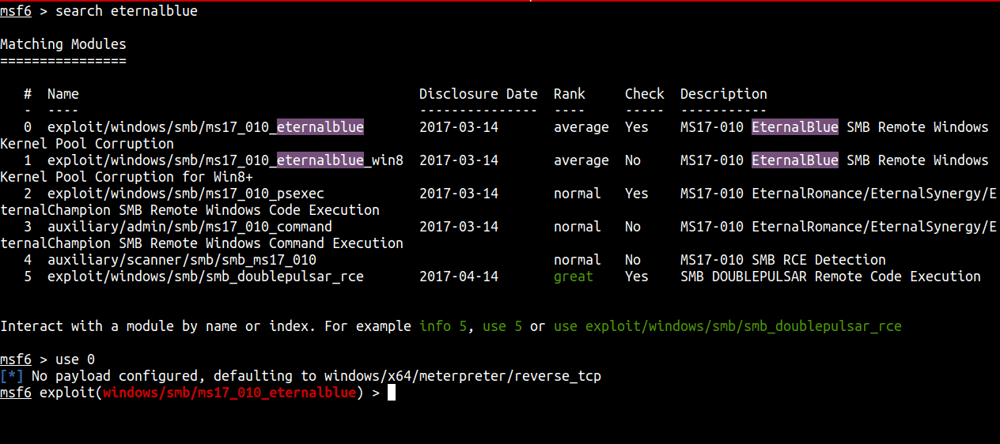
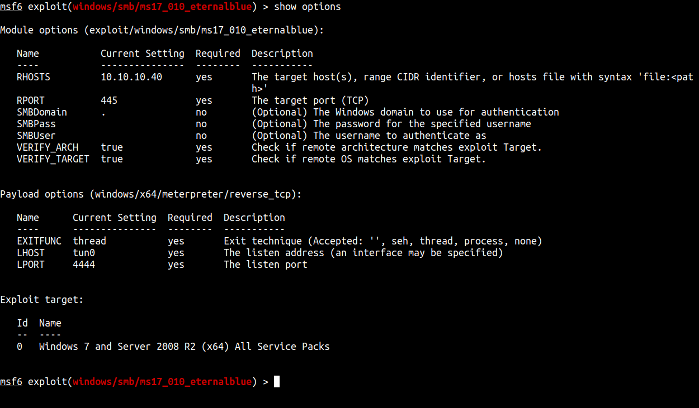
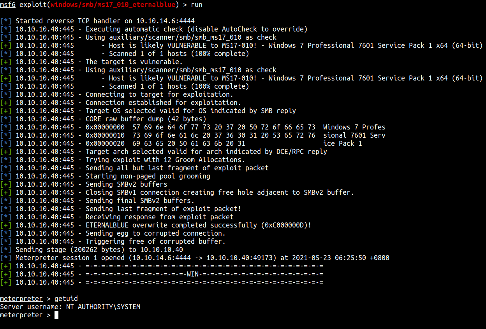
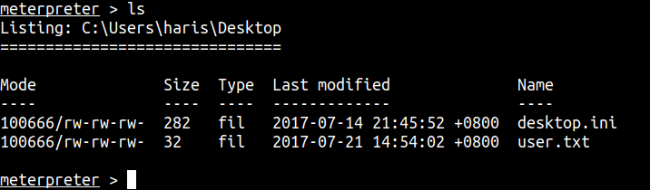
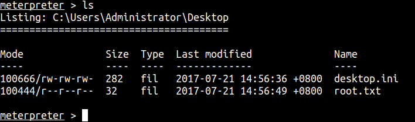

## Enumeration

First, let’s do an enumeration with the IP address of this machine. I’m gonna run Nmap [Netwok Mapper] to scan any open ports. I’m gonna run this command

```sql
nmap -sC -sV -oN nmap/initial 10.10.10.40
```
### Explaining the nmap scan:
* -sC	:= scan using nmap default script
* -sV	:= scan for version
* -oN := output in normal format



The Nmap scan is done. The result shows us this is a Windows 7 machine and has smb!

This is a very old machine. I'm pretty sure this is vulnerable to Eternalblue. Let's run the Nmap `smb-vuln` script to double-check.

```bash
nmap --script smb-vuln* -p139,445 -oN nmap/vuln_script 10.10.10.40
```



Yup. This machine is vulnerable to Eternalblue exploit.

## Foothold/Gaining Access

I'm gonna run Metasploit and search for `eternalblue` and use it



Before we run it. We need to set up the `RHOSTS` and `LHOST`. Make the lhost is set into your htb ip addr.



## Oopsie

After that just type `run`.



WE'RE IN AS SYSTEM!!! cool.

Now, let's hunt for the user & admin flag.

## User flag



## Root/Admin flag



## Conclusion

I’ve learned a lot today. Please update the system. In this case, I'm able to exploit using `EternalBlue` and become root. That's super scary.

I have a fun time doing this machine and I hope you guys too. Bye ;)