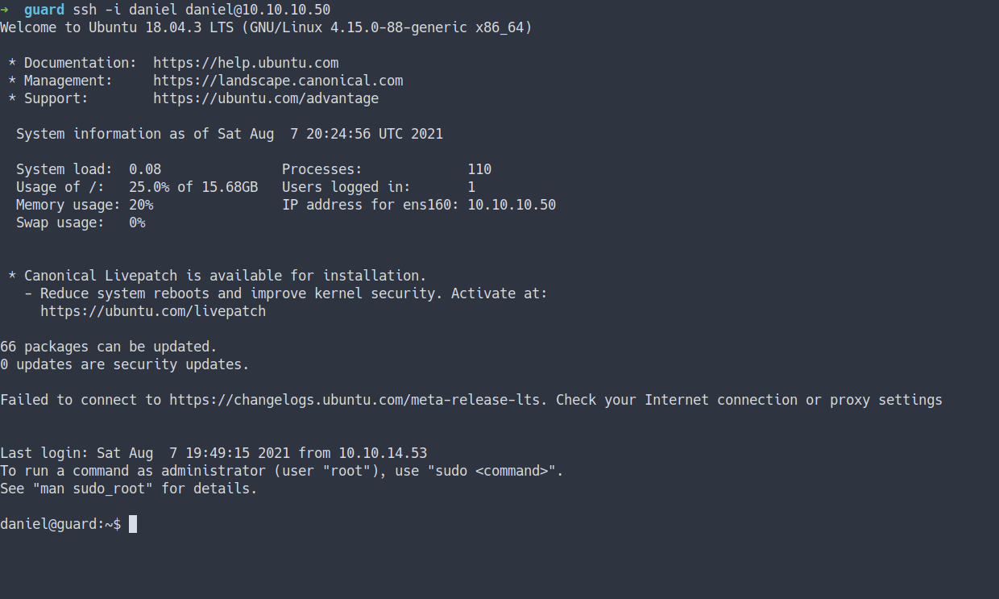
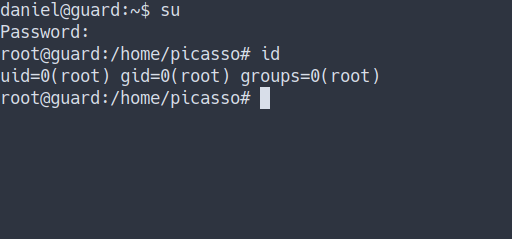

## Enumeration

- Top 1000 ports scan

```sql
nmap -sC -sV -oN nmap/initial 10.10.10.50
```
- the result


- scan all ports

```sql
nmap -sC -sV -p- -oN nmap/all_ports 10.10.10.50
```
- the result


### Open Ports
- Well, both nmap scan result shows `SSH port` just open

## Foothold/Gaining Access

### SSH
- Let's try SSH into the machine using the `private key` we've got from the `previous box [Markup]`



- It works

### rBash
- Well, I'm login as `daniel` and I found the user flag already.
- However, it's odd. When I try to read the content of the file
- It doesn't have any output.


- Turns out this user have `rbash/Restricted Bash Shell`
- Let's try bypass it
- Source
	- [TecMint - rBash Explained](https://www.tecmint.com/rbash-a-restricted-bash-shell-explained-with-practical-examples/)
	- [Hacking Articles - Multiple 	Methods to Bypass rBash](https://www.hackingarticles.in/multiple-methods-to-bypass-restricted-shell/)

## User Flag
- I'm gonna try bypass it using `ed`
- the result


- Finally, I can read the `user.txt` file
- That's means we successfully bypass the `rBash`

## Privilege Escalation

### Backup
- Now, let's start enumeration inside this box.
- These are some of the `commands` I run for manual enumeration.
- Source
	- [House of Note - Manual Enumeration](https://www.ctfnote.com/pentest/linux-privilege-escalation/manual-enumeration#password-hunting)

- I try looking at the backup file with the `.bak` extension

```bash
find / -iname '*.bak' -exec ls -l {} \; 2>/dev/null
```


- We've found couples `backup files` but I can't read them.
- Let's try another approach.

```bash
locate backup
```


- Well, I've found this.
- Let's try read `/var/backups/shadow` file
- the result


- Nice. We've got hashes. Let's try to crack it

### HashCat
> Hashcat is a password recovery tool. Examples of hashcat-supported hashing algorithms are LM hashes, MD4, MD5, SHA-family, and Unix Crypt formats as well as algorithms used in MySQL and Cisco PIX. <br>
> [Wikipedia - Hashcat](https://en.wikipedia.org/wiki/Hashcat) <br>
> [hashcat.net](https://hashcat.net/hashcat/)

- Now, I'm gonna copy and paste the `root hash` into a file `called root`
- Here is the [link to hashcat example hashes](https://hashcat.net/wiki/doku.php?id=example_hashes)
- I'm gonna run this command and use `rockyou.txt` as a wordlist

```bash
hashcat -m 1800 root /opt/rockyou.txt
```


_Note: I've already run it that's why I'm using `--show` at the end_

## Root
- Let's change our user into the root by using this command `su`
- when it's prompt for the password. Just insert the password we crack earlier



## Root Flag
- Let's get the final flag
- Nice


## Conclusion
I've learned a lot today. What is the `rBash` and how to bypass it. The most important thing is how you store your data or backup. If you do not properly store it or not configure the permission carefully. This thing might gonna happen. Once again, don't use the same password.

I have a fun time doing this machine and I hope you guys do too. Bye ;)