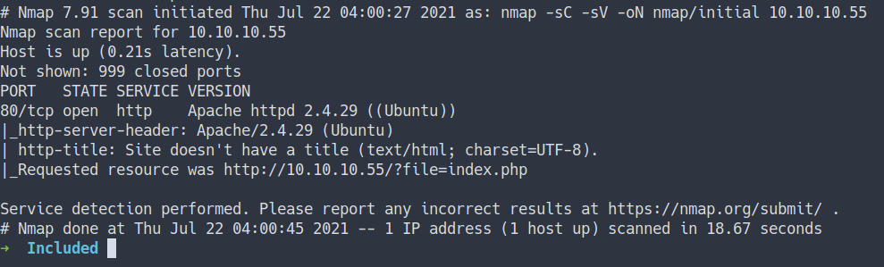
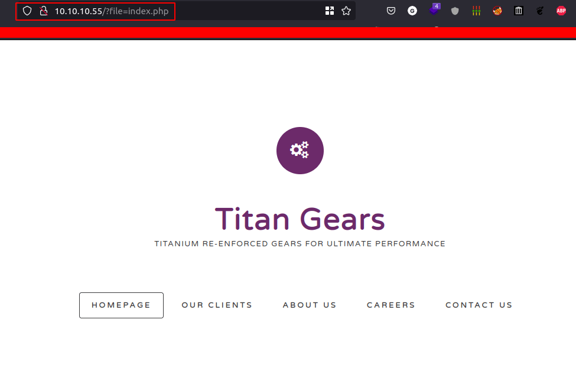
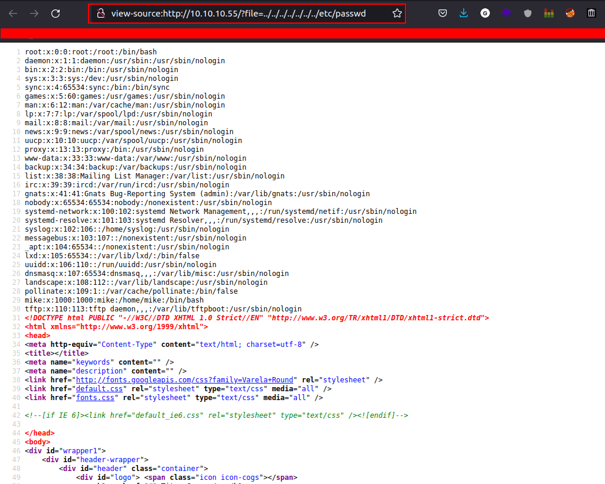
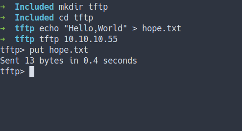
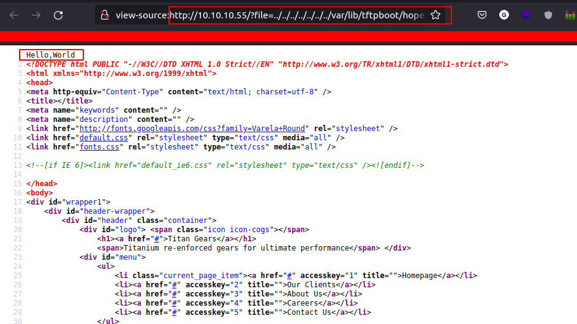
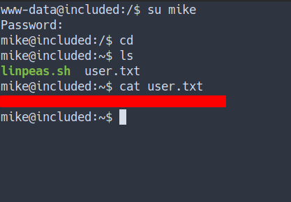
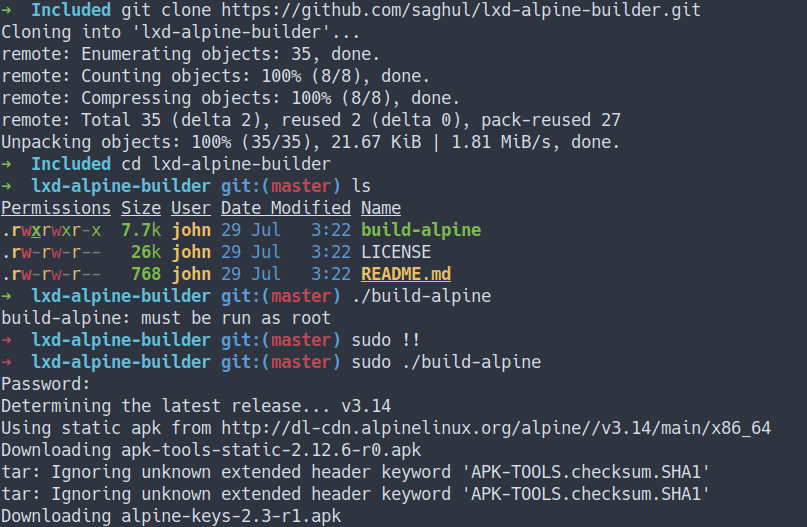
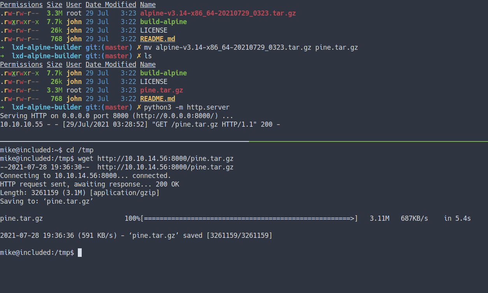

## Enumeration

- scan top 1000 ports

```sql
nmap -sC -sV -oN nmap/initial 10.10.10.55
```
- the result



- scan all ports

```sql
nmap -sC -sV -p- -oN nmap/all_ports 10.10.10.55
```

- the result


### Open Ports
- Well, both the Nmap result shows only `port 80` just `open`
- That's mean this server have a website

### Local File Inclusion [LFI]
- Based on the Nmap scan result, This server has a `website`
- Let's take a look



- When I saw this string that had `file` as `parameter`
- I'm always thinking <font color="yellow">Local File Inclusion [LFI]</font>
  - Let's try it with this string:
  - `http://10.10.10.55/?file=../../../../../../../etc/passwd`
- the result



- We can try to get `Remote Code Execution [RCE]` through log poisoning
  - Well, we can't
  - Let's try to enumerate again


<hr>

> <font color='yellow'>Quick Note:</font> I've already found the website is vuln to Local File Inclusion \[LFI\].


However, I can't find anything. To be honest, I took a peek of the writeup. There is no shamed of and I'm still learning. So, Here we go.

### UDP Scan
```sql
nmap -sU -oN nmap/UDP_scan 10.10.10.55
```
- I'm gonna run the nmap scan once again with `-sU` flag for UDP scan
- the result


### Trivial File Transfer Protocol [TFTP]

> Trivial File Transfer Protocol is a simple lockstep File Transfer Protocol which allows a client to get a file from or put a file onto a remote host.


- Read more here [Wikipedia - Trivial File Transfer Protocol](https://en.wikipedia.org/wiki/Trivial_File_Transfer_Protocol)
- In simple term this protocol is simple than regular protocol \[FTP\]

### Put File
- Now, we've already know the website can do `directory traversal`.
- Let's put the simple `Hello,World` file in `TFTP`



- `Let's hit that file using LFI`
- But where is the location of that file?
	- according this [link](https://www.quora.com/Where-is-the-TFTP-directory-in-Linux?share=1) It's locate `/var/lib/tftpboot`
- Let's try it out



- It Work!

## Foothold/Gaining Access

- Let's try get `the reverse shell`
- So, I'm gonna `put` the `php reverse shell` into TFTP 


- Start the listener and execute it


- I'M IN!

## User Flag
- Let's try login as `Mike` with a `password from the previous box`
- Success



## Mike
- Now, we've got Mike's password.
- So, I'm gonna check Mike's sudo capabilities by run this command `sudo -l`

```bash
# Well, that's unfortunate
mike@included:~$ sudo -l
[sudo] password for mike: 
Sorry, user mike may not run sudo on included.
```

- Let's check out his group, etc with `id command`

```bash
mike@included:~$ id
uid=1000(mike) gid=1000(mike) groups=1000(mike),108(lxd)
mike@included:~$ 
```

- Owhhh. I'm thinking we can become root with `exploit lxd`
- Because I found one of the machines in [TryHackMe](https://tryhackme.com/room/gamingserver) have this same vuln.
- Sources
    - [Doct3rJohn - GamingServer[THM]](/thm/gaming-server)
    - [Hacking Articles - lxd-privilege-escalation](https://www.hackingarticles.in/lxd-privilege-escalation/)
    - [Github - lxd-alpine-builder](https://github.com/saghul/lxd-alpine-builder)

## Privilege Escalation
### LXD
- Let's try it.
- First, I’m gonna `git clone the lxd-alpine-builder`
- Then, run the `build-alpine` command.



- After it's done building.
- The tar file will be created in our directory.
- Now, we need to download the tar file from our victim machine.



- This next bit gonna be complicated.
- So, if you wanna follow along. Please do


- YESSSS. I'M ROOT

## Root Flag


## Conclusion
I've learned a lot today. First, make sure to do recon properly and make sure to scan everything TCP/UDP/everything. Then, configure the webpage properly. Most of the time the webpage is the easier/first thing they(hacker) look at. Once again, don't use the same password.

I have a fun time doing this machine and I hope you guys do too. Bye ;)