## Nmap
Like always, I'm going to scan the IP Address by using [Nmap](https://nmap.org/).

```sql
# Nmap 7.92 scan initiated Tue May 17 23:03:20 2022 as: nmap -sC -sV -vv -p- -oN nmap/late_all 10.10.11.156
Nmap scan report for 10.10.11.156
Host is up, received echo-reply ttl 63 (0.070s latency).
Scanned at 2022-05-17 23:03:21 +08 for 243s
Not shown: 65533 closed tcp ports (reset)
PORT   STATE SERVICE REASON         VERSION
22/tcp open  ssh     syn-ack ttl 63 OpenSSH 7.6p1 Ubuntu 4ubuntu0.6 (Ubuntu Linux; protocol 2.0)
| ssh-hostkey: 
|   2048 02:5e:29:0e:a3:af:4e:72:9d:a4:fe:0d:cb:5d:83:07 (RSA)
| ssh-rsa AAAAB3NzaC1yc2EAAAADAQABAAABAQDSqIcUZeMzG+QAl/4uYzsU98davIPkVzDmzTPOmMONUsYleBjGVwAyLHsZHhgsJqM9lmxXkb8hT4ZTTa1azg4JsLwX1xKa8m+RnXwJ1DibEMNAO0vzaEBMsOOhFRwm5IcoDR0gOONsYYfz18pafMpaocitjw8mURa+YeY21EpF6cKSOCjkVWa6yB+GT8mOcTZOZStRXYosrOqz5w7hG+20RY8OYwBXJ2Ags6HJz3sqsyT80FMoHeGAUmu+LUJnyrW5foozKgxXhyOPszMvqosbrcrsG3ic3yhjSYKWCJO/Oxc76WUdUAlcGxbtD9U5jL+LY2ZCOPva1+/kznK8FhQN
|   256 41:e1:fe:03:a5:c7:97:c4:d5:16:77:f3:41:0c:e9:fb (ECDSA)
| ecdsa-sha2-nistp256 AAAAE2VjZHNhLXNoYTItbmlzdHAyNTYAAAAIbmlzdHAyNTYAAABBBBMen7Mjv8J63UQbISZ3Yju+a8dgXFwVLgKeTxgRc7W+k33OZaOqWBctKs8hIbaOehzMRsU7ugP6zIvYb25Kylw=
|   256 28:39:46:98:17:1e:46:1a:1e:a1:ab:3b:9a:57:70:48 (ED25519)
|_ssh-ed25519 AAAAC3NzaC1lZDI1NTE5AAAAIIGrWbMoMH87K09rDrkUvPUJ/ZpNAwHiUB66a/FKHWrj
80/tcp open  http    syn-ack ttl 63 nginx 1.14.0 (Ubuntu)
|_http-title: Late - Best online image tools
|_http-favicon: Unknown favicon MD5: 1575FDF0E164C3DB0739CF05D9315BDF
| http-methods: 
|_  Supported Methods: GET HEAD
|_http-server-header: nginx/1.14.0 (Ubuntu)
Service Info: OS: Linux; CPE: cpe:/o:linux:linux_kernel

Read data files from: /usr/bin/../share/nmap
Service detection performed. Please report any incorrect results at https://nmap.org/submit/ .
# Nmap done at Tue May 17 23:07:24 2022 -- 1 IP address (1 host up) scanned in 243.26 seconds
```

There are only `2` ports open. The `22/SSH` and `80/HTTP` ports.

### Http: late.htb

Well, the `SSH` is open. However, I'm going to ignore it because that's almost not likely going to be vulnerable. So, I'm going to check the other port, which is `port 80` by navigating through my browser. That's unexpected, I found a subdomain called `images` and also the hostname `late.htb`. I'm going to add it to my `/etc/hosts` file. 


### Http: images.late.htb

Going to the `images.late.htb` it says `convert image to text with flask`. Well, I'm using  [kali](https://www.kali.org/) linux and its came with `mousepad` as text editor ([XFCE](https://www.xfce.org/) flavour). So, I'm going to open the text editor and type the `Hello,World` as the text and screenshot it with [Flameshot](https://flameshot.org/). Save it and upload the file.

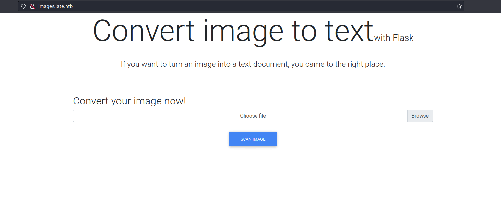

After I uploaded it, my browser downloaded the file called `result.txt`. When I read the content of the file it says `Hello,World` like the image that I uploaded but it's wrapped in an HTML paragraph tag.

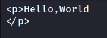

### SSTI (Server Side Template Injection)

That's interesting. So, like any human being that I am. I asked for help from Mr.Google itself (ask nicely of course;p). I've got bombarded with the result always something to do with [SSTI](https://owasp.org/www-project-web-security-testing-guide/v41/4-Web_Application_Security_Testing/07-Input_Validation_Testing/18-Testing_for_Server_Side_Template_Injection). Well, to be fair! this is a [flask](https://flask.palletsprojects.com/en/2.1.x/) application that's using [jinja](https://jinja.palletsprojects.com/en/3.1.x/) as the template engine. It does make sense if this app is vulnerable to it.

Time to find out! first, I'm going to upload an image with this payload as text _{\{7*7}}_. In theory, the template engine will see this as a mathematical equation and try to solve it. Hold and behold, the result is `49` and this is a positive indication it is vulnerable. So, I'll try uploading the [read file payload](https://github.com/swisskyrepo/PayloadsAllTheThings/blob/master/Server%20Side%20Template%20Injection/README.md#jinja2---read-remote-file). In this case, it is `/etc/passwd` file. It successfully retrieves the file.


I'm using Roboto Slab Regular fonts in Mousepad



## SSH: svc_acc

From the result above, there are just two users in this box. The `root` and `svc_acc` user. Also, the nmap scan result above shows `port 22` is open. Which is `SSH`. Then, I'll try to retrieve the `svc_acc` ssh private key in the user's home directory in the `.ssh`

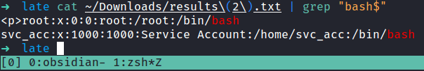

I'll change the payload from read `/etc/passwd` file into `/home/svc_acc/.ssh/id_rsa`. Well, the result came back and it did not disappoint at all. So, I'm going to open the file and remove the HTML paragraph tag `<p></p>`, and save it into a new name called `svc_acc`. Also, change the permission with this command; `chmod 600 <id_rsa>`. Without further ado, I'm going to ssh into the box with this key. (please work \*finger cross\*). It did work! YES!

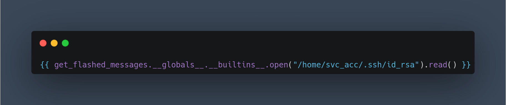

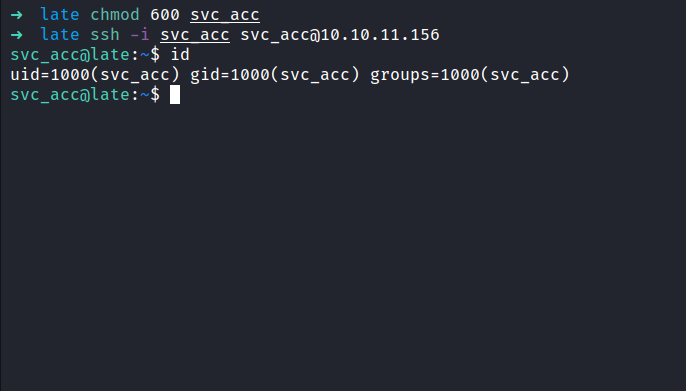

### PEASS-ng: linpeas.sh

I'm in as a `svc_acc` user and I also can read the first flag, which is the `user flag`. To be honest, I just want a quick win. Since this is a linux box, I'm going to run the linpeas script in this box. As always, I'm going to run the latest version of [linpeas](https://github.com/carlospolop/PEASS-ng) from [carlospolop](https://twitter.com/carlospolopm). 

After it is all done running, I'll check the output and find something weird. A directory called `/usr/local/sbin` contain a file called `ssh-alert.sh`. The file itself looks like a `bash script` because it's ended up with `.sh` extensions and this file is not a native to the linux ecosystem. (I think?)

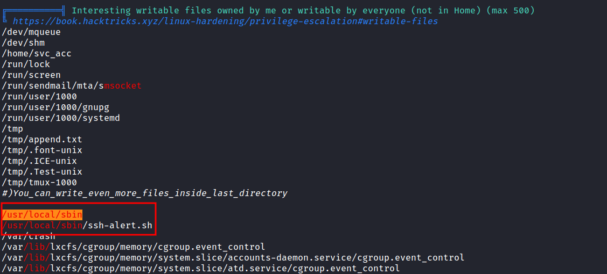

### /usr/local/sbin: ssh-alert.sh

Upon inspecting the file, it's looks like this file probably running every time someone logs in. Well, I'll try to edit the file but permissions don't allow me to write it when I checked the file attribute. Turns out, I can append something to this file.

However, if I manage to change this file. It doesn't mean I'm going to be `root` because this file belongs to the `svc_acc` user & groups. Honestly, I'm stuck and don't know what to do next. So, I reached out to the [HackTheBOX community](https://discord.com/invite/hackthebox) and got a nudge on `pspy`. I'm super excited because I've never used this tool before let alone known it exists. 

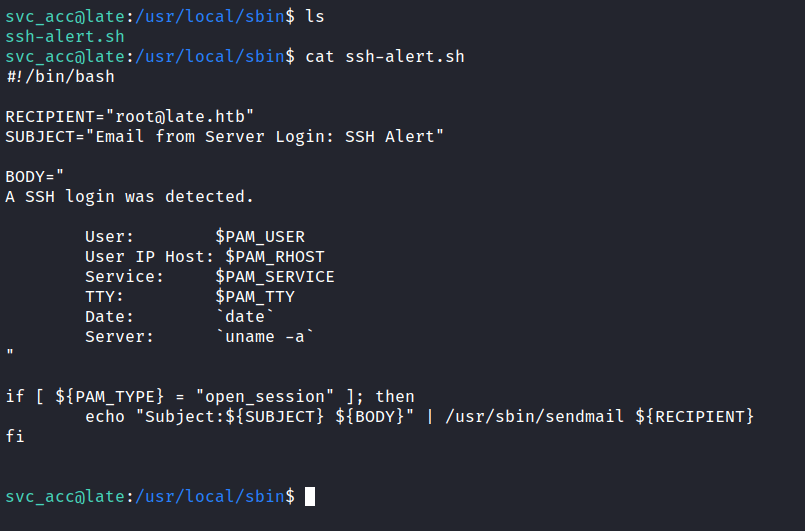

### Pspy

[Pspy](https://github.com/DominicBreuker/pspy) is a command-line tool designed to snoop on processes without the need for root permissions. It allows seeing commands run by other users, cron jobs, etc. as they execute. Without wasting any single second, I'm going to download the `pspy64` on the release page and execute it.

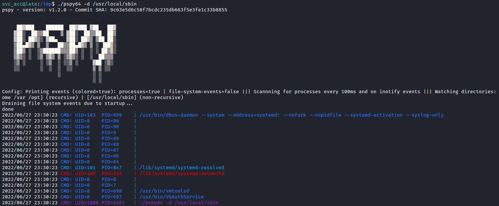

Based on the file `ssh-alert.sh` above. I need to make an ssh connection, to be able to execute the file. So, I'm going to open a new terminal and ssh in the box again. Interestingly, something pops out in the pspy output. The output itself shows the `ssh-alert.sh` file be executed by `root` and I can gain the `reverse shell` in this way.

_NOTE: `UID=0` is root_

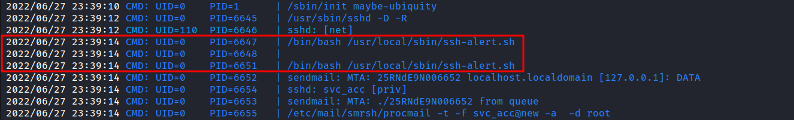

## Linux: Privilege Escalation

Going back to the `/usr/local/sbin` directory, I'm going to append the bash `reverse shell` into the `ssh-alert.sh` file. As mentioned above, I'm going to make a connection once again, and BOOM!. I've got the root shell.

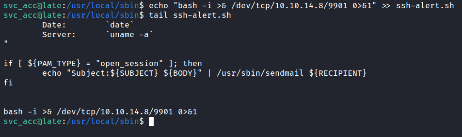

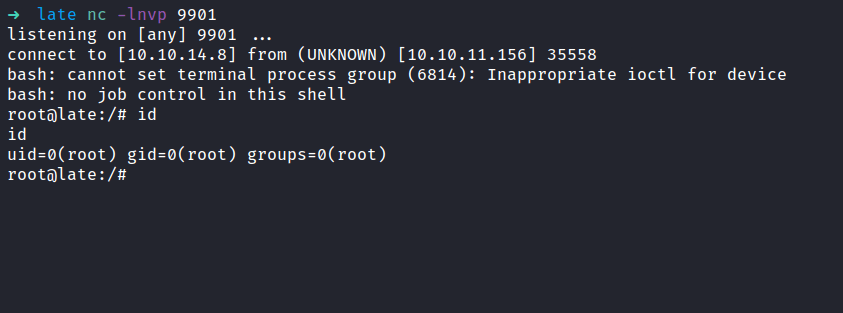

