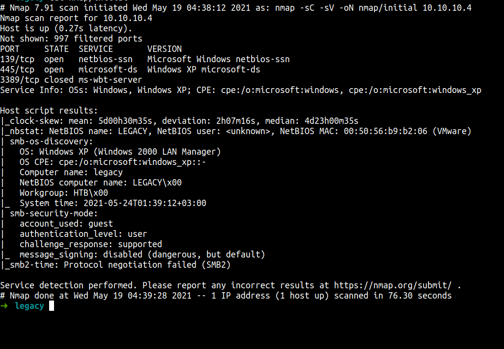
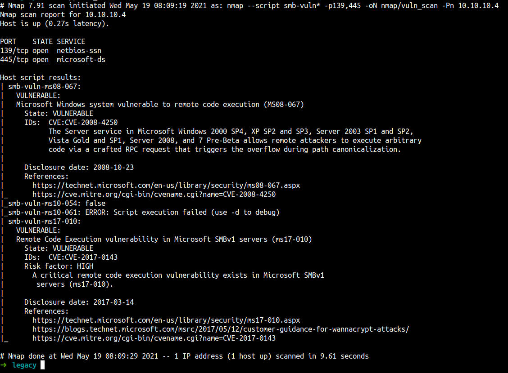
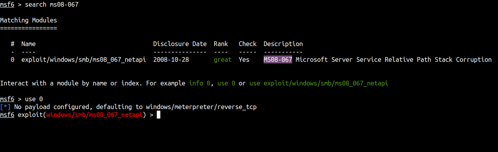
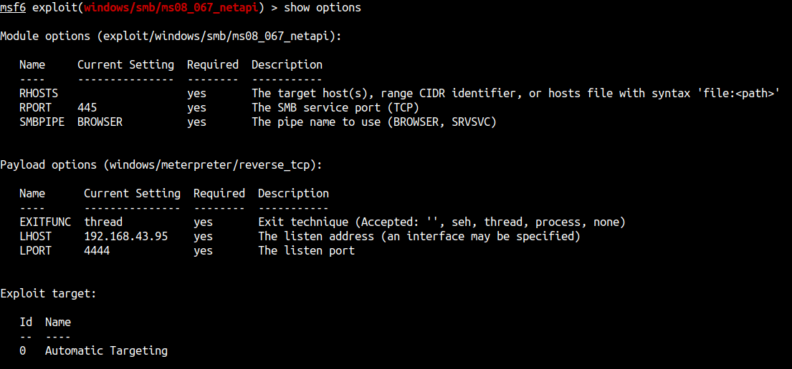
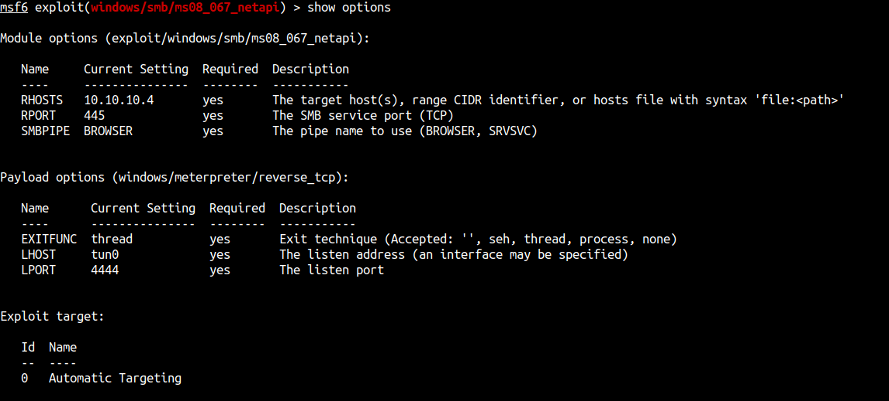
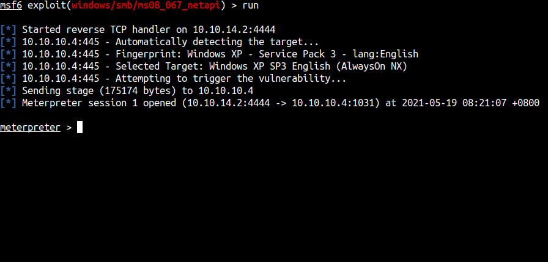
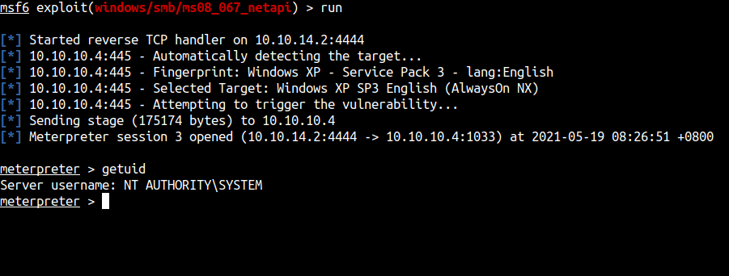
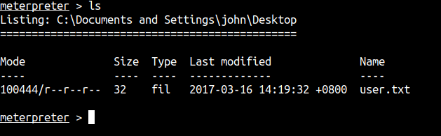
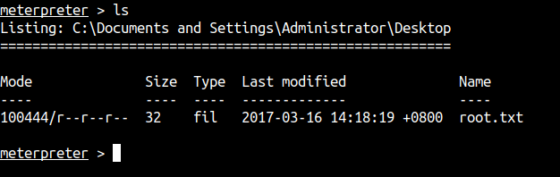

## Enumeration

First, let’s do an enumeration with the IP address of this machine. I’m gonna run Nmap [Netwok Mapper] to scan any open ports. I’m gonna run this command

```sql
nmap -sC -sV -oN nmap/initial 10.10.10.4
```
### Explaining the nmap scan:
* -sC	:= scan using nmap default script
* -sV	:= scan for version
* -oN := output in normal format

The result:



Again, using Nmap for scanning all ports but nothing new comes up.

Anyway, the Nmap scan result shows us this is a Windows XP machine.
Also, have smb on it. When I saw smb on Windows XP that's will be an EternalBlue exploit but I'm gonna run the Nmap `smb-vuln` script anyway.

```bash
nmap --script smb-vuln* -p139,445 10.10.10.4 -oN nmap/vuln_scan 
```

The result:



WOW! we've got the result back. The result shows us this machine vulnerable to RCE and Eternalblue attacks.

## Foothold/Gaining Access

So, I'm gonna use metasploit and seach `ms08-067` and use it.



Before we can use it. We need to set up the module first. So, I'm gonna set the `RHOSTS` into this machine ip address which is `10.10.10.4`. Then, I'm gonna set the `LHOST` into `tun0` which is my HTB ip address is.


_before_


_after_

After that just type `run`.



## Oopsie

The first thing we gonna check is `whoami`. So, I'm gonna use the `getuid` command



COOL! WE'RE THE SYSTEM!

Now, let's hunt for the user & admin flag.

### <u>User flag</u>



### <u>Root/Admin flag</u>



## Conclusion

I’ve learned a lot today. Always, update your system. We can see this machine so vulnerable even the Nmap scan shows us there are 2 "holes" in it. That "hole" needs to fix/update ASAP.

I have a fun time doing this machine and I hope you guys too. Bye ;)