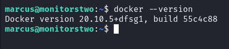

Box author | 

<!--more-->

## Nmap
Like always, I’m going to scan the IP Address by using [nmap](https://nmap.org/) but I’m going to scan the full port first. Then, I’m going to scan the only open ports.

```sql
nmap -sCV -p22,80 -oN nmap/monitorstwo 10.10.11.211

PORT   STATE SERVICE VERSION
22/tcp open  ssh     OpenSSH 8.2p1 Ubuntu 4ubuntu0.5 (Ubuntu Linux; protocol 2.0)
| ssh-hostkey: 
|   3072 48:ad:d5:b8:3a:9f:bc:be:f7:e8:20:1e:f6:bf:de:ae (RSA)
|   256 b7:89:6c:0b:20:ed:49:b2:c1:86:7c:29:92:74:1c:1f (ECDSA)
|_  256 18:cd:9d:08:a6:21:a8:b8:b6:f7:9f:8d:40:51:54:fb (ED25519)

80/tcp open  http    nginx 1.18.0 (Ubuntu)
|_http-title: Login to Cacti
|_http-server-header: nginx/1.18.0 (Ubuntu)
Service Info: OS: Linux; CPE: cpe:/o:linux:linux_kernel
```

The nmap scan result is completed. There are just `two` port opens which are `SSH, HTTP`. Based on the [OpenSSH](https://bugs.launchpad.net/ubuntu/+source/openssh/1:8.2p1-4ubuntu0.5) version, the target most likely running `Ubuntu 20.04`, codename `Focal Fossa`. I'm going to ignore `port 22` which is `SSH`, since I don't have any credentials.

## Http: Cacti Login
So, I'm going to navigated to `port 80` through my browser and I've been greeted with [Cacti](http://www.cacti.net/) login page. As usual, I'll tried a bunch of credentials combination such as `admin:admin, admin:password, root:root` and much more. Unfortunately, all of them were wrong.


## Docker: foothold - CVE-2022-46169
Then, I realized on the login page. It's showing the version number of this web application, which is `Cacti v1.2.22`. 


It's appear to be vulnerable to unauthenticated `RCE` and it gets assign as [CVE-2022-46169](https://nvd.nist.gov/vuln/detail/CVE-2022-46169). Based on this [description](https://pentest-tools.com/vulnerabilities-exploits/cacti-remote-code-execution_CVE-2022-46169), `RCE` vulnerability happens in the `remote_agent.php` file. It exists due to insufficient authorization when handling `HTTP` requests with a custom `Forwarded-For` header. 

With quick googling, I managed to find an [exploit](https://github.com/FredBrave/CVE-2022-46169-CACTI-1.2.22) about this particular version. Then I'm going to execute it, and it's successfully executed.


Like always, I'm going to upgrade my reverse shell into full interactive and stabile. However, both of the python version did not exist on this machine. So, I'm going to upgrading using `script`.


### Docker: privesc - capsh
After successfully upgrading my reverse shell. I'll try to check the sudo permission with command `sudo -l`. Unfortunately, the `sudo` command did not exist on this machine. So, I'll try to find any `SUID` binary that can be abused by execute this command `find / -perm -u=s 2>/dev/null`.


Luckly, the `capsh` was set into `SUID` binary and it is a tool that provides a handy wrapper for certain types of capability testing and environment creation. Then, I searching up on [GTFOBins](https://gtfobins.github.io/) and managed to found this [command](https://gtfobins.github.io/gtfobins/capsh/#suid) to abused it. After successful execution, I manage to become a root user.


### Docker: entrypoint.sh
Unfortunately, I'm in docker container based on the `.dockerenv` file present. On top of that, my eyes managed to caught something interesting, it was a bash file named `entrypoint.sh` and it's contains `mysql` command with plaintext credentials.


### Docker: mysql
So, I'll try to log into `mysql` service with founded credentials above and it's succeed. Then, with quick database enumeration, I found username along side with password hashes.


Since I already have the hashes of the user. I'm going to crack it with [john](https://github.com/openwall/john). Unfortunately, the `admin` hash did not cracked successfully. However, it managed to crack the other hash, which is `marcus`.


## SSH: marcus
I successfully log into the machine via cracked credentials of the user called `marcus` through `SSH`.


I'm in as a `marcus` user. Like always, I'm going to check the sudo permission of this user with the command `sudo -l`. Turns out, this user cannot run as `sudo` on this machine.


### SSH: docker version
I really dumbfounded. Then, I'm thinking, if this machine has a docker inside it. It might worth checking the installed docker version with a simple command `docker --version`.



## PrivEsc: CVE-2021-41091 
Based on the version above. It seems this an old docker engine dated back to `2021`. Then, I found this [exploit](https://github.com/UncleJ4ck/CVE-2021-41091/tree/main) on the internet and it gets assign [CVE-2021-41091](https://cve.mitre.org/cgi-bin/cvename.cgi?name=CVE-2021-41091). Based on this [description](https://github.com/UncleJ4ck/CVE-2021-41091/tree/main#vulnerability-summary), it's allow unprivileged users to traverse and execute programs within the data directory (typically `/var/lib/docker`) due to improperly restricted permissions. 

To exploit it successfully, first, I need to go back to [shell](https://shafiqaiman.com/posts/htb/monitorstwo/#docker-privesc---capsh) that I have in docker container and setup `/bin/bash` as a `SUID` binary.


Then, I transfer this [exploit](https://github.com/UncleJ4ck/CVE-2021-41091) into the machine that I have `SSH` into, and make it executable with command `chmod +x`. When everything already setup, finally, I can execute the exploit and it was successeded. Lastly, I'm going to change directory into vulnerable path and execute this command `./bin/bash -p` and become root.


