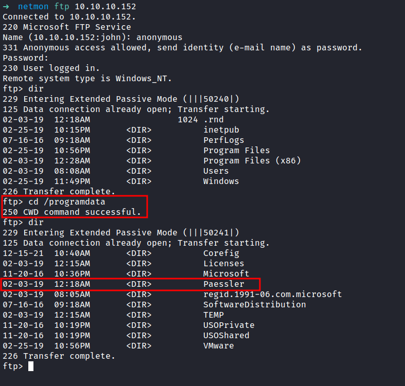

Box author | 

<!--more-->

## Nmap
First, let's scan the IP address by using the Nmap

```sql
# Nmap 7.92 scan initiated Thu May 26 02:11:18 2022 as: nmap -sC -sV -vv -T4 -p- -oN nmap/netmon_all 10.10.10.152
Nmap scan report for 10.10.10.152
Host is up, received echo-reply ttl 127 (0.048s latency).
Scanned at 2022-05-26 02:11:19 +08 for 126s
Not shown: 65522 closed tcp ports (reset)
PORT      STATE SERVICE      REASON          VERSION
21/tcp    open  ftp          syn-ack ttl 127 Microsoft ftpd
| ftp-anon: Anonymous FTP login allowed (FTP code 230)
| 02-03-19  12:18AM                 1024 .rnd
| 02-25-19  10:15PM       <DIR>          inetpub
| 07-16-16  09:18AM       <DIR>          PerfLogs
| 02-25-19  10:56PM       <DIR>          Program Files
| 02-03-19  12:28AM       <DIR>          Program Files (x86)
| 02-03-19  08:08AM       <DIR>          Users
|_02-25-19  11:49PM       <DIR>          Windows
| ftp-syst: 
|_  SYST: Windows_NT
80/tcp    open  http         syn-ack ttl 127 Indy httpd 18.1.37.13946 (Paessler PRTG bandwidth monitor)
|_http-server-header: PRTG/18.1.37.13946
|_http-trane-info: Problem with XML parsing of /evox/about
|_http-favicon: Unknown favicon MD5: 36B3EF286FA4BEFBB797A0966B456479
| http-title: Welcome | PRTG Network Monitor (NETMON)
|_Requested resource was /index.htm
| http-methods: 
|_  Supported Methods: GET HEAD POST OPTIONS
135/tcp   open  msrpc        syn-ack ttl 127 Microsoft Windows RPC
139/tcp   open  netbios-ssn  syn-ack ttl 127 Microsoft Windows netbios-ssn
445/tcp   open  microsoft-ds syn-ack ttl 127 Microsoft Windows Server 2008 R2 - 2012 microsoft-ds
5985/tcp  open  http         syn-ack ttl 127 Microsoft HTTPAPI httpd 2.0 (SSDP/UPnP)
|_http-server-header: Microsoft-HTTPAPI/2.0
|_http-title: Not Found
47001/tcp open  http         syn-ack ttl 127 Microsoft HTTPAPI httpd 2.0 (SSDP/UPnP)
|_http-server-header: Microsoft-HTTPAPI/2.0
|_http-title: Not Found
49664/tcp open  msrpc        syn-ack ttl 127 Microsoft Windows RPC
49665/tcp open  msrpc        syn-ack ttl 127 Microsoft Windows RPC
49666/tcp open  msrpc        syn-ack ttl 127 Microsoft Windows RPC
49667/tcp open  msrpc        syn-ack ttl 127 Microsoft Windows RPC
49668/tcp open  msrpc        syn-ack ttl 127 Microsoft Windows RPC
49669/tcp open  msrpc        syn-ack ttl 127 Microsoft Windows RPC
Service Info: OSs: Windows, Windows Server 2008 R2 - 2012; CPE: cpe:/o:microsoft:windows

Host script results:
| smb2-time: 
|   date: 2022-05-25T18:13:22
|_  start_date: 2022-05-25T16:09:05
| smb2-security-mode: 
|   3.1.1: 
|_    Message signing enabled but not required
| smb-security-mode: 
|   authentication_level: user
|   challenge_response: supported
|_  message_signing: disabled (dangerous, but default)
| p2p-conficker: 
|   Checking for Conficker.C or higher...
|   Check 1 (port 33374/tcp): CLEAN (Couldn't connect)
|   Check 2 (port 40209/tcp): CLEAN (Couldn't connect)
|   Check 3 (port 15668/udp): CLEAN (Failed to receive data)
|   Check 4 (port 46849/udp): CLEAN (Timeout)
|_  0/4 checks are positive: Host is CLEAN or ports are blocked
|_clock-skew: mean: 0s, deviation: 0s, median: 0s

Read data files from: /usr/bin/../share/nmap
Service detection performed. Please report any incorrect results at https://nmap.org/submit/ .
# Nmap done at Thu May 26 02:13:25 2022 -- 1 IP address (1 host up) scanned in 127.45 seconds
```

That's a lot of open ports. Port `21/ftp` really caught my eyes. In this scan, it says `Anonymous FTP login allowed`. So, let's check it out.

## FTP (File Transfer Protocol)

Successfully login as an `anonymous` user. OH WOW!. Looks like we've got the entire directory of the server. In this case, the server running `Windows`. On top of that, I've got the `user flag` in the `/Users/Public` directory.


## Http (PRTG Network Monitor)
The Nmap scan above also reveals, that port `80/http` is open and the title was `Welcome | PRTG Network Monitor (NETMON)`. Now, let's check the http site. It's just a login page. 

First, I'm gonna try the default credentials `prtgadmin:prtgadmin`.  Unfortunately, it didn't work but luck is on our side. We already have the access to the server file system through `FTP`.


### Paessler
So, I went googling around the internet and found this [article](https://kb.paessler.com/en/topic/463-how-and-where-does-prtg-store-its-data) about; where does PRTG store its data. The `Data directory` is stored in a folder called `Paessler` that locate in `programdata`. 

To be honest, I am stuck at this point cause I didn't even see the directory called `programdata`. Then, I'm just playing around in the file system and finally found it. Turns out, it's located in the root directory `/programdata`.



### PRTG Configuration.old.bak

Then, I found the `PRTG Configuration` files locate in the directory `/programdata/Paessler/PRTG Network Monitor`. The `.bak` extensions caught my eyes. So, I ended up downloading the 3 config files with the `get` command.


I manage found the `password` inside the `PRTG Configuration.old.bak` file. So, let's try login in with these found credentials. Unfortunately, it doesn't work. 


Upon inspection, I found that the file called `PRTG Configuration.old.bak` was created back in `2018`, and the 2 other files were created in `2019`. So, I'm gonna assumed the developers are so lazy and not careful enough with the password. Now, I'm gonna change the password to end with `2018` into `2019`. Let's try it out.


### Http (Welcome PRTG System Administrator!)


YES!!! IT WORKS!!!

This admin page, reveals the version of the software version `18.1.37.13946`. Then, I ask google nicely and found this [article](https://www.codewatch.org/blog/?p=453). The article is about `Command Injection Vulnerability` and got assigned to a [CVE-2018-9276](https://nvd.nist.gov/vuln/detail/CVE-2018-9276).

## RCE (Remote Code Execution)
Then, I'll try to search the exploit in the `searchsploit` databases and find, one that has `(Authenticated) RCE`. We are in luck because I've already got the admin credentials. So, I'm gonna copy the exploit into my current directory with the `-m` flag.


The exploit needed the admin `cookies`. Then, Its gonna created the user called `pentest` in the admin groups. In the Nmap scan result above, we see that port [5985](https://www.speedguide.net/port.php?port=5985) is open. The exploit successfully ran. Let's connected to the machine through the credentials `pentest:P3nT3st!`


NICE!