## Nmap
Let's scan the Ip address first, by using Nmap.

### result
```sql
# Nmap 7.92 scan initiated Sun Apr 17 06:14:42 2022 as: nmap -sC -sV -p- -T4 -vv -oN nmap/timelapse_all 10.10.11.152
Nmap scan report for 10.10.11.152
Host is up, received echo-reply ttl 127 (0.055s latency).
Scanned at 2022-04-17 06:14:43 +08 for 205s
Not shown: 65517 filtered tcp ports (no-response)
PORT      STATE SERVICE           REASON          VERSION
53/tcp    open  domain            syn-ack ttl 127 Simple DNS Plus
88/tcp    open  kerberos-sec      syn-ack ttl 127 Microsoft Windows Kerberos (server time: 2022-04-17 06:16:37Z)
135/tcp   open  msrpc             syn-ack ttl 127 Microsoft Windows RPC
139/tcp   open  netbios-ssn       syn-ack ttl 127 Microsoft Windows netbios-ssn
389/tcp   open  ldap              syn-ack ttl 127 Microsoft Windows Active Directory LDAP (Domain: timelapse.htb0., Site: Default-First-Site-Name)
445/tcp   open  microsoft-ds?     syn-ack ttl 127
464/tcp   open  kpasswd5?         syn-ack ttl 127
593/tcp   open  ncacn_http        syn-ack ttl 127 Microsoft Windows RPC over HTTP 1.0
636/tcp   open  ldapssl?          syn-ack ttl 127
3268/tcp  open  ldap              syn-ack ttl 127 Microsoft Windows Active Directory LDAP (Domain: timelapse.htb0., Site: Default-First-Site-Name)
3269/tcp  open  globalcatLDAPssl? syn-ack ttl 127
5986/tcp  open  ssl/http          syn-ack ttl 127 Microsoft HTTPAPI httpd 2.0 (SSDP/UPnP)
| ssl-cert: Subject: commonName=dc01.timelapse.htb
| Issuer: commonName=dc01.timelapse.htb
| Public Key type: rsa
| Public Key bits: 2048
| Signature Algorithm: sha256WithRSAEncryption
| Not valid before: 2021-10-25T14:05:29
| Not valid after:  2022-10-25T14:25:29
| MD5:   e233 a199 4504 0859 013f b9c5 e4f6 91c3
| SHA-1: 5861 acf7 76b8 703f d01e e25d fc7c 9952 a447 7652
| -----BEGIN CERTIFICATE-----
| MIIDCjCCAfKgAwIBAgIQLRY/feXALoZCPZtUeyiC4DANBgkqhkiG9w0BAQsFADAd
| MRswGQYDVQQDDBJkYzAxLnRpbWVsYXBzZS5odGIwHhcNMjExMDI1MTQwNTI5WhcN
| MjIxMDI1MTQyNTI5WjAdMRswGQYDVQQDDBJkYzAxLnRpbWVsYXBzZS5odGIwggEi
| MA0GCSqGSIb3DQEBAQUAA4IBDwAwggEKAoIBAQDJdoIQMYt47skzf17SI7M8jubO
| rD6sHg8yZw0YXKumOd5zofcSBPHfC1d/jtcHjGSsc5dQQ66qnlwdlOvifNW/KcaX
| LqNmzjhwL49UGUw0MAMPAyi1hcYP6LG0dkU84zNuoNMprMpzya3+aU1u7YpQ6Dui
| AzNKPa+6zJzPSMkg/TlUuSN4LjnSgIV6xKBc1qhVYDEyTUsHZUgkIYtN0+zvwpU5
| isiwyp9M4RYZbxe0xecW39hfTvec++94VYkH4uO+ITtpmZ5OVvWOCpqagznTSXTg
| FFuSYQTSjqYDwxPXHTK+/GAlq3uUWQYGdNeVMEZt+8EIEmyL4i4ToPkqjPF1AgMB
| AAGjRjBEMA4GA1UdDwEB/wQEAwIFoDATBgNVHSUEDDAKBggrBgEFBQcDATAdBgNV
| HQ4EFgQUZ6PTTN1pEmDFD6YXfQ1tfTnXde0wDQYJKoZIhvcNAQELBQADggEBAL2Y
| /57FBUBLqUKZKp+P0vtbUAD0+J7bg4m/1tAHcN6Cf89KwRSkRLdq++RWaQk9CKIU
| 4g3M3stTWCnMf1CgXax+WeuTpzGmITLeVA6L8I2FaIgNdFVQGIG1nAn1UpYueR/H
| NTIVjMPA93XR1JLsW601WV6eUI/q7t6e52sAADECjsnG1p37NjNbmTwHabrUVjBK
| 6Luol+v2QtqP6nY4DRH+XSk6xDaxjfwd5qN7DvSpdoz09+2ffrFuQkxxs6Pp8bQE
| 5GJ+aSfE+xua2vpYyyGxO0Or1J2YA1CXMijise2tp+m9JBQ1wJ2suUS2wGv1Tvyh
| lrrndm32+d0YeP/wb8E=
|_-----END CERTIFICATE-----
|_http-title: Not Found
|_http-server-header: Microsoft-HTTPAPI/2.0
| tls-alpn: 
|_  http/1.1
|_ssl-date: 2022-04-17T06:18:07+00:00; +7h59m59s from scanner time.
9389/tcp  open  mc-nmf            syn-ack ttl 127 .NET Message Framing
49667/tcp open  msrpc             syn-ack ttl 127 Microsoft Windows RPC
49673/tcp open  ncacn_http        syn-ack ttl 127 Microsoft Windows RPC over HTTP 1.0
49674/tcp open  msrpc             syn-ack ttl 127 Microsoft Windows RPC
49696/tcp open  msrpc             syn-ack ttl 127 Microsoft Windows RPC
64800/tcp open  msrpc             syn-ack ttl 127 Microsoft Windows RPC
Service Info: Host: DC01; OS: Windows; CPE: cpe:/o:microsoft:windows

Host script results:
| smb2-time: 
|   date: 2022-04-17T06:17:30
|_  start_date: N/A
| smb2-security-mode: 
|   3.1.1: 
|_    Message signing enabled and required
|_clock-skew: mean: 7h59m58s, deviation: 0s, median: 7h59m58s
| p2p-conficker: 
|   Checking for Conficker.C or higher...
|   Check 1 (port 62878/tcp): CLEAN (Timeout)
|   Check 2 (port 32357/tcp): CLEAN (Timeout)
|   Check 3 (port 38085/udp): CLEAN (Timeout)
|   Check 4 (port 22941/udp): CLEAN (Timeout)
|_  0/4 checks are positive: Host is CLEAN or ports are blocked

Read data files from: /usr/bin/../share/nmap
Service detection performed. Please report any incorrect results at https://nmap.org/submit/ .
# Nmap done at Sun Apr 17 06:18:08 2022 -- 1 IP address (1 host up) scanned in 206.29 seconds
```

Oh wow! this is an active directory machine and that's a lot of open ports. We also get the hostname called `timelapse.htb`, let's add it to the `/etc/hosts` file.

## SMB
In the result of the Nmap scan. I saw that ports `139` and `445` are open and it's a default for `SMB (Server Message Block)`. Let's check the windows version using a tool called [CrackMapExec](https://github.com/byt3bl33d3r/CrackMapExec).

### CrackMapExec: SMB
The version of Windows currently using is `Windows 10.0 Build 17763 x64`. So, this is not a new version of Windows, at the time writing this blog Windows 11 is already out.

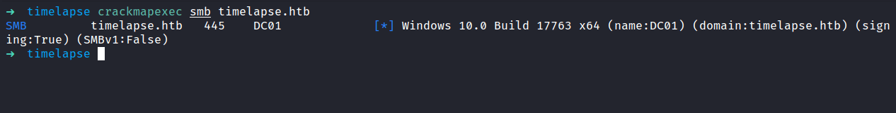

### SMBclient
Now, we already know that smb ports are open. Let's try listing the shares by using `smbclient`. Surprisingly, it doesn't require authentication for it. I just press `Enter` in the password prompt. 

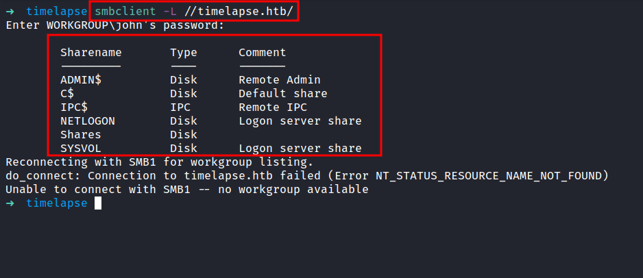

## JohntheRipper: zip2john
After checking the all shares. I finally found something that looks interesting. I found the `winrm_backup.zip` file in `\Shares\Dev\`. Let's download it, into our attack machine with the `get command`. Now, it's time to unzip the file. However, it is protected by a password and I don't know, what the password is. So, I'm gonna run `zip2john` to crack the zip file with `rockyou.txt` as a wordlist.

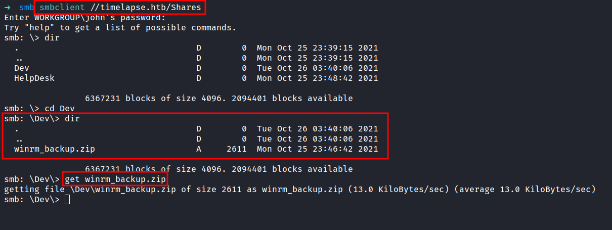


## *.PFX file
Finally, the wait pay off. We've got the password and it's time to crack it open. Well, it just contains one file called `legacyy_dev_auth.pfx`. I never heard of the extensions called `pfx`  before, and with quick googling. It says:

> The .pfx file, which is in a PKCS#12 format, **contains the SSL certificate (public keys) and the corresponding private keys**.
 

 
### JohntheRipper: pfx2john
The `pfx` file it's just a binary that compiles with public and private keys. Now, what we need is, to extract the keys from it. I manage found an article that shows us `'How to extract it'`. Here's the [article](https://www.ibm.com/docs/en/arl/9.7?topic=certification-extracting-certificate-keys-from-pfx-file). First, we need to extract the private key by using `openssl`. Unfortunately, its needed the password. I already try the password that we found earlier and it doesn't work. Now, I'm gonna run the file against `pfx2john` to produce the hash and crack it with `john`.
 
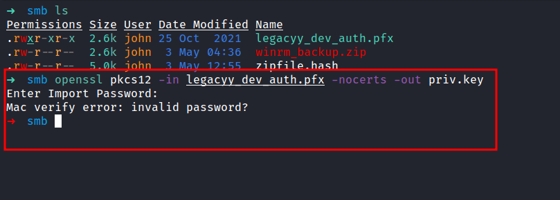
 
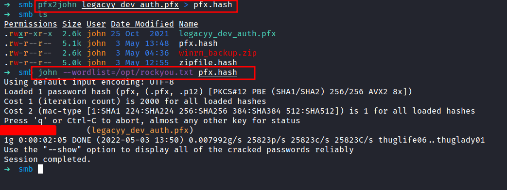
 
### Extracting the cert from *.PFX file
Nice! we finally managed to retrieve the `pfx` file password. Let's try to extract the keys one more time. Here's an [article](https://www.ibm.com/docs/en/arl/9.7?topic=certification-extracting-certificate-keys-from-pfx-file) for reference. Let me breaks down into three parts real quick.

1. The first command is basically to extract  the encrypted private key
2. Run the next following command to extract the certificate/public key
3. The final command, it's just decrypted the private key

_<font color="yellow">NOTE: you will be prompted to type the import password. Type the password you found earlier by using pfx2john</font>_

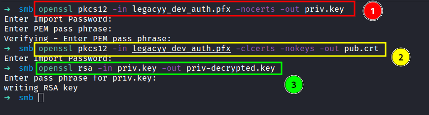

## Evil-WinRM: legacyy
Based on the zip file name `'winrm_backup.zip'`. I guess this might be something to do with `winrm`, and the Nmap scan result also shows us that port `5986` is open. 

Let's try connecting to it with `Evil-WinRM` and make sure to `enable ssl` with the `-S` tag. I'm gonna use the keys we discovered with  `-c` for the public key and `-k` for a private key. Finally, I'm in as a `legacyy` user.

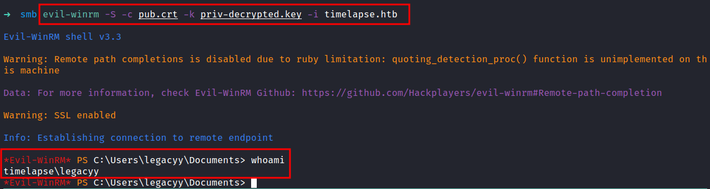

### Powershell History
So, I'll try to run the `winpeas`. Unfortunately, it doesn't execute because the `Anti-Virus` program managed to catch it and throws this error `file contains a virus or potentially unwanted software`. Honestly, I am stuck on this machine. Then, I realized, I never check the `powershell history` and I felt guilty because that file has always been ignored by me. To my surprise, I found something useful yet interesting in the `powershell history` file.

```powershell
type $env:APPDATA\Microsoft\Windows\PowerShell\PSReadLine\ConsoleHost_history.txt
```

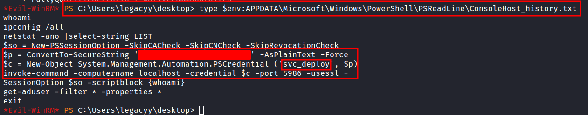

## Evil-WinRM: svc_deploy
Well, in the `history` file contains `svc_deploy` user credentials and lead us into port `5986` once again. Let's connect to the machine as `svc_deploy` user with the credentials we just found. Success!

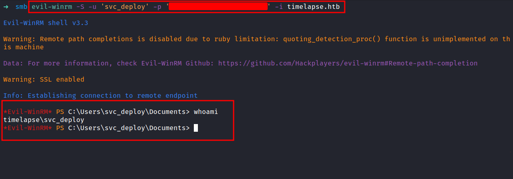

### Group: LAPS_Readers
Let's check this user "background" with the `net user` command. Turns out, this user is part of `LAPS_Readers` Global Group memberships. Honestly, I didn't even know what it is, but it sounds cool :p with a quick search on the net. It says:

> The "Local Administrator Password Solution" (LAPS) provides management of local account passwords of domain-joined computers. Passwords are stored in Active Directory (AD) and protected by ACL, so only eligible users can read them or request its reset.

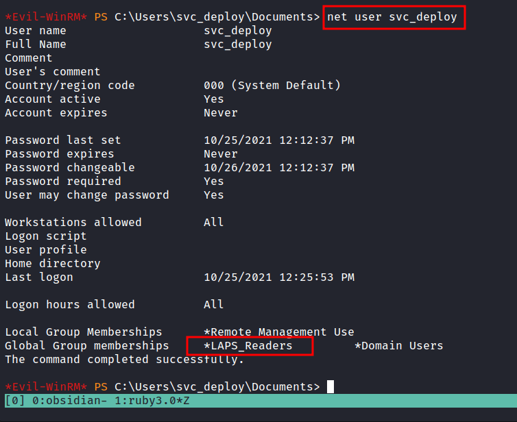

### LDAPsearch
The excited part of it. We can read the password stored in Active Directory. The last time I checked, this is an AD machine. So, I manage to find an [article](https://www.hackingarticles.in/credential-dumpinglaps/) that's about credentials dumping. I already try used `crackmapexec` and it just threw a bunch of errors at me. So, I end up using `ldapsearch`. Let's dump the `administrator` credentials.

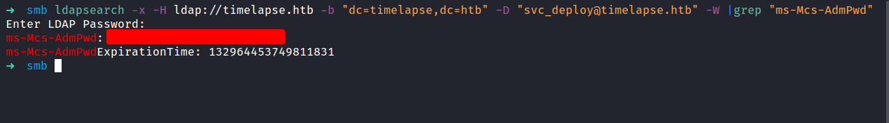

## Evil-WinRM: administrator
We successfully retrieve the `administrator` credentials. Let's try connect to `evil-winrm`.

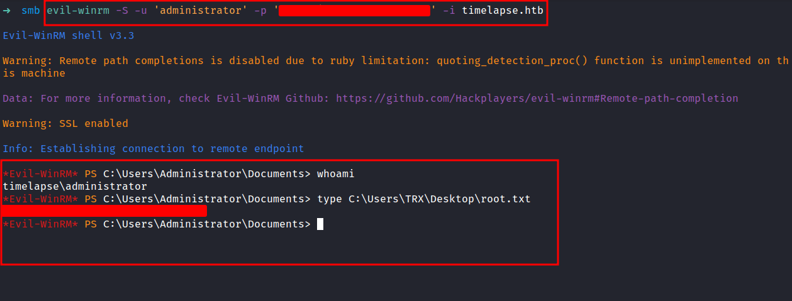

\*CHEF KISS\* Beautiful