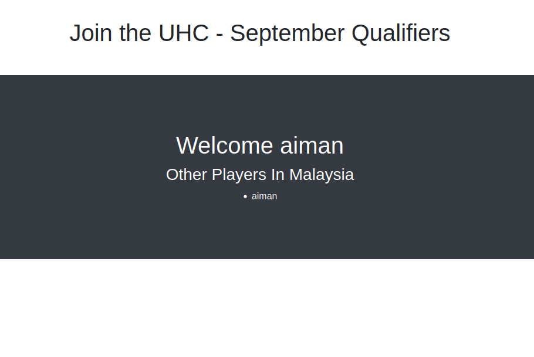
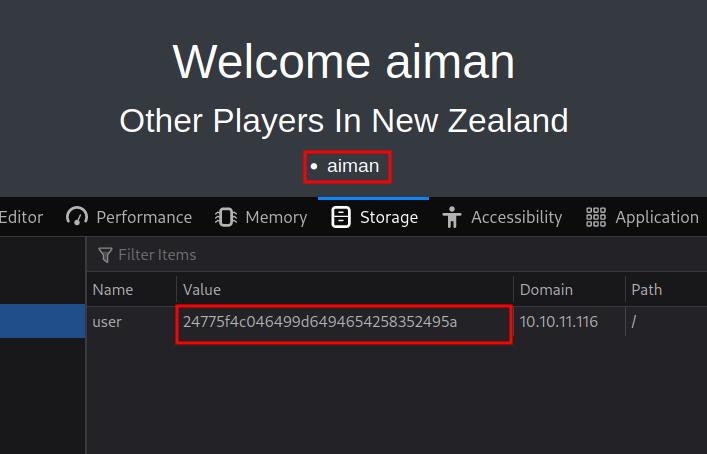
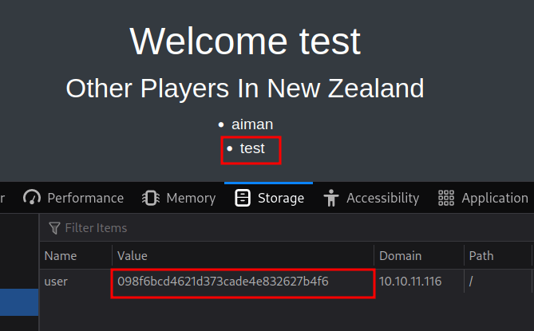
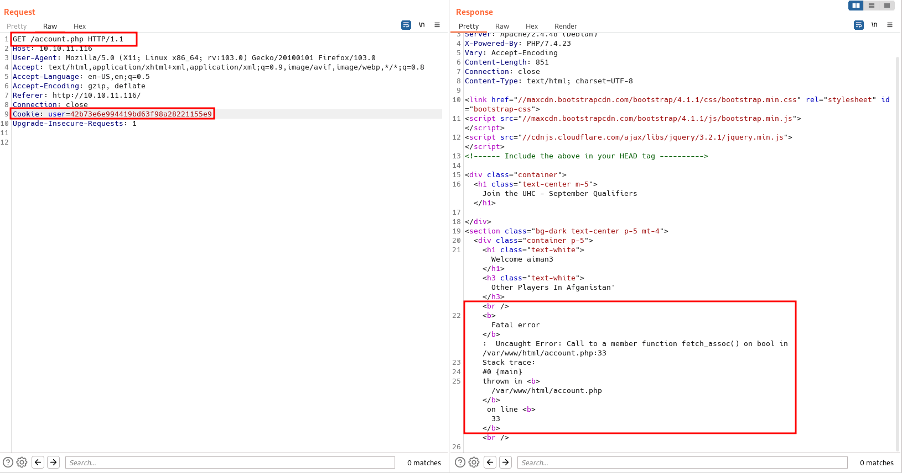
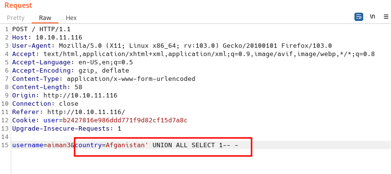
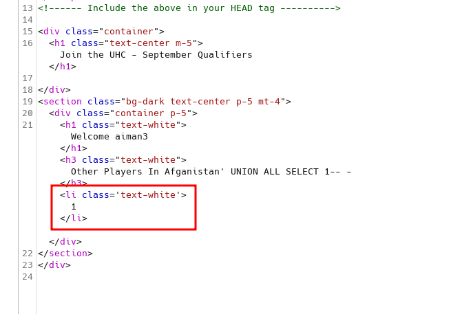
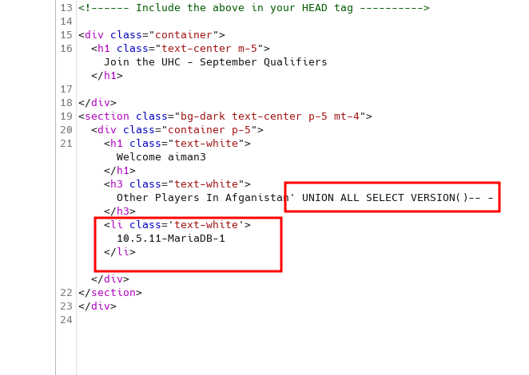
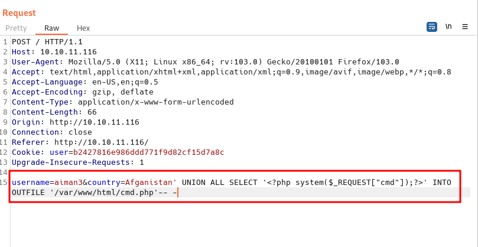
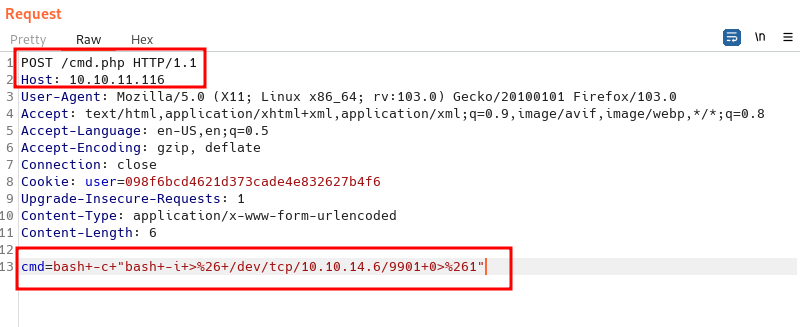

Box author | 

<!--more-->

## Nmap
Like always, I'm going to scan the IP Address by using [Nmap](https://nmap.org/).

```sql
# Nmap 7.92 scan initiated Fri Aug 19 23:10:37 2022 as: nmap -sCV -O -oN nmap/validation 10.10.11.116
Nmap scan report for 10.10.11.116
Host is up (0.19s latency).
Not shown: 992 closed tcp ports (reset)
PORT     STATE    SERVICE       VERSION
22/tcp   open     ssh           OpenSSH 8.2p1 Ubuntu 4ubuntu0.3 (Ubuntu Linux; protocol 2.0)
| ssh-hostkey: 
|   3072 d8:f5:ef:d2:d3:f9:8d:ad:c6:cf:24:85:94:26:ef:7a (RSA)
|   256 46:3d:6b:cb:a8:19:eb:6a:d0:68:86:94:86:73:e1:72 (ECDSA)
|_  256 70:32:d7:e3:77:c1:4a:cf:47:2a:de:e5:08:7a:f8:7a (ED25519)
80/tcp   open     http          Apache httpd 2.4.48 ((Debian))
|_http-title: Site doesn't have a title (text/html; charset=UTF-8).
|_http-server-header: Apache/2.4.48 (Debian)
5000/tcp filtered upnp
5001/tcp filtered commplex-link
5002/tcp filtered rfe
5003/tcp filtered filemaker
5004/tcp filtered avt-profile-1
8080/tcp open     http          nginx
|_http-title: 502 Bad Gateway
No exact OS matches for host (If you know what OS is running on it, see https://nmap.org/submit/ ).
TCP/IP fingerprint:
OS:SCAN(V=7.92%E=4%D=8/19%OT=22%CT=1%CU=39488%PV=Y%DS=2%DC=I%G=Y%TM=62FFA81
OS:5%P=x86_64-pc-linux-gnu)SEQ(SP=103%GCD=2%ISR=10F%TI=Z%CI=Z%II=I%TS=A)OPS
OS:(O1=M54DST11NW7%O2=M54DST11NW7%O3=M54DNNT11NW7%O4=M54DST11NW7%O5=M54DST1
OS:1NW7%O6=M54DST11)WIN(W1=FE88%W2=FE88%W3=FE88%W4=FE88%W5=FE88%W6=FE88)ECN
OS:(R=Y%DF=Y%T=40%W=FAF0%O=M54DNNSNW7%CC=Y%Q=)T1(R=Y%DF=Y%T=40%S=O%A=S+%F=A
OS:S%RD=0%Q=)T2(R=N)T3(R=N)T4(R=Y%DF=Y%T=40%W=0%S=A%A=Z%F=R%O=%RD=0%Q=)T5(R
OS:=Y%DF=Y%T=40%W=0%S=Z%A=S+%F=AR%O=%RD=0%Q=)T6(R=Y%DF=Y%T=40%W=0%S=A%A=Z%F
OS:=R%O=%RD=0%Q=)T7(R=Y%DF=Y%T=40%W=0%S=Z%A=S+%F=AR%O=%RD=0%Q=)U1(R=Y%DF=N%
OS:T=40%IPL=164%UN=0%RIPL=G%RID=G%RIPCK=G%RUCK=G%RUD=G)IE(R=Y%DFI=N%T=40%CD
OS:=S)

Network Distance: 2 hops
Service Info: OS: Linux; CPE: cpe:/o:linux:linux_kernel

OS and Service detection performed. Please report any incorrect results at https://nmap.org/submit/ .
# Nmap done at Fri Aug 19 23:11:17 2022 -- 1 IP address (1 host up) scanned in 39.91 seconds
```

There are a bunch of filtered ports. However, there still have open ports. Such as `22,80,8080`. It's like something is happening with these ports. Based on `port 22` the host is running `Ubuntu` but in `port 80` it says the host running on `Debian`.

## Http: UHC
Well, the `port 80` is open and running on `Apache`. Now, I'm going to take a look at it. Surprisingly, it is a simple website about [UHC](https://twitter.com/hackingesports) and I can register on it by putting the username and selecting the country. 


I'm going to register my name and the country. When I clicked the "Join Now" button, it goes to this page.  



It shows my name and the county that I picked to register. When I register with the same name and a different country. It keeps showing the page as the image above and always goes through the `/account.php` endpoint. 

### Gobuster
So, I'm going to run [gobuster](https://github.com/OJ/gobuster) to enumerate the hidden directory on it. Well, it did not reveal much of the directory in other words this site is very "barebone". However, `config.php`  sounds interesting but it is empty.


### Http: Cookie
Honestly, I found that weird. So, I'll try to check if this page has some sort of section or cookie. Turns out, it has a set `cookie` called `user`. This cookie appears to change when I register a new username. 





## SQL Injection
I end up running the [burpsuite](https://portswigger.net/burp) to analyze the response and how the register form handles the request. Then, I'll try to add a single quote `'` everywhere and nothing happens. That's so weird!, Hold and behold I forgot to change the cookie. So, I changed it and I've got an error that indicates it is vulnerable to `SQLi`.




### SQL Injection: UNION
Then, I'll check the columns that can be injected and display the output to me. As always, this is the first time I'm going to try and the columns must be number 1. Right? ;). So, the [payloads](https://github.com/payloadbox/sql-injection-payload-list) going to be `country=country' UNION ALL SELECT 1-- -`.





Shockingly, it works on the first try. Based on the output itself, I can inject it with a malicious payload and display it to me. Such as `VERSION()`.



### SQL Injection: RCE
I want to upload the web shell to this box. However, I can't find any path to upload it. To be honest, I'm stuck at this point and felt defeated. Then, I manage to find this [article](https://kayran.io/blog/web-vulnerabilities/sqli-to-rce/) by threatening Mr.Google (not asking nicely today sir! jk). This is possible by using `OUTFILE` to write a file to the server.



The webpage still throws an error. When I navigated to the file that I created and try the `id` commands it works.


## Foothold: Bash reverse shell
Now, it's time to get a reverse shell. Seems the host is running on Linux. I'm going to use bash reverse shell and encoded with URL and BOOM!



### Foothold: Upgrade shell using script

Finally, I've got the reverse shell as the `www-data` user. As always, I want to have a full working shell, and it's time to upgrade my reverse shell. However, when I lookups python either v2 or v3 its shows no result at all. Then, it clicks in my mind. I can upgrade this shell using `script` like [unified](https://shafiqaiman.com/posts/htb/unified/) box.


### Foothold: Config.php

So, I'm already in `/var/www/html` directory. When I list all the content in this directory. I found that `config.php` is not empty after all. Not just that! I manage to grab credentials in that file as well.


Then, I'll try to enumerate the database with those credentials but nothing useful came back. So, I check how many users are on this box by reading the `/etc/passwd` file. Surprisingly, there's only one user in this box.


## Root
So, I'll try those credentials with the root user and it works.


NICE!