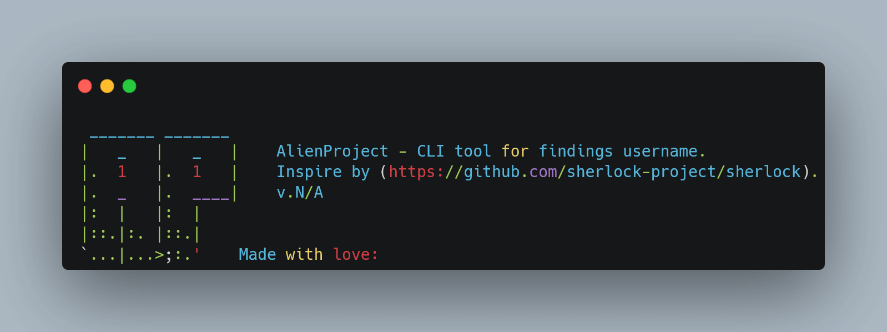

## `👽` AlienProject





MADE WITH: <span style="color: #FFC107"></span>
PLATFORM: <span style="color: #66BB6A"></span>
PLATFORM: <span style="color: #29B6F6"></span>
LICENSE MIT: <span style="color: #FFC107"></span>

_This project inspire by [sherlock-project](https://github.com/sherlock-project/sherlock)_

`AlienProject` is the CLI tool for findings username in all social media platform, kinda lol. Massive thanks to [sherlock](https://github.com/sherlock-project/sherlock) original [creator](https://github.com/sdushantha), that inspire me.

## Disclaimer
This tool is not going to be accurate at all. It has a lot of false-positives/false-negatives. Anyways, enjoy! ;).

## Installation
```bash
git clone https://github.com/Doct3rJohn/alienproject.git
cd alienproject
pip3 install -r requirements.txt
```

## Usage
```bash
$ python3 alienproject.py <username>
```

## License
License [MIT](https://raw.githubusercontent.com/Doct3rJohn/alienproject/main/LICENSE)