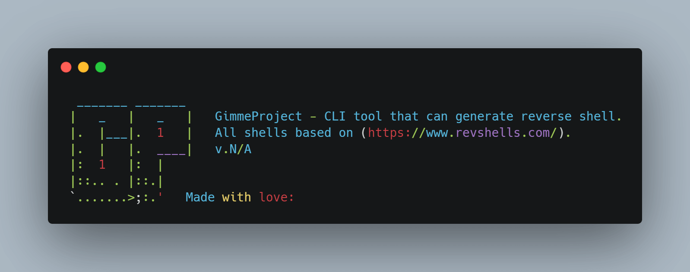

## `🐚` Gimmeproject





MADE WITH: <span style="color: #FFC107"></span>
PLATFORM: <span style="color: #66BB6A"></span>

_This project inspire by [@0dayCTF](https://twitter.com/0dayCTF)_ - [Reverse Shell Generator](https://www.revshells.com/)

`gimmeproject` is the CLI tool that can generate a reverse shell from the list based on (https://www.revshells.com/) just by using Python3. In the course of building these tools. I learn a lot and how powerful it is the [Python programming language](https://www.python.org/). 

## Installation
```bash
git clone https://github.com/Doct3rJohn/gimmeproject.git
cd gimmeproject
pip3 install -r requirements.txt
```

## Reverse Shell List
```json
{
	"shell_list": [
        "awk",
        "bash",
        "golang",
        "groovy",
        "lua",
        "mkfifo",
        "nc",
        "nodejs",
        "perl",
        "php",
        "powershell",
        "python",
        "python3",
        "ruby",
        "rustcat",
        "telnet",
	]
}
```
