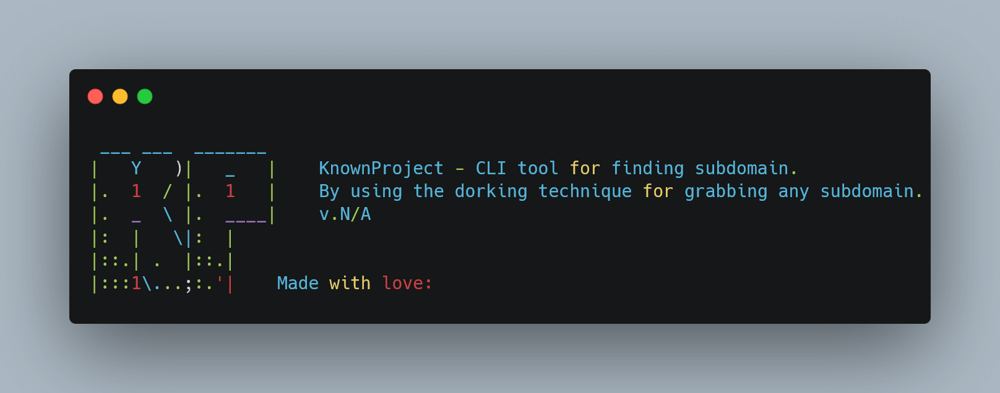

## `🌐` KnownProject





MADE WITH: <span style="color: #29B6F6"></span>
PLATFORM: <span style="color: #66BB6A"></span>
PLATFORM: <span style="color: #29B6F6"></span>
PLATFORM: <span style="color: #E0E0E0"></span>
LICENSE MIT: <span style="color: #FFC107"></span>

`KnownProject` is the CLI tool for findings any subdomain by using the dorking technique or in other word, in passive way for grabbing subdomains.

## Disclaimer
Be careful while using this tool because it can be blocked easily. If you get blocked, just wait a couple of minutes and run it again. On top of that, it only supports the `GOOGLE` engine for now, and it only retrieves the data/subdomains for about `10` pages of Google. Anyways, enjoy! 😉

## Installation
Well, you can get the prebuilt release right [here](https://github.com/Doct3rJohn/knownproject/releases/tag/v0.1.0)! <br>
But, if you want to build on your own: _follow the step below_
```bash
git clone https://github.com/Doct3rJohn/knownproject.git
cd knownproject
go build main.go
```

## Usage
```bash
[+] Usage: knownproject -d <example.com>
[+] Options:
        -d DOMAIN       Domain name to enumerate subdomains
```

## License
License [MIT](https://raw.githubusercontent.com/Doct3rJohn/knownproject/main/LICENSE)