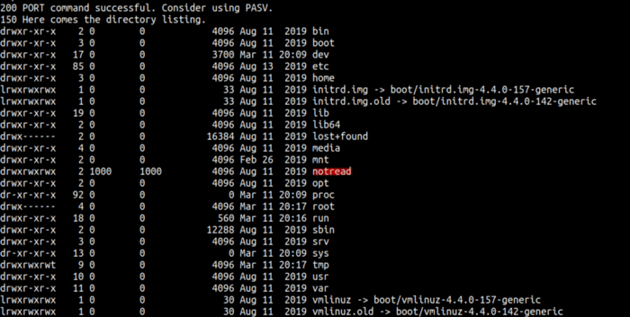

[Link : https://tryhackme.com/room/bsidesgtanonforce](https://tryhackme.com/room/bsidesgtanonforce)

## Enumeration

First, let’s do an enumeration with the IP address of this machine. I’m gonna run Nmap [Netwok Mapper] to scan any open ports. I’m gonna run this command

```bash
nmap -sC -sV -oN nmap/initial <machine ip>
```

### Explaining the nmap flag:
* -sC := scan using nmap default script
* -sV := scan for version
* -oN := output in normal format


Nmap scan is done. Let’s take a look at that result. We can see that this machine has 2 ports open and we can log in as anonymous in port 21/FTP.

Well, we can access the FTP with anonymous login. Let’s enumerate this service first because we all know that SSH must have a password to access it.


WOW! we found the melodias home directory and he got the user flag. However, we cannot read the content of the file in this protocol. So, I’m gonna download that file using the get command.


After download it, just cat the file and you found the first flag.


If you navigate the starting point of this directory/file system. It seems a little odd. You can see one of the folders is not supposed to be there/exists. The folder is called notread. Let’s try to investigate that folder



I didn’t expect that. We found 2 files. It seems to encrypt with gpg stuff and private key?. COOL! Let’s download it first.


## Foothold/Gaining Access

Now, we have the private key. The format of the key looks like gpg encryption. So, I’m gonna use a tool called John the Ripper \[JtR] to crack it. Unfortunately, \[JtR] did not understand that. First, we need to convert that encryption into \[JtR] would understand using gpg2john.


Now, we need to run the [JtR] to crack the hash. Looks like [JtR] has found the password already.


First, you need to import the key into the private_key file to validate. Then, just decrypt the backup.pgp into crack.txt file. When I’ve read the content of the file. I’m shocked! We’re all can see the root password hash exists in this file. Let’s try to crack it using hashcat.


Now, you need to save the hash into a file. In this case, I’m gonna save this hash into a file called root.hash . Now, let’s run the hashcat. YES!!! we’ve found the root password. However, we can’t change the user in FTP. Now, that leaves us with one choice. The SSH.


Let’s try SSH into that machine using root as username and the password we’ve crack as SSH password. It’s work. Now, let’s try to find the root flag. YES!! WE’VE FOUND IT


## Conclusion

I’ve learned a lot today. Never give anonymous access to your FTP [File Transfer Protocol]. After that, make sure you’re using the longest and strongest password ever. If you can see above, \[JtR] and hashcat can crack the hash very easily. However, please don’t put anything and any sensitive information on there. Anyways, I’ve learned how to use the gpg command and I’m excited.

This room so much fun and I hope you guys have fun and learn something new today.