[Link : https://tryhackme.com/room/bruteit](https://tryhackme.com/room/bruteit)

## Enumeration

First we need to connect to try hack me networks through openvpn and deploy the machine.

Now, the box is up. First, we need to do a reconnaissance using nmap. Nmap is a network mapper tool for scanning the ports or enumerate the machine through ports. I will run this command for my nmap scan.

```
nmap -sC -sV -O -oN nmap/initial <machine ip>
```

### Explaining the nmap flag:
* -sC := scan using nmap default script
* -sV := scan for version
* -O := scan for OS [operating system]
* -oN := output in normal format

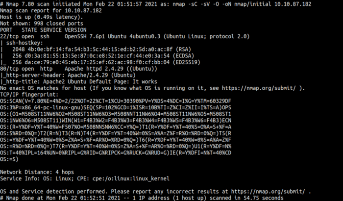

Now our nmap scan is done. We can the result here that this machine has 2 ports open. Port 22 and 80. Port 80 is running on apache webserver on ubuntu box. We also can see the version of ssh and apache.

This machine have webserver in port 80. So, let’s take a look

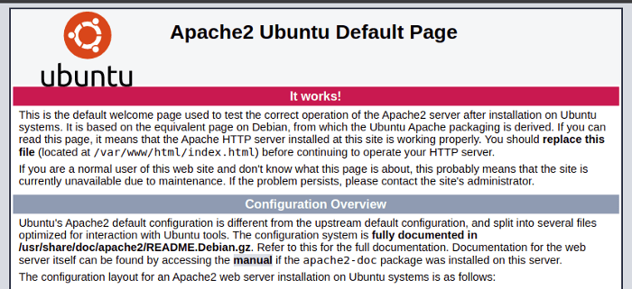

Well, port 80 it’s just lead me to the apache default page and I don’t have a lot of information by just looking into that page.However, we can find hidden directory using tool called gobuster. I’m gonna run this command:

```bash
gobuster dir -u http://<machine ip> -w <path/to/wordlist> — no-error
```

### Explaining gobuster flag:
* dir := using directory mode
* -u := specify url
* -w := specify wordlist
* — no-error := no error

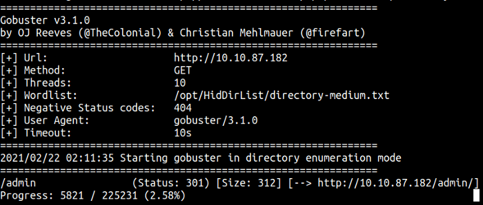

After we ran it. We found the hidden directory called /admin. Let’s go to that page and take a look

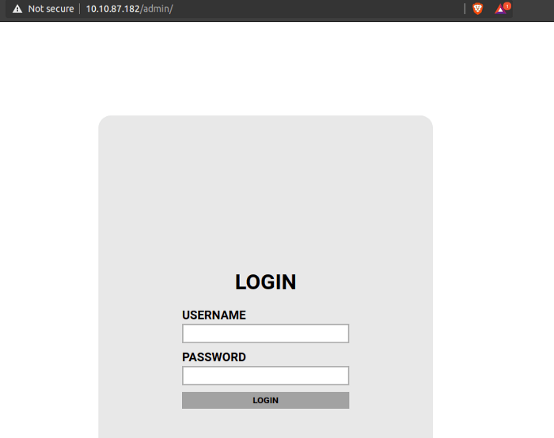

Interesting, this page is the login page but how to login because we don’t have any credentials yet. We can view the source code of this page to find any interesting function or maybe a comment.

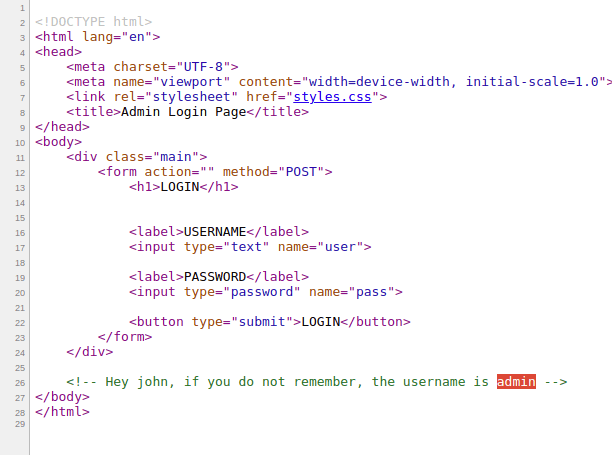

WOW! we can see the comment that says ‘Hey john if you don’t remember, the username is admin’. Right now, we have a potential username and user. However, we still don’t have the password.

We can try to brute force the password using a tool called hydra. Today, I’m gonna make a python script to brute force this page.

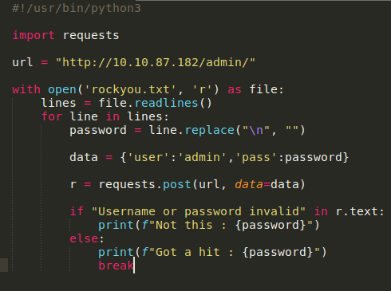

Now, let’s run our python script. Unbelievable, our script finally got a hit.

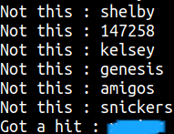

Now we have user credentials. Let’s try to login with these credentials and it works. Oh! we’ve got the web flag on this page and we’ve got RSA private key.

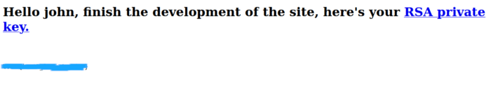

I’m gonna save that key in a file called id_rsa. Unfortunately, the RSA key is protected by a passphrase and I gonna assumed this is John’s key. Anyways, we can use john the ripper \[JtR] to crack this key. First, we gonna use ssh2john to rewrite this key into a format that \[JtR] can understand. Now, I’m gonna run this command:

```
python3 ssh2john.py id_rsa > new_id_rsa
```

If we can see. The file called new_id_rsa was been created in our working directory. Now we can use \[JtR] to crack the hashes


```
john — wordlist=/opt/rockyou.txt — format=SSH new_id_rsa
```

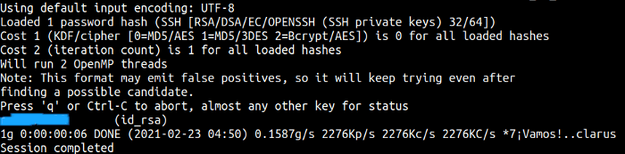

Let’s go ssh into this machine but first, we need to write our permission on the id_rsa file.

```
chmod 600 id_rsa
```

Let’s ssh into that machine!

## Foothold/Gaining Access

```
ssh -i id_rsa john@<machine ip>
```

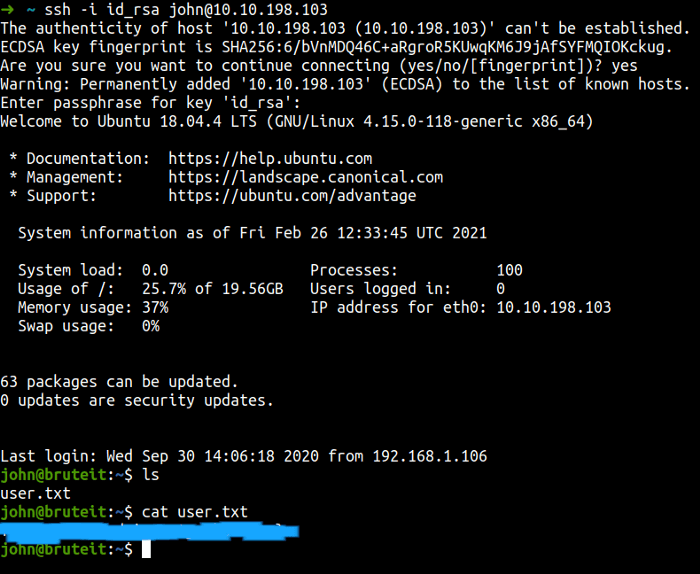

## Privilege Escalation

Now, we need to do the basic enumeration. First, I’m gonna check user sudo permission/capability

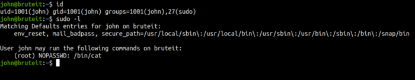

Cool! this user can run the cat command as root and no password needed. So, we need to read the password hashes and hopefully, we’ve got the root password.

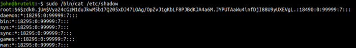

Yes! we’ve got the root password but it’s still in hash not in the plaintext. So now, we gonna use a tool called hashcat for this. If we look at this hash it looks like sha512crpyt.

First, we need to copy and paste the root hash in the file. Mine called root.hash. So, I’m gonna run the hashcat with mode 1800 and rockyou.txt as my wordlist.

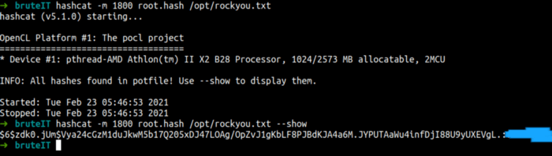

And now we just can log in as root.

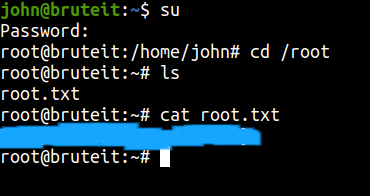

## Conclusion

I’ve learned a lot today. The tool called john the ripper \[JtR] and hashcat is good for cracking hashes. On top of that, I finally can use my python knowledge in this room.

This room so much fun and I hope you guys have fun and learn something new today.