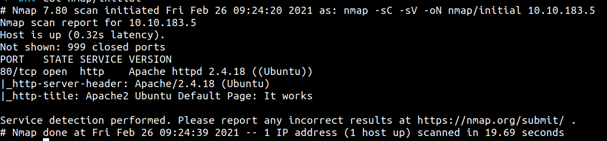
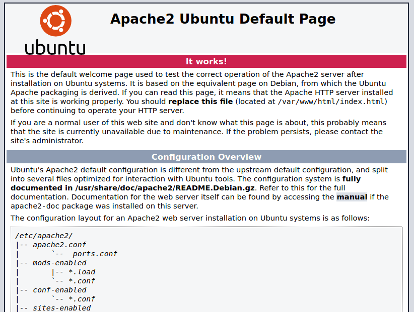
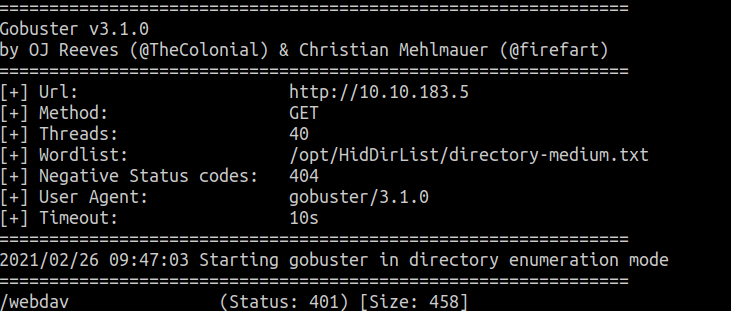
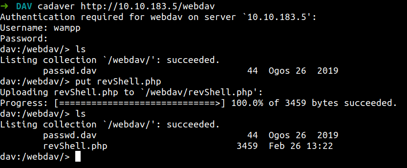
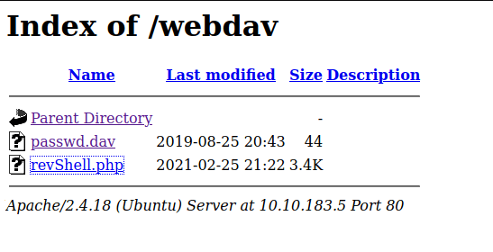
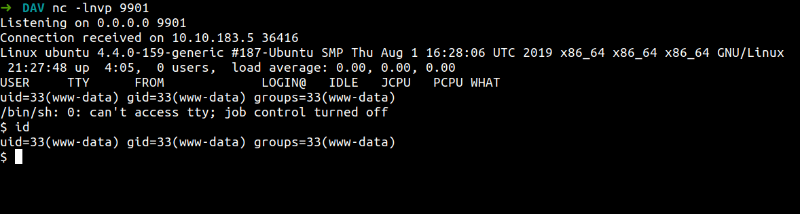
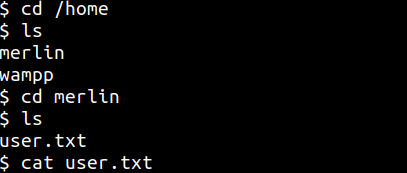
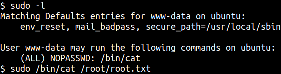

[Link : https://tryhackme.com/room/bsidesgtdav](https://tryhackme.com/room/bsidesgtdav)

## Enumeration

First we need to connect to try hack me networks through openvpn and deploy the machine. 

Now, the box is up. So, first we need to do a reconnaissance using nmap. Nmap is a network mapper tools for scanning the ports or enumerate the machine through ports. I will run this command for my nmap scan.

```
nmap -sC -sV -oN nmap/initial <machine ip>
```

### Explaining the nmap flag:
* -sC := scan using nmap default script
* -sV := scan for version
* -oN := output in normal format

The result of our  nmap scan



We have one port open. Port 80 running on apache webserver version 2.4.18 on ubuntu. Let's take a look



I try read line by line if anything interesting pop up and make sure always read the source code. Just in case

Unfortunately, I can't find anything usefull in this page. Now we gonna use a tools called gobuster. Gobuster a tool for finding the hidden directory on the web.

```
gobuster dir -u http://<machine ip> -w /opt/directory-medium-list.txt --no-error
```

### Explaining the gobuster flag:
* dir	  := using directory mode
* -u		:= specify url
* -w		:= specify wordlist
* --no-error := no error



We found webdav directory. Unfortunately we need username and password to access it.
However, I'm gonna try a default [webdav creds](https://thisiszzzombie.blogspot.com/2011/12/webdav-xampp-1.html). YESS IT'S WORKING

## Foothold/Gaining Access

I'm gonna upload my php-reverse-shell using tool called cadaver. 



Setup a listener. In my case I set the reverse shell for listen to the port 9901. Go to the webpage and double click it. Yes you've got a shell





Let's hunt for the user flag. YES! we've found it



Now, we need to do the basic enumeration. First, I’m gonna check user sudo permission/capability. Turn's out we can run the cat command with sudo. Let's cat the root flag out.



## Conclusion

I've learn what is the default password of webdav not just that. I've learn 'what is webdav?'. This room is easy and simple but more focusing in webdav. If you using this app, make sure change the password. The longer pass the better.

If you see up there. An attacker easily can get on your machine and can do a lot more stuff. Anyways, take care and  bye2