[Link : https://tryhackme.com/room/gamingserver](https://tryhackme.com/room/gamingserver)

## Enumeration

First, let’s do an enumeration with the IP address of this machine. I’m gonna run Nmap [Netwok Mapper] to scan any open ports. I’m gonna run this command

```
nmap -sC -sV -oN nmap/initial <machine ip>
```

### Explaining the nmap scan:
* -sC	:= scan using nmap default script
* -sV	:= scan for version
* -oN := output in normal format

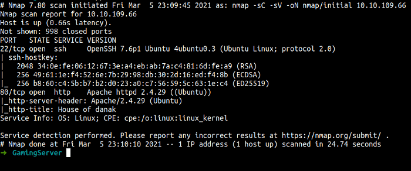

Nmap scan shows us. There are 2 ports open ssh and HTTP. First, I’m gonna check port 80 because not common for ssh to log in as anonymous. Let’s check it out.

We’re found this web page. We know that this machine has a website. Let’s run the gobuster for finding a hidden directory in the background.

I’ll run this command:

```
gobuster dir -u http://<machine IP> -w /path/to/wordlist.txt -x php
```

Let’s the gobuster do his thing. Let’s enumerate this webpage manually.


This is the very first thing I’m gonna do. You always need to check the page source code maybe we can find something interesting. Well, yes we did.

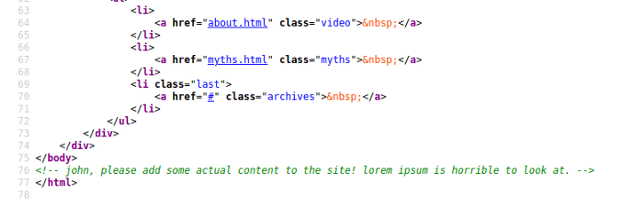

WOW! that is unexpected, we’re found a potential user. Now, let’s play around with this website maybe we found something cool. YES! we’re found something cool guys.


This section has an upload button. When I clicked it, it redirects me to `best location`.

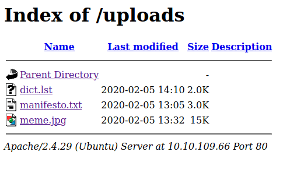

Let’s check all the items in this section. Well, the `dict.lst` file caught my eyes and it looks like a password list. Let’s download it.

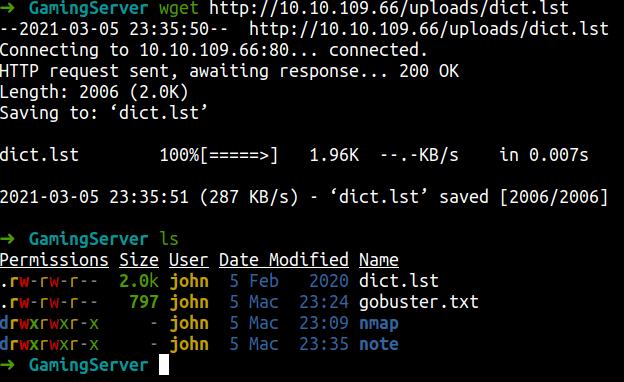

Let’s check our gobuster scan

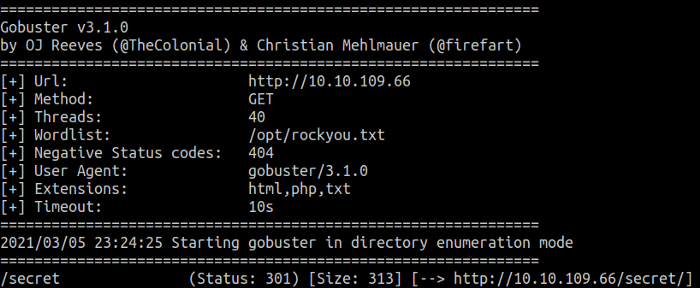

Gobuster found the hidden directory called `/secret`. It sounds cool to me. Let’s go to that directory. Oh! we’re found something cool!!!!!.

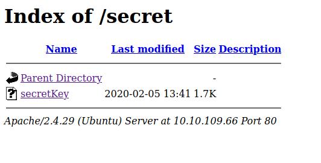

It’s said secret key. So, let’s check it out.

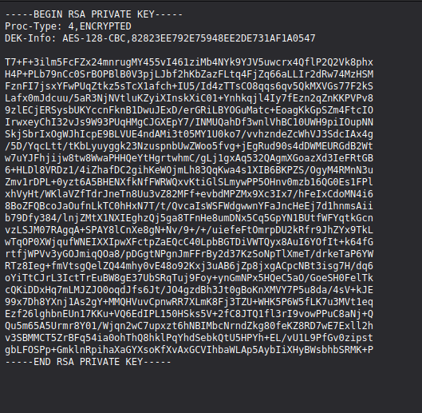

We found the RSA key. Looks like this key is encrypted. We’re can use john the ripper \[JtR] to crack it. First, we need to download this file into our machine.

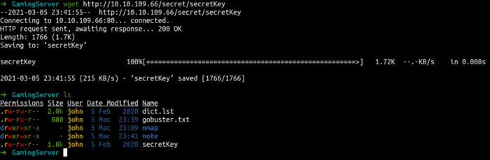

## Foothold/Gaining Access

First, we gonna use `ssh2john` to rewrite this key into a format that \[JtR] can understand. Let’s run it. My ssh2john locate in the /opt directory. We, need to run this tool and save the output in the file called skey.

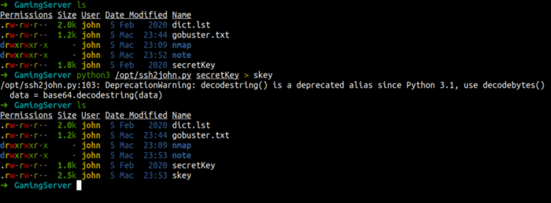

If we can see. The file called skey was been created in our working directory. Now we can use \[JtR] to crack the hashes and we gonna use the dict.lst file as the password wordlist.

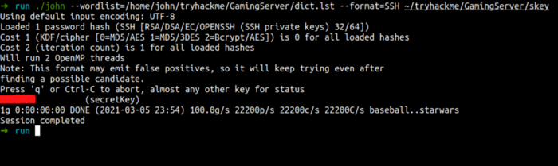

We’re found it. Before we ssh into that machine, we need to write our permission on the secretKey file.

```
chmod 600 secretKey
```

I’m gonna assume john is the user. If you remember we’re found his name in the HTML comment. Let’s try it.

```
ssh -i secretKey john@<machine ip>
```

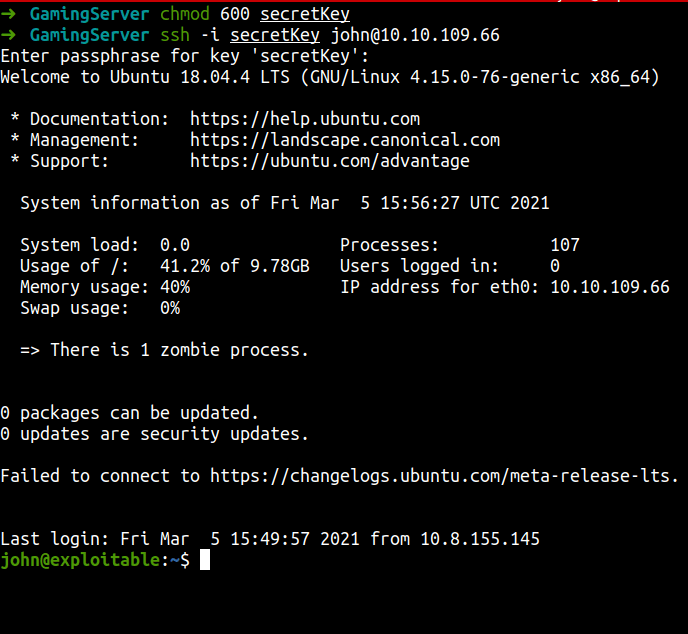

We’re in as john. Let’s find the user flag.

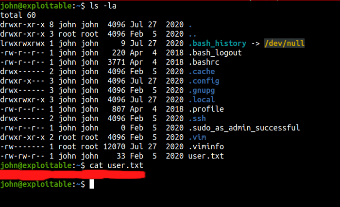

## Privilege Escalation

What I like to do is upload the shell script called [linpeas](https://github.com/carlospolop/privilege-escalation-awesome-scripts-suite/tree/master/linPEAS). We’re gonna upload that script into the victim machine by using python simple server.

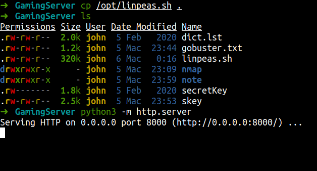

In the victim machine. I love to go the `/tmp` directory and using wget tool to download the linpeas script. After that, we need to make that file executable with this command:

```
chmod +x <file name>
```
and run it.
```
./<file name>
```

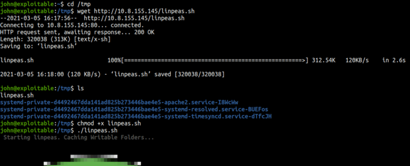

So, let’s check the scan result maybe we can found something interesting.

Hmmm… we can see here that lxd is color-coded and to the honest this something new to me. Let’s try search lxd exploit on the internet. YES! we’re found it. You can [check here](https://www.hackingarticles.in/lxd-privilege-escalation/) for more info.

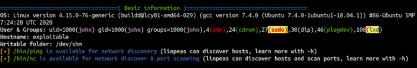

First, I’m gonna download the lxd-alpine-builder. Using git clone and cd into that directory. After that, make sure you run the command with root or sudo.

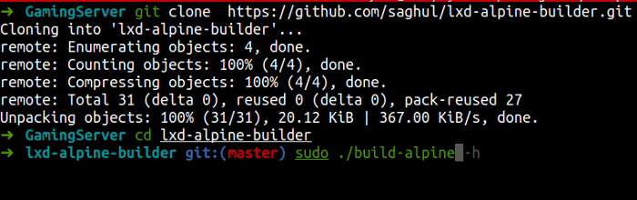


After this script is done running. The tar file will be created in our directory.

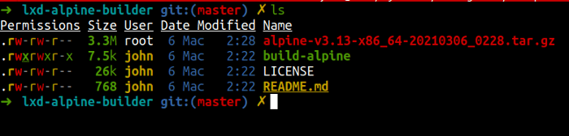

First, I like to rename the tar file because it’s too long. I’m gonna name mine is alpine-v3.tar.gz. Now, we need to download the tar file from our victim machine. First, we need to run the python simple server in lxd-alpine-builder directory.

```
python3 -m http.server
```

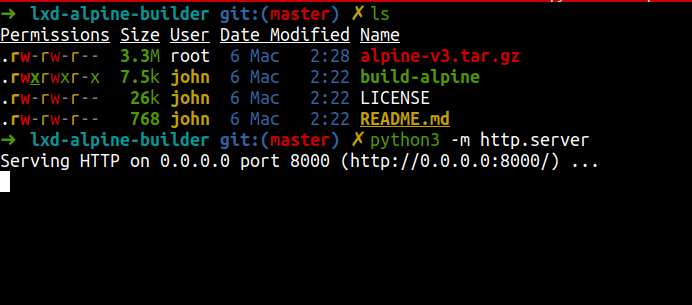

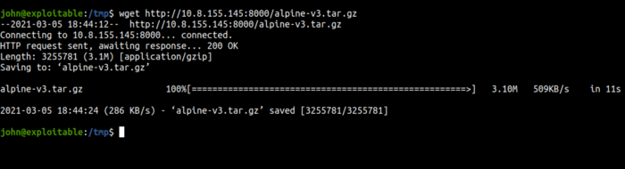


To be honest, I can’t explain anything to you and I need to look up into this more. This is very new to me. You can go [here](https://www.hackingarticles.in/lxd-privilege-escalation/) for more info.

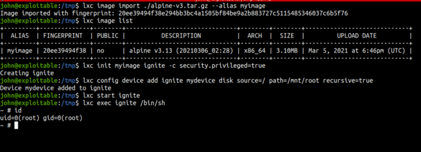

Let’s find the root flag.

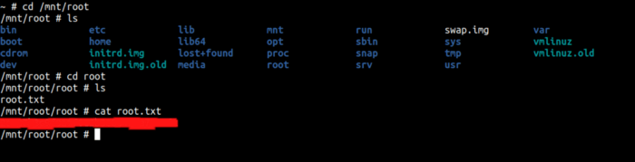

## Conclusion

I’ve learned a lot today. First, never put your ssh key on the website. Even it’s hidden the gobuster can find it with ease. The most important thing is I’ve learned that we can exploit the lxd. I’m making a quick google. it says lxd is the Linux Container. I don’t know what it is. I need to study more about this thing. Anyways, It’s cool and It’s new to me.

This room so much fun and I hope you guys have fun and learn something new today.