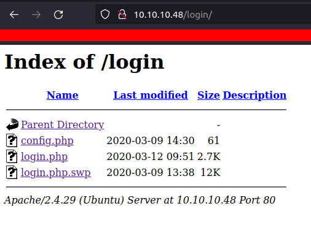
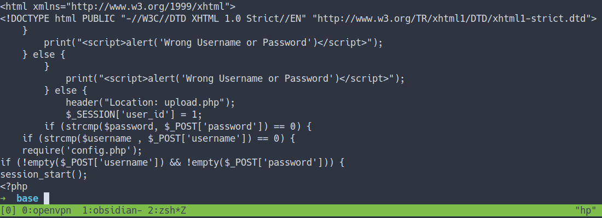
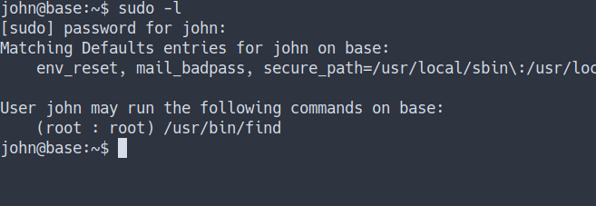

# HackTheBox - Base Writeup


## Enumeration

- Top 1000 ports scan

```bash
nmap -sC -sV -oN nmap/initial 10.10.10.48
```

- the result


- All ports scan

```bash
nmap -sC -sV -p- -oN nmap/all__ports 10.10.10.48
```

- the result


### Open Ports
- both Nmap scan result shows the only port open are `SSH` and `HTTP`

### Gobuster

```bash
gobuster dir -u http://10.10.10.48 -w /opt/SecLists/Discovery/Web-Content/raft-small-words.txt -x php.html -o Rgobuster
```

- We've found couples of hidden directory
- the result
	- `http://10.10.10.48/login/`
	- `http://10.10.10.48/static/`
	- `http://10.10.10.48/_uploaded/`

- let's take a look at `/login/` directory



- `Config.php` sounds fantastic but I can't read them.
- However, the file `login.php.swp` can be download.
- well, let's download that file and take a peek at it

### login.php.swp

- let's `strings` that file out
- the result



- well, it is a piece of code on `how the login form works`
- it's just logic `if-else statements` but again my eye caught something else.

### Strcmp bypass



Returns < 0 if `string1` is less than `string2`; > 0 if `string1` is greater than `string2`, and 0 if they are equal.


- it compares the `string1` and `string2` . If they equal returns 0
- Again we don't know the `password`. 
- we can make it one of the `strings` into `arrays` because it will returns `NULL`
- when `NULL == 0` it will returns 0
- Source
	- [PHP - strcmp](https://www.php.net/manual/en/function.strcmp.php)
	- [Anirudh Anand - Bypassing PHP strcmp() - CSAW 2015 web 200 writeup](https://blog.0daylabs.com/2015/09/21/csaw-web-200-write-up/)
	- [Danuxx - Unauthorized Access: Bypassing PHP strcmp()](https://danuxx.blogspot.com/2013/03/unauthorized-access-bypassing-php-strcmp.html)

## Foothold/Gaining Access

### Devtools
- Let's navigate to the login page `http://10.10.10.48/login/login.php`. Now, we've learned how these login forms work. Let's try `strcmp bypass`
- First, I'm gonna insert something in those `username` and `password` fields.
- Then, open up the `Devtools` and go to the `Network` tab. 
- `Right-click` and click on `Edit and Resend`
- it should look like this.


- Then edit the `Request Body` something like this
- `username[]=''&password[]=''`
- After that, click on `Send` and you should see the `upload.php` appears.


### Upload
- Now, you have to do is `Double-click` on `upload.php` and you should greet by this page.


- That means we successfully bypass the login.
- So, I'm gonna upload the `PHP reverse shell`
- I'm successfully uploaded. Remember those `gobuster scans` we did earlier. we've found the directory called `_uploaded`
- Let's navigate the `URL and the file name`. Hopefully, it will execute the revshell.

`http://10.10.10.48/_uploaded/<filename>`


- we've got the shell

### config.php
- I'm in. remember the file called `config.php` we've found earlier but sadly we can't read it.
- Now, it's the time to read it. Let's navigate into this directory
- `/var/www/html/login/`. Then, read the `config.php` file


## John
- So, we've found the `password`.
- Maybe this password belongs to the user on this system.
- Let's `cat /etc/passwd`


- we found one user name john.
- Let's try login as `john` with those `password` we've found.


- Great. Now, I'm John

### User Flag


## Privilege Escalation

- OK. I've got the user password. 
- Let's try to check the `sudo permission` this user got with this commands `sudo -l`
- the result



- Well, Let's try to become `root`
- by running this command
- Source
	- [GTFObins - find](https://gtfobins.github.io/gtfobins/find/#sudo)

```bash
sudo /usr/bin/find . -exec /bin/bash \; -quit
```


### Root Flag


## Conclusion
I've learned a lot today. Do not expose anything on the internet. Make sure your website properly configure. If your website `offers to upload something`. Make it harder for an attacker to upload that related to security risks such as `reverse shell`. Once again, don't use the same password. Oh before I forgot. Configure the user and the root properly.

I have a fun time doing this machine and I hope you guys do too. Bye ;)
