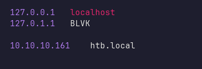
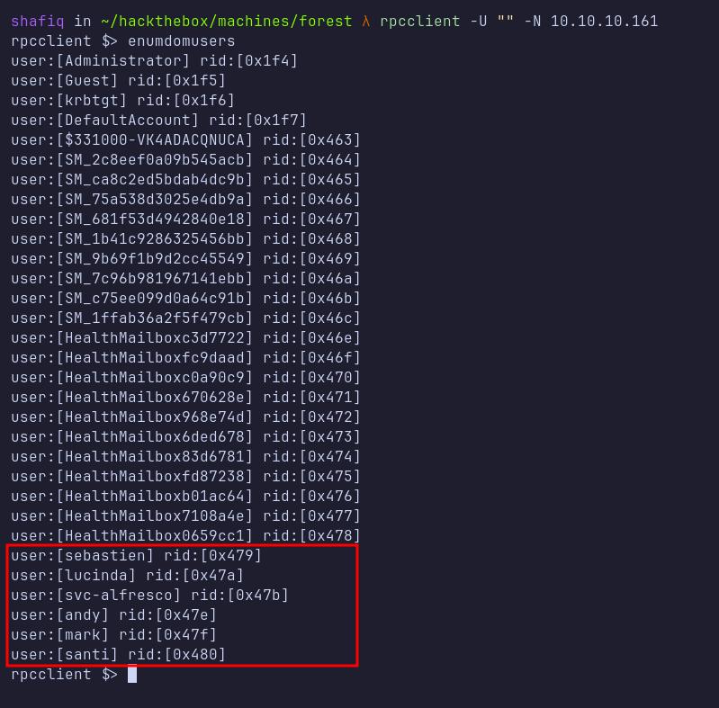
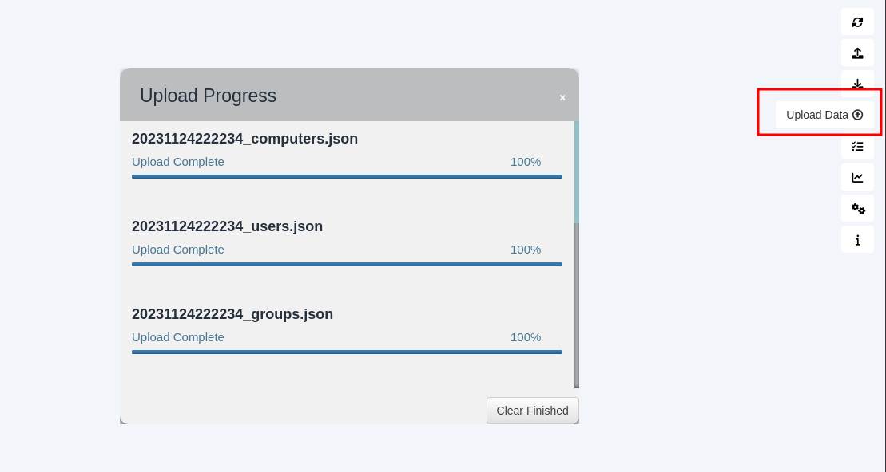
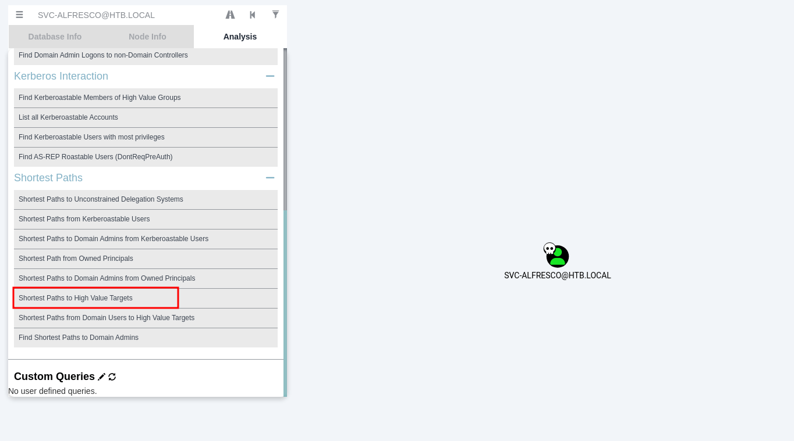
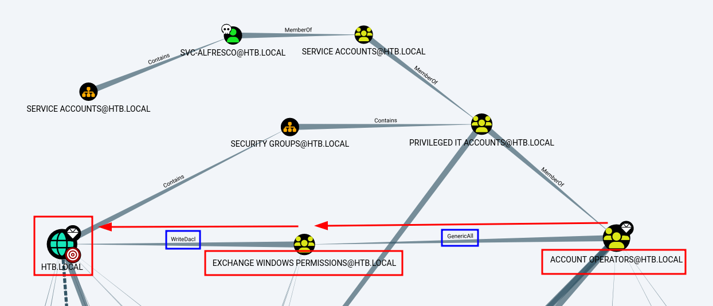
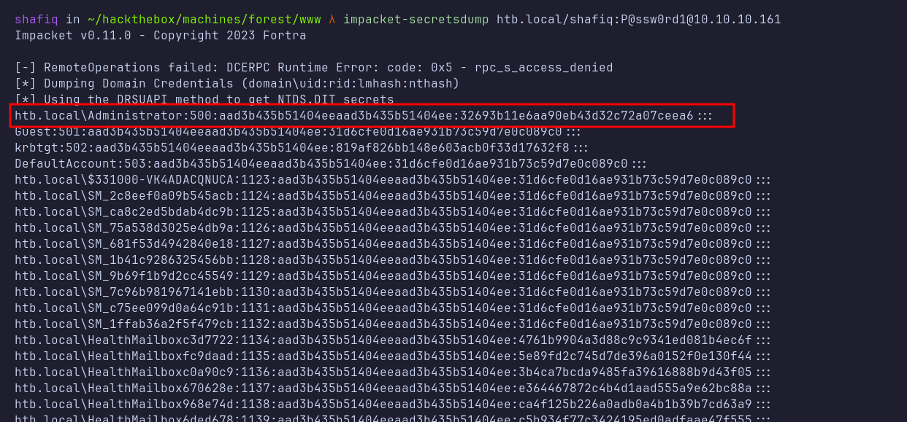
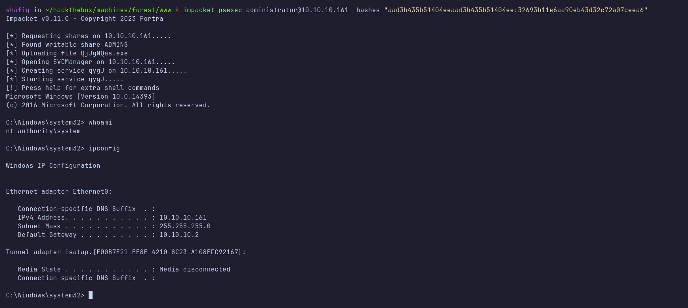

# HackTheBox - Forest Writeup


Box author |  

<!--more-->

## Nmap
Like always, I’m going to scan the IP Address by using [nmap](https://nmap.org/) but I’m going to scan the full port first. Then, I’m going to scan the only open ports.

```sql
# Nmap 7.94 scan initiated Wed Oct  4 11:53:44 2023 as: nmap -sCV -p135,139,3268,3269,389,445,464,47001,49664,49666,49667,49671,49676,49677,49684,49703,49940,53,593,636,88,9389 -oN nmap/forest 10.10.10.161
Nmap scan report for htb.local (10.10.10.161)
Host is up (0.032s latency).

PORT      STATE SERVICE      VERSION
53/tcp    open  domain       Simple DNS Plus
88/tcp    open  kerberos-sec Microsoft Windows Kerberos (server time: 2023-10-04 04:00:42Z)
135/tcp   open  msrpc        Microsoft Windows RPC
139/tcp   open  netbios-ssn  Microsoft Windows netbios-ssn
389/tcp   open  ldap         Microsoft Windows Active Directory LDAP (Domain: htb.local, Site: Default-First-Site-Name)
445/tcp   open               Windows Server 2016 Standard 14393 microsoft-ds (workgroup: HTB)
464/tcp   open  kpasswd5?
593/tcp   open  ncacn_http   Microsoft Windows RPC over HTTP 1.0
636/tcp   open  tcpwrapped
3268/tcp  open  ldap         Microsoft Windows Active Directory LDAP (Domain: htb.local, Site: Default-First-Site-Name)
3269/tcp  open  tcpwrapped
9389/tcp  open  mc-nmf       .NET Message Framing
47001/tcp open  http         Microsoft HTTPAPI httpd 2.0 (SSDP/UPnP)
|_http-title: Not Found
|_http-server-header: Microsoft-HTTPAPI/2.0
49664/tcp open  msrpc        Microsoft Windows RPC
49666/tcp open  msrpc        Microsoft Windows RPC
49667/tcp open  msrpc        Microsoft Windows RPC
49671/tcp open  msrpc        Microsoft Windows RPC
49676/tcp open  ncacn_http   Microsoft Windows RPC over HTTP 1.0
49677/tcp open  msrpc        Microsoft Windows RPC
49684/tcp open  msrpc        Microsoft Windows RPC
49703/tcp open  msrpc        Microsoft Windows RPC
49940/tcp open  msrpc        Microsoft Windows RPC
Service Info: Host: FOREST; OS: Windows; CPE: cpe:/o:microsoft:windows

Host script results:
| smb-security-mode: 
|   account_used: guest
|   authentication_level: user
|   challenge_response: supported
|_  message_signing: required
| smb-os-discovery: 
|   OS: Windows Server 2016 Standard 14393 (Windows Server 2016 Standard 6.3)
|   Computer name: FOREST
|   NetBIOS computer name: FOREST\x00
|   Domain name: htb.local
|   Forest name: htb.local
|   FQDN: FOREST.htb.local
|_  System time: 2023-10-03T21:01:34-07:00
| smb2-security-mode: 
|   3:1:1: 
|_    Message signing enabled and required
| smb2-time: 
|   date: 2023-10-04T04:01:32
|_  start_date: 2023-10-02T17:03:32
|_clock-skew: mean: 2h26m52s, deviation: 4h02m31s, median: 6m50s

Service detection performed. Please report any incorrect results at https://nmap.org/submit/ .
# Nmap done at Wed Oct  4 11:54:50 2023 -- 1 IP address (1 host up) scanned in 66.48 seconds
```

The nmap scan result is completed and that's a bunch of open ports. Based on the ports itself, it's look like a `Domain Controller`.

On top of that, nmap also found the domain name called `htb.local`. So, I'm going to add that to the `/etc/hosts` file.



## LDAP: ldapsearch
This machine doesn't have any web server to check it out and I tried to list the `SMB` shares with anonymous access and it failed. Then, I'll start to enumerate the `LDAP` server by using `ldapsearch` and find a list of users. I saved those lists of users in the file called `users.txt`. 


Unfortunately, I was stuck at this point and did not know what to do next. However, [HacktheBox](https://www.hackthebox.com/) just released a new feature called [Guided Mode](https://www.hackthebox.com/blog/guided-mode) which is the perfect training companion for beginners. I used that as an advantage and it says, I need to find a user who has `Kerberos Pre-Authentication` disabled.

## Impacket: GetNPUsers.py
Based on the description above, I need to find a user that is vulnerable to an `asreproast` attack. Then, I executed the [impacket](https://github.com/fortra/impacket) script called `GetNPUsers.py` alongside the list of users and it did not find anything at all.


## Rpcclient: enumdomusers
Then, I remembered that `rpcclient` can be used to enumerate `users` on this machine. After successfully establishing a connection with anonymous access. I searched the users by executing the `enumdomusers` command and it did manage to find another user which is `svc-alfresco`.



### ASREPRoast: GetNPUsers.py
With that information in hand, I'll execute the `GetNPUsers.py` script once again. Instead of using a list of users, I'm going to dump the hash of the `svc-alfresco` user only. After successfully dumping the hash, I'm going to crack it using [hashcat](https://hashcat.net/hashcat/).


## Evil-winrm: svc-alfresco
Since I already have valid credentials, I'm going to connect to it as a `svc-alfresco` user. I'm in as a `svc-alfresco` user.


### BloodHound
After successfully logging in. I'm going to drop the [SharpHound](https://github.com/Flangvik/SharpCollection) binary in the machine for enumerating the `Active Directory` using the `upload` command provided by [evil-winrm](https://github.com/Hackplayers/evil-winrm). Then, I executed it and saved the output into the `zip` file.


For analyzing the `zip` file data. I'm going to fire up the `neo4j console` with the `sudo` privilege. I'll start up the `BloodHound` and import the `zip` file by clicking the `Upload Data` button on the right navigation bar.



After successfully importing the data. I'll search for `SVC-ALFRESCO@HTB.LOCAL` node and `Mark User as Owned` by right-clicking on the node.


Now, I'm going to analyze the data from the owned user which is `svc-alfresco` by clicking the `burger menu` on the top left and clicking the `Analysis` button, and choosing the `Shortest Paths to High Value Targets`.



### Groups: Account Operators

Honestly, the graph view is confusing. However, the current user is a member of `SERVICE ACCOUNT` -> `PRIVILEGED IT ACCOUNT` -> `ACCOUNT OPERATORS` and with quick googling, I found Microsoft [documentation](https://learn.microsoft.com/en-us/windows-server/identity/ad-ds/manage/understand-security-groups#account-operators) about it. Turns out, the `Account Operators` group, it's a quite powerful group in this case, which can be used to create and modify accounts.


The **Account Operators** group grants limited account creation privileges to a user. Members of this group can create and modify most types of accounts, including accounts for users, Local groups, and Global groups. Group members can log in locally to domain controllers.



The `Account Operators` group has `GenericAll` permission on the `Exchange Windows Permissions` groups. This permission essentially gives members full control of the group and allows members to directly modify group membership.

On top of that, the `EXCHANGE WINDOWS PERMISSIONS` group has `WriteDacl` permission on the domain `HTB.LOCAL` and it can be used to abuse the `DCSync` attack on the domain.



By right-clicking the `WriteDacl` button and `Help` menu. Another window will appear by giving some information on that permission. I'll click the Windows Abuse section and it shows the steps on how to abuse it.


Based on the information above, I'll create another user called `shafiq` on the target machine and added to the `Exchange Windows Permissions` groups.


### Impacket: secretsdump.py

I'll upload the [PowerView.ps1](https://raw.githubusercontent.com/PowerShellMafia/PowerSploit/master/Recon/PowerView.ps1) to the target machine, which is located at `/usr/share/windows-resources/powersploit/Recon/PowerView.ps1` on the [Kali](https://www.kali.org/) machine and imported into my current PowerShell session like this `. .\PowerView.ps1`. Then, I'll give the `DCSync` rights to the `shafiq` user by executing the command below.

```powershell
$SecPassword = ConvertTo-SecureString 'P@ssw0rd1' -AsPlainText -Force
$Cred = New-Object System.Management.Automation.PSCredential('HTB\shafiq', $SecPassword)
Add-DomainObjectAcl -Credential $Cred -TargetIdentity "DC=htb,DC=local" -PrincipalIdentity shafiq -Rights DCSync
```


After successfully executing the commands without any errors. I'll start to perform the `DCSync` attack by using another [impacket](https://github.com/fortra/impacket) script called `secretsdump.py` by supplying shafiq's credential.



## PsExec

Then, I'll use another [impacket](https://github.com/fortra/impacket) script called `psexec.py` and log in as `Administrator` using the technique called `Pass-The-Hash` and it succeeds. I’m in as `NT AUTHORITY\SYSTEM`.


