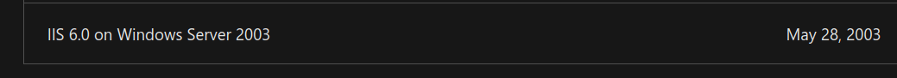
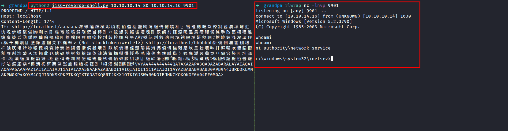
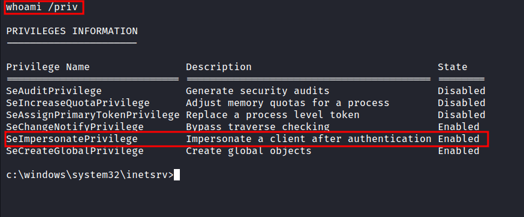
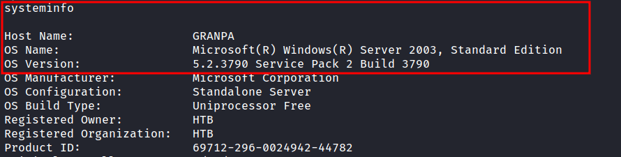
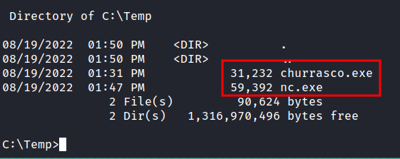
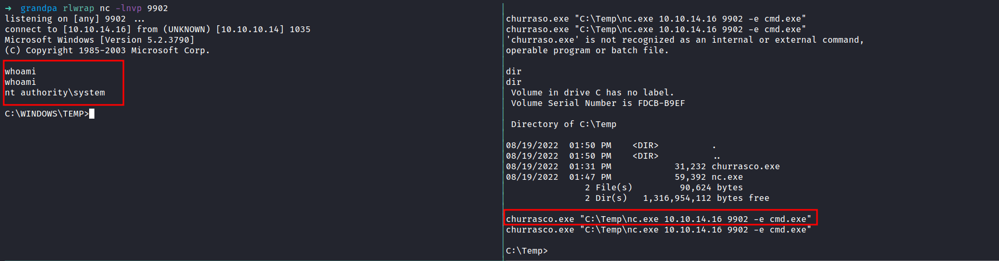

# HackTheBox - Grandpa Writeup


## Nmap
Like always, I'm going to scan the IP Address by using [Nmap](https://nmap.org/).

```sql
# Nmap 7.92 scan initiated Fri Aug  5 21:51:15 2022 as: nmap -sCV -oN nmap/grandpa 10.10.10.14
Nmap scan report for 10.10.10.14
Host is up (0.66s latency).
Not shown: 999 filtered tcp ports (no-response)
PORT   STATE SERVICE VERSION
80/tcp open  http    Microsoft IIS httpd 6.0
|_http-title: Under Construction
| http-methods: 
|_  Potentially risky methods: TRACE COPY PROPFIND SEARCH LOCK UNLOCK DELETE PUT MOVE MKCOL PROPPATCH
| http-webdav-scan: 
|   Allowed Methods: OPTIONS, TRACE, GET, HEAD, COPY, PROPFIND, SEARCH, LOCK, UNLOCK
|   Server Type: Microsoft-IIS/6.0
|   Server Date: Fri, 05 Aug 2022 13:52:20 GMT
|   Public Options: OPTIONS, TRACE, GET, HEAD, DELETE, PUT, POST, COPY, MOVE, MKCOL, PROPFIND, PROPPATCH, LOCK, UNLOCK, SEARCH
|_  WebDAV type: Unknown
|_http-server-header: Microsoft-IIS/6.0
Service Info: OS: Windows; CPE: cpe:/o:microsoft:windows

Service detection performed. Please report any incorrect results at https://nmap.org/submit/ .
# Nmap done at Fri Aug  5 21:52:34 2022 -- 1 IP address (1 host up) scanned in 79.44 seconds
```
That's interesting! only `1` port is open. `Port 80`

### Http: Microsoft IIS 6.0
It looks like I'm dealing with a Windows machine that's running `Microsoft IIS` version `6.0` on port 80. To be honest, it sounds kind of an old version. So, I did some googling and found out, It is an old version of Microsoft IIS.



Well, here (image above) is tied to one particular Windows Server version. Without wasting any time, I start googling some exploits that might be useful to me.

## Foothold: iis6 reverse shell
It took me no time at all to find this Github [repos](https://github.com/g0rx/iis6-exploit-2017-CVE-2017-7269/blob/master/iis6%20reverse%20shell) with `reverse shell` for this particular version of Microsoft IIS. Then, I downloaded the exploit. It looks like a python2 script. So, I'd change the file name with the `.py` extension at the end. Also, to be able to execute it. I must provide `victim/attacker IP` & `victim/attacker PORT`.



### Windows: SeImpersonatePrivilege
I'm in as `nt authority\network service` user. However, I want to be `nt authority\system` :(. The first thing, I love to do is to check the privilege this (current) user have. This can be accomplished by running this command `whoami /priv`.





I'm not expecting that at all. It says `SeImpersonatePrivilege` is enabled. This can lead to token kidnapping/impersonate attacks and elevate my privilege into `nt authority\system`. Like always, I start googling these specific attacks on `Microsoft Windows Server 2003` and I manage to find this [exploit](https://github.com/Re4son/Churrasco/blob/master/churrasco.exe) through this [article](https://medium.com/@nmappn/windows-privelege-escalation-via-token-kidnapping-6195edd2660e) on Medium.

### SMBserver.py
To elevate my privilege, it must require `nc.exe` and `churrasco.exe` (exploit) on the victim machine. Well, I'll try running the Powershell on the victim but nothing happens. Lucky for me, I found this [article](https://blog.ropnop.com/transferring-files-from-kali-to-windows/#smb) on "how to transfer files with smbserver.py". So, I started the SMB server with `impacket's smbserver.py` and transferred those files into the victim machine.



## Windows: Privilege Escalation
I've already transferred the file that is needed. So, I'm going to execute the exploit with `nc.exe` to establish the connection and also set up the listeners to catch the shell. 


