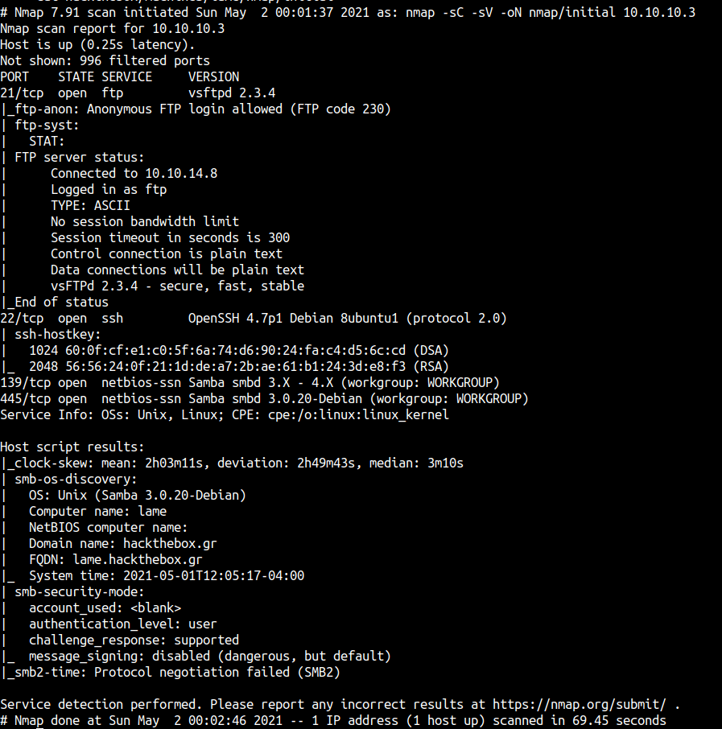
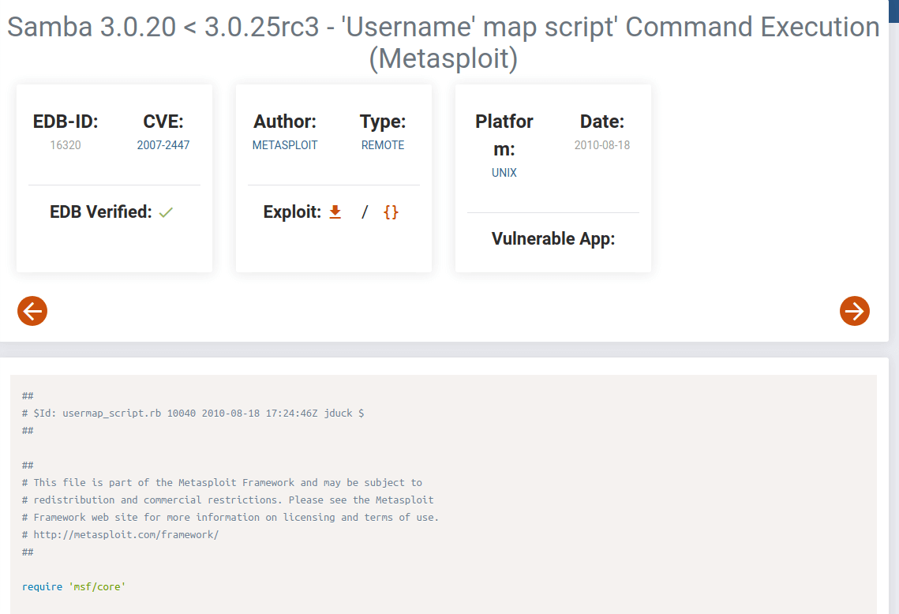
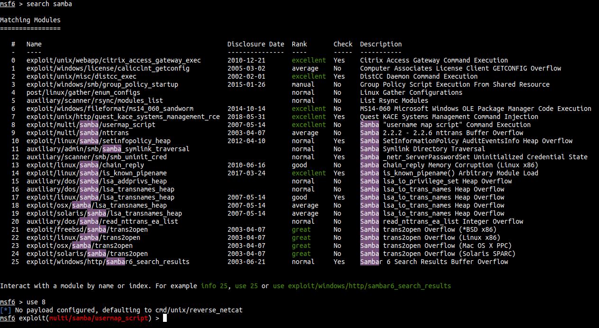
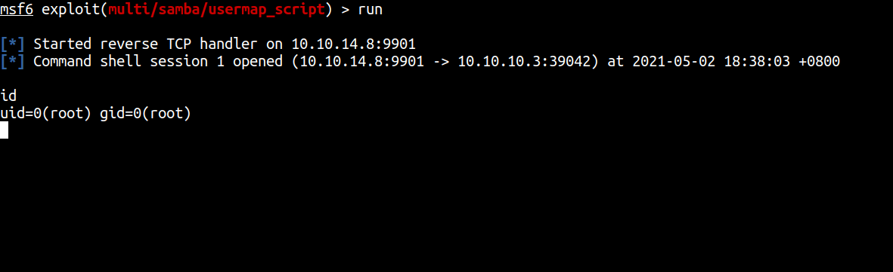
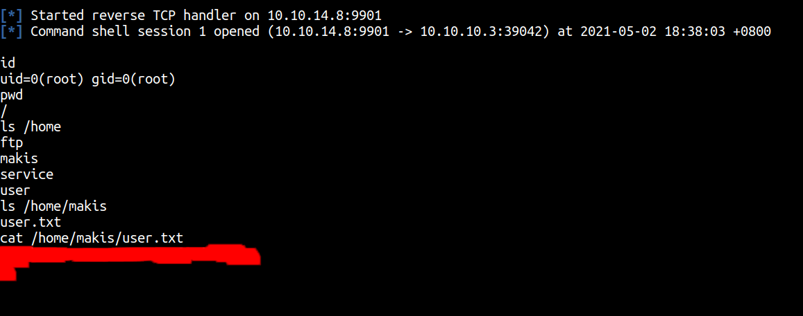
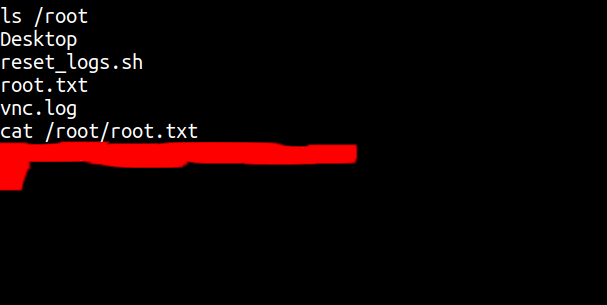

# HackTheBox - Lame Writeup


Box author | 

<!--more-->

## Enumeration

First, let’s do an enumeration with the IP address of this machine. I’m gonna run Nmap [Netwok Mapper] to scan any open ports. I’m gonna run this command

```bash
nmap -sC -sV -oN nmap/initial 10.10.10.3
```
### Explaining the nmap scan:
* -sC	:= scan using nmap default script
* -sV	:= scan for version
* -oN := output in normal format



The Nmap scan shows us port 21 is `FTP` and can log in as `anonymous`. However, I can't find anything useful in there but the version of FTP looks vulnerable. I'll try to exploit it again I failed. Turns out that particular version is `already patch`. So, yup.

## Foothold/Gaining Access

Also, we can see this machine has `samba 3.0.20` maybe it's useful for us.

So, I'm searching smb exploit for this specific version samba 3.0.20 on the internet and I found this exploit.



This exploit is available on `metasploit`. I'm gonna run my msfconsole . I'm gonna search this exploit and use it.



After that, I'm gonna set the important thing `lhost` and `rhost`. Then, I'm gonna run the exploit.

## Oopsie



WOW! I'M A ROOT USER. Unbelievable! Anyways let's hunt the user and root flag

### User flag



### Root flag



## Conclusion

I’ve learned a lot today. First, please don't allow FTP login as anonymous. Second, please update the system. In this case, I'm able to exploit the `samba 3.0.20` and become root. That's scary.

I have a fun time doing this machine and I hope you guys too. Bye ;)
