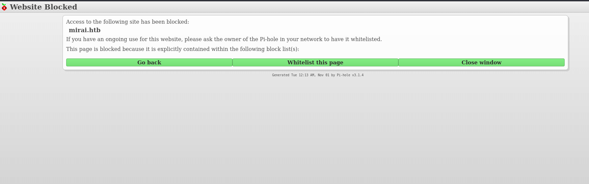
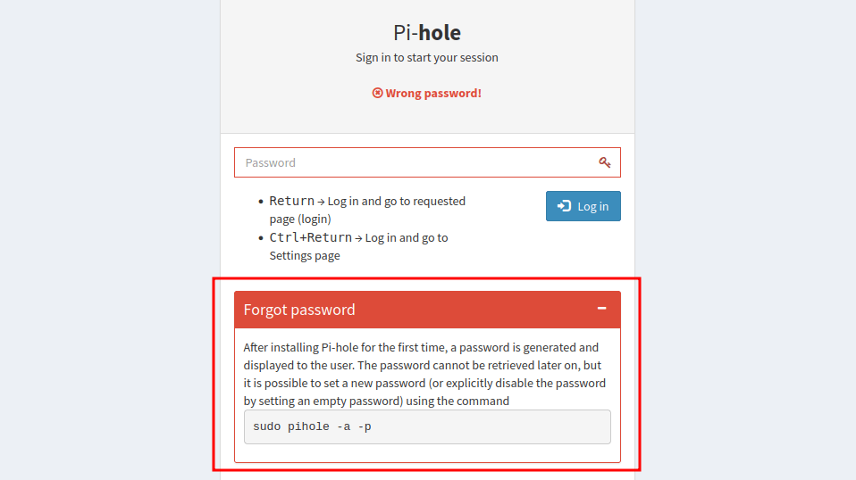
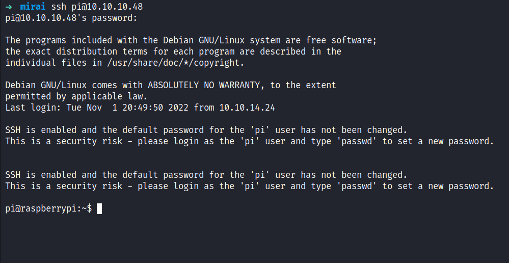
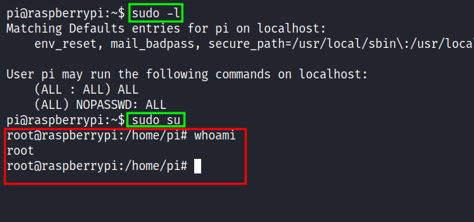
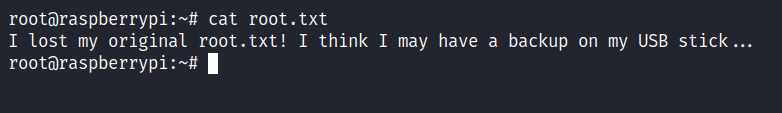
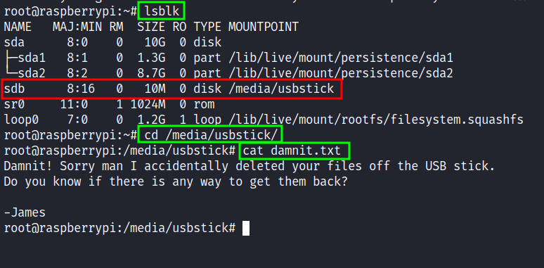
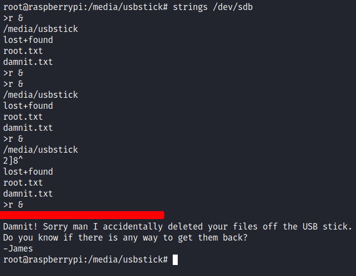

# HackTheBox - Mirai Writeup


Box author | 

<!--more-->

## Nmap
Like always, I’m going to scan the IP Address by using [nmap](https://nmap.org/) but I'm going to scan the full port first. Then, I'm going to scan the only open ports.

```sql
nmap -p22,53,80,1776,32400,32469 -sCV -oN nmap/mirai 10.10.10.48

22/tcp    open  ssh     OpenSSH 6.7p1 Debian 5+deb8u3 (protocol 2.0)
| ssh-hostkey: 
|   1024 aaef5ce08e86978247ff4ae5401890c5 (DSA)
|   2048 e8c19dc543abfe61233bd7e4af9b7418 (RSA)
|   256 b6a07838d0c810948b44b2eaa017422b (ECDSA)
|_  256 4d6840f720c4e552807a4438b8a2a752 (ED25519)

53/tcp    open  domain  dnsmasq 2.76
| dns-nsid: 
|_  bind.version: dnsmasq-2.76

80/tcp    open  http    lighttpd 1.4.35
|_http-title: Site doesn't have a title (text/html; charset=UTF-8).
|_http-server-header: lighttpd/1.4.35

1776/tcp  open  upnp    Platinum UPnP 1.0.5.13 (UPnP/1.0 DLNADOC/1.50)

32400/tcp open  http    Plex Media Server httpd
|_http-cors: HEAD GET POST PUT DELETE OPTIONS
|_http-favicon: Plex
| http-auth: 
| HTTP/1.1 401 Unauthorized\x0D
|_  Server returned status 401 but no WWW-Authenticate header.
|_http-title: Unauthorized

32469/tcp open  upnp    Platinum UPnP 1.0.5.13 (UPnP/1.0 DLNADOC/1.50)
Service Info: OS: Linux; CPE: cpe:/o:linux:linux_kernel
```
The nmap scan result is completed. Looks like, I'm dealing with Debian (Jessie) machine based on the [OpenSSH](https://launchpad.net/debian/+source/openssh/1:6.7p1-5+deb8u3) service banner. Since its have port `53` open, I'm going to add the hostname into the `/etc/hosts` file called `mirai.htb` (guessing). 

## Http: mirai.htb
Upon navigating through the `mirai.htb` on my browser.  I've been greeted by the `"Website Blocked"` page. However, at the bottom of this page, I can see it says `Pi-hole` with the version number. As far as I know, `Pi-hole` is commonly used in "homemade" `VPNs` that run on [Raspberry Pi](https://www.raspberrypi.com/).



### Http: pi.hole/admin
By checking the page source code. I manage to find the `hostname` called `pi.hole` and I added it to my `/etc/hosts` file and also its have `/admin` directory.

```js
44| <script src="http://pi.hole/admin/scripts/vendor/jquery.min.js"></script>
```

So, I navigated to the `/admin` directory and was greeted with the `Pi-hole` page. I managed to find the `login` form by clicking `Login` on the left sidebar and I'll try simple credentials such as `admin:admin`. Then, it spits out this error and simply says `"password is generated after installation and make sure to save it or it's too late"`. Based on this error, I guess the password must be random and it's impossible to guess it.



## Foothold: SSH
To be honest, I'm stuck at this point and clueless. Then, I realized something, this is a [RaspberryPi](https://www.raspberrypi.com/). There are two ways, to interact with it either `connect to monitor` or `SSH` into it. Fortunately, with light googling, I managed to find the default `SSH` credentials. I'll try it and BOOM! 



## PrivEsc: Sudo
I'm in as a `pi` user and the first thing I'll check is the sudo permission with the command `sudo -l`. Surprisingly, this user has all access to everything and I ended up just running the command `sudo su` to get the root shell.



### Flag: Root
I'm so excited that I get the `root` shell. However, I was stunned when I'll try to retrieve the root flag because the flag isn't in that file at all but this message was.



Upon reading that, I'll check the `devices` that are connected to this machine with the `lsblk` command. Fair enough, I found the usb stick device that connected under `/media/usbstick`. So, I change the directory into it and it has two items in it. The first is the `lost+found` directory but unfortunately, it's just an empty directory the other file `damnit.txt` has this message.




Damnit! Sorry man I accidentally deleted your files off the USB stick. </br>
Do you know if there is any way to get them back?

-James


Now, I'm really mad because why?? why!!!!!!! arggggg!!.. adkjlfhgasjkudfgjh \*hahahaha\* but when I'm thinking again it's linux. Everything on linux is a file because of its nature of it. So, I'm thinking `"how I'm going to read this usb stick device"` then I remembered, I can use the `strings` command to display all the things human-readable. So, I'd ended up running `strings` on the partition itself `/dev/sdb`, and again BOOM! (double-BOOM!).



\*EVIL LAUGH\*
