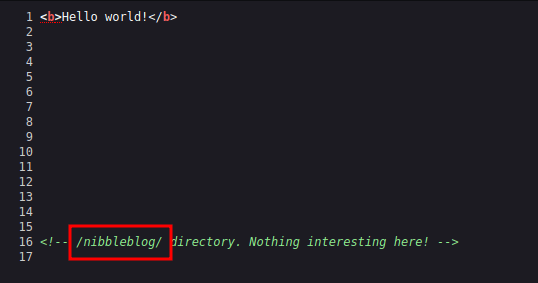
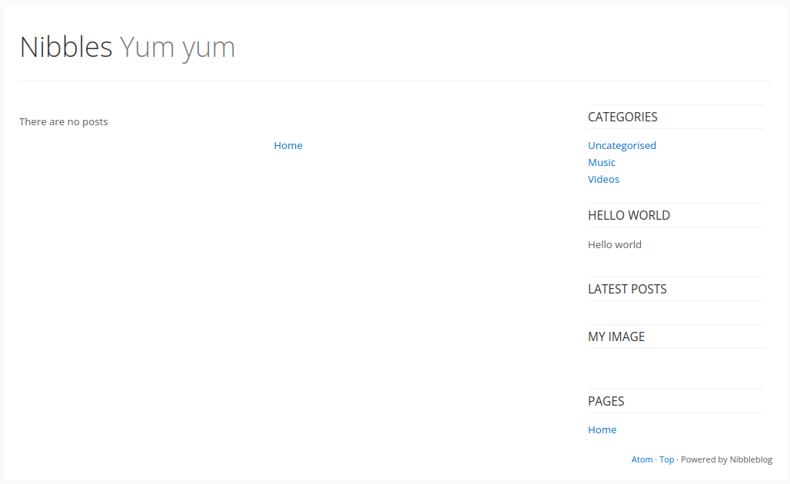
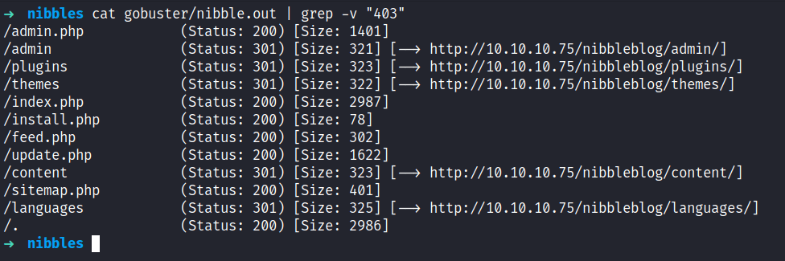
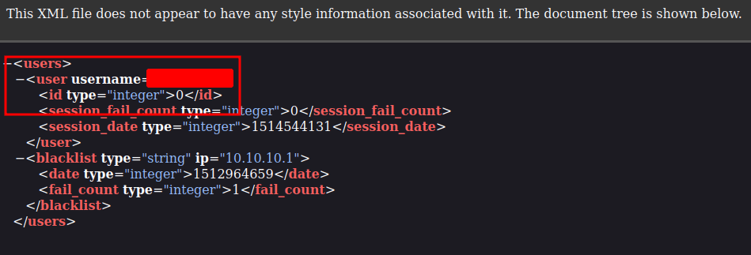
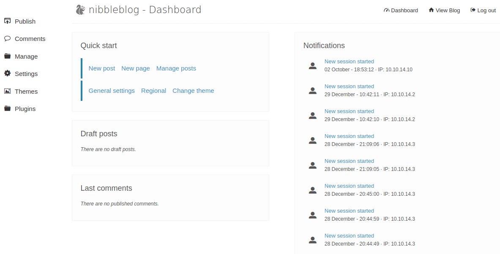
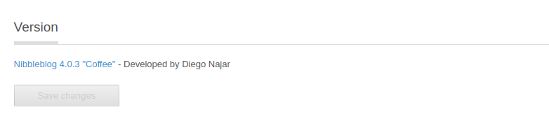
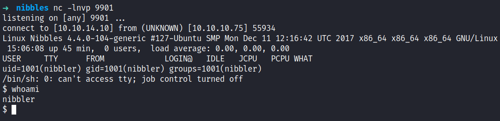
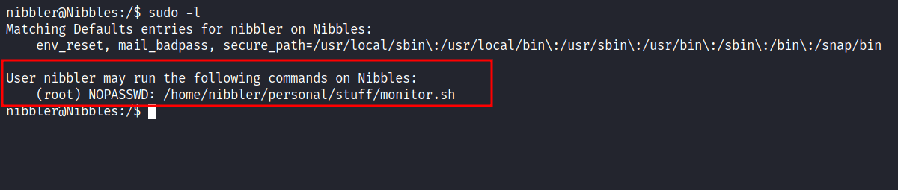
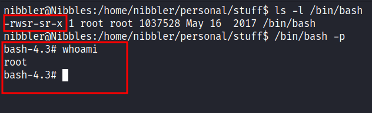

# HackTheBox - Nibbles Writeup


Box author | 

<!--more-->

## Nmap
Like always, I'm going to scan the IP address by using [Nmap](https://nmap.org/). However, today I feel spicier ;). So, I'm going to scan the full port with `-p-` then I'm only scanning those open ports with scripts and version enumeration.

```sql
nmap -sCV -p22,80 -oN nmap/nibbles 10.10.10.75

22/tcp open  ssh     OpenSSH 7.2p2 Ubuntu 4ubuntu2.2 (Ubuntu Linux; protocol 2.0)
| ssh-hostkey: 
|   2048 c4:f8:ad:e8:f8:04:77:de:cf:15:0d:63:0a:18:7e:49 (RSA)
|   256 22:8f:b1:97:bf:0f:17:08:fc:7e:2c:8f:e9:77:3a:48 (ECDSA)
|_  256 e6:ac:27:a3:b5:a9:f1:12:3c:34:a5:5d:5b:eb:3d:e9 (ED25519)

80/tcp open  http    Apache httpd 2.4.18 ((Ubuntu))
|_http-title: Site doesn't have a title (text/html).
|_http-server-header: Apache/2.4.18 (Ubuntu)
Service Info: OS: Linux; CPE: cpe:/o:linux:linux_kernel
```

The nmap scan is completed and looks like I'm only dealing with `port 22 and 80`. The banner itself says this machine is a linux box and running ubuntu.

## Http
With that information, I'm going straight to my browser and navigating to the IP address, and surprisingly it only displays `Hello world!` with **bold** text. Upon expecting the source of the page it's leaking the directory called `/nibbleblog/`.



### Http: /nibbleblog
By navigating through that directory. I've been greeted with some sort of blog page title `Nibbles - Yum yum`.  Then, I started guessing the `index` file with different extensions and I got a hit with `PHP` extensions. Turns out, this is a PHP website. So, I started to look around in that blog and cannot find anything useful.



### Gobuster
Now, I'm going to fire off my guns (jk). [Gobuster](https://github.com/OJ/gobuster) to enumerate further and look for any hidden directories and files. Sure enough, it's managed to find the login page located `/admin.php` but I did not have any credentials on me right now. Also, the `/admin` directory caught my eye but again I cannot find anything useful.



### Http: /nibbleblog/content/
The `/content` directory also attracts my intentions by having such a unique name :). Upon enumerating the content of it. Finally, I manage to find something useful this time and it was a username located in `/nibbleblog/content/private/users.xml`. Now, I have equipped with the username but I did not manage to find any password at all.



### Http: /admin.php
Only with the username in my hands, I'm heading to the login page by navigating through `/nibbleblog/admin.php` and start guessing the password. Suppringsly, I manage to get it correctly and the password is `nibbles`. Yeah, the name of the box itself.



By clicking the `Settings` on the left sidebar and scrolling at the bottom. Its displays the version of it.



## Foothold
Without further ado, I'm asking my old friend Mr.Google regarding this version. Turns out, this particular version has an assigned CVE to it called [CVE-2015-6967](https://nvd.nist.gov/vuln/detail/CVE-2015-6967) it's vulnerable to _Unrestricted file upload in the My Image plugin</font>_. So, I'm ready to upload the `php reverse shell` but first, I need to navigate through `Plugins -> My Image -> Configure`. Then, upload the shell (just ignore the warning), and to execute it, I must click the `shell` that is located in `/nibbleblog/content/private/plugins/my_image/`.



## PrivEsc: monitor.sh
Viola! I'm in as a `nibbler` user and the best thing to do is [upgrade my shells with python3](https://book.hacktricks.xyz/generic-methodologies-and-resources/shells/full-ttys#python). My favorite thing to do after getting a shell is checking the user sudo permission with the command `sudo -l`. \*Jaw dropped\*, apparently I can run the `monitor.sh` file as sudo without any password needed. Awesome!



However, when I'm in nibbler's home directory. I cannot find the `monitor.sh` file but I find a zip archive file called `personal.zip`. So, I unzip that archive, and hold and behold there is the `monitor.sh` file. Upon expecting the script of it, I did not find it amusing. However, the file itself has an interesting character that I can write into the file.

## Root
So, I'd end up putting one line command when executed it. It will make a `/bin/bash` as a setuid binary. Then, I'm typing this command `/bin/bash -p` and it will drop me into the root shell.

```bash
echo "chmod +s /bin/bash" >> monitor.sh
```


