# HackTheBox - Oopsie Writeup


## Enumeration

- Top 1000 ports scan

```bash
nmap -sC -sV -oN nmap/inital 10.10.10.28
```

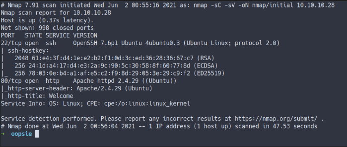

- all ports scan

```bash
nmap -sC -sV -p- -oN nmap/all_ports 10.10.10.28
```

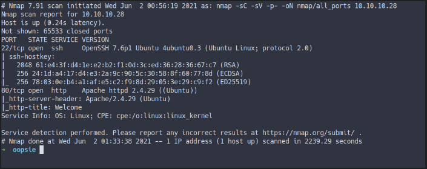

- Still the same result 
- Open ports
	- port 22 / ssh 
	- port 80 / http


### The Website


### Gobuster
- Auto recon in the background
- looking the hidden directory

```bash
gobuster dir -u http://10.10.10.28 -w /opt/SecLists/Discovery/Web-Content/raft-medium-directories.txt -o gobuster.log
```
- The result


This webpage have an upload directory.

### Login Page
- Found something insteresting in the source code


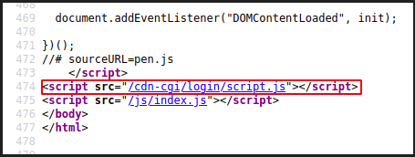

- the directory into `/cdn-cgi/login/script.js`
- navigate into `http://10.10.10.28/cdn-cgi/login`
- found the login page

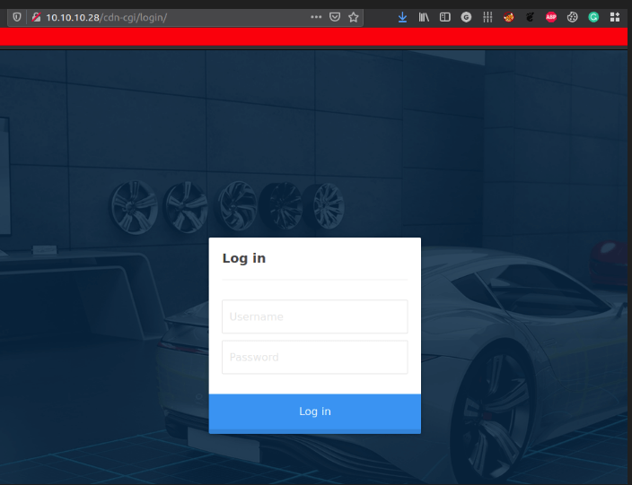

- Got the credentials in previous box called [Archetype](https://shafiqaiman.com/posts/htb/archetype/) _in official pdf_
- Successfully login as admin

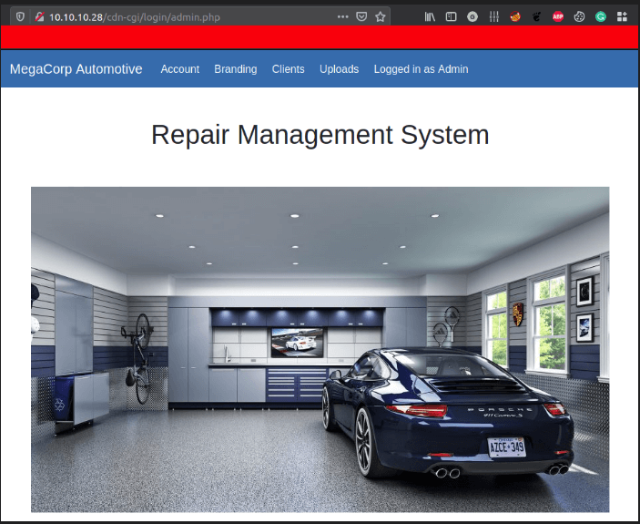

### Can't Upload
- navigate to the upload page
- it says `super admin` have right to view it

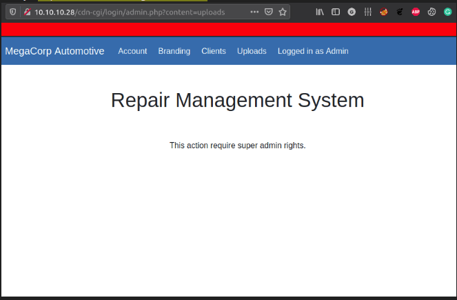

### The ID

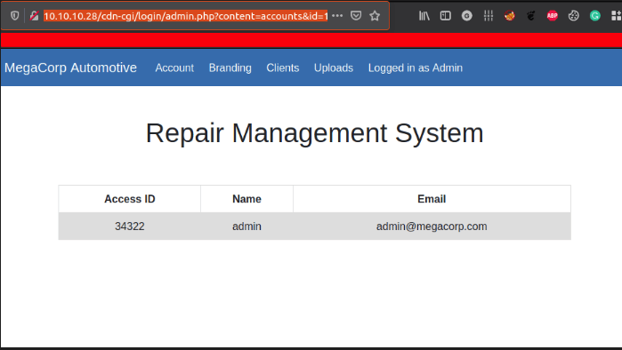

- This page appear to be `user table` base on the `id parameter` in the link
- Making `python script` for IDs brute-force 

## Foothold/Gaining Access

### Python Script
- python script for ID brute force
- need cookies for authentication

```python
#!/usr/bin/env python3

import requests

for i in range(101):
    url = f"http://10.10.10.28/cdn-cgi/login/admin.php?content=accounts&id={i}"
    c = {'user':'34322','role':'admin'}
    r = requests.get(url, cookies=c)

    if len(r.content) == 3595: # nothing appear just pass it
        pass
    else:
        print(f"Check this ID out {i}")
print("Done")
```
- The result

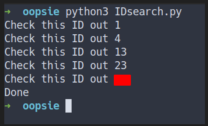

- Here is the ID lead to (in order)

```javascript
{'access id':'34322','name':'admin','email':'admin@megacorp.com'}
{'access id':'8832','name':'john','email':'john@tafcz.co.uk'}
{'access id':'57633','name':'Peter','email':'peter@qpic.co.uk'}
{'access id':'28832','name':'Rafol','email':'tom@rafol.co.uk'}
{'access id':'xxxxx','name':'super admin','email':'superadmin@megacorp.com'}
```

### Upload as super admin
- Found the super admin table

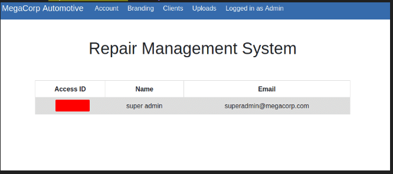

- Turns out the `Access ID` it is the `cookie value`
- Change the admin cookies into super admin

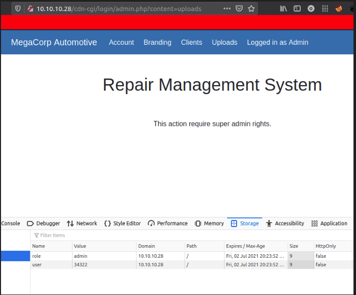 <br>_before_

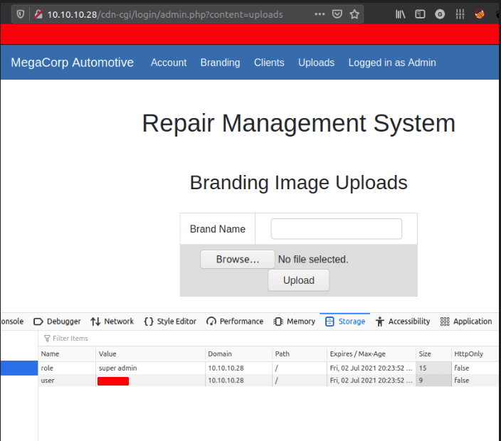 <br>_after refresh the page_

### Reverse Shell
- Upload the php reverse shell
  - [Here is the source ](https://raw.githubusercontent.com/pentestmonkey/php-reverse-shell/master/php-reverse-shell.php)

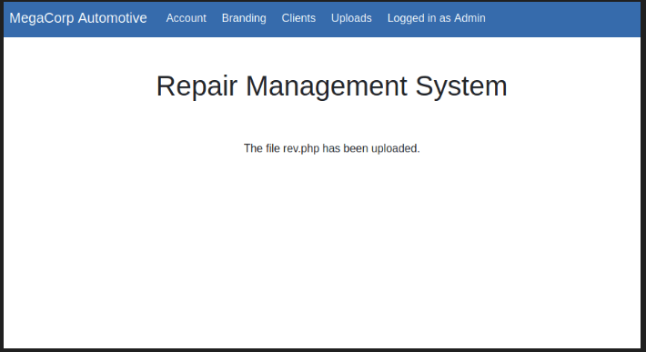

- Activated the reverse shell
  - through this link

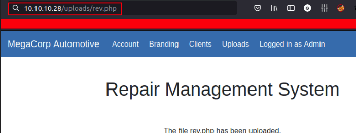

- Got the shell


### www-data
- Found the credentials in file called `db.php`
- in `/var/www/html/cdn-cgi/login/db.php`


### Robert
- Login as robert

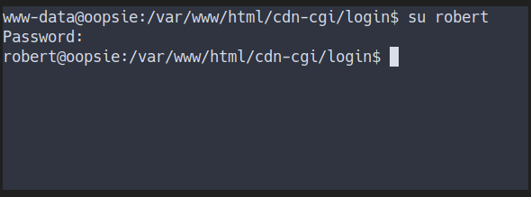

### User Flag

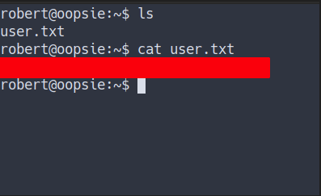

- Find the <font color="yellow">SUID</font>
- The command for find it

```bash
find / -user root -perm -4000 -exec ls {} \; 2>/dev/null
```
- Found weird binary that not suppose to be there

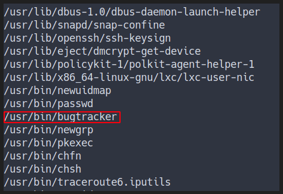

## Privilege Escalation

### Bugtracker
- This is how it works
- However it says `no such file or directory`

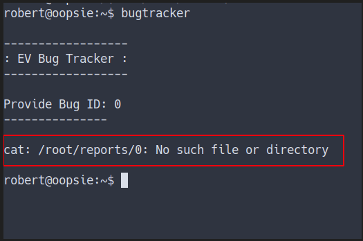

- Try `strings` out the binary 
- Turns out this binary use `cat command`
- However this is use relative path

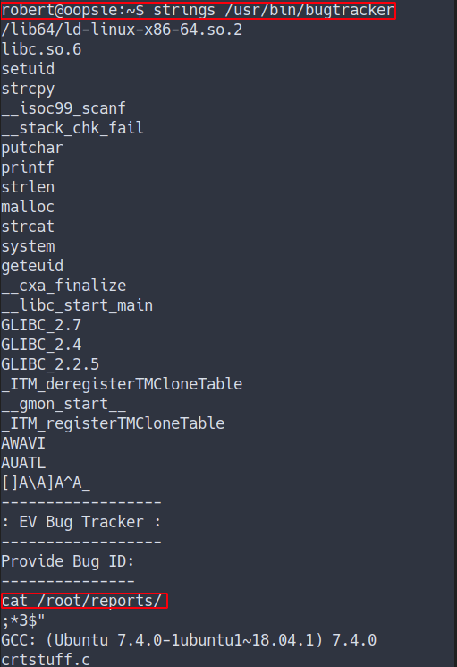

- explain the _`relative & absolute path`_

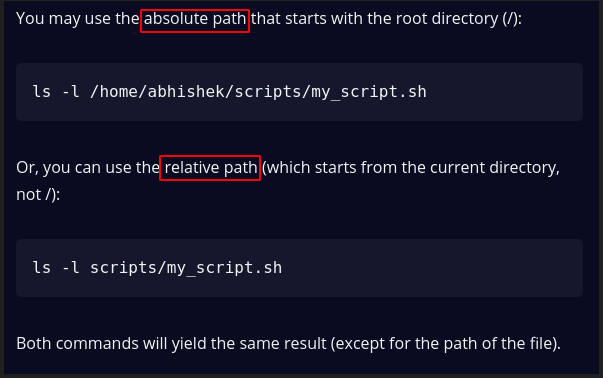

### Relative Path Abused
- Make a fake `cat command`
	- by puting `/bin/bash` in it
	- the bugtracker binary will execute this fake file as `root`
	- [source for relative path abused](https://www.hackingarticles.in/linux-privilege-escalation-using-path-variable/)

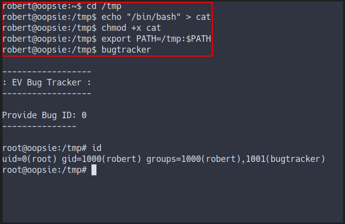

### Root Flag

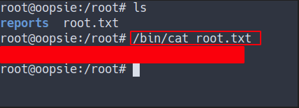

## Conclusion
I’ve learned a lot today. Never put the user ID as cookies value and make sure you configure the website properly. Lastly, make sure to configure the SUID binary carefully and do not put any untrust or unpatched version as SUID

I have a fun time doing this machine and I hope you guys too. Bye ;)
