# HackTheBox - Pilgrimage Writeup


Box author | 

<!--more-->

## Nmap
Like always, I’m going to scan the IP Address by using [nmap](https://nmap.org/) but I’m going to scan the full port first. Then, I’m going to scan the only open ports.

```sql
nmap -p22,80 -sCV -oN nmap/pilgrimage_script 10.10.11.219

PORT   STATE SERVICE VERSION
22/tcp open  ssh     OpenSSH 8.4p1 Debian 5+deb11u1 (protocol 2.0)
| ssh-hostkey: 
|   3072 20be60d295f628c1b7e9e81706f168f3 (RSA)
|   256 0eb6a6a8c99b4173746e70180d5fe0af (ECDSA)
|_  256 d14e293c708669b4d72cc80b486e9804 (ED25519)

80/tcp open  http    nginx 1.18.0
|_http-server-header: nginx/1.18.0
|_http-title: Pilgrimage - Shrink Your Images
| http-cookie-flags: 
|   /: 
|     PHPSESSID: 
|_      httponly flag not set
| http-git: 
|   10.10.11.219:80/.git/
|     Git repository found!
|     Repository description: Unnamed repository; edit this file 'description' to name the...
|_    Last commit message: Pilgrimage image shrinking service initial commit. # Please ...
Service Info: OS: Linux; CPE: cpe:/o:linux:linux_kernel
```

The nmap scan result is completed. There are just `two` port opens which are `SSH, and HTTP`. Well, I'm going to ignore `port 22` which is `SSH`, since I don't have any credentials.

However, nmap also found the `git` directory on `port 80`.

## Http: pilgrimage.htb
Then, I navigated to `port 80` on my browser and I was greeted with `We can’t connect to the server at the pilgrimage.htb`. So, I added `pilgrimage.htb` into my `/etc/hosts` file.

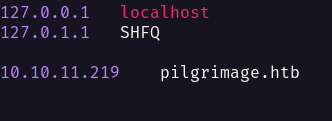

With a simple reload of the page and _ta-daaa_

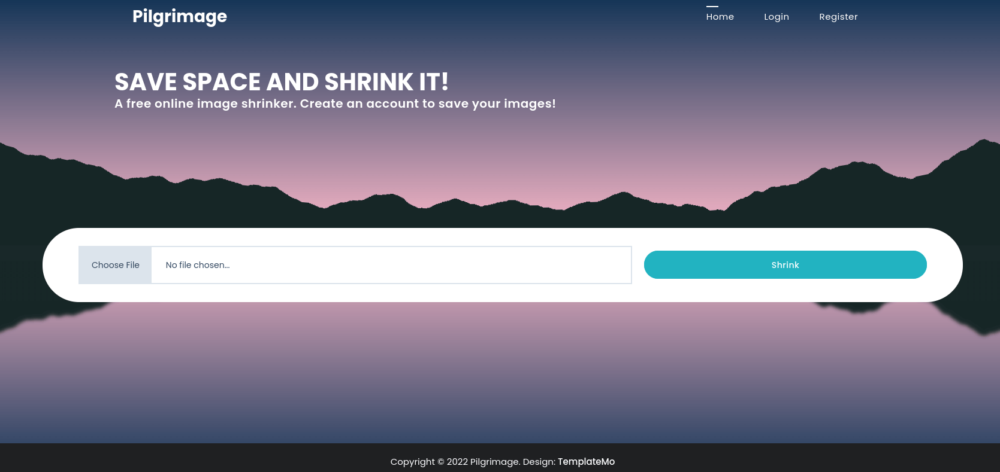

## Http: git-dumper
Before I investigate the page. I need to take a look at the `git` directory first. So, I'm using the [git-dumper](https://github.com/arthaud/git-dumper) tool. After successfully dumping all the `git` repositories.

The first thing I did was execute the `git log` command to show all the `commit` history and found the user called `emily`.

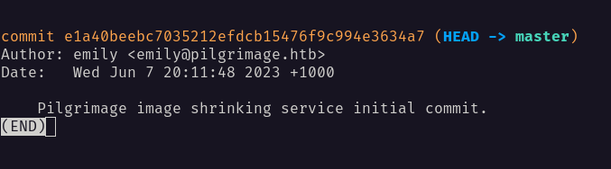

### Git: magick
However, there's an executable file on this repository called `magick` and with quick googling, turns out, it's a program that member of [ImageMagick](https://imagemagick.org/index.php) suite of tools.

While searching this program, I found that there are many vulnerabilities regarding it. So, I executed the program with a version tag.

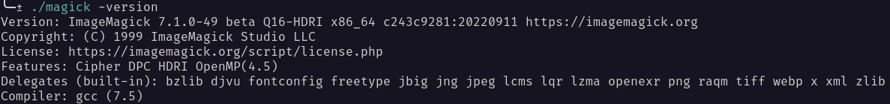

### Magick: CVE-2022-44268
With that information in my hand. I managed to find this [article](https://www.vicarius.io/blog/cve-2022-44268-arbitrary-remote-leak-in-imagemagick) about it. 


There's a function called `ReadOnePNGImage` that will check the image, if it has the `Profile` keyword.
It will parse it to another function called `FileToBlob` and read the file.


While I'm inspecting the `git` repository that got dumped earlier. I managed to find the location of the `sqlite` database in `input.php`.

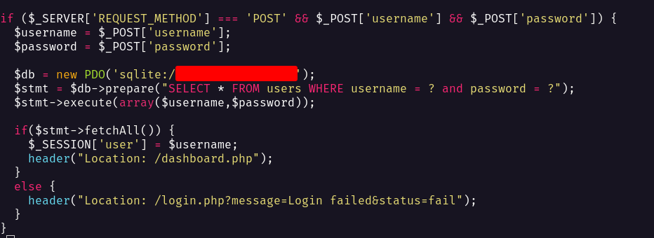

Now, I have the path to the sensitive file. So, I'm going to create a malicious image file by using `pngcrush`. Then, I'll upload it to the web application and download the shrink version.

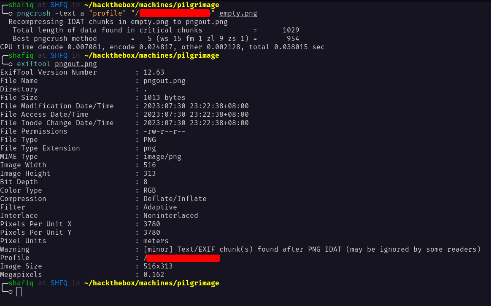

### SQLite: emily
I'll check the downloaded image metadata with `exiftool` and the output it's so massive. So, I ended up using [CyberChef](https://gchq.github.io/CyberChef/) to decode all the hex code from it and managed to find `emily` credentials.

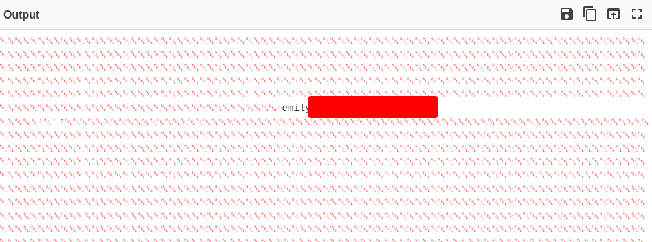

## SSH: emily
Then, I'll try those credentials against `port 22` which is `SSH`. Luckily, I successfully logged in as user emily.

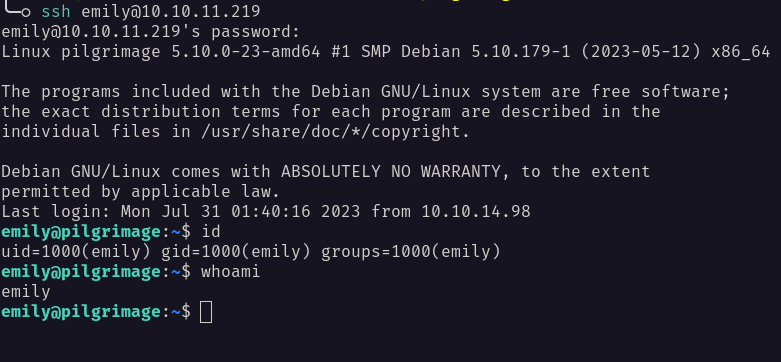

Now, I have the credentials for this user. Then, it's time to check the `sudo` permission with the `sudo -l` command. Turns out, `emily` did not have a sudo privilege on this machine.

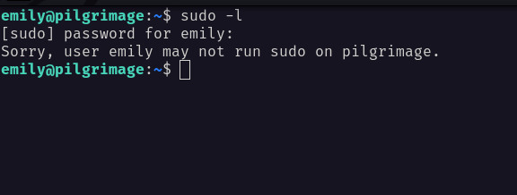

### Binwalk
However, I found the hidden directory called `.config` and there was another directory in it called `binwalk` and funny enough. There is an application called `binwalk`.

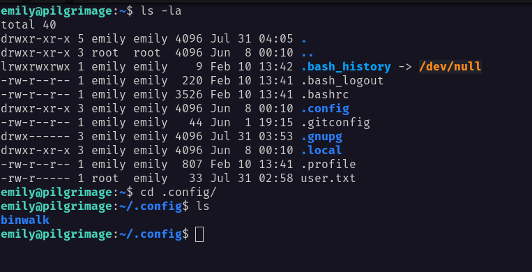

So, I checked, if `binwalk` exists and it does. Then, I execute it with the help command to show the version of it. Turns out, it's version `2.3.2` and the release date for it was `Aug 16, 2021`.

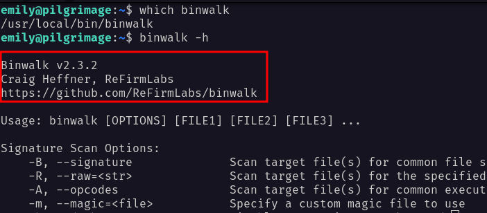

## Binwalk: CVE-2022-4510
With a quick Q&A session with Mr.Google himself. I managed to find this [exploit](https://www.exploit-db.com/exploits/51249) regarding the binwalk version. Based on this [description](https://nvd.nist.gov/vuln/detail/CVE-2022-4510)


It's a `path traversal` vulnerability that could lead to `RCE` by crafting a malicious `PFS` file and get extracted into binwalk `plugins`.


When I executed the exploit it created a malicious image file but I couldn't find anywhere to make use of it. 

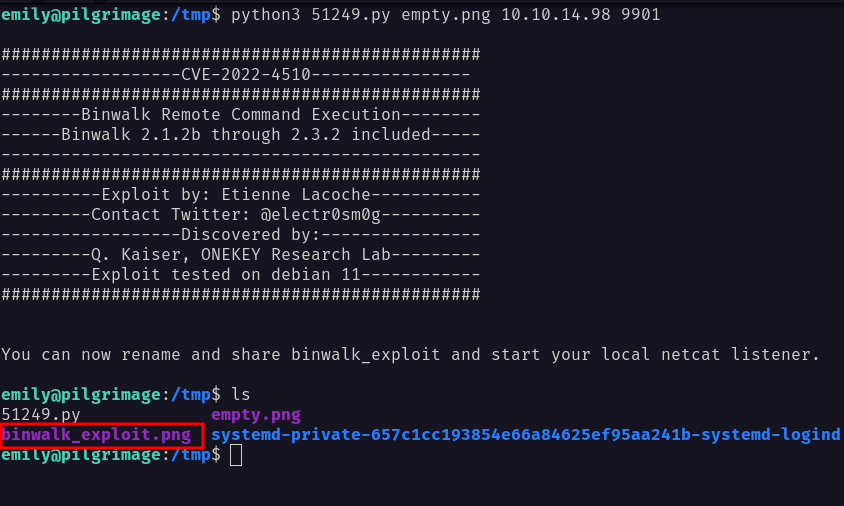

Then, I uploaded a tool called [pspy](https://github.com/DominicBreuker/pspy) to see any command that is run by other users. Now, I'll try uploading any image file to the web application to see if anything gets executed in the background.

It did! and I saw that the root user executed a bash file called `malwarescan.sh` inside the `/usr/sbin/` directory.

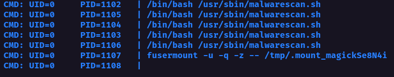

So, I managed to read that file. It basically checks the image that gets uploaded, and if it's an executable or not. However, there's a particular `path` where uploaded images get stored. 

On top of that, it gets executed by `binwalk` with a `-e` flag, which means `extract` and this cloud leads into successfully `RCE`.

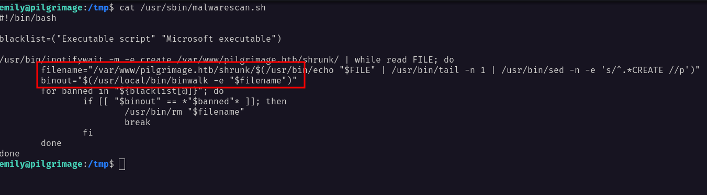

Now, I'm going to put a malicious image file that I created earlier into `/var/www/pilgrimage.htb` and see what's going to happen.

I did get the root user but it seems not really consistent. So, I'm going to try it again by creating a malicious image file on my local machine and uploading it into the appropriate directory. It works flawlessly and I became root.

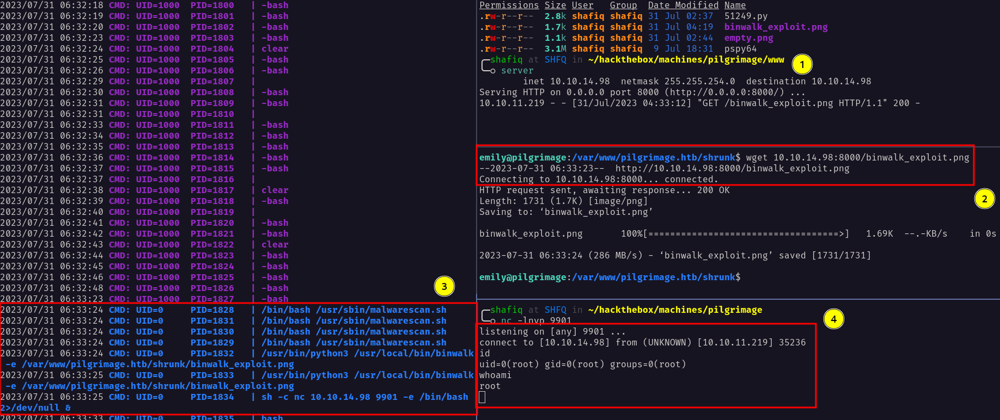
