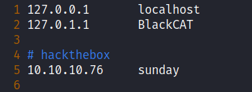
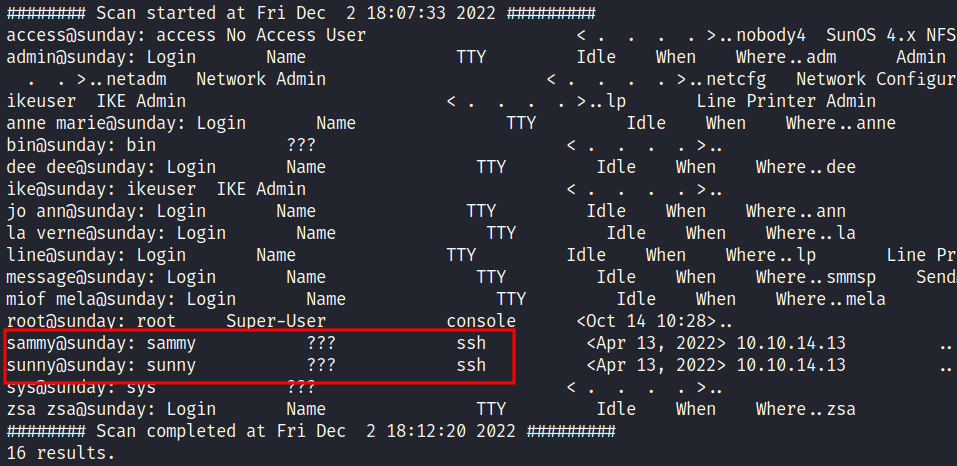
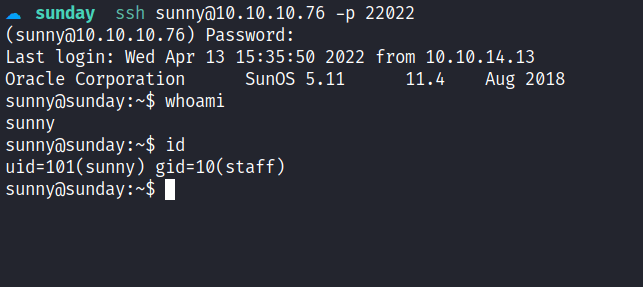
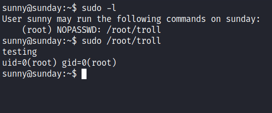
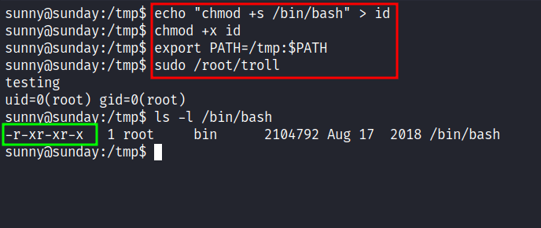
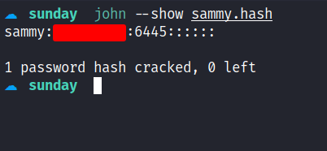
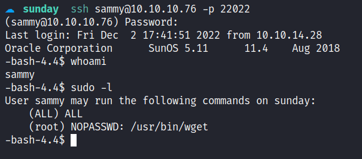
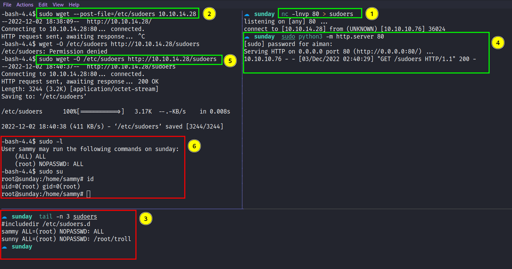

# HackTheBox - Sunday Writeup


Box author | 

<!--more-->

## Nmap
Like always, I’m going to scan the IP Address by using [nmap](https://nmap.org/) but I’m going to scan the full port first. Then, I’m going to scan the only open ports.

```sql
nmap -p79,111,515,6787,22022 -sCV -oN nmap/sunday 10.10.10.76

79/tcp    open  finger?
| fingerprint-strings: 
|   GenericLines: 
|     No one logged on
|   GetRequest: 
|     Login Name TTY Idle When Where
|     HTTP/1.0 ???
|   HTTPOptions: 
|     Login Name TTY Idle When Where
|     HTTP/1.0 ???
|     OPTIONS ???
|   Help: 
|     Login Name TTY Idle When Where
|     HELP ???
|   RTSPRequest: 
|     Login Name TTY Idle When Where
|     OPTIONS ???
|     RTSP/1.0 ???
|   SSLSessionReq, TerminalServerCookie: 
|_    Login Name TTY Idle When Where
|_finger: No one logged on\x0D

111/tcp   open  rpcbind  2-4 (RPC #100000)
515/tcp   open  printer
6787/tcp  open  ssl/http Apache httpd 2.4.33 ((Unix) OpenSSL/1.0.2o mod_wsgi/4.5.1 Python/2.7.14)
| ssl-cert: Subject: commonName=sunday
| Subject Alternative Name: DNS:sunday
| Not valid before: 2021-12-08T19:40:00
|_Not valid after:  2031-12-06T19:40:00
| http-title: Solaris Dashboard
|_Requested resource was https://10.10.10.76:6787/solaris/
|_http-server-header: Apache/2.4.33 (Unix) OpenSSL/1.0.2o mod_wsgi/4.5.1 Python/2.7.14
| tls-alpn: 
|_  http/1.1
|_ssl-date: TLS randomness does not represent time

22022/tcp open  ssh      OpenSSH 7.5 (protocol 2.0)
| ssh-hostkey: 
|   2048 aa0094321860a4933b87a4b6f802680e (RSA)
|_  256 da2a6cfa6bb1ea161da654a10b2bee48 (ED25519)
```

The nmap scan result is completed. There are a bunch of open ports. As far I as know, I've never seen port `79` before which is [finger](https://www.grc.com/port_79.htm) as the service name, and `SSH` on port `22022`. However, on port `6787` the nmap found the `hostname` on the `ssl-cert` scripts scan. The hostname called `sunday` and I'm going to add it to the `/etc/hosts` file. 



## Finger: User enumeration
The port `79` really bothering me, I did some research on google about this service and I stumble upon [pentestmonkey](https://pentestmonkey.net/tools/user-enumeration/finger-user-enum) website. Which is a tool called `finger-user-enum` that's written in `Perl` for enumerating users. This happens because the `finger` program is designed for remote users to obtain information about the user on a specific computer by querying their machine's `finger` server. So, I ended up executing it with the file that contains the username that can be located in `/usr/share/seclists/Usernames/Names/names.txt` or it can be downloaded from [here](https://raw.githubusercontent.com/danielmiessler/SecLists/master/Usernames/Names/names.txt).



## Foothold: SSH
The scan is completed and the output is very verbose and confusing. However, there is `two` user that completely catches my eye which is `sammy` and `sunny`. These users have something to do with `SSH` and I assumed they can be used to login into `SSH`. Unfortunately, I don't have any credentials for these users.  Based on the machine that I've been playing [before](https://shafiqaiman.com/posts/htb/nibbles/) it is worth trying the password with the machine name. In this case, is `sunday`, I'll try both of the users and I manage login in as `sunny`.



Now, I have the credential for this user which is `sunny`. Then, it's time to check the `sudo` permission with the `sudo -l` command. Turns out, it can run the `troll` file in the `/root` directory with sudo privilege and I executed it, but its only display the user id. 



So, I've assumed in this file contains the `id` binary and I'll try to abuse it by creating a fake id binary that contains the payload for set `/bin/bash` as `SUID` just like [HTB - Oopsie](https://shafiqaiman.com/posts/htb/oopsie/#relative-path-abused). Then, I export the path and execute it but nothing happens. It sounds like a troll. ;)



### Backup: Shadow.backup
With further enumeration, I manage to find the directory called `/backup` located in the root directory. Shockingly, inside of it, contains `two` files that have an interesting extension to it but I am keener towards the file called `shadow.backup`. Upon reading out the content, I manage to find another user `hash` which is `sammy`. Without further ado, I'm asking [john](https://www.openwall.com/john/) what this hash means and he gives me the answer straight away.



## PrivEsc: Wget
I'm in as a `sammy` user. Like always, I'm going to check the sudo permission of this user. Turns out, this user can run `wget`  with sudo privileges. Something little off here, the permission says `(ALL) ALL` and when I executed `sudo su`, I've become the `root` user. So, what's the point of the `wget` then? \*ngl it makes me confused a bit*\. 



However, I think I never use `wget` to privilege escalation before and I'm going to try it. Upon searching on google, I manage to find this [article](https://www.hackingarticles.in/linux-for-pentester-wget-privilege-escalation/) under the title `"Exploiting Sudo rights"`, turns out, I can read the file with `wget` by using the `--post-file` option and catching it with `nc`. Since the sudo permission makes me confused, I'm going to copy the `sudoers` file and change it to `"ALL=(root) NOPASSWD: ALL"` under `sammy` permissions. Then, send it back to the victim.



I'm hoping it makes sense. Anyways, I'm ROOT BABY!!!!
